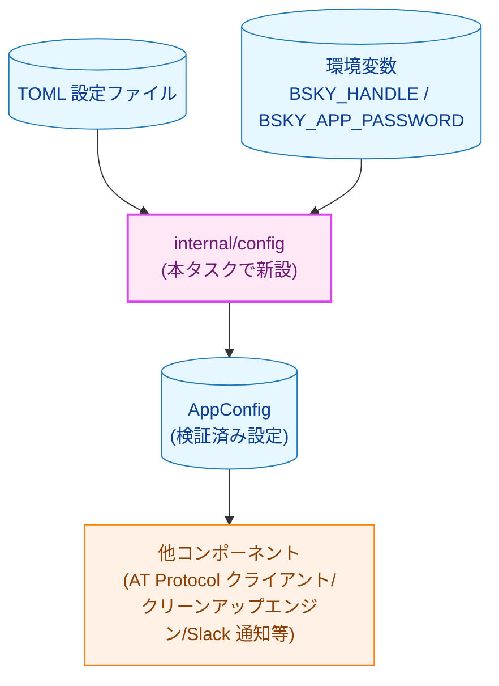
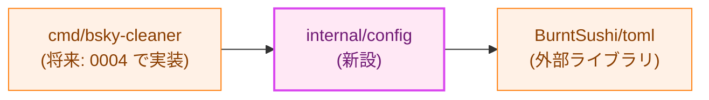
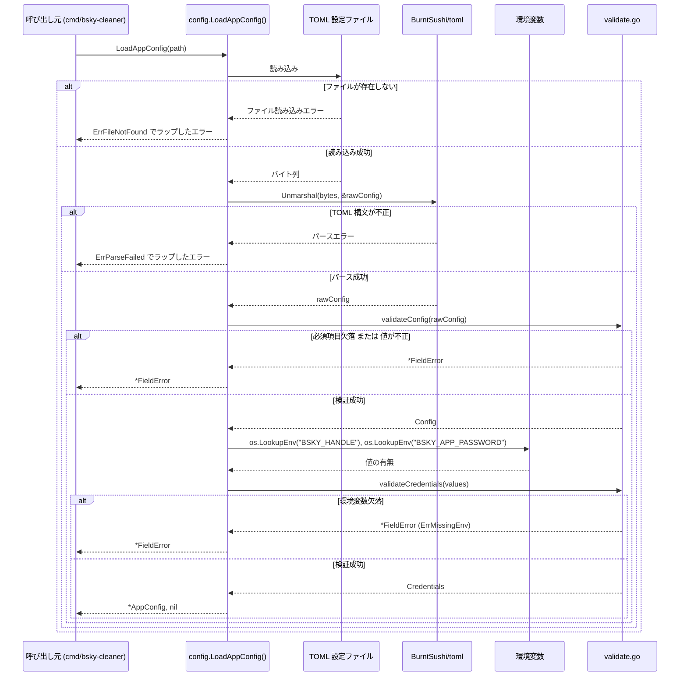
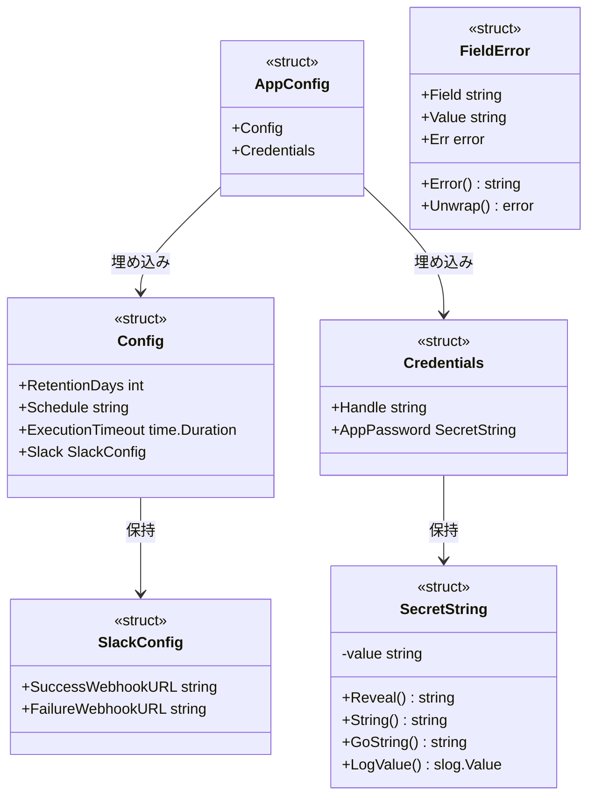
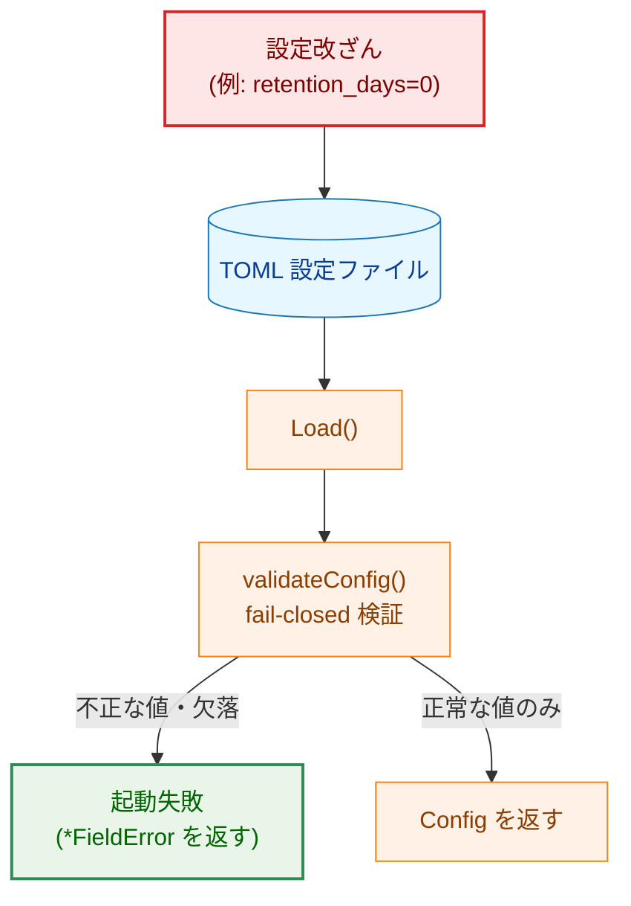

# 設定管理 — アーキテクチャ設計書

## Document Status

| Item | Value |
|---|---|
| Status | `draft` |
| Created | 2026-07-02 |
| Review date | - |
| Reviewer | - |
| Comments | - |

## 1. 設計の全体像

### 1.1 設計原則

- **単一責任**: `internal/config` パッケージは「TOML 設定ファイルと環境変数を読み込み、検証済みの設定値を返す」ことのみを責務とする。読み込んだ設定をどう使うか（削除対象の判定、Slack 通知の送信など）は他コンポーネントの責務であり、本パッケージは関与しない。
- **fail-closed**: 構文エラー・必須項目欠落・値の範囲逸脱のいずれについても、デフォルト値で黙って補完せず、明確なエラーを返して呼び出し元の起動を失敗させる。「検証をパスしなければ `Config` 構造体は手に入らない」という設計にすることで、検証漏れのまま設定値が使われる経路自体をなくす。
- **秘匿情報の分離**: TOML ファイルには秘匿情報を一切含めない（[プロジェクト概要](../../overview.md) の制約に従う）。app パスワード等は環境変数からのみ取得し、専用の型（`SecretString`）でラップすることで、ログ・エラーメッセージ・Slack 通知への意図しない漏洩を型システムのレベルで防ぐ。
- **YAGNI**: 設定の読み込み元は「ローカルファイルパス」と「プロセス環境変数」という組み合わせの 1 通りしか想定しないため、`Loader` インターフェースのような差し替え可能な抽象化は導入しない（詳細は 3.2 節）。CLI フラグ（`--config` のパス指定）の解析自体は本タスクの責務外であり、[CLI エントリポイント](../0004_cli_entrypoint/01_requirements.md) 側が解決したパス文字列を本パッケージの `Load` に渡す。
- **副作用のないコンポーネント**: 本タスクには `--dry-run` のような外部副作用（削除・送信等）を切り替えるフラグは存在しない（該当なし）。設定の読み込み自体はファイル読み取りと環境変数参照のみを行い、書き込み・削除・ネットワーク送信は一切行わない。

### 1.2 概念モデル



**凡例**: 矢印 A → B は「A のデータ、または A の処理結果が B に渡ること」を表す。青（`data`）は静的データ（設定ファイル・環境変数・検証済み設定値）、紫（`newpkg`）は本タスクで新設するパッケージ、橙（`process`）は本タスクの対象外である既存/将来コンポーネントを示す。

## 2. システム構成

### 2.1 全体アーキテクチャ（パッケージ依存関係）



**凡例**: 矢印 A → B は「A が B に依存する（import する）」ことを表す。紫（`newpkg`）は本タスクで新設するパッケージ、橙（`process`）は本タスクでは変更しない既存/外部コンポーネントを示す。

`cmd/bsky-cleaner` は現時点では `cmd/main.go` のプレースホルダーのみで、CLI フラグ解析を含む本格実装は [0004_cli_entrypoint](../0004_cli_entrypoint/01_requirements.md) で行われる。本設計では `internal/config` パッケージが提供する関数群のみを対象とする。

**TOML パーサーライブラリの選定について**: TOML はテーブル・配列・インラインテーブル・複数の日時表現など仕様が複雑であり、自作パーサーは実装コストとバグ混入リスクの両面で見合わない。そのため [プロジェクト概要](../../overview.md#前提条件制約) の「外部依存の最小化」方針に照らし、TOML パースという単一機能に特化し、外部依存を持たない `github.com/BurntSushi/toml` を採用する（`indigo` のような広範な機能を持つ SDK とは異なり、責務が単一のライブラリであるため方針に反しない）。

### 2.2 コンポーネント配置

`internal/config/` パッケージ（新設）に配置するファイルは以下の通り。ファイル間に依存関係の分岐や呼び出し順序はなく（同一パッケージ内の単純な役割分担）、詳細な責務は 3.3 節のコンポーネント責務表を参照。

| ファイル | 新設/既存 | 主な定義 |
|---|---|---|
| `internal/config/config.go` | 新設 | `Config`, `Load()` |
| `internal/config/credentials.go` | 新設 | `Credentials`, `LoadCredentials()` |
| `internal/config/secret.go` | 新設 | `SecretString` |
| `internal/config/validate.go` | 新設 | `validateConfig()`, `validateCredentials()` |
| `internal/config/errors.go` | 新設 | `ErrX` 各センチネルエラー, `FieldError` |
| `internal/config/app_config.go` | 新設 | `AppConfig`, `LoadAppConfig()` |

### 2.3 データフロー



**凡例**: 矢印 A → B は同期呼び出し、A -->> B は戻り値/エラーの返却を表す。`alt` は分岐条件（成功系/異常系）を示す。

## 3. コンポーネント設計

### 3.1 データ構造



**凡例**: `<<struct>>` は Go の構造体を表す。矢印 A → B はラベルの関係（埋め込み/フィールドとしての保持）を表す。本パッケージは新設のためインターフェースを持たず、色分けは行っていない。

**フィールド設計上の要点**:

- **必須項目の欠落検出（AC-04）**: `RetentionDays`・`Schedule`・`ExecutionTimeout` は TOML 上の必須項目である。TOML の欠落フィールドはゼロ値（`0` や `""`）に見えてしまい、「未設定」と「明示的なゼロ/空文字」を区別できない。そこで、TOML から一時的にマッピングする内部構造体（`rawConfig`、非公開）はポインタ型フィールドを用いて存在有無を保持する。`validateConfig()` は nil ポインタを欠落として検出したうえで、値を `Config`（値型フィールド）に変換する。この二段階変換により、欠落判定（AC-04）と値の範囲検証（AC-08〜AC-10）を同一の検証関数に集約できる。
- **`ExecutionTimeout` の表現形式とオーバーフロー対策**: TOML 上では `execution_timeout_seconds`（整数・秒）として表現し、Go 側で `time.Duration` に変換する。文字列表現（例: `"5m"`）を使うことも検討したが、`time.Duration` は `encoding.TextUnmarshaler` を実装しておらず、`BurntSushi/toml` でこれを扱うには独自の変換型を追加実装する必要がある。整数秒であれば追加コードなしで `BurntSushi/toml` の標準的な整数マッピングのみで完結するため、YAGNI の観点からこちらを採用する。`validateConfig()` は「秒→ナノ秒」への変換前に、下限（0 より大きいこと、AC-10）に加えて上限（例: 24 時間相当）も検証する。実行タイムアウトは、多重起動対策としてこの値のみに依存する唯一の防衛線である（[セキュリティ設計](../../design/security.md) 参照）。上限を設けないと、極端に大きい `execution_timeout_seconds` が `time.Duration`（`int64` ナノ秒）変換時にオーバーフローし、意図しない極小値・負値に折り返るおそれがある。そのため、変換前の生値の段階で上限チェックを行う。
- **未知キーの検出**: `BurntSushi/toml` は未知のキー（TOML ファイル中に存在するが `Config`/`SlackConfig` に対応フィールドがないキー）を `toml.MetaData.Undecoded()` で検出できる。`Load()` はデコード後に `Undecoded()` が空でない場合を構文エラー相当（`ErrParseFailed`）として扱う。これにより、`success_webhook_url` のようなキー名のタイプミスが「未設定」として静かに受理され、Slack 通知だけが理由不明に届かなくなるという事故を防ぐ（必須項目のタイプミスは AC-04 の欠落検出で捕捉されるが、任意項目である `SlackConfig` の 2 フィールドには他に検出手段がないため、この仕組みが唯一の防衛線となる）。
- **Slack Webhook URL は任意項目（AC-11）**: `Slack`（`SlackConfig`）の 2 フィールドは TOML 上では任意項目（未設定時は空文字列）。設定されている場合のみ `https` スキーム等の形式検証を行う。ホスト一致検証は [0006_slack_notification](../0006_slack_notification/01_requirements.md) の責務であり、本パッケージは行わない。
- **`Schedule` は存在確認のみ**: cron 構文としての妥当性検証は本パッケージでは行わない。cron 構文の検証は [Docker 配布の詳細設計](../../design/docker_deployment.md#スケジュール設定と内蔵-cron-の連携) が定める `print-schedule` サブコマンド（[0007_docker_distribution](../0007_docker_distribution/01_requirements.md)）側の責務とし、cron 文法の知識を本パッケージに重複して持たせないための意図的な判断である。
- **`Credentials` の 2 フィールド（AC-05, AC-06）**: `Handle` と `AppPassword` はいずれも環境変数由来の必須項目である。`Handle` 自体は「秘匿情報」ではない（Bluesky 上で公開されるアカウント識別子）が、要件文書 [01_requirements.md](01_requirements.md) の方針に従い TOML には書かず環境変数から取得する。`AppPassword` のみ `SecretString` でラップする（`Handle` を漏洩対策の対象に含める必要はない）。

### 3.2 インターフェース定義

```go
package config

// Load reads and validates the TOML file at path and returns the
// non-secret configuration values.
func Load(path string) (*Config, error)

// LoadCredentials reads and validates secret configuration values from
// the process environment (BSKY_HANDLE, BSKY_APP_PASSWORD via
// os.LookupEnv). It takes no parameters: it only ever reads these two
// fixed variable names, never an arbitrary key.
func LoadCredentials() (*Credentials, error)

// LoadAppConfig combines Load and LoadCredentials into a single entry
// point for callers that need both.
func LoadAppConfig(path string) (*AppConfig, error)

// Reveal returns the underlying secret value. Callers must only invoke
// this at the point of use (e.g. building an authentication request) and
// must never pass the result to a logger or formatter.
func (s SecretString) Reveal() string
```

**インターフェースを導入しない理由（YAGNI）**: `Load`/`LoadCredentials` は「ローカルファイルパス」「プロセス環境変数」という単一の実装しか持たず、テストは一時ファイル（`Load`）および `t.Setenv()`（`LoadCredentials`、Go 1.17+ の標準テストヘルパーで、テスト終了時に値を自動復元する）で十分に行える（NF-002）。差し替え可能な複数実装を想定した `Loader` インターフェースを導入する具体的な要求は現時点で存在しないため、関数ベースの API とする。

**`LoadCredentials` に `getenv` のようなコールバックを注入しない理由**: `func(key string) (string, bool)` のようなコールバックを引数で受け取る設計も検討したが、これは「関数の内部が任意の環境変数を読める」という、実際に必要な範囲（`BSKY_HANDLE`・`BSKY_APP_PASSWORD` の2つに限定）より広い権限を公開 API に持たせてしまう。テストは `t.Setenv()` で完結するため、この広い権限を許容してまで注入可能にする必要はない。`LoadCredentials()` は内部で `os.LookupEnv` をこの2つの変数名に対してのみ直接呼び出す。

### 3.3 コンポーネント責務表

| ファイル | 責務 | 関連 AC |
|---|---|---|
| `internal/config/config.go` | `Config`・`SlackConfig` 型定義、`Load()`（TOML 読み込み + 検証） | AC-01, AC-02, AC-03, AC-04, AC-11 |
| `internal/config/credentials.go` | `Credentials` 型定義、`LoadCredentials()`（環境変数読み込み + 検証） | AC-05, AC-06 |
| `internal/config/secret.go` | `SecretString` 型（`String()`/`GoString()`/`LogValue()` による秘匿情報の非表示化） | AC-07, NF-003 |
| `internal/config/validate.go` | `validateConfig()`・`validateCredentials()`（必須項目・値の範囲検証） | AC-04, AC-08, AC-09, AC-10, AC-11 |
| `internal/config/errors.go` | センチネルエラー（`ErrFileNotFound` 等）、`FieldError` 型 | AC-02, AC-03, AC-04, AC-06, AC-08, AC-10 |
| `internal/config/app_config.go` | `AppConfig` 型定義、`LoadAppConfig()`（`Load` と `LoadCredentials` の合成） | - |
| `docs/design/config_file.md` | TOML 設定ファイルの仕様書（項目名・型・必須/任意・デフォルト値・記述例） | AC-12 |

すべて新設ファイルであり、既存コードとの責務重複はない（`cmd/main.go` はプレースホルダーのみで、設定読み込みロジックを持たない）。

## 4. エラーハンドリング設計

```go
package config

var (
    ErrFileNotFound = errors.New("config file not found")
    ErrParseFailed  = errors.New("config file parse failed")
    ErrMissingField = errors.New("required field is missing")
    ErrInvalidValue = errors.New("field value is invalid")
    ErrMissingEnv   = errors.New("required environment variable is missing")
)

// FieldError identifies which configuration field caused the failure,
// wrapping one of the sentinel errors above so callers can use
// errors.Is / errors.AsType[*FieldError] instead of matching on the
// error message string. Value holds the offending raw value for
// non-secret fields only; it is left empty for credential-derived
// errors (see "設計方針" below).
type FieldError struct {
    Field string
    Value string
    Err   error
}

func (e *FieldError) Error() string
func (e *FieldError) Unwrap() error
```

**設計方針**:

- **`FieldError` によるフィールド単位のエラー判定**: すべての検証エラーは `FieldError` でラップし、`Field`（例: `"retention_days"`）を保持する。呼び出し元は `errors.Is(err, config.ErrInvalidValue)` のような判定と、`errors.AsType[*config.FieldError](err)` によるフィールド名の取得の両方が可能になる（CLAUDE.md の「Error Testing」方針に合わせる）。
- **`Value` は非秘匿フィールドのみに格納（AC-07, NF-003）**: `FieldError.Value` には、検証に失敗した実際の値の文字列表現を格納する。ただし格納するのは **TOML 由来の非秘匿フィールド**（`retention_days`・`schedule`・`execution_timeout_seconds`・Slack Webhook URL）に限る。`retention_days=0` のような設定ミスは運用上頻発する障害モードであり、実際にどんな値が入っていたかがエラーメッセージから分かることはオンコール対応上重要である。一方、`Credentials`（環境変数由来）の検証エラーでは `Value` を常に空文字列のままとし、`AppPassword` の値がエラー経由で漏洩する経路を作らない。`validateConfig()`（TOML 側、`Value` を埋める）と `validateCredentials()`（環境変数側、`Value` を埋めない）を別関数として分離しているため、実装時にこの使い分けを取り違えにくい。
- **ファイル関連エラーは元のエラーも保持**: `os.Open` が返す `*fs.PathError` 等は、本パッケージのセンチネルエラーと元のエラーの両方を保持した形でラップして返す（Go 1.20 以降の複数 `%w` を用いて `fmt.Errorf("...: %w: %w", ErrFileNotFound, rawErr)` のように連結する）。これにより `errors.Is(err, config.ErrFileNotFound)` に加えて `errors.Is(err, fs.ErrPermission)` のような判定も可能になり、「ファイルが存在しない」と「ファイルの読み取り権限がない」（Docker のボリュームマウント設定ミスで典型的に発生する）を呼び出し元・ログ上で区別できるようにする。

## 5. セキュリティ考慮事項

- **秘匿情報の非表示化（AC-07, NF-003）**: `SecretString` は `String()`・`GoString()` を実装し、`%v`・`%s`・`%#v` のいずれで出力しても `"[REDACTED]"` のような固定文字列を返す。加えて `log/slog` 経由の構造化ログでも値が漏れないよう `slog.LogValuer` インターフェース（`LogValue() slog.Value`）も実装する。実際の値を取得できるのは `Reveal()` の呼び出しのみとし、認証リクエスト構築などの利用直前でのみ呼び出す運用とする。**残存リスク**: `Reveal()` の呼び出し元がその戻り値をログや Slack 通知にそのまま渡さないことは、型システムでは強制できず、実装時のコードレビューに依存する。本パッケージのテスト（7.1 節）は `String()`/`GoString()`/`LogValue()` による非表示化のみを検証し、`Reveal()` の呼び出し箇所を制限する仕組み（lint ルール等）は本タスクでは導入しない。`Reveal()` を呼び出すのは [0002_atproto_client](../0002_atproto_client/01_requirements.md) で実装する認証リクエスト構築処理のみになる見込みであり、当該タスクのコードレビュー時にこの制約を確認する運用でカバーする。
- **設定改ざんへの fail-closed 対応（AC-08, AC-09, AC-10）**: [プロジェクト概要](../../overview.md#セキュリティ考慮事項) が挙げる「設定改ざん」リスクに対し、本パッケージが第一の防衛線となる。`retention_days` が 0 以下または未設定の場合、実行タイムアウトが 0 以下または未設定の場合は、`Config` を一切返さず起動を失敗させる。ファイルシステム権限管理・改ざん検知（ファイル自体の書き換え防止）は [01_requirements.md](01_requirements.md) の通り本タスクのスコープ外であり、値の妥当性検証のみで対応する。
- **TOML ライブラリのサプライチェーン**: `github.com/BurntSushi/toml` は `go.mod` にバージョン固定で追加し、追加の推移的依存を持たない（2.1 節参照）。
- **スコープ外（N/A）の脅威**: 以下は [プロジェクト概要](../../overview.md#セキュリティ考慮事項) が挙げるリスクカテゴリだが、本タスクの範囲外のため対応しない。
  - Slack Webhook ホスト一致検証: [0006_slack_notification](../0006_slack_notification/01_requirements.md) が担当
  - SSRF（PDS エンドポイント偽装）: 本パッケージは DID 解決を行わないため該当なし
  - リトライ過多・多重起動: 本パッケージはネットワーク呼び出しを行わないため該当なし
  - 投稿本文経由のインジェクション: 本パッケージは投稿データを扱わないため該当なし

### 脅威モデル: 設定ファイル改ざんによる大量削除



**凡例**: 矢印 A → B はデータ/処理の流れを表し、分岐ラベルは `validateConfig()` の検証結果の条件を表す。赤（`problem`）は攻撃/事故の起点、緑（`enhanced`）は本タスクが新設する防御ポイントを示す。

## 6. 処理フロー詳細

2.3 節のシーケンス図が主要な処理フロー（正常系・異常系の分岐を含む）を示す。追加の分岐ロジックは存在しない。

## 7. テスト戦略

### 7.1 単体テスト

- `internal/config/config_test.go`: 妥当な TOML・構文不正な TOML・存在しないファイル・必須項目欠落・未知のキー（タイプミスを想定）の各ケースを網羅する表駆動テスト（AC-01〜AC-04）。
- `internal/config/validate_test.go`: `retention_days`・`execution_timeout_seconds` の境界値テスト（`0`・負値・未設定・正の整数・`time.Duration` へのナノ秒変換でオーバーフローする極端に大きい値）（AC-08〜AC-10）。Slack Webhook URL の形式検証（`https` 以外のスキーム、未設定時はスキップされることの確認）（AC-11）。
- `internal/config/credentials_test.go`: `t.Setenv()` で `BSKY_HANDLE`・`BSKY_APP_PASSWORD` を設定/未設定にした双方のケースを検証する（AC-05, AC-06）。
- `internal/config/secret_test.go`: `SecretString` を `fmt.Sprintf("%v", ...)`・`fmt.Sprintf("%#v", ...)`・`slog` の `Info` 呼び出しに渡し、出力に実際の値が含まれないことをアサートする（AC-07, NF-003）。

### 7.2 静的検証

- `docs/design/config_file.md` の存在確認、および記載されたフィールド名・型が `Config`/`Credentials`/`SlackConfig` のフィールド定義と一致していることをレビューで確認する（AC-12）。

### 7.3 セキュリティテスト

7.1 節の `secret_test.go` が NF-003（秘匿情報を出力に含めない）を直接検証する。これに加え、`errors.Is`/`errors.AsType[*FieldError]` を用いたエラー判定が意図通り機能することをテストし、値の欠落と不正値の両方が確実に fail-closed で拒否されることを確認する。

## 8. 実装優先順位

1. **Phase 1 — TOML 読み込みの基盤**: `Config`・`SlackConfig` 型、`rawConfig`（非公開）、`Load()` の骨格実装（AC-01〜AC-04）
2. **Phase 2 — 秘匿情報の取り扱い**: `SecretString`、`Credentials`、`LoadCredentials()`（AC-05〜AC-07）
3. **Phase 3 — 検証**: `validateConfig()`・`validateCredentials()`、`FieldError`、センチネルエラー群（AC-08〜AC-11）
4. **Phase 4 — 統合と文書化**: `AppConfig`・`LoadAppConfig()`、`docs/design/config_file.md` の作成（AC-12）

## 9. 将来の拡張性

- 現時点では TOML ファイルのスキーマバージョニング（例: `config_version` フィールド）は導入しない。将来的にフィールドの破壊的変更が必要になった場合に検討する。
- 設定のホットリロード（実行中の再読み込み）は [プロジェクト概要](../../overview.md) の「一発実行の CLI」という方針上不要であり、対応しない。
- `print-schedule` サブコマンド（[0007_docker_distribution](../0007_docker_distribution/01_requirements.md)）は本パッケージの `Load()` が返す `Config.Schedule` を再利用する想定であり、TOML パース処理の二重実装を避けられる。

## 付録: 決定履歴

本ドキュメントは `docs/tasks/0001_config` の初回アーキテクチャ設計であり、置き換えた旧設計は存在しない。要件文書 [01_requirements.md](01_requirements.md) のレビューで追加された AC-12（設定ファイル仕様書の要求）を受け、3.3 節のコンポーネント責務表に `docs/design/config_file.md` を追加している。
