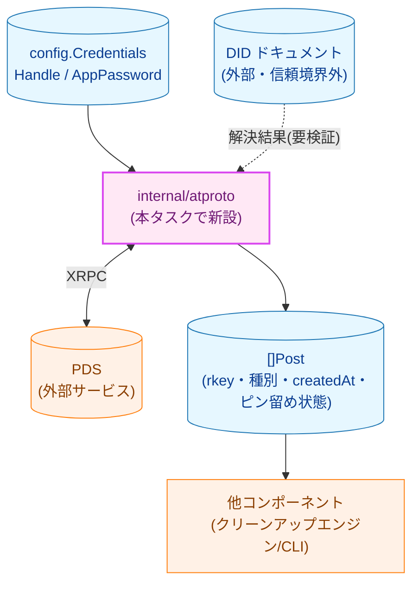
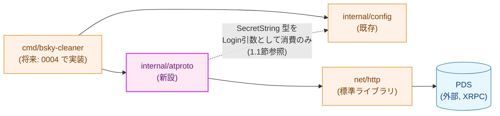
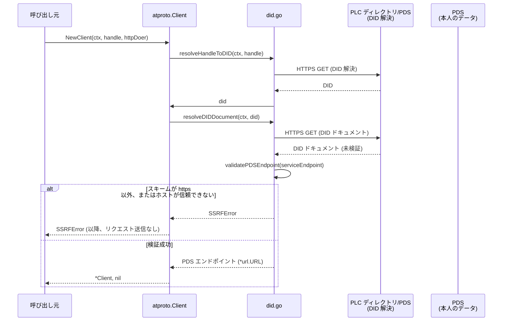
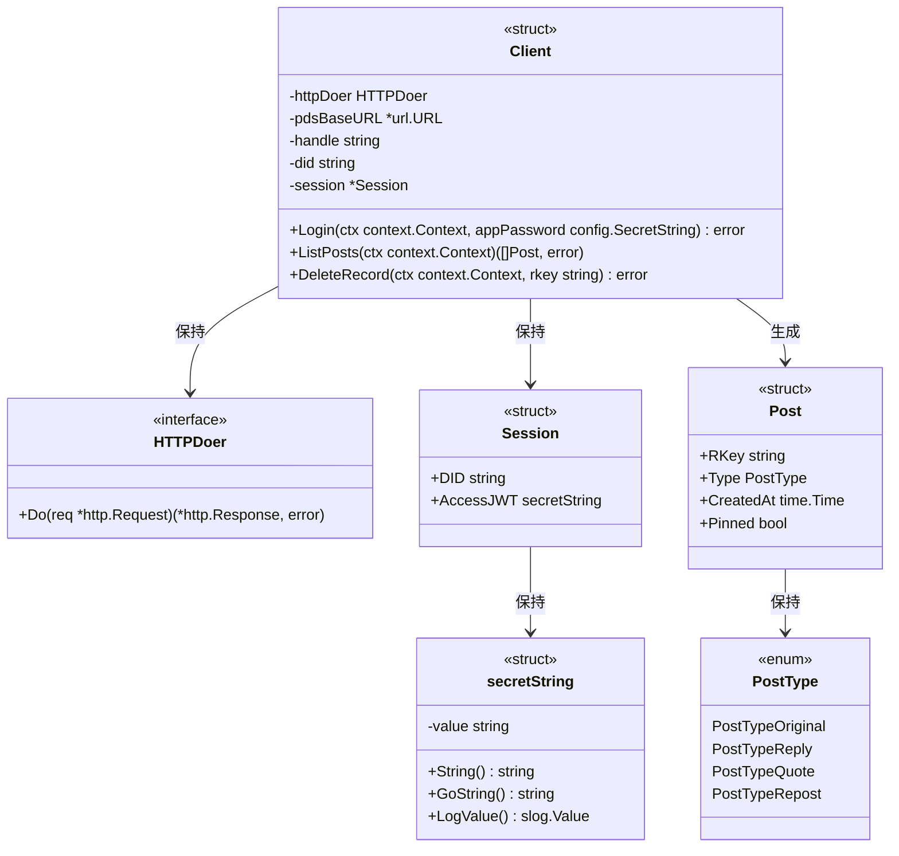
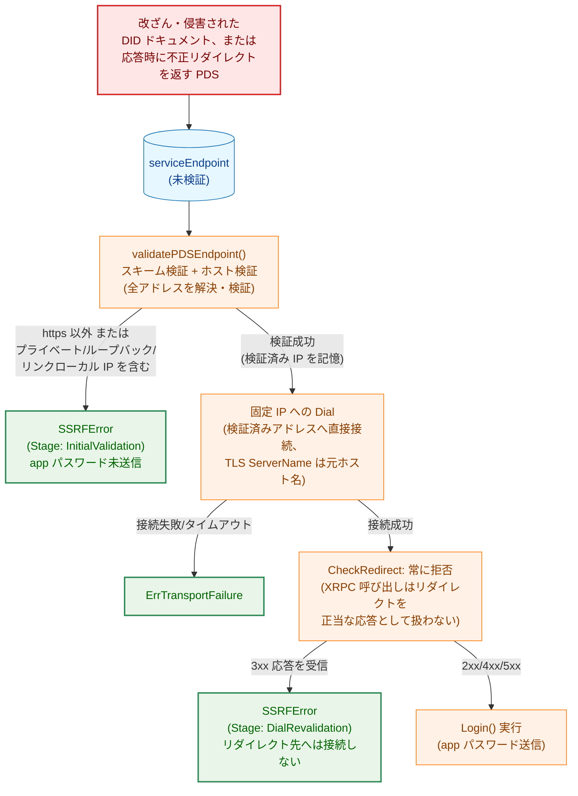
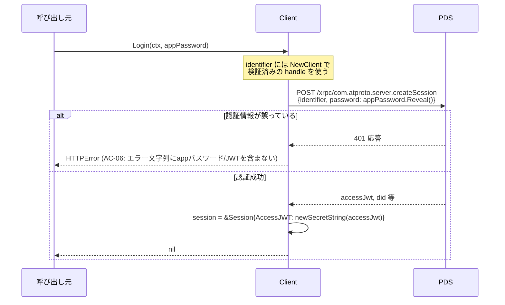
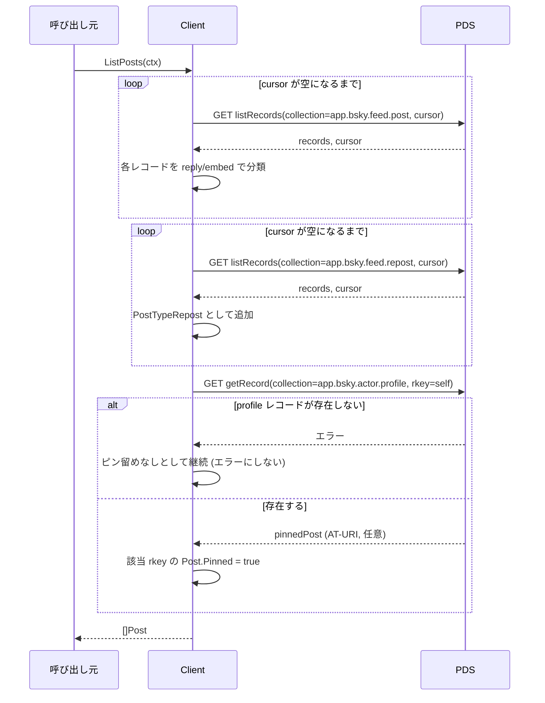
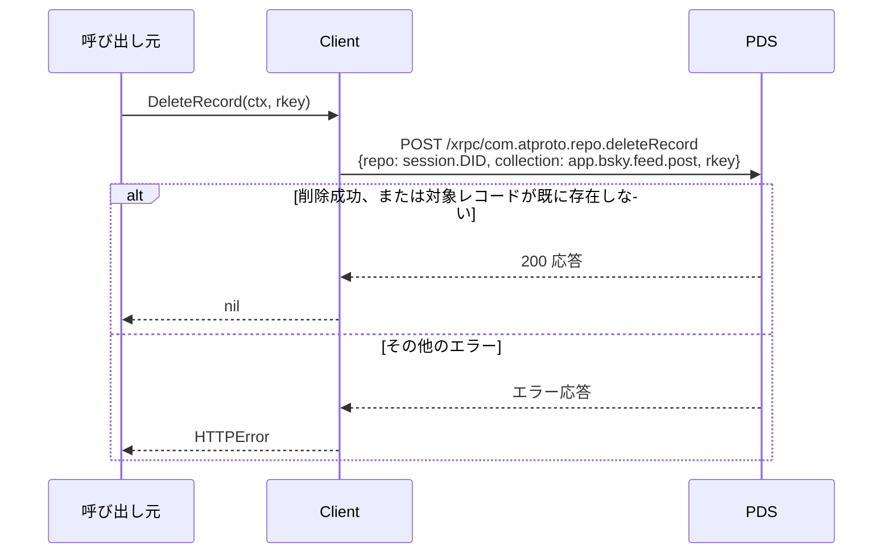

# AT Protocol クライアント — アーキテクチャ設計書

## Document Status

| Item | Value |
|---|---|
| Status | `draft` |
| Created | 2026-07-02 |
| Review date | - |
| Reviewer | - |
| Comments | - |

関連ドキュメント: [要件定義書](01_requirements.md)

## 1. 設計の全体像

### 1.1 設計原則

- **単一責任**: `internal/atproto` パッケージは「ログイン・投稿一覧取得・投稿削除という3つの XRPC 操作を、正しい PDS エンドポイントに対して安全に実行する」ことのみを責務とする。投稿の経過日数・種別によるフィルタリング判断（[0003_cleanup_engine](../0003_cleanup_engine/01_requirements.md)）や、リトライ・タイムアウト制御（[0005_retry_timeout](../0005_retry_timeout/01_requirements.md)）は行わない。本パッケージの各メソッドは、1回の呼び出しにつき XRPC リクエストを1回だけ送信する（`ListPosts` のページネーションのみ、複数リクエストにまたがる内部実装として例外）。
- **fail-closed**: DID 解決結果が信頼できない場合（スキームが `https` 以外、ホストが信頼できない）は、app パスワードを含むリクエストを一切送信せずに処理を中断する（AC-02, AC-03）。
- **外部依存の最小化**: HTTP 通信は標準ライブラリ `net/http` ベースの薄い自作実装とし、`indigo` のような大型 SDK は導入しない（NF-002、[プロジェクト概要](../../overview.md#前提条件制約) 参照）。
- **秘匿情報のラップ**: `Login` は app パスワードを `config.SecretString` 型で受け取り、値を使う直前（リクエストボディ構築時）にのみ `Reveal()` する。一方、本パッケージが `createSession` 応答から新たに得るセッションアクセス JWT は、`config.SecretString` を構築する手段（非公開フィールドのみで公開コンストラクタを持たない）が `internal/config` にないため再利用できず、本パッケージ内に同等のマスキング型を新設する（3.1 節で詳述）。
- **モード切り替えを持たないコンポーネント**: 本パッケージ自体は `--dry-run`/`--apply` のようなモード切り替えを持たない。`DeleteRecord` を呼び出せば常に実際の削除が行われる。dry-run と apply の切り替えは [0004_cli_entrypoint](../0004_cli_entrypoint/01_requirements.md) の責務であり、「削除対象一覧の表示に留めるか、実際に削除するか」は呼び出し元が `DeleteRecord` を呼ぶかどうかで制御する（5.1 節参照）。

### 1.2 概念モデル



**凡例**: 実線矢印 A → B は「A のデータ、または A の処理結果が B に渡ること」を表す。破線矢印は「信頼境界を越えて渡ってくる、検証前のデータ」を表す（DID ドキュメントは外部の PDS/PLC ディレクトリが返す値であり、本パッケージが検証するまでは信頼しない）。青（`data`）は静的データ、紫（`newpkg`）は本タスクで新設するパッケージ、橙（`process`）は本タスクの対象外である既存/外部コンポーネントを示す。

### 1.3 要件との対応

| 要件 | 満たす設計要素 |
|---|---|
| F-001（DID 解決によるPDSエンドポイント決定）/ AC-01〜AC-03 | `did.go`: `resolveHandleToDID` / `resolveDIDDocument` / `validatePDSEndpoint` |
| F-002（ログイン）/ AC-04〜AC-06 | `session.go`: `Client.Login` |
| F-003（投稿一覧取得）/ AC-07〜AC-10 | `posts.go`: `Client.ListPosts` |
| F-004（投稿削除）/ AC-11〜AC-13 | `delete.go`: `Client.DeleteRecord` |
| F-005（エラーハンドリング）/ AC-14, AC-15 | `errors.go`: `HTTPError` とセンチネルエラー群 |
| NF-003（SSRF 対策、リダイレクト含む） | `did.go`: `validatePDSEndpoint`、`http.go`: リダイレクト拒否ポリシーと接続時 IP 再検証（5.2 節） |
| NF-004（HTTP のインターフェース化） | `http.go`: `HTTPDoer` インターフェース |
| NF-006（フィクスチャの lexicon 準拠） | `testutil/`: フィクスチャの構造検証（7.1 節） |

## 2. システム構成

### 2.1 コンポーネント配置



**凡例**: 実線矢印 A → B は「A が B に依存する（import する）」ことを表す。破線矢印は「限定的な型のみを再利用する依存」を表す。紫（`newpkg`）は本タスクで新設するパッケージ、橙（`process`）は本タスクでは変更しない既存/外部コンポーネント、青（`data`）は外部サービスを示す。

`internal/atproto` は `internal/config` に依存するが、依存する範囲は `Login` の引数型として使う `config.SecretString` のみであり、`atproto` 側でこの型の値を構築することはない（3.1 節参照）。`config` パッケージは `atproto` に依存しないため循環依存は生じない。`cmd/bsky-cleaner` からの実際の結線（`config.Credentials` を `atproto.Client` に渡す配線）は [0004_cli_entrypoint](../0004_cli_entrypoint/01_requirements.md) の責務であり、本タスクでは `internal/atproto` パッケージ単体の実装のみを対象とする。

| ファイル | 新設/既存 | 主な定義 |
|---|---|---|
| `internal/atproto/client.go` | 新設 | `Client`, `NewClient()` |
| `internal/atproto/did.go` | 新設 | `resolveHandleToDID()`, `resolveDIDDocument()`, `validatePDSEndpoint()` |
| `internal/atproto/session.go` | 新設 | `Session`, `Client.Login()` |
| `internal/atproto/posts.go` | 新設 | `Post`, `PostType`, `Client.ListPosts()` |
| `internal/atproto/delete.go` | 新設 | `Client.DeleteRecord()` |
| `internal/atproto/http.go` | 新設 | `HTTPDoer`, XRPC リクエスト構築の共通処理 |
| `internal/atproto/errors.go` | 新設 | `ErrX` 各センチネルエラー, `HTTPError`, `SSRFError` |
| `internal/atproto/testutil/mocks.go` | 新設 | `HTTPDoer` のモック実装 |
| `internal/atproto/testutil/fixtures.go` | 新設 | lexicon 準拠のテスト用 JSON フィクスチャ |

### 2.2 データフロー



**凡例**: 矢印 A → B は同期呼び出し、A -->> B は戻り値/エラーの返却を表す。`alt` は分岐条件を示す。ログイン・投稿一覧取得・投稿削除の各シーケンスは 6 節で詳細化する。

## 3. コンポーネント設計

### 3.1 データ構造・インターフェース



**凡例**: `<<interface>>`/`<<struct>>`/`<<enum>>` は Go の型カテゴリを表す。矢印 A → B は「A が B を保持する/生成する」関係を表す。新設パッケージのみで構成されるため色分けは行っていない。

**設計上の要点**:

- **`NewClient` が DID 解決を担う（AC-01〜AC-03）**: `NewClient(ctx, handle string, httpDoer HTTPDoer) (*Client, error)` は、生成時に handle → DID → DID ドキュメント → PDS エンドポイントの解決・検証まで行い、解決済みの `handle`/`did` を `Client` に保持する。この時点では app パスワードを一切受け取らないため、「DID 解決結果が信頼できない場合、app パスワードを含むリクエストを一切送信せずに処理を中断する」（AC-03）という制約を型のレベルで保証できる。`Login` は `*Client` が既に得られた後で初めて呼び出せ、`createSession` の `identifier` には `NewClient` で検証済みの `handle` をそのまま使う（`Login` 側で別の handle を受け取り直すことはしない）。これにより、「検証済みの PDS 以外へは app パスワードを送らない」という保証は、ログイン時に呼び出し元が渡す値に依存せず維持される。
  - **AC-01 の範囲（handle 入力のみサポート）**: AC-01 は「handle または DID から」の解決を要求するが、`NewClient` は handle のみを入力とする。本タスクが前提とする唯一の認証情報供給元 [0001_config](../0001_config/01_requirements.md) の `config.Credentials` は `Handle` フィールドのみを持ち、裸の DID を渡す経路が現状存在しないため、DID を直接受け取るコンストラクタ（例: `NewClientFromDID`）は YAGNI により本タスクでは新設しない。`NewClient` 内部の DID 解決処理は handle→DID の変換を経てから DID ドキュメント解決を行うため、DID 相当の解決ロジック自体は AC-01 の「DID から」の部分要件も内部的に満たしている。
- **`config.SecretString` の再利用は「消費のみ」に限定する**: `internal/config/secret.go` を確認すると `SecretString` は非公開フィールド (`value string`) のみを持ち、公開コンストラクタを提供しない。そのため `internal/config` パッケージの外からは既存の `SecretString` 値を `Reveal()` で読み取ることしかできず、新しい値を構築することはできない。`Login` の引数（呼び出し元が `config.Credentials.AppPassword` として既に保持している値）にはこの型をそのまま使い、値を使う直前（リクエストボディ構築時）にのみ `Reveal()` する。一方、`createSession` 応答から本パッケージが新たに得るセッションアクセス JWT は「本パッケージ自身が値を構築する」ケースであり `config.SecretString` を再利用できないため、`secretString`（非公開型、`String()`/`GoString()`/`LogValue()` で `config.SecretString` と同じマスキングを実装）を本パッケージ内に新設する。同種の実装を2箇所に持つことにはなるが、これはやむを得ない。`config.SecretString` の構築経路を外部に公開する変更は、[0001_config](../0001_config/01_requirements.md) の承認済み設計（`config/secret.go` は「読み込んだ値をラップする」ことのみを責務とし、任意の値からの構築を想定しない）に対する変更を伴うため、本タスク単独では行わない。
- **`Post` の型判定（AC-07, AC-09）**: `PostType` は `app.bsky.feed.post` レコードの `reply` フィールドの有無、および `embed.$type` が `app.bsky.embed.record`/`app.bsky.embed.recordWithMedia` かどうかで判定する（3.2 節）。`PostTypeRepost` は別コレクション（`app.bsky.feed.repost`）から取得するため判定ロジックの対象外である。
- **`Pinned` の判定（AC-09）**: `app.bsky.actor.profile` レコード（rkey `self`）の `pinnedPost` フィールド（AT-URI）の rkey と一致する投稿を `Pinned: true` とする。

### 3.2 投稿一覧取得ロジック（AC-07〜AC-10）

`Client.ListPosts` は以下の3種類の XRPC 呼び出しを合成して `[]Post` を構築する。

1. `com.atproto.repo.listRecords`（`collection=app.bsky.feed.post`）: 通常投稿・リプライ・引用ポストを取得する。各レコードについて、`reply` フィールドが存在すれば `PostTypeReply`、存在せず `embed.$type` が `app.bsky.embed.record` または `app.bsky.embed.recordWithMedia` であれば `PostTypeQuote`、いずれでもなければ `PostTypeOriginal` と判定する（両方に該当しうる場合は `PostTypeReply` を優先する）。
2. `com.atproto.repo.listRecords`（`collection=app.bsky.feed.repost`）: リポストを取得し、すべて `PostTypeRepost` とする。
3. `com.atproto.repo.getRecord`（`collection=app.bsky.actor.profile`, `rkey=self`）: `pinnedPost` フィールドを取得する。存在しない場合はエラーとせず「ピン留めなし」として扱う。

1・2 はそれぞれページネーションが必要な場合、レスポンスの `cursor` を次のリクエストに渡すループで全件取得する（AC-08）。投稿が0件の場合、`listRecords` は空配列を返す（AT Protocol の仕様上エラーにはならない）ため、`ListPosts` はそのまま空の `[]Post` を返す（AC-10）。

### 3.3 コンポーネントの責務（新規ファイル一覧）

| ファイル | 責務 | 関連 AC |
|---|---|---|
| `internal/atproto/client.go` | `Client` 型定義、`NewClient()`（DID 解決の起動） | AC-01〜AC-03 |
| `internal/atproto/did.go` | handle→DID→DID ドキュメント解決、PDS エンドポイントの抽出・検証（SSRF ガード） | AC-01〜AC-03 |
| `internal/atproto/session.go` | `Session` 型定義、`Client.Login()`（`createSession`） | AC-04〜AC-06 |
| `internal/atproto/posts.go` | `Post`/`PostType` 型定義、`Client.ListPosts()`（3種の XRPC 呼び出しの合成・ページネーション） | AC-07〜AC-10 |
| `internal/atproto/delete.go` | `Client.DeleteRecord()`（`deleteRecord`、冪等性の確保） | AC-11〜AC-13 |
| `internal/atproto/http.go` | `HTTPDoer` インターフェース、XRPC リクエスト構築・応答デコードの共通処理 | AC-14, NF-004 |
| `internal/atproto/errors.go` | センチネルエラー、`HTTPError`、`SSRFError` | AC-06, AC-14, AC-15 |
| `internal/atproto/testutil/mocks.go` | `HTTPDoer` のモック実装（他ファイルの単体テストが依存） | NF-004 |
| `internal/atproto/testutil/fixtures.go` | lexicon 準拠のテスト用 JSON フィクスチャ | NF-006 |

すべて新設ファイルであり、既存コードとの責務重複はない（`cmd/main.go` はプレースホルダーのみで AT Protocol 通信ロジックを持たず、`internal/config` は本パッケージに秘匿情報や設定値を渡す側であり通信は行わない）。

## 4. エラーハンドリング設計

```go
package atproto

var (
    ErrDIDResolutionFailed  = errors.New("DID resolution failed")
    ErrUntrustedPDSEndpoint = errors.New("PDS endpoint is not trusted")
    ErrAuthenticationFailed = errors.New("authentication failed")
    ErrHTTPStatus           = errors.New("unexpected HTTP status")
    ErrTransportFailure     = errors.New("HTTP transport failure") // timeout, DNS failure, connection refused, etc.
)

// SSRFStage identifies which validation step rejected a PDS endpoint,
// so an operator reading a Slack failure notification (0006, built on
// this error type) can tell an ordinary misconfiguration apart from a
// same-request DNS answer change (a stronger signal of an active
// rebinding attempt).
type SSRFStage int

const (
    SSRFStageInitialValidation SSRFStage = iota // rejected by validatePDSEndpoint before first connection
    SSRFStageDialRevalidation                   // rejected by the DialContext wrapper at connection time
)

// HTTPError identifies an XRPC call that received an unexpected HTTP
// response. It never embeds the raw *http.Request/*http.Response, only
// the XRPC method name and status code, so it cannot leak the
// Authorization header or request/response bodies (which may contain
// the app password or session JWT).
type HTTPError struct {
    Method     string // XRPC method name, e.g. "com.atproto.repo.listRecords"
    StatusCode int
    Err        error
}

func (e *HTTPError) Error() string
func (e *HTTPError) Unwrap() error

// SSRFError identifies a DID resolution result rejected by
// validatePDSEndpoint (AC-02, AC-03). It carries the scheme/host that
// was rejected — neither value can contain secrets, since resolution
// happens before any app password is sent (3.1 節).
type SSRFError struct {
    Endpoint string
    Stage    SSRFStage
    Err      error
}

func (e *SSRFError) Error() string
func (e *SSRFError) Unwrap() error
```

**設計方針**:

- **エラー型による判定（AC-14）**: `HTTPError`/`SSRFError` はいずれも `Unwrap()` を実装し、`errors.Is(err, atproto.ErrHTTPStatus)` のようなセンチネル判定と `errors.AsType[*atproto.HTTPError](err)` によるステータスコード取得の両方を可能にする。
- **秘匿情報を含まない設計（AC-06, AC-15）**: `HTTPError`/`SSRFError` はどちらも「XRPC メソッド名・ステータスコード・検証に失敗したホスト名」のみを保持し、`*http.Request`・`*http.Response`・生のレスポンスボディを一切保持しない。`Authorization` ヘッダーの値、送信した app パスワード、レスポンスに含まれるセッション JWT は、これらのエラー型のどのフィールドにも格納されないため、`Error()` の文字列表現に含まれえない。HTTP リクエスト構築処理（`http.go`）は、リクエスト送信後に返す全てのエラーをこの2つの型のいずれかでラップしてから返す（生の `net/http` エラーや `*url.Error` をそのまま透過させない）。`*url.Error` は失敗したリクエストの URL を含むが、AT Protocol の XRPC リクエストでは秘匿情報（app パスワード・セッション JWT）は常に POST ボディまたは `Authorization` ヘッダーで送信し、URL のクエリパラメータには含めない設計とするため、この経路からの漏洩リスクはない。
- **`net/http` の標準タイムアウト・ネットワークエラーの扱い**: タイムアウトや DNS 解決失敗などの transport レベルのエラーは `HTTPError{StatusCode: 0}` に `ErrTransportFailure` をラップして返し、`errors.Is(err, atproto.ErrHTTPStatus)`（応答を受け取った上でのステータス異常）とは異なるセンチネル判定ができるようにする。
- **`SSRFError.Stage` による原因の切り分け（NF-003 と関連）**: `SSRFError` は「`validatePDSEndpoint` による初回検証で拒否された」（`SSRFStageInitialValidation`）のか「`DialContext` による接続時の再検証で拒否された」（`SSRFStageDialRevalidation`）のかを `Stage` フィールドで区別する。本プロジェクトは削除ログをファイルへ記録しない方針（[プロジェクト概要](../../overview.md#安全性についての方針)）のため、オンコール担当者が状況を知る手段は最終的に Slack 通知（[0006_slack_notification](../0006_slack_notification/01_requirements.md)）に含まれるエラー内容のみになる。両者を同一メッセージに畳み込むと、「DID ドキュメントの設定ミス」（初回検証での拒否、多くの場合は静的な設定不備）と「同一リクエスト中に DNS 応答が変化した」（接続時の再検証での拒否、能動的な攻撃を示唆するより深刻なシグナル）を区別できなくなるため、`Stage` を分けて 0006 側が通知内容を出し分けられるようにする。

## 5. セキュリティ考慮事項

### 5.1 副作用契約

`internal/atproto` パッケージ自体は dry-run/apply のようなモード切り替えを持たない。副作用の有無はメソッド単位で固定である。

| メソッド | 外部副作用 |
|---|---|
| `NewClient` | HTTPS 通信あり（DID 解決）。書き込み・削除は行わない。 |
| `Login` | HTTPS 通信あり（セッション取得）。書き込み・削除は行わない。 |
| `ListPosts` | HTTPS 通信あり（読み取りのみ）。 |
| `DeleteRecord` | HTTPS 通信あり。呼び出せば**常に実際の投稿削除が行われる**。呼び出し自体を抑制するかどうか（dry-run 相当の制御）は、[0004_cli_entrypoint](../0004_cli_entrypoint/01_requirements.md) が `--apply` フラグに応じて `DeleteRecord` を呼ぶか呼ばないかを制御することで実現する。本パッケージ内部に削除を無効化するフラグは持たない。

### 5.2 脅威モデル: DID 解決を経由した SSRF

[プロジェクト概要](../../overview.md#セキュリティ考慮事項) および [セキュリティ設計](../../design/security.md) が挙げる「SSRF（PDS エンドポイント偽装）」リスクへの対策を以下に示す。



**凡例**: 矢印 A → B は処理の流れを表し、分岐ラベルは各検証ステップの結果の条件を表す。赤（`problem`）は攻撃の起点、緑（`enhanced`）は本タスクが新設する防御ポイントを示す。

- **スキーム検証（AC-02）**: `serviceEndpoint` のスキームが `https` でなければ即座に拒否する。
- **ホスト検証（AC-03）と DNS リバインディング対策の具体的な方式（NF-003）**: `validatePDSEndpoint` によるホスト検証と実際の TCP 接続の間に時間差があると、その間に DNS 応答が変化して検証をすり抜けうる（TOCTOU）。「検証時と接続時で別々に `net.LookupIP` を呼ぶ」実装では、ハッピーアイボールズ方式のダイヤラが検証していないアドレスへフォールバックしうるため、これだけでは TOCTOU を閉じきれない。本設計は以下の具体的な方式を採る:
  1. `validatePDSEndpoint` はホスト名を一度だけ `net.LookupIP` で解決し、**返された全アドレス**についてプライベートアドレス（RFC 1918）・ループバック・リンクローカルユニキャスト/マルチキャスト・未指定アドレスのいずれにも該当しないことを検証する（`net.IP` の `IsPrivate`/`IsLoopback`/`IsLinkLocalUnicast`/`IsLinkLocalMulticast`/`IsUnspecified` を用い、`::ffff:` 形式の IPv4-mapped IPv6 も同じ判定に通す）。1つでも該当すれば拒否する。
  2. 検証を通過したアドレスの集合を `Client` が保持し、以降の全接続（DID ドキュメント取得・`Login`・`ListPosts`・`DeleteRecord` を含む、`*Client` のライフタイム全体）は、ホスト名を都度再解決するのではなく、この検証済みアドレスへ**IP リテラルとして直接接続**する（`http.Transport.DialContext` はホスト名解決を行わず、検証済みアドレスのいずれかへ直接 `Dial` する）。TLS 証明書検証のためのサーバー名確認は `tls.Config.ServerName` を元のホスト名に設定して行う。
  3. AT Protocol はフェデレーション型のプロトコルであり PDS は任意の外部ドメインになりうるため、ホスト名の許可リスト方式は採らない。あくまで「内部ネットワーク・メタデータサービス相当のアドレスへの到達を防ぐ」という最小限のガードに限定する。
- **リダイレクトの拒否（NF-003, AC-03）**: `internal/atproto` が生成する `http.Client` はすべて `CheckRedirect` を「常にエラーを返す」設定にし、3xx 応答を一切自動追跡しない。DID ドキュメント取得・XRPC 呼び出しのいずれも、リダイレクトを正当な応答として扱う必要はないためである。標準の `http.Client` はデフォルトでリダイレクトを追跡し、同一ホストへのリダイレクトでは `Authorization` ヘッダーを含むリクエストをそのまま再送しうる（307/308 はボディも保持したまま再送する）ため、これを無効化しないと検証済みホスト以外へ秘匿情報ごとリクエストが転送されるおそれがある。
- **DID 解決失敗時（AC-03）**: DID 解決そのものが失敗した場合（ネットワークエラー、DID ドキュメントの形式不正、`serviceEndpoint` が存在しない等）も `NewClient` はエラーを返し、`Login` を呼び出せる `*Client` を返さない。

### 5.3 検出限界

- **DID ドキュメントの内容自体の真正性検証は行わない**: DID の暗号学的な検証（`did:key` の署名検証等）は AT Protocol の identity 層の責務であり、本パッケージは「HTTPS 経由で取得した DID ドキュメントの `serviceEndpoint` が安全な接続先か」という到達可能性の観点のみを検証する。DID 自体が乗っ取られているケース（正規の PLC ディレクトリが返す DID ドキュメントの `serviceEndpoint` 自体が攻撃者の管理するホストに書き換えられているケース）は、本パッケージのホスト検証だけでは防げない。これは、AT Protocol のフェデレーション設計上、正規のアカウント移行（PDS 移行）でも `serviceEndpoint` が変わりうるため、ホスト名を過去の既知の値に固定する方式を採用できないことによる。この点は、[プロジェクト概要](../../overview.md#未確定今後検討する事項) が「API 調査フェーズで確認」としている既知の残課題である。
- **投稿本文経由のインジェクション対策は対象外**: 本パッケージは投稿データを取得・削除するのみで、投稿本文を Slack 通知やコンソールに出力する処理は持たない。対策は [0006_slack_notification](../0006_slack_notification/01_requirements.md) の責務。
- **リトライ・多重起動対策は対象外**: [0005_retry_timeout](../0005_retry_timeout/01_requirements.md) の責務（Out of Scope、01_requirements.md 参照）。

## 6. 処理フロー詳細

### 6.1 ログイン（AC-04〜AC-06）



**凡例**: 矢印 A → B は同期呼び出し、A -->> B は戻り値/エラーの返却を表す（2.2 節と同じ規約）。

### 6.2 投稿一覧取得（AC-07〜AC-10）



**凡例**: 矢印 A → B は同期呼び出し、A -->> B は戻り値/エラーの返却を表す（2.2 節と同じ規約）。`loop` はカーソルが空になるまでの繰り返しを表す。

**ページネーションの終端保証**: `cursor` はレスポンスの値をそのまま次リクエストへ渡すが、実装は直前に使ったカーソルと新たに返されたカーソルが同一の場合（カーソルが進行しない不正な応答）を検出し、ループを継続させず `ErrTransportFailure` 相当のエラーで打ち切る。フェデレーション型のプロトコル上、本パッケージが直接制御できない任意の PDS 実装が対象になりうるため、行儀の悪い応答（カーソルが収束しない）によって呼び出し元の処理が無限に停止することを防ぐための最小限のガードとして設ける。

### 6.3 投稿削除（AC-11〜AC-13）



**凡例**: 矢印 A → B は同期呼び出し、A -->> B は戻り値/エラーの返却を表す（2.2 節と同じ規約）。

`repo` パラメータは常に `session.DID`（`Login` で取得した自分自身の DID）を使うため、認証済みセッションに紐づくリポジトリ以外のレコードを指定することはできない（AC-13）。

**冪等性の前提と検証状況（AC-12）**: 上図は「存在しない `rkey` を指定した場合も PDS は成功応答（200）を返す」ことを前提としている。この前提は AT Protocol の一般的な実装傾向に基づくものであり、本タスクの検証範囲では確定していない未検証の仮定である。これは、[要件定義書](01_requirements.md) の NF-006 が定める通り、本タスクの自動テストが lexicon フィクスチャの構造検証に限られ（7.2 節）、実 PDS に対する結合テストは行わないためである。もしこの前提が誤っており、実際には PDS が「対象レコードなし」を表す XRPC エラー（例: `InvalidRequest` 系のエラー名を伴う 400 応答）で返す実装であった場合、`DeleteRecord` は当該エラー名を追加の「正常系」条件として認識できるよう拡張する必要がある。この前提の妥当性は、[プロジェクト概要](../../overview.md#完了の定義) の手動 dry-run/apply 確認、または AT Protocol lexicon 定義（`com.atproto.repo.deleteRecord` のエラー定義）の一次資料で Phase 5（8節）の完了前に確認する。

## 7. テスト戦略

### 7.1 単体テスト

- `internal/atproto/did_test.go`: 正常な DID 解決（AC-01）、`https` 以外のスキームを含む DID ドキュメントへの拒否（AC-02）、プライベート/ループバック/リンクローカル IP に解決するホストへの拒否・DID 解決失敗時の拒否（AC-03）を、`testutil.HTTPDoer` モックが返すレスポンスを差し替えて検証する。ホスト検証のケースには境界値・回避手法として知られる形（`::ffff:127.0.0.1` のような IPv4-mapped IPv6、`0.0.0.0`、および1つのホスト名が「公開 IP と非公開 IP の両方」を返す複数アドレス応答）を含める。いずれのケースでも、拒否後に app パスワードを送信する HTTP リクエストが発行されていないことをモックの呼び出し回数でアサートする。
- `internal/atproto/session_test.go`: 正しい認証情報でのログイン成功（AC-04）、誤った認証情報でのログイン失敗と後続 API 呼び出しが行われないこと（AC-05）、エラーオブジェクトの `Error()` 文字列に app パスワード・セッション JWT が含まれないこと（AC-06）を検証する。
- `internal/atproto/posts_test.go`: 通常投稿・リプライ・リポスト・引用ポストそれぞれのレコード形状に対する `PostType` 判定（AC-07, AC-09）、複数ページにまたがる `cursor` の追従（AC-08）、0件時の空配列返却（AC-10）を表駆動テストで検証する。
- `internal/atproto/delete_test.go`: 存在する rkey の削除成功（AC-11）、既に削除済みの rkey に対する冪等な正常応答（AC-12）、`repo` パラメータが常に自分の DID になっていること（AC-13）を検証する。
- `internal/atproto/errors_test.go`: `errors.Is`/`errors.AsType[*HTTPError]` によるエラー判定（AC-14）、あらゆるエラーパスで `Error()` の文字列表現に秘匿情報が含まれないこと（AC-15）を、タイムアウト・5xx・4xx の各ケースで検証する。

### 7.2 統合テスト

本タスクでは実際の PDS に対する統合テストは行わない。NF-004 が要求するのは「実際のネットワーク通信を伴わない単体テスト」であり、[要件定義書](01_requirements.md) の NF-006 が定める通り、実 API との最終的な動作確認は本タスクの自動テストの範囲外とし、[プロジェクト概要](../../overview.md#完了の定義) の手動 dry-run 確認に委ねる。

代わりに、`internal/atproto/testutil/fixtures.go` に置くレスポンスフィクスチャ（`createSession`/`listRecords`/`getRecord`/`deleteRecord` の各応答 JSON）を、AT Protocol の公式 lexicon が定めるフィールド名・必須/任意区分と突き合わせる検証テストを置く（NF-006）。JSON Schema バリデータのような追加ライブラリは導入せず（NF-002 の外部依存最小化方針）、フィクスチャを対応する lexicon 由来の Go 構造体へ `json.Decoder.DisallowUnknownFields()` を用いて厳格デコードすることで、フィールド名の乖離をコンパイル・テスト実行の両方で検出できるようにする。

### 7.3 セキュリティ・回帰テスト

5.2 節の SSRF 対策（スキーム検証・ホスト検証・検証済み IP への固定接続・リダイレクト拒否）は `did_test.go` および `http_test.go`（`DialContext`/`CheckRedirect` ラッパー単体のテスト）で検証する。特にリダイレクト拒否は、モック `HTTPDoer` が 3xx 応答を返すケースを用意し、`Client` がそれを追跡しないこと（後続のリクエストが発行されないこと）をアサートする。4節のエラーハンドリング設計が「秘匿情報を一切保持しない」ことは、`errors_test.go` で全エラーパスを網羅的に確認する形で担保する（回帰時にどこかのエラーパスが生のレスポンスボディを巻き込んでラップし始めた場合に検出できるようにする）。

## 8. 実装優先順位

1. **Phase 1 — HTTP 抽象化とエラー型**: `HTTPDoer`、`HTTPError`/`SSRFError`/`SSRFStage`、センチネルエラー群、`testutil/mocks.go`（`HTTPDoer` モック、以降の全フェーズの単体テストが依存）（NF-004, AC-14, AC-15 の土台）
2. **Phase 2 — DID 解決**: `resolveHandleToDID`/`resolveDIDDocument`/`validatePDSEndpoint`（全アドレス検証・固定 IP 接続・リダイレクト拒否を含む）、`NewClient`（AC-01〜AC-03, NF-003）
3. **Phase 3 — ログイン**: `Session`、`secretString`、`Client.Login`（AC-04〜AC-06）
4. **Phase 4 — 投稿一覧取得**: `Post`/`PostType`、`Client.ListPosts`（カーソル非進行時の打ち切りを含む）（AC-07〜AC-10）
5. **Phase 5 — 投稿削除**: `Client.DeleteRecord`。着手前に、存在しない `rkey` に対する `deleteRecord` の実際の応答（6.3 節の未検証の前提）を lexicon 定義または手動確認で確認する（AC-11〜AC-13）
6. **Phase 6 — テストフィクスチャの lexicon 準拠検証**: `testutil/fixtures.go` とその検証テスト（NF-006）

## 9. 将来拡張性

- リトライ層（[0005_retry_timeout](../0005_retry_timeout/01_requirements.md)）は `HTTPDoer` インターフェースをラップする形で追加される想定であり、`Client` 自体の変更を必要としない。
- 現時点では `com.atproto.repo.listRecords` を採用し `app.bsky.feed.getAuthorFeed` は使わない想定（[要件定義書](01_requirements.md) F-003 参照）。`getAuthorFeed` はフィード表示用の集約 API であり、削除対象の網羅的な列挙という用途には `listRecords` の方が素直に対応するためである。将来的に取得件数やレート制限の観点で見直す可能性はあるが、本設計では `Client.ListPosts` の内部実装詳細に閉じており、公開インターフェースの変更は不要である。

## 付録: 決定履歴

本ドキュメントは `docs/tasks/0002_atproto_client` の初回アーキテクチャ設計であり、置き換えた旧設計は存在しない。
