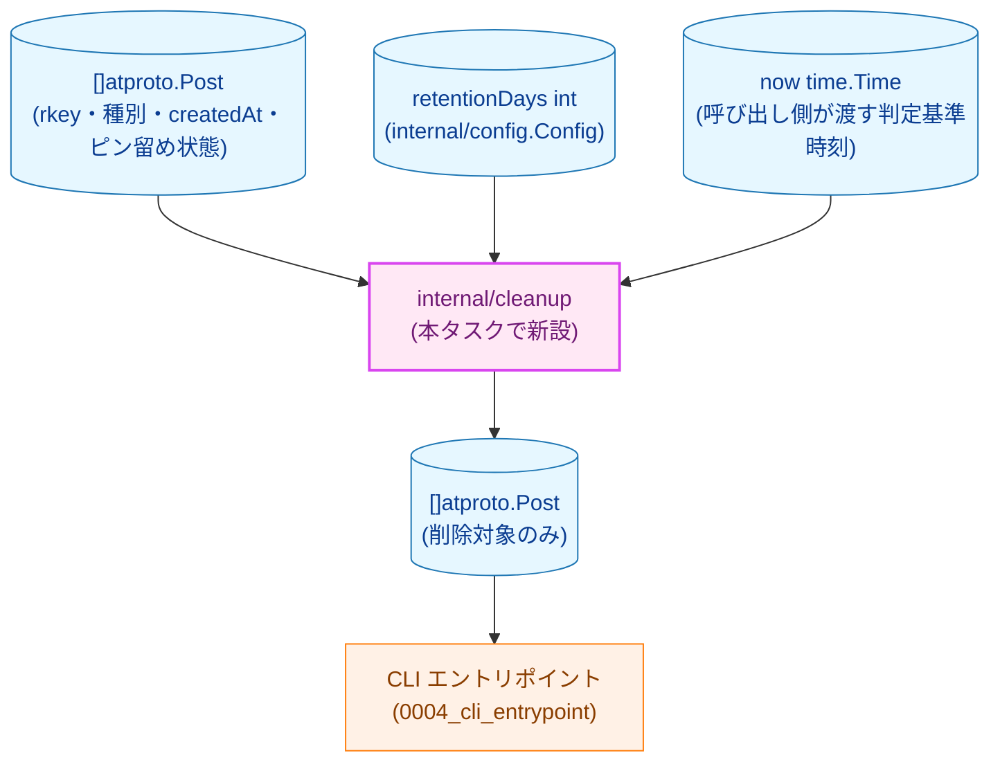
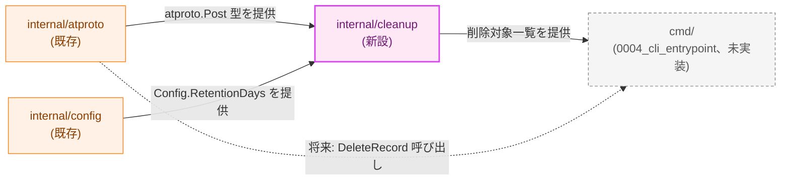
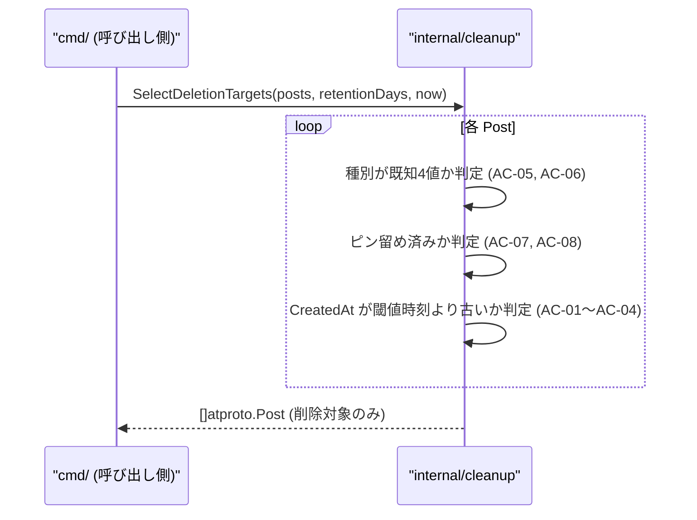

# クリーンアップエンジン — アーキテクチャ設計書

## Document Status

| Item | Value |
|---|---|
| Status | `draft` |
| Created | 2026-07-03 |
| Review date | - |
| Reviewer | - |
| Comments | - |

関連ドキュメント: [要件定義書](01_requirements.md)

## 1. 設計の全体像

### 1.1 設計原則

- **単一責任**: `internal/cleanup` パッケージは「投稿一覧と保持日数から削除対象を判定する」ことのみを責務とする。投稿一覧の取得・削除の実行そのものは [0002_atproto_client](../0002_atproto_client/01_requirements.md)、dry-run/apply の分岐と CLI からの呼び出しは [0004_cli_entrypoint](../0004_cli_entrypoint/01_requirements.md) の責務であり、本パッケージはどちらにも関与しない（NF-002）。
- **純粋関数**: 判定ロジックは `[]atproto.Post` と `retentionDays int`、判定基準時刻 `now time.Time` を入力として `[]atproto.Post`（削除対象一覧）を返す純粋関数として実装する。ネットワーク I/O・ファイル I/O・グローバル状態への依存を持たない（NF-002）。
- **時刻の明示的な受け渡し**: 判定基準となる現在時刻は、パッケージ内部で `time.Now()` を呼ばず、呼び出し側が引数として明示的に渡す（NF-002a）。これにより AC-03 の境界値テストを含め、時刻に依存する判定を決定的に検証できる。
- **安全側に倒す（fail-closed 相当の判定方針）**: `atproto.PostType` として既知の4種別（`PostTypeOriginal`/`PostTypeReply`/`PostTypeQuote`/`PostTypeRepost`）のいずれにも一致しないレコードは削除対象に含めない（AC-06）。判定は既知の4値を明示的に列挙する形（`switch`)で行い、範囲チェック（例: `0 <= v && v < 4`）は用いない。
- **設定値の再検証はしない**: `retentionDays` の正当性（正の整数であること）は [internal/config](../../dev/developer_guide/package_reference.md) が `Load`/`LoadAppConfig` の時点で検証済みである（`internal/config/validate.go`）。本パッケージはその検証結果を信頼し、再検証を行わない（DRY）。この前提が破られた場合の挙動は 4 節・5.2 節で扱う。

#### AC-06「ゼロ値」の解釈について

`01_requirements.md` の AC-06 は「既知4種別以外の想定外のレコード種別」の例として「`atproto.PostType` のゼロ値を含む」と記載している。しかし `atproto.PostType` のゼロ値は `PostTypeOriginal`（`iota` の最初の値、通常投稿）と数値上一致し、`PostTypeOriginal` 自体は AC-05 が要求する既知4種別の一つである。したがって AC-06 の文言をそのまま「ゼロ値は常に想定外」と読むと、AC-05（通常投稿は削除対象になり得る）と矛盾する。

本設計では、AC-06 の「ゼロ値を含む」という記述を「`PostTypeOriginal` という名前で明示的に列挙された値」ではなく「将来 `PostType` の値集合が拡張された場合や、`internal/atproto` 側の分類処理の不備によって意図せず未設定のまま渡された値」を指すものと解釈する。すなわち、判定ロジックは `PostTypeOriginal`/`PostTypeReply`/`PostTypeQuote`/`PostTypeRepost` の4つの**定数名**を `switch` で明示的に列挙し、それ以外の値（数値がたまたまゼロ値と一致する未分類の値を含む）はすべて除外側に倒す。この実装であれば AC-05・AC-06 のいずれも矛盾なく満たされる。

この解釈は `01_requirements.md` 自体の文言修正（AC-06 の再承認）を伴わない設計上の明確化である。要件文言の曖昧さそのものを解消するにはレビュー時に `01_requirements.md` へ AC-06a 等の補足を追加することが望ましいが、本タスクの判定ロジックの実装方針としては上記の解釈で一意に定まるため、この設計書ではこの解釈を採用して進める。

### 1.2 概念モデル



**矢印の意味**: すべての矢印は「入力として渡される／出力として渡す」ことを表す。

**凡例**: 水色（`data`）は入出力データ、紫（`newpkg`）は本タスクで新設するパッケージ、オレンジ（`process`）は既存または今後実装される呼び出し元コンポーネントを表す。

### 1.3 要件との対応

| 要件 | 設計上の対応 |
|---|---|
| F-001（経過日数判定、AC-01〜AC-04） | `now` と `retentionDays` から求めた閾値時刻と `Post.CreatedAt` を比較（2.2 節・3.1 節） |
| F-002（投稿種別判定、AC-05・AC-06） | `Post.Type` を既知4値と明示的に照合（1.1 節・3.1 節） |
| F-003（ピン留め除外、AC-07・AC-08） | `Post.Pinned` を判定条件に含める（3.1 節） |
| NF-001〜NF-003 | 7 節（テスト戦略）・8 節（実装優先順位）で担保 |

## 2. システム構成

### 2.1 コンポーネント配置



**凡例**: オレンジ（`process`）は既存コンポーネント、紫（`newpkg`）は本タスクで新設するパッケージ、グレー破線枠（`future`）は本タスクでは未実装の将来コンポーネントを表す。実線矢印は「呼び出し／型の利用」を、破線矢印は「本タスクの対象外だが将来結線される関係」を表す。`internal/cleanup` は `internal/atproto` の公開型 `Post`/`PostType` にのみ依存し、`internal/atproto` の HTTP クライアント本体には依存しない。

### 2.2 データフロー



**矢印の意味**: `→` は呼び出し、`-->` は戻り値を表す。ループ内の3判定をすべて満たした投稿のみが戻り値に含まれる（AND 条件）。

## 3. コンポーネント設計

### 3.1 データ構造・インターフェース

判定ロジックは新しい型を必要としない。`internal/atproto` が公開する `Post`/`PostType` をそのまま入出力の型として用いる。

```go
package cleanup

// SelectDeletionTargets returns the subset of posts eligible for deletion
// under the retention policy: posts whose CreatedAt is strictly older than
// (now - retentionDays), excluding pinned posts and any record whose Type
// does not match one of the known atproto.PostType values.
func SelectDeletionTargets(posts []atproto.Post, retentionDays int, now time.Time) []atproto.Post
```

`retentionDays` が正の整数であることは、呼び出し側（`internal/config`）が既に保証済みという前提に立ち、本関数は `error` を返さない（4節参照）。

### 3.2 判定基準時刻の計算（AC-01〜AC-04）

閾値時刻は `now.UTC().AddDate(0, 0, -retentionDays)` として一度だけ算出し、各投稿の判定に共通して用いる。`Post.CreatedAt` は比較前に `.UTC()` で正規化する（タイムゾーンオフセット表記への対応、AC-04）。境界値（`CreatedAt` が閾値時刻とちょうど等しい）は削除対象外側に倒す（AC-03）。そのため比較には「より古い」（厳密な `Before`）のみを用い、「以下」（`!After` のような等号を含む比較）は用いない。

### 3.3 コンポーネントの責務（新規ファイル一覧）

| ファイル | 責務 |
|---|---|
| `internal/cleanup/cleanup.go` | `SelectDeletionTargets` の実装、判定ロジック本体 |
| `internal/cleanup/cleanup_test.go` | AC-01〜AC-08 の単体テスト |

既存ファイルへの変更はない。

## 4. エラーハンドリング設計

`SelectDeletionTargets` はエラーを返さない。理由は以下の通り。

- 入力 `[]atproto.Post` はスライスであり、空・`nil` を渡された場合も空の削除対象一覧を返せば足りる（異常系ではない）。
- `retentionDays` の妥当性検証は `internal/config` の責務であり（1.1 節）、本パッケージが受け取る時点で既に検証済みという前提を置く。仮に呼び出し側がこの前提を破って `retentionDays <= 0` を渡した場合でも、算出される閾値時刻が未来方向にずれるだけで判定ロジック自体はクラッシュしない（純粋な時刻比較のため）。ただし、この場合すべての投稿（`CreatedAt` がどれだけ新しくても）が閾値時刻より古いと判定され、事実上アカウント全体の投稿が削除対象になる。これを防ぐ仕組みは `internal/config` の検証（`retentionDays > 0`）のみであり、本パッケージ自体は二重の防御層を持たない（5.2 節で許容リスクとして明記）。
- 未知の `PostType` 値は「エラー」ではなく「削除対象外」という判定結果として扱う（AC-06、解釈は 1.1 節参照）。
- `retentionDays` の上限は `internal/config` 側にも設けられていない（`validate.go` は `<= 0` のみを拒否する）。きわめて大きな値（例: `int` の最大値に近い値）を `time.Time.AddDate` に渡した場合の閾値計算結果は Go 標準ライブラリの日付正規化に委ねられ、本タスクではその挙動を個別に検証・保証しない。実用上は `retention_days` を人手で設定する運用（TOML ファイル）であるため発生確率は低いが、上限バリデーションを追加するかどうかは `internal/config` 側の設計判断であり、本パッケージのスコープ外とする。

## 5. セキュリティ考慮事項

### 5.1 副作用契約

`SelectDeletionTargets` は純粋関数であり、外部副作用を一切持たない。

| 関数 | 外部副作用 |
|---|---|
| `SelectDeletionTargets` | なし（ネットワーク通信・ファイル I/O・削除実行のいずれも行わない）。戻り値の削除対象一覧を実際に削除するかどうかは、呼び出し側（[0004_cli_entrypoint](../0004_cli_entrypoint/01_requirements.md)）が `--apply` フラグに応じて `atproto.Client.DeleteRecord` を呼ぶかどうかで制御する。 |

### 5.2 脅威モデル

本パッケージは外部入出力（ネットワーク・ファイル・環境変数）を持たず、[プロジェクト概要](../../overview.md#セキュリティ考慮事項) が挙げるリスクカテゴリ（間接プロンプトインジェクション、SSRF、秘匿情報漏洩、リトライ暴走、cron 二重起動）のいずれにも該当する攻撃面を持たない（N/A）。

**設定改竄（`retention_days`）については以下の点を許容リスクとして明記する。** `retention_days <= 0` は `internal/config` の検証で既に拒否されるため（`validate.go`）、`0` やそれ以下の値が本パッケージに到達することはない。一方、`retention_days = 1` のような小さいが有効な値は検証を通過し、実質的に「直近1日以外のほぼ全投稿」が削除対象になり得る。この種の値の妥当性チェック（削除件数上限のガードレール等）は overview.md に明記の通り将来検討事項であり、本タスクではガードレールを設けない。また、本パッケージは `internal/config` の検証結果を信頼する単一の防御層構成であり（1.1 節・4節）、`retentionDays` の再検証という第二の防御層は持たない。これは意図的な設計判断（DRY・YAGNI）であり、`internal/config` の検証をバイパスして本関数が直接呼び出された場合（例: 将来のテストコードや新しい呼び出し元の実装ミス）に大量削除が発生し得ることを許容リスクとして受け入れる。

**投稿一覧スナップショットの鮮度（実削除実行との時間差）**: `SelectDeletionTargets` が受け取る `[]atproto.Post`（`Pinned`・`CreatedAt` を含む）は [0002_atproto_client](../0002_atproto_client/01_requirements.md) の `ListPosts` が取得した時点のスナップショットである。ピン留め解除・設定後、実際の削除実行（[0004_cli_entrypoint](../0004_cli_entrypoint/01_requirements.md) が行う `DeleteRecord` 呼び出し）までの間にピン留め状態が変化した場合、本パッケージの判定は取得時点の状態に基づくため、削除実行時点の最新状態とは一致しない可能性がある。この時間差をどう扱うか（鮮度管理）は 0004 側の責務として扱う（9節参照）。

## 6. 処理フロー詳細

2.2 節のシーケンス図を参照。判定は投稿1件ごとに独立しており、投稿間の順序依存や状態の引き継ぎはない。

## 7. テスト戦略

### 7.1 単体テスト

`internal/cleanup/cleanup_test.go` に AC-01〜AC-08 それぞれを検証するテストケースを作成する。`now` を固定値として明示的に渡すことで、時刻に依存しない決定的なテストとする（NF-002a）。

| AC | テスト観点 |
|---|---|
| AC-01 | 閾値時刻より古い `CreatedAt` の投稿が削除対象に含まれる |
| AC-02 | 閾値時刻以内の `CreatedAt` の投稿が削除対象に含まれない |
| AC-03 | `CreatedAt` が閾値時刻とちょうど等しい投稿が削除対象に含まれない（境界値） |
| AC-04 | UTC 以外のオフセットを持つ `CreatedAt` が正しく判定される |
| AC-05 | 4種別（通常投稿・リプライ・リポスト・引用ポスト）それぞれが削除対象として判定される |
| AC-06 | 既知4値以外の `PostType`（ゼロ値含む、テストでは既存の4定数以外の値を明示的に構成して検証）が削除対象に含まれない |
| AC-07 | ピン留め投稿が経過日数条件を満たしても削除対象に含まれない |
| AC-08 | ピン留め解除後の投稿が経過日数条件を満たせば削除対象に含まれる |

### 7.2 統合テスト

本パッケージは `internal/atproto` の型のみに依存する純粋関数であり、外部システムとの結合点を持たないため、単体テストで全パターンを検証すれば十分である。統合テストは [0004_cli_entrypoint](../0004_cli_entrypoint/01_requirements.md) 側で「取得 → 判定 → (dry-run) 表示」の結線として実施する。

### 7.3 セキュリティ・回帰テスト

N/A（5節の通り攻撃面を持たない）。

## 8. 実装優先順位

1. `internal/cleanup/cleanup.go` に `SelectDeletionTargets` を実装（F-001〜F-003 を一括で満たす、判定条件間に依存関係がないため段階分けの必要がない）。
2. `internal/cleanup/cleanup_test.go` に AC-01〜AC-08 のテストケースを作成。
3. `make fmt` / `make test` / `make lint` を実行し NF-001 を満たすことを確認。
4. [Package Reference](../../dev/developer_guide/package_reference.md) に `internal/cleanup` の責務を追記する。

## 9. 将来拡張性

- 削除件数上限のガードレール（確認プロンプト・`--max-delete` フラグ等）を将来追加する場合も、`SelectDeletionTargets` は「条件に合致する全件」を返す現在の責務を維持し、上限適用は呼び出し側（CLI エントリポイント）の責務とする方が単一責任の原則に沿う。
- 削除対象外の種別（例: 将来的な新しい投稿種別）が `atproto.PostType` に追加された場合、本パッケージの `switch` 文に明示的な分岐を追加する必要がある。既知4値の列挙という設計方針（1.1 節）により、追加を忘れた新種別は自動的に「削除対象外」側に倒れる。
- **除外理由の可観測性**: `SelectDeletionTargets` は削除対象として選ばれた投稿一覧のみを返し、除外された投稿（経過日数条件を満たさない・ピン留め・想定外の種別）の理由別内訳は呼び出し元に渡さない。将来 [0004_cli_entrypoint](../0004_cli_entrypoint/01_requirements.md) が実行結果の Slack 通知やログに「何件が想定外の種別として除外されたか」等の内訳を含めたい場合、現在のインターフェースでは呼び出し元が同じ判定ロジックを再実装しない限り取得できない。0004 の設計時に、除外理由別の件数を取得する必要があるかどうかを確認し、必要であれば本パッケージのインターフェース拡張（例: 理由付き結果を返す形への変更）を別途検討する。

## 付録: 決定履歴

初版。参照すべき過去タスクからの変更履歴はまだ存在しない。
