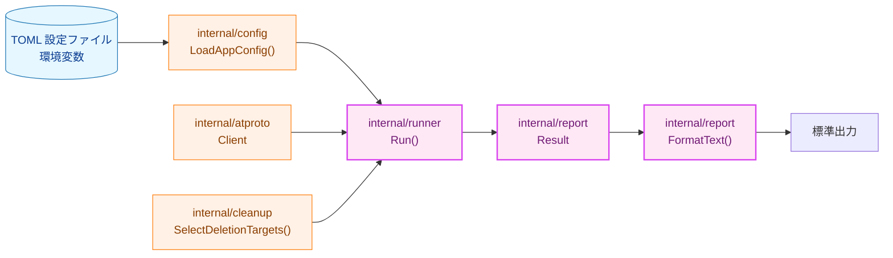
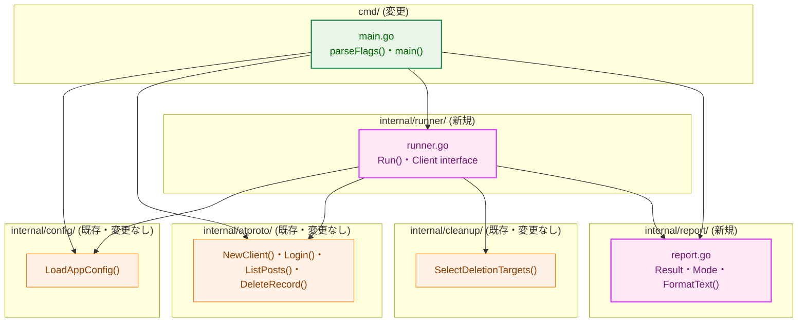
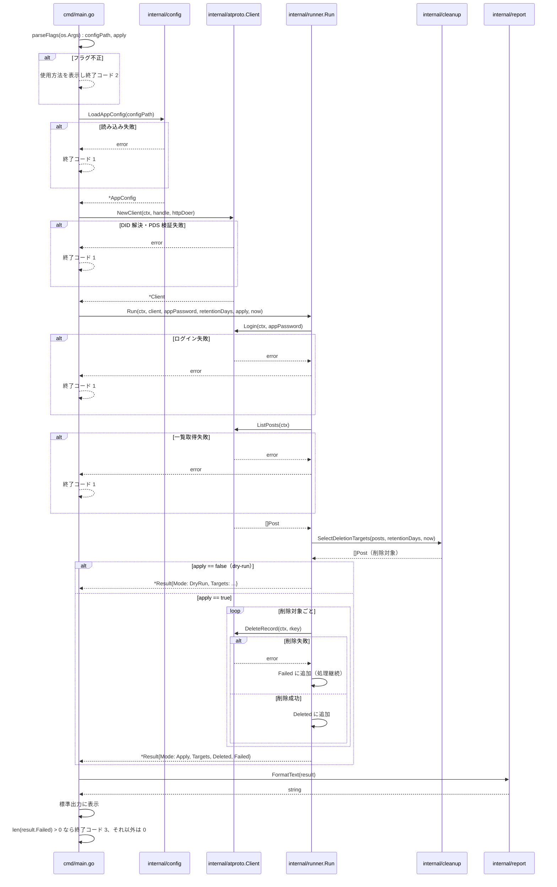
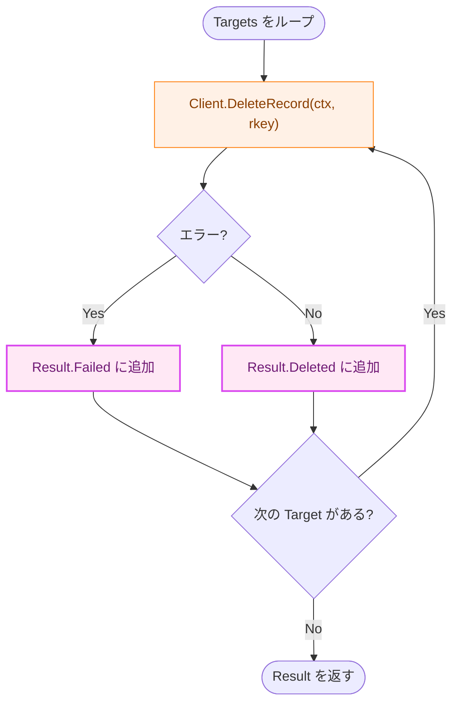

# CLI エントリポイント — アーキテクチャ設計書

## Document Status

| Item | Value |
|---|---|
| Status | `approved` |
| Created | 2026-07-04 |
| Review date | 2026-07-04 |
| Reviewer | isseis |
| Comments | - |

関連ドキュメント: [要件定義書](01_requirements.md)

## 1. 設計の全体像

### 1.1 設計原則

- **YAGNI**: リトライ・タイムアウト（0005）・Slack 通知（0006）・`print-schedule`（0007）はスコープ外とし、それらのための抽象化を先取りしない。
- **fail-closed**: 設定読み込み・クライアント初期化・ログイン・一覧取得のいずれかが失敗した場合は削除処理に進まず、非 0 の終了コードで停止する（[CLAUDE.md](../../../CLAUDE.md#key-design-patterns) 参照）。
- **Separation of Concerns**: `cmd/main.go` は「組み立て」（コンポーネントの呼び出し順序と終了コードの決定）に専念し、削除対象の判定ロジックは持ち込まない（NF-002）。判定は既存の `internal/cleanup.SelectDeletionTargets` に委譲する。
- **再利用性を見据えた構造化**: 実行結果は表示ロジックから独立した構造化データとして保持し（NF-005）、0006_slack_notification が同じデータを Slack 通知の入力として再利用できるようにする。

### 1.2 概念モデル



矢印 A → B は「A の出力が B の入力として使われる（依存・データフロー）」ことを表す。

**凡例**:

| クラス | 意味 |
|---|---|
| `data`（青） | 設定ファイル・環境変数などの静的データ |
| `process`（オレンジ） | 既存のまま変更しないコンポーネント |
| `newpkg`（紫） | 新規追加するパッケージ |

### 1.3 要件との対応

| 要件 | 対応する設計要素 |
|---|---|
| F-001 (AC-01〜03) | `cmd/main.go` のフラグパース（3.2.1） |
| F-002 (AC-04〜06) | `internal/runner.Run` の dry-run 経路 + `internal/report`（3.2.2） |
| F-003 (AC-07〜09) | `internal/runner.Run` の apply 経路（3.2.3） |
| F-004 (AC-10〜11) | `cmd/main.go` の組み立て順序とエラー時の終了コード制御（3.2.4） |
| NF-002 | `cmd/main.go` は組み立てのみ、判定ロジックは `internal/cleanup`（既存）に委譲 |
| NF-005 | `internal/report.Result`（表示から独立した構造化データ） |
| NF-001, NF-004 | 専用の設計要素なし。`make fmt`/`make test`/`make lint`（NF-001）と Go 1.26.2 以上でのビルド（NF-004）は、本タスクが新規の言語機能・外部ツールに依存しないため、既存のビルド設定でそのまま満たされる |
| NF-003 | 7.2 のテスト戦略で満たし方を記載 |

## 2. システム構成

### 2.1 コンポーネント配置



**凡例**:

| クラス | 意味 |
|---|---|
| `enhanced`（緑） | 変更するコンポーネント |
| `newpkg`（紫） | 新規追加するパッケージ |
| `process`（オレンジ） | 既存のまま変更しないコンポーネント |

`internal/atproto` の DID 解決・ログイン・一覧取得・削除ロジック自体は 0002_atproto_client で実装済みであり、本タスクはそれらを呼び出す組み立てのみを追加する。同様に `internal/cleanup.SelectDeletionTargets` の判定ロジックは 0003_cleanup_engine で実装済みである。`internal/runner` から `internal/config` への依存は、`Run` が `Client.Login` に渡す `config.SecretString`（app パスワード）の型を受け取るためだけの狭い依存であり、設定の読み込み・検証ロジック自体には関与しない。

### 2.2 データフロー



矢印 `->>` は同期呼び出し、`-->>` は戻り値・エラーの返却を表す。`alt` ブロックはエラー分岐を表し、いずれの分岐でも app パスワードやセッション JWT を含む値がそのまま `Main` に渡ることはない（`internal/atproto` が既に秘密情報を含まないエラー型（`HTTPError`/`SSRFError`）を返すため。0002_atproto_client AC-06/AC-15 参照）。

## 3. コンポーネント設計

### 3.1 データ構造・インターフェース

```go
// internal/report package

// Mode identifies whether a run actually deleted posts or only reported
// what would be deleted.
type Mode int

const (
    ModeDryRun Mode = iota
    ModeApply
)

// DeleteFailure pairs a deletion target with the error that occurred
// while deleting it.
type DeleteFailure struct {
    Post atproto.Post
    Err  error
}

// Result is the structured outcome of a single run, independent of how it
// is rendered. FormatText renders it for stdout (this task); a future
// Slack formatter (0006_slack_notification) renders the same Result for
// a webhook payload.
type Result struct {
    Mode    Mode
    Targets []atproto.Post  // posts SelectDeletionTargets judged eligible
    Deleted []atproto.Post  // ModeApply only: targets actually deleted
    Failed  []DeleteFailure // ModeApply only: targets whose deletion failed
}

// FormatText renders r as human-readable text for stdout. When
// r.Failed is non-empty, the rendered text lists each failure's rkey and
// error message (not merely the count) -- see 3.2.3 for the rationale.
func FormatText(r Result) string
```

```go
// internal/runner package

// Client is the subset of *atproto.Client that Run depends on, so tests
// can supply a fake instead of a real network client.
type Client interface {
    Login(ctx context.Context, appPassword config.SecretString) error
    ListPosts(ctx context.Context) ([]atproto.Post, error)
    DeleteRecord(ctx context.Context, rkey string) error
}

// Run performs one wiring pass: login, list posts, judge deletion targets
// via cleanup.SelectDeletionTargets, and -- only when apply is true --
// delete each target, continuing past individual failures. now is the
// caller-supplied judgment time, passed straight through to
// SelectDeletionTargets (consistent with that function's own non-implicit
// now parameter).
func Run(ctx context.Context, client Client, appPassword config.SecretString, retentionDays int, apply bool, now time.Time) (*report.Result, error)
```

`Client` の実体は `internal/atproto.Client`（既存、変更なし）であり、`*atproto.Client` は上記 3 メソッドを満たすためそのまま渡せる。テストではこのインターフェースを満たすモック実装、または `internal/atproto/testutil.MockHTTPDoer` を経由した実 `*atproto.Client` のいずれかを注入できる。

### 3.2 判定・処理ロジック

#### 3.2.1 フラグ・引数のパース（AC-01〜03）

`cmd/main.go` はフラグパースをテスト可能な関数 `parseFlags(args []string) (configPath string, apply bool, err error)` として切り出す。標準の `flag.Parse()`（`flag.ExitOnError`）は失敗時に `os.Exit` を直接呼ぶため、この切り出しでは `os.Exit` を伴わずにエラーを返せる構成（`flag.ContinueOnError` 相当）を採る。`--config` の別名として `-c` も受け付ける。`--config`/`-c` が指定されなかった場合、およびその他未知のフラグ・引数が指定された場合は、いずれも `parseFlags` がエラーを返し、`main()` が使用方法を表示した上で終了コード 2 で終了する。

#### 3.2.2 dry-run モードでの削除対象一覧表示（AC-04〜06）

`apply == false` の場合、`runner.Run` は `Client.DeleteRecord` を一切呼び出さない（2.2 のシーケンス図の `alt apply == false` 分岐を参照）。呼び出されるのは `Login`・`ListPosts`・`cleanup.SelectDeletionTargets` のみであり、返る `Result.Targets` が 0 件であっても `Result` 自体はエラーにならない。`report.FormatText` は `Targets` が空の場合、「削除対象なし」に相当する文言を出力する。

#### 3.2.3 `--apply` モードでの実削除実行（AC-07〜09）

`apply == true` の場合、`runner.Run` は `Targets`（`cleanup.SelectDeletionTargets` の判定結果）に含まれる投稿のみを削除対象とする。ピン留め投稿・保持期間内の投稿は `SelectDeletionTargets` の時点で既に除外されているため、`runner.Run` 側で追加のフィルタリングは行わない（判定ロジックの二重実装を避ける、DRY）。`report.FormatText` は `Result.Mode == ModeApply` のとき、`len(Deleted)` と `len(Failed)`（AC-09 が要求する件数）に加え、`Failed` の各要素について rkey とエラー内容を列挙する。本タスクの時点ではリトライ（0005_retry_timeout）も Slack 通知（0006_slack_notification）も実装されておらず、標準出力が失敗の内容を伝える唯一の手段であるため、運用者が件数だけでなく「どの投稿が」「なぜ」失敗したかまで判断できるようにする。

#### 3.2.4 コンポーネントの組み立てとエラー時の終了コード制御（AC-10〜11）

`cmd/main.go` の呼び出し順序は `parseFlags` → `config.LoadAppConfig` → `atproto.NewClient` → `runner.Run` である。`config.LoadAppConfig`・`atproto.NewClient`・`runner.Run` のいずれかがエラーを返した場合（`parseFlags` のエラー処理は 3.2.1 の通り別扱い）、後続の呼び出しは行わずエラーメッセージを標準エラー出力に書き、終了コード 1 で終了する（fail-closed）。`runner.Run` 自体がエラーを返すのは `Login`/`ListPosts` の失敗時のみであり、個々の投稿の削除失敗は `Run` のエラーではなく `Result.Failed` に集約される（AC-11）。`main()` は `runner.Run` が `nil` エラーで戻った場合でも `len(result.Failed) > 0` であれば非 0 の終了コードとする。

判定に使う「現在時刻」は `main()` が `time.Now()` を 1 回だけ呼び出して取得し、その値を `runner.Run` の `now` 引数にそのまま渡す。ループの途中で再取得することはない（`cleanup.SelectDeletionTargets` 自身が `now` を暗黙に取得しない設計（0003_cleanup_engine NF-002a）と一貫させ、1 回の実行内での判定基準を一つに固定するため）。

終了コードの割り当て:

| 状況 | 終了コード |
|---|---|
| フラグ・引数の不正（AC-03） | 2 |
| 設定読み込み・クライアント初期化・ログイン・一覧取得の失敗（AC-10、削除は一切発生していない） | 1 |
| dry-run 成功、または apply で全件成功 | 0 |
| apply で 1 件以上削除失敗（AC-11、一部の投稿は既に削除済み） | 3 |

AC-10 由来の失敗（終了コード 1）と AC-11 由来の失敗（終了コード 3）を区別するのは、両者が運用上まったく異なる意味を持つためである。前者は削除が一切実行されていない安全な失敗だが、後者は一部の投稿が既に不可逆に削除された状態での部分失敗である。終了コードだけでこの二つを区別できないと、cron・監視ツール側では「何も起きていない失敗」と「一部が既に削除された失敗」を、標準出力の文面をパースしない限り区別できない。AC-10/AC-11 はいずれも「非 0 の終了コードで終了する」とのみ規定しており、具体的な値までは指定していないため、この使い分けは要件と矛盾しない。

### 3.3 コンポーネントの責務（新規・変更ファイル一覧）

- **`cmd/main.go`（変更）**: フラグ・引数のパース（`--config`/`-c`、`--apply`）、`atproto.NewClient` に渡す `HTTPDoer` の具体実装（`http.DefaultClient` 等、`*http.Client` は `HTTPDoer` を満たす）の構築、判定基準時刻 `now` の取得（`time.Now()` を 1 回）、`config`/`atproto`/`runner`/`report` の呼び出し順序の制御、終了コードの決定。ビジネスロジック（削除対象の判定）は持たない。既存のテストは存在しない（プレースホルダのみだったため、更新が必要な既存挙動はない）。
- **`internal/runner/runner.go`（新規）**: `Client` インターフェースと `Run` 関数。`config`・`atproto`・`cleanup`・`report` を組み立て、`*report.Result` を構築する。ネットワーク I/O は行わず、渡された `Client` 経由でのみ `atproto` を呼び出す。
- **`internal/report/report.go`（新規）**: `Result`・`Mode`・`DeleteFailure` の型定義と `FormatText`。表示ロジックと結果データを分離し、0006_slack_notification が `Result` を再利用できるようにする。

## 4. エラーハンドリング設計

- `cmd/main.go` は `config.LoadAppConfig`・`atproto.NewClient` のエラーをラップせずそのまま受け取る。同様に `internal/runner.Run` も `Login`/`ListPosts` のエラーをラップせずそのまま返す。いずれも呼び出し元が `errors.Is`/`errors.AsType[T]` で 0001/0002 の既存エラー型を判別できるようにするためである。
- 個々の投稿削除の失敗は `error` として `Run` の戻り値に伝播させず、`report.DeleteFailure{Post, Err}` として `Result.Failed` に集約する。これにより「一部失敗しても処理を継続する」（AC-11）という制御フローと、「削除呼び出し自体のエラー型」という関心事を分離する。
- `cmd/main.go` はエラーを標準エラー出力に書く際、`err.Error()` をそのまま使う。0002_atproto_client の `HTTPError`/`SSRFError`、0001_config の `FieldError` はいずれも秘密情報（app パスワード・セッション JWT）を含まない文字列表現を持つため（0002 AC-06/AC-15、既存実装の `secretString`/`SecretString` によるマスキング）、秘密情報の観点では本タスクで追加のマスキング処理は不要である。ただし `HTTPError.ErrorName` は PDS サーバー自身が返す XRPC エラー名であり、これは秘密情報ではないが、SSRF 対策により信頼済みと検証された PDS ホストからの値である場合に限り、その内容を信頼してそのまま表示している（信頼できないホストへの通信自体は 0002_atproto_client の SSRF 対策で防止される）。

## 5. セキュリティ考慮事項

プロジェクト共通のリスクカテゴリは [セキュリティ設計](../../design/security.md) を参照。本タスク固有の考慮事項は以下の通り。

本タスクは「AT Protocol クライアントを呼び出し、削除（不可逆な破壊的操作）を実行する」という [_context.md](../../../.claude/commands/_context.md) の Conditional-guide trigger に該当する。ただし、DID 解決・SSRF 対策・秘密情報マスキングは 0002_atproto_client が、削除対象の判定（ピン留め除外・保持期間判定）は 0003_cleanup_engine が、それぞれ専用の設計ノートに相当する検討を経て、既に実装済みである。本タスクが新たに持ち込む唯一のリスクは「dry-run のつもりが実際に削除してしまう」という組み立てミスであるため、専用の設計ノートを別途起こす代わりに、その境界を次の 5.1 で明示する。

本タスクは新規の外部サービス連携を追加しない（既存の `internal/atproto` が提供する XRPC 呼び出しをそのまま利用するのみ）ため、「新規の外部サービス機能の全対象クライアント環境での動作検証」は対象外（N/A）である。

### 5.1 副作用契約

| モード | `Client.Login` | `Client.ListPosts` | `Client.DeleteRecord` |
|---|---|---|---|
| dry-run（`--apply` 未指定、デフォルト） | 呼ぶ | 呼ぶ | **呼ばない**（AC-05） |
| apply（`--apply` 指定） | 呼ぶ | 呼ぶ | `Result.Targets` の各要素に対して呼ぶ（AC-07） |

`apply` は `runner.Run` の引数として明示的に渡され、`Run` 内部やそれより下位のレイヤ（`internal/atproto`・`internal/cleanup`）が独自に「実行モード」を判定することはない。`DeleteRecord` の呼び出し可否は `runner.Run` 内の単一の `if apply` 分岐でのみ制御され、この分岐を経由しない `DeleteRecord` 呼び出し経路は存在しない。

`Login` は dry-run でも無条件に呼ぶ。`internal/atproto.ListPosts` 自体は認証不要な公開読み取りエンドポイントであり（0002_atproto_client の実装コメント参照）、理屈の上では dry-run のプレビューだけならログインなしでも実行できる。それでも本設計が dry-run/apply の両モードで `Login` を呼ぶのは、認証情報（app パスワード）の問題を `--apply` 実行時に初めて発覚させるのではなく、プレビュー段階で早期に検出できるようにするためである。

なお、dry-run と `--apply` は別々のプロセス実行であり、一つの「プレビュー→確認→実行」トランザクションにはなっていない。そのため、dry-run 実行後に保持期間を超えた投稿（dry-run の一覧には含まれていなかった投稿）が、後続の `--apply` 実行では削除対象に含まれうる。overview.md が削除件数の上限・確認プロンプトを将来検討事項として明示的にスコープ外としている以上、これは本タスクが許容する既知の挙動であり、不具合ではない。

### 5.2 脅威モデル

本タスクが新たに開くネットワーク送信経路・認証情報の取り扱いはない（`atproto.NewClient`/`Login`/`ListPosts`/`DeleteRecord` をそのまま呼び出すのみ）。想定される固有リスクは以下の 1 点。

| 脅威 | 対策 |
|---|---|
| dry-run のはずが実際に削除される（フラグ判定の実装ミス） | 5.1 の副作用契約通り、`apply` フラグの分岐点を `runner.Run` 内の 1 箇所に限定する。NF-003 により「フラグ未指定時は dry-run になる」ことを統合テストで明示的に検証する。 |

### 5.3 検出限界

削除件数が閾値を超えた場合の確認プロンプトや `--max-delete` は、要件定義書の通りスコープ外（overview.md に将来検討事項と明記）であり、本タスクでも対応しない。

## 6. 処理フロー詳細

2.2 のシーケンス図に主要フローを記載済み。個々の投稿削除が失敗した場合の詳細フロー（`Runner` 内のループ）は次の通り。



**凡例**:

| クラス | 意味 |
|---|---|
| `process`（オレンジ） | 既存のまま変更しないコンポーネント呼び出し |
| `newpkg`（紫） | 新規追加するロジック（`Result` への振り分け） |

`DeleteRecord` の呼び出し結果が確定するたび（ループの 1 周ごと）に、成功・失敗を問わずその場で 1 行の実行ログ（`slog` 経由、rkey と成否を含む）を出力する。本タスクではリトライ（0005）も Slack 通知（0006）もまだ実装されておらず、ループ完了後にまとめて返る `Result` だけが唯一の出力経路だと、大量の投稿削除の途中でプロセスが異常終了した場合（OOM・シグナル・想定外のレスポンス形状によるパニック等）、どの投稿が既に削除済みかを事後に一切復元できなくなるためである。この逐次ログは `Result` の内容と重複するが、`Result` は正常終了時にのみ得られる集約データであり、逐次ログはそれとは独立した「クラッシュ耐性のある実行記録」として位置づける。

## 7. テスト戦略

### 7.1 単体テスト

- `internal/report`: `FormatText` を `Result` の各パターン（dry-run・0 件・apply 全件成功・apply 一部失敗）で検証する。apply 一部失敗のパターンでは、失敗件数だけでなく、各失敗の rkey とエラー内容が出力に含まれることを検証する。
- `internal/runner`: `Client` インターフェースを満たすモック実装（テスト専用、`internal/runner` 配下の `test_helpers.go` に定義する軽量モック）を注入し、以下を検証する。
  - dry-run（`apply=false`）で `DeleteRecord` が一度も呼ばれないこと（AC-05）。
  - apply（`apply=true`）で `Targets` の全件に対して `DeleteRecord` が呼ばれること（AC-07）。
  - 一部の `DeleteRecord` がエラーを返しても残りの呼び出しが継続され、`Result.Failed`/`Result.Deleted` に正しく振り分けられること（AC-11）。
  - `Login`/`ListPosts` のエラーがそのまま `Run` のエラーとして返ること（AC-10 の一部）。
  - `DeleteRecord` の呼び出しごとに、成否を問わず 1 行の実行ログが出力されること（6 節の逐次ログ）。
- `cmd/main.go`（`main_test.go`、`package main`）: 終了コードの決定ロジックを、AC-10 由来の失敗（終了コード 1）と AC-11 由来の失敗（終了コード 3）の両方について検証する。
- `cmd/main.go`（`main_test.go`、`package main`）: `parseFlags` を直接呼び出し、以下を検証する。
  - `--config`/`-c` のいずれでも設定ファイルパスが受理されること（AC-01）。
  - `--apply` を指定しない場合に `apply == false` が返ること（AC-02、NF-003 の一部）。
  - `--config`/`-c` を指定しない場合、および未知のフラグを指定した場合にエラーが返ること（AC-03）。

### 7.2 統合テスト

- NF-003（「dry-run がデフォルト」の明示的な検証）は、7.1 の `parseFlags` テスト（フラグ未指定で `apply=false`）と `internal/runner` テスト（`apply=false` で `DeleteRecord` 呼び出し 0 回）を組み合わせて満たす。両テストが揃って初めて「フラグ未指定 → 実削除が一切発生しない」という一連の振る舞いが検証される。
- `internal/atproto/testutil.MockHTTPDoer`（既存）を用いて、実 `*atproto.Client` を `runner.Client` として注入するテストを 1 本以上用意し、`runner.Run` が実クライアントの型と実際に組み立てられることを確認する（インターフェースの形状不一致を検出するための最小限の結合テスト）。

### 7.3 セキュリティ・回帰テスト

- 0002_atproto_client・0003_cleanup_engine の既存テストは本タスクによる変更を受けないため、回帰テストの追加は不要。
- dry-run 時に `DeleteRecord` が呼ばれないことの検証（7.1）自体が、本タスク固有のセキュリティ要件（不可逆操作の誤発火防止）に対する回帰テストを兼ねる。

## 8. 実装優先順位

1. **フェーズ1**: `internal/report` パッケージ（`Result`/`Mode`/`DeleteFailure`/`FormatText`）を実装し、単体テストを書く。
2. **フェーズ2**: `internal/runner` パッケージ（`Client` インターフェース・`Run`）を実装し、偽 `Client` を用いた単体テストで dry-run/apply 双方の経路を検証する。
3. **フェーズ3**: `cmd/main.go` を実装し（`parseFlags` を含む）、`parseFlags` の単体テストと、実 `*atproto.Client` を用いた結合テストを追加する。

## 9. 将来拡張性

- `internal/report.Result` は 0006_slack_notification が Slack 通知のフォーマッタ（例: `FormatSlackBlocks(Result) SlackPayload`）を追加する際の入力としてそのまま再利用できる設計とした。
- `internal/runner.Run` の `Client` インターフェースは、0005_retry_timeout がリトライ付きの `Client` 実装（デコレータ）を注入できる形になっている。本タスクではリトライ実装自体は行わない（YAGNI）。

## 付録: 決定履歴

- **NF-005 の「構造化データ（interface）」を Go の `interface` 型ではなく `struct`（`report.Result`）として実装した理由**: NF-005 が求めているのは「標準出力への表示ロジックから独立した、再利用可能なデータ」という API 境界としての独立性であり、複数の実装を切り替えるための多態性（Go の `interface` 型）そのものではない。`Result` の形状は単一であり、0006_slack_notification もこの同じ具体型をそのまま入力として再利用する想定であるため、`interface` 型による抽象化を追加することは YAGNI に反する。

- **`Result` を `internal/runner` ではなく独立した `internal/report` に置いた理由**: `runner` は組み立てロジック（ネットワーク呼び出しの順序制御）を持つため、0006_slack_notification が「結果の型だけ」を参照したい場合に `runner` パッケージ全体（`Client` インターフェースや `Run` の実装詳細）への依存を強制してしまう。データ型と表示ロジックを組み立てロジックから分離することで、NF-005 が意図する「表示ロジックとは独立した構造化データ」という要件をパッケージ境界としても表現した。
- **`flag.ExitOnError`（標準の `flag.Parse()` の挙動）を採用しなかった理由**: `os.Exit` を直接呼ぶため、NF-003 が要求する「フラグ未指定時に dry-run になること」の統合テストが書けなくなる（プロセスが終了してしまう）。`flag.ContinueOnError` + テスト可能な `parseFlags` 関数に切り出すことで、この要件を満たしながら AC-03（使用方法表示 + 非 0 終了）は `main()` 側で維持した。
