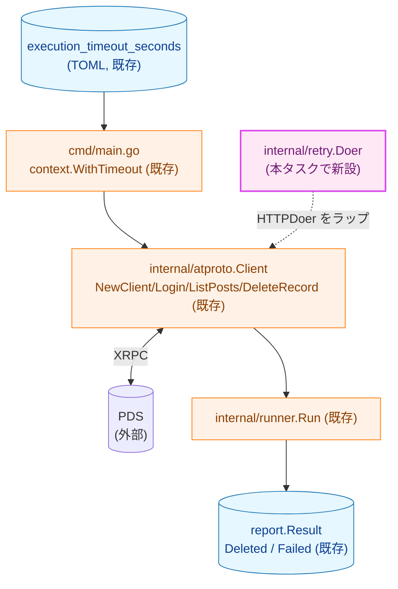
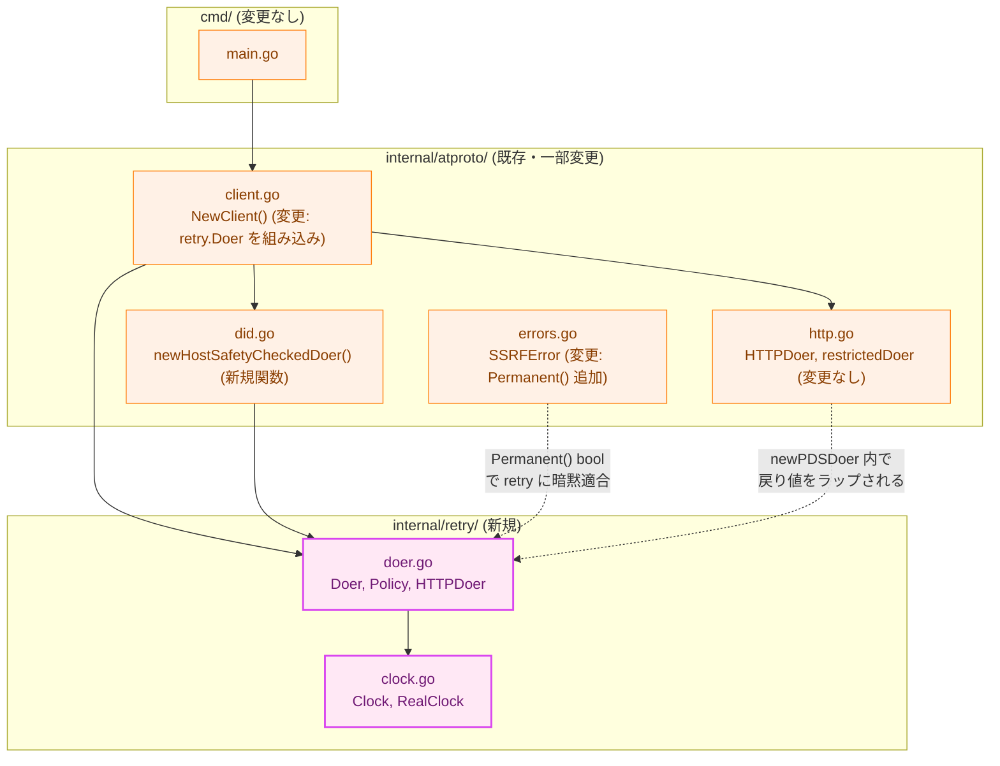
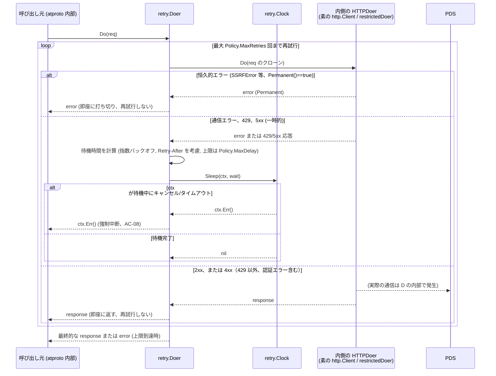
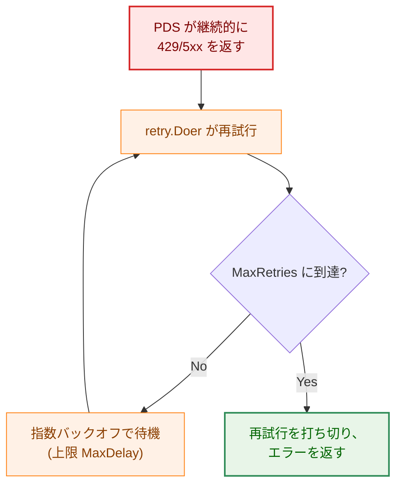
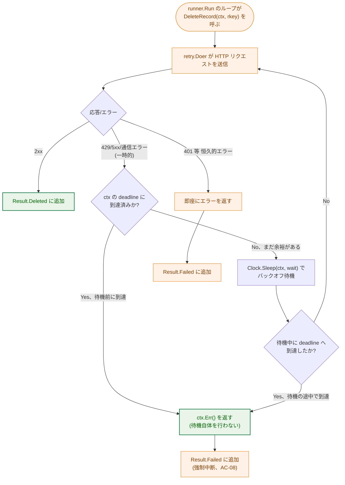

# リトライ・実行タイムアウト — アーキテクチャ設計書

## Document Status

| Item | Value |
|---|---|
| Status | `draft` |
| Created | 2026-07-04 |
| Review date | - |
| Reviewer | - |
| Comments | - |

関連ドキュメント: [要件定義書](01_requirements.md)

## 1. 設計の全体像

### 1.1 設計原則

- **単一責任**: 本タスクが新設する `internal/retry` パッケージの責務は「`HTTPDoer` を1つラップし、一時的な失敗を指数バックオフで再試行する」ことのみに限定する。どの XRPC メソッドを呼んでいるか、レスポンスボディの中身が何かといった AT Protocol 固有の知識は一切持たない。
- **既存コンポーネントの再利用（YAGNI）**: 実行タイムアウト自体（F-002 / AC-05, AC-06）は [0004_cli_entrypoint](../0004_cli_entrypoint/01_requirements.md) の実装時点で `cmd/main.go` がすでに `context.WithTimeout(ctx, cfg.ExecutionTimeout)` を実装済みであり、`internal/config.Config.ExecutionTimeout`（[0001_config](../0001_config/01_requirements.md) AC-10）も既にバリデーション済みである。本タスクはこれらを変更せず、F-002 の受け入れ基準は既存実装によってすでに満たされていることを 3.4 節で確認する。同様に F-003（AC-08, AC-09）についても、`context.Context` を用いた deadline 伝播（`http.NewRequestWithContext`）と `internal/report.Result` の `Deleted`/`Failed` の分離は既存実装がすでに備えており、新規の型・分岐を追加する必要がないことを 3.5 節で示す。本タスクが実際に新規実装するのはリトライ機構（F-001）のみである。
- **デコレータパターンによる透過的な追加**: [0002_atproto_client](../0002_atproto_client/01_requirements.md) 9節は「リトライ層は `HTTPDoer` インターフェースをラップする形で追加される想定であり、`Client` 自体の変更を必要としない」と将来拡張性として明記している。本設計はこの想定どおり、`internal/atproto.HTTPDoer` を満たす薄いデコレータとしてリトライを実装し、`internal/atproto.Client` の公開 API（`NewClient`/`Login`/`ListPosts`/`DeleteRecord` のシグネチャ）は変更しない。
- **外部依存の最小化**: リトライ・バックオフの実装は標準ライブラリ（`time`/`context`/`math`）のみを用いた自作の薄い実装とし、専用のリトライライブラリは導入しない。
- **fail-closed**: リトライ回数・バックオフ時間には必ず上限を設け、無制限リトライによる Bluesky 側のレート制限誘発（[セキュリティ設計](../../design/security.md) 参照）を防ぐ。

### 1.2 概念モデル



**凡例**: 実線矢印 A → B は「A の出力・制御が B に渡ること」を表す。破線矢印は「B の内部実装がラップ対象として利用すること」（ラップする・される関係）を表す（新設する `internal/retry.Doer` が `internal/atproto` 内部の `HTTPDoer` 実装をラップする関係であり、`atproto` パッケージの公開インターフェースを変更するものではない）。青（`data`）は静的データおよび構造化された結果データ、橙（`process`）は本タスクで変更しない既存コンポーネント、紫（`newpkg`）は本タスクで新設するパッケージを示す。この矢印の向きは、2.1節の図が示す「import する（依存する）」関係とは逆になる（2.1節の図では `atproto` → `retry` の向きに矢印が引かれる）。両者は同じ実体（`internal/retry.Doer` が `internal/atproto` 内部の `HTTPDoer` をラップする関係）を別の側面（ラップ関係 / import 関係）から見たものであり、矛盾ではない。

`context.WithTimeout` によって生成された deadline 付き `ctx` は、`atproto.NewClient` 以降のすべての呼び出し（DID 解決・ログイン・投稿一覧取得・削除）にそのまま伝播する（既存実装、[0002_atproto_client](../0002_atproto_client/01_requirements.md) の各メソッドが `ctx context.Context` を受け取り `http.NewRequestWithContext` に渡す設計、および [セキュリティ設計](../../design/security.md) が指摘する slowloris 対策の前提）。本タスクが新設する `internal/retry.Doer` は、この既存の ctx 伝播経路の途中に挿入されるだけであり、伝播そのものの経路や仕組みを変更しない。

### 1.3 要件との対応

| 要件 | 満たす設計要素 |
|---|---|
| F-001（指数バックオフ付きリトライ）/ AC-01〜AC-04 | `internal/retry`: `Doer`, `Policy`, `Clock`（2, 3節） |
| F-002（実行全体の実行タイムアウト）/ AC-05〜AC-07 | AC-05, AC-06 は [0004_cli_entrypoint](../0004_cli_entrypoint/01_requirements.md)（`cmd/main.go` の `context.WithTimeout`）・[0001_config](../0001_config/01_requirements.md)（`ExecutionTimeout` の検証）による既存実装で充足済み（3.4節）。AC-07 は `docs/design/configuration.md` への追記（3.4節、3.6節）で満たす |
| F-003（タイムアウトと削除処理の境界制御）/ AC-08, AC-09 | 既存の ctx 伝播（[0002_atproto_client](../0002_atproto_client/01_requirements.md)）と `internal/report.Result`（[0004_cli_entrypoint](../0004_cli_entrypoint/01_requirements.md)）による既存実装で充足済み。本タスクの新規要件は「リトライ待機中も ctx キャンセルを即座に検知すること」のみ（3.5節） |
| NF-001（`make fmt`/`make test`/`make lint`） | 専用の設計要素なし。既存のビルド設定でそのまま満たされる（[0004_cli_entrypoint](../0004_cli_entrypoint/01_requirements.md) の同項目と同じ扱い） |
| NF-002（時間のモック化） | `internal/retry.Clock` インターフェース（3.2節） |
| NF-003（`context.Context` 伝播） | 既存実装（1.2節）。本タスクは伝播経路を変更しない |

## 2. システム構成

### 2.1 コンポーネント配置



**凡例**: 実線矢印 A → B は「A が B に依存する（import する）」ことを表す。破線矢印は、ラベルに応じて次の2種類のいずれかを表す。「〜に暗黙適合」というラベル（`ERRORS` → `RDOER`）は「B が定義する非公開インターフェースに、A 側の型がメソッドを実装することで暗黙に適合する」構造的部分型（structural typing）の関係を表す。「〜ラップされる」というラベル（`HTTP` → `RDOER`）は「B が A の戻り値をラップする」関係を表す（`client.go` の `newPDSDoer` が `http.go` の `newRestrictedDoer` の戻り値を `retry.NewDoer` に渡してラップする、3.3節参照）。どちらの破線矢印も `client.go`・`errors.go` が `internal/retry` を import する関係を表すものではない点に注意する（`http.go`・`errors.go` はいずれも `internal/retry` を import しない。実際に import するのは `client.go` のみであり、それは実線矢印 `CLIENT --> RDOER` が表す）。紫（`newpkg`）は本タスクで新設するパッケージ、橙（`process`）は既存コンポーネント（一部ファイルは変更あり）を示す。

`internal/retry` は `internal/atproto` に依存しない（`net/http`/`context`/`time` のみに依存する）。依存の向きは `atproto` → `retry` の一方向のみであり、循環依存は生じない。`SSRFError`（`atproto/errors.go`）に `Permanent() bool` メソッドを追加する変更は、`retry` パッケージ側が定義する非公開インターフェース `permanentError` に構造的に適合させるためのものであり、この適合自体は `atproto` 側でのメソッド実装だけで成立し、`retry` の公開 API を呼び出す必要はない（2.3節で詳述）。`NewClient` が `retry.NewDoer`（公開コンストラクタ）を呼び出して `HTTPDoer` をラップする配線は、これとは別の依存であり、3.3節で扱う。

| ファイル | 新設/既存 | 主な定義 |
|---|---|---|
| `internal/retry/doer.go` | 新設 | `HTTPDoer`, `Policy`, `Doer`, `NewDoer()` |
| `internal/retry/clock.go` | 新設 | `Clock`, `RealClock` |
| `internal/retry/test_helpers.go` | 新設（`//go:build test`） | `fakeClock`（バックオフ待機を即座に進める、NF-002） |
| `internal/atproto/client.go` | 既存・変更 | `NewClient()` が `retry.NewDoer` で DID 解決用・PDS 通信用の双方の `HTTPDoer` をラップする |
| `internal/atproto/errors.go` | 既存・変更 | `SSRFError` に `Permanent() bool` を追加（リトライ対象外であることを表明） |
| `internal/atproto/did.go` | 既存・変更 | `newHostSafetyCheckedDoer()`（新規関数）を追加し、`resolveHandleToDID`/`resolveDIDDocument` がリクエスト前に直接呼んでいた `checkRequestHostSafety` を、`HTTPDoer.Do` 呼び出しのたびに実行するラッパーへ移す（2.3節） |
| `docs/design/configuration.md` | 既存・変更 | `execution_timeout_seconds` の記述に、リトライ最悪ケース時間を考慮した設定ガイダンスを追記（AC-07、3.6節） |

`internal/runner`・`internal/report`・`cmd/main.go` はいずれも変更しない。既存テストのうち、本タスクの変更によって挙動が変わりうるものの洗い出しは 2.4 節を参照。

### 2.2 データフロー



**凡例**: 矢印 `->>` は同期呼び出し、`-->>` は戻り値・エラーの返却を表す。`alt` は分岐条件を、`loop` は再試行ループの上限を表す。認証エラー（401 等、AC-03）は「429 以外の 4xx」に含まれ、他の一時的エラーと同じ分岐には入らず即座に返る。

### 2.3 `SSRFError` をリトライ対象外にする理由

[0002_atproto_client](../0002_atproto_client/01_requirements.md) の SSRF 対策（`restrictedDoer`・`DialContext` ラッパー・`CheckRedirect`）は、検証済みアドレス以外への接続やリダイレクトを `*SSRFError` として `HTTPDoer.Do` の戻り値（`error`）で返す。この失敗は一時的な通信障害ではなく、「検証条件に違反した接続を拒否した」という恒久的な判定結果であるため、再試行しても同じ拒否が繰り返されるだけであり、AC-01 が対象とする「一時的なエラー」には該当しない。

`internal/retry` は `internal/atproto` に依存しない設計（2.1節）のため、`*atproto.SSRFError` を型として直接判定できない。そこで `retry` パッケージ側に次の非公開インターフェースを定義し、`SSRFError` がこれを構造的に満たすことで、パッケージ間の依存を増やさずに「恒久的エラーなので再試行しない」という情報を伝える。

```go
// internal/retry package

// permanentError is implemented by errors that must never be retried
// regardless of their transport-level shape (e.g. an SSRF rejection --
// retrying would not help, since the same verified-address check would
// reject it again). Doer checks for this via a plain type assertion, so
// callers do not need to import this package's types to opt out of retry.
type permanentError interface {
    Permanent() bool
}
```

`atproto.SSRFError` はこのインターフェースを暗黙に満たすよう `Permanent() bool { return true }` を実装する（2.1節の図の破線矢印）。`ErrPaginationStalled`（[0002_atproto_client](../0002_atproto_client/01_requirements.md) 6.2節、`listAllRecords` のカーソル非進行検出）は `HTTPDoer.Do` の戻り値としては発生せず、2xx 応答を受け取った後の上位レイヤー（`atproto.listAllRecords`）でのみ判定されるため、`retry.Doer` の再試行ループの対象に含まれることはない。これは 0002 の設計判断（「リトライ層はこの種のエラーを一時的な transport 障害と混同すべきではない」）と矛盾しない。

#### 2.3.1 DID 解決フェーズでのリトライと DNS リバインディング対策の両立

[0002_atproto_client](../0002_atproto_client/01_requirements.md) 5.2節が確立した DNS リバインディング（ホスト名の安全性検証後、実際の接続までの間に DNS の応答が書き換わり、検証をすり抜けて別のホストへ接続させる攻撃）対策は、「ホスト名の安全性検証（`checkRequestHostSafety`）と実際の接続の間の時間差を可能な限り縮める」ことを前提にしている。既存実装では `resolveHandleToDID`/`resolveDIDDocument`（`did.go`）が、リクエストを1回だけ組み立てる直前に `checkRequestHostSafety` を1回だけ呼んでいる。

本タスクがこの2メソッドの `HTTPDoer` をリトライでラップすると、1回の論理的な呼び出しが `HTTPDoer.Do` レベルで最大6回（初回+5リトライ）の独立した接続を行いうる。もし `checkRequestHostSafety` を呼び出し前に1回だけ実行したままリトライを追加すると、2回目以降の接続は安全性検証を経ないまま行われることになり、初回の検証から2回目の接続までの間に DNS リバインディングが発生した場合を検出できなくなる。これは「検証と接続の時間差をなくす」という 0002 の設計判断に対する後退である。

この問題を避けるため、`checkRequestHostSafety` の呼び出し位置を「リクエスト組み立て前に1回」から「`HTTPDoer.Do` が呼ばれるたびに1回」へ移す。具体的には、`did.go` に次のラッパーを追加し、`resolveHandleToDID`/`resolveDIDDocument` はこのラッパー越しにリクエストを送る。

```go
// internal/atproto package (did.go への追加分)

// newHostSafetyCheckedDoer wraps inner so that every Do call re-validates
// the request's target host via checkRequestHostSafety before delegating,
// rather than checking once before the first attempt. This keeps the
// DNS-rebinding protection (0002_atproto_client 5.2節) intact even when
// retry.Doer (2.3.1節) retries the same logical call multiple times: each
// retried attempt is a fresh Do call and therefore triggers a fresh check.
func newHostSafetyCheckedDoer(inner HTTPDoer) HTTPDoer
```

`retry.NewDoer` はこのラッパーの外側に位置する（`retry.NewDoer(newHostSafetyCheckedDoer(httpDoer), ...)`）。これにより、リトライによる再試行のたびに `newHostSafetyCheckedDoer.Do` が呼ばれ、そのたびに安全性検証が実行される。DID 解決結果自体（handle→DID、DID→サービスエンドポイント）は各試行で再取得されるわけではなく、`resolveHandleToDID`/`resolveDIDDocument` それぞれの1回の呼び出しの中でリトライが完結する点は変わらない。

### 2.4 既存テストへの影響

`internal/retry` の導入によって成功パス（1回で 2xx が返るケース）の呼び出し回数は変わらないため、`internal/atproto` の既存テストのうち **恒久的な失敗（再試行されるべきでない失敗）を扱うテストは、本タスクの変更後も同じ呼び出し回数のまま成立する**。ただし、その理由は分類ロジック（`Permanent()`/ステータスコード）だけでなく、テストが `*Client` をどう構築しているかにも依存するため、両方を明示する。

- `did_test.go` の SSRF 拒否ケース（`TestValidatePDSEndpoint...` 等、`mock.CallCount()` で「拒否後に追加リクエストが送られない」ことを検証）: これらは `atproto.NewClient` を経由する数少ない既存テストであり、実際にリトライラップを通過する。`SSRFError.Permanent()==true` により再試行されないため、変更の影響を受けない。
- `session_test.go: TestClient_Login_InvalidCredentials_NoFurtherCalls`（401 相当、`mock.CallCount()==1` を検証）・`delete_test.go`・`posts_test.go` のページネーション非進行ケース: これらは `newTestClient`（`test_helpers.go`）で `*Client` の非公開フィールドを直接設定して構築しており、`NewClient` を経由しない（＝リトライラップを一切通過しない）。したがって「401 やページネーション非進行が再試行対象外だから」ではなく、そもそもこれらのテストがリトライ機構に触れないことが、変更の影響を受けない直接の理由である。
- `errors_test.go`・`http_test.go` は `HTTPError`/`SSRFError` の構築や `restrictedDoer`/`DialContext` を直接テストしており、`retry.Doer` を経由しないため無関係。

したがって、本タスクの実装によって既存テストの期待値を更新する必要のあるものはない。5xx・429・タイムアウトを用いた新規のリトライ挙動テストは `internal/retry` 配下に新設する（7.1節）。`internal/atproto` レベルでは「`NewClient` が返す `*Client` がリトライでラップされた `HTTPDoer` を保持すること」の配線確認のみを行い、リトライの時間制御ロジック自体（バックオフ・`Retry-After`・打ち切り）の網羅的な検証は `internal/retry` 側の単体テストに一元化する（7.1節）。`newTestClient` 経由の既存テストは、実際のネットワーク通信を伴わない高速な単体テストであることを重視した意図的な設計である。`NewClient` 経由でリトライ込みの `Login`/`ListPosts`/`DeleteRecord` を駆動する結合テストを追加すると、`RealClock` による実待機（最悪ケース約31秒、3.4節）が発生してテストを著しく遅くしてしまうため、本タスクではあえて追加しない（付録「決定履歴」参照）。

## 3. コンポーネント設計

### 3.1 `internal/retry` パッケージのデータ構造・インターフェース

```go
// internal/retry package

// HTTPDoer is the minimal HTTP interface this package retries. It is
// structurally identical to atproto.HTTPDoer but declared independently so
// this package has no dependency on internal/atproto.
type HTTPDoer interface {
    Do(req *http.Request) (*http.Response, error)
}

// Policy bounds retry behavior for a single logical HTTP call: MaxRetries
// additional attempts beyond the first, exponential backoff starting at
// BaseDelay and doubling on every subsequent attempt, capped at MaxDelay
// regardless of the computed backoff or a server-supplied Retry-After
// value (AC-04).
type Policy struct {
    MaxRetries int
    BaseDelay  time.Duration
    MaxDelay   time.Duration
}

// Clock abstracts the backoff wait so tests can simulate elapsed time
// without a real sleep (NF-002). Sleep returns ctx.Err() if ctx is done
// before d elapses, letting a caller detect a forced interruption (AC-08)
// during the wait itself, not only during the HTTP round trip.
type Clock interface {
    Sleep(ctx context.Context, d time.Duration) error
}

// RealClock is the production Clock: it sleeps for the real duration d, or
// returns ctx.Err() early if ctx is canceled/expires first.
type RealClock struct{}

// Doer wraps an HTTPDoer, retrying transient failures (transport errors,
// HTTP 429, HTTP 5xx) per policy, and never retrying an error satisfying
// the unexported permanentError interface (2.3節) or an HTTP status
// outside the retryable set (in particular 401 and other non-429 4xx,
// AC-03).
type Doer struct {
    // unexported fields: inner HTTPDoer, policy Policy, clock Clock
}

// NewDoer builds a Doer wrapping inner per policy, using clock to wait
// between attempts.
func NewDoer(inner HTTPDoer, policy Policy, clock Clock) *Doer

// Do implements HTTPDoer, retrying per d's policy and clock.
func (d *Doer) Do(req *http.Request) (*http.Response, error)
```

**設計上の要点**:

- **リクエストの再送可能性**: `req.GetBody` は Go 標準ライブラリの `http.NewRequestWithContext` が `*bytes.Reader`/`*bytes.Buffer`/`*strings.Reader` 系のボディに対して自動設定するフィールドであり、`internal/atproto` の `doXRPC`（`http.go`）が構築するリクエストは常に `bytes.NewReader` でボディを構築しているため、この条件を満たす。`Doer.Do` は再試行のたびに `req.GetBody()` で新しいボディリーダーを取得したリクエストのクローンを送信することで、1回目の送信でボディが消費済みになっていても2回目以降の送信でボディが空になる問題を防ぐ。
- **再試行のたびに破棄する中間レスポンスのクローズ**: リトライ対象と判定した応答（429・5xx）は、次の試行に進む前に必ず `resp.Body` を処理してから `Close()` する。原則は `io.Copy(io.Discard, resp.Body)` で EOF まで読み切り、`http.Transport` に TCP コネクションをキープアライブ用として再利用させることを狙うが、この読み捨てには上限（例: 数十 KB）を設ける。上限に達してもなお EOF に到達しない場合は、そこで読み捨てを打ち切って `Close()` する——Go の `net/http` の仕様上、この場合は当該コネクションがキープアライブ用に再利用されず新規接続に置き換わる。すなわち、上限超過時に諦めるのはコネクション再利用というパフォーマンス上の最適化のみであり、正しさや安全性には影響しない（異常に大きい 429/5xx ボディを送りつけられて読み捨てに時間や無制限メモリを浪費する事態を防ぐことを優先する判断である）。これを怠って読み捨て自体を省略すると、`Policy.MaxRetries` 回のリトライごとに接続を1本ずつ消費してしまう（長時間稼働する cron 実行でコネクションプールを枯渇させるリスク）。呼び出し元に返す最終的な応答（打ち切り時に返す最後の応答、または成功応答）の `Body` の所有権のみが呼び出し元に渡り、それ以外の中間応答は `Doer.Do` の内部で必ずクローズされる。
- **`Clock.Sleep` による ctx キャンセルの即時検知（AC-08 との関係）**: `RealClock.Sleep` はタイマーと `ctx.Done()` の両方を待ち受け、いずれか早い方で返る。実行タイムアウトの deadline がバックオフ待機の途中に到来した場合、`Sleep` は実際の待機時間を待たずに `ctx.Err()` を返し、`Doer.Do` はそれ以上リトライせず即座にエラーを返す。これにより、削除 API 呼び出し（`DeleteRecord`）がリトライの待機中にタイムアウトへ到達した場合も、強制中断が遅延なく発生する（3.5節）。待機時間 `d` が0以下の場合（次の箇条書きで説明する `Retry-After` の異常値対策により通常は発生しないが、防御的に）、`Sleep` はタイマーと `ctx.Done()` の `select` による競合に頼らず、`ctx.Err()` を明示的に確認してから即座に復帰する実装とする。
- **429 応答の `Retry-After` の扱いと異常値対策（AC-04）**: `Retry-After` ヘッダーが存在し、秒数または HTTP-date として解釈できる場合はその値を待機時間の参考値とする。ただし、解釈した値が0以下（負の秒数指定、または現在時刻以前を指す HTTP-date）の場合は、そのヘッダー値自体を「参考値なし」として扱い、指数バックオフによる計算値にフォールバックする。0以下の値をそのまま待機時間として採用すると、実質的に待機なしでの再試行を繰り返すことになり、5節が「レート制限を誘発しない」ために設ける歯止めが無力化されるためである。この参考値・指数バックオフによる計算値のいずれであっても、実際の待機時間は必ず `Policy.MaxDelay` で頭打ちにする。
- **リトライの可観測性**: `internal/retry` は独自のロガー抽象化を持たず、`log/slog` の標準ロガーを直接呼び出す。`Doer.Do` は再試行が発生するたび（打ち切りも含む）に1行（試行回数・待機時間・HTTP メソッド/URL）を出力する。XRPC の秘密情報（app パスワード・セッション JWT）は常にリクエストボディまたは `Authorization` ヘッダーで送信され URL のクエリパラメータには含まれない（[0002_atproto_client](../0002_atproto_client/01_requirements.md) 4節の設計方針）ため、URL をログに含めても秘密情報漏洩にはならない。これにより、`internal/runner.Run` の既存のログ（`slog.Default().Error("delete post failed", ...)`）だけでは判別できない「即座に失敗したのか、リトライを使い果たしてから失敗したのか」を、オンコール担当者がこのログ行から判別できるようにする。`internal/runner`・`internal/report` 側のログ出力・型には変更を加えない（1.1節の YAGNI 方針）。

### 3.2 リトライ対象の分類（AC-01〜AC-03）

| 応答/エラーの種類 | 分類 | 理由 |
|---|---|---|
| 通信エラー（タイムアウト、DNS 失敗、接続拒否等） | 再試行対象 | AC-01 の「タイムアウト等」に該当する一時的なエラー |
| HTTP 429 | 再試行対象（上限あり） | AC-01: レート制限も他の一時的エラーと同様に扱い、無制限に再試行しない |
| HTTP 5xx | 再試行対象 | AC-01 の「5xx」に該当する一時的なサーバーエラー |
| HTTP 401 その他 429 以外の 4xx | 再試行対象外、即座にエラーを返す | AC-03: 再試行しても解決しない恒久的なエラー |
| `Permanent() bool` を満たすエラー（`SSRFError` 等） | 再試行対象外、即座にエラーを返す | 2.3節: 検証済み条件への違反という恒久的な判定結果 |

### 3.3 `internal/atproto` への組み込み（`NewClient` の変更）

`NewClient` は、渡された `httpDoer` を `newHostSafetyCheckedDoer`（2.3.1節）でラップしたうえで、さらに `retry.NewDoer` でラップしたものを DID 解決（`resolveHandleToDID`/`resolveDIDDocument`）に使う。DID 解決・PDS エンドポイント検証が成功した後、`newPDSDoer` が構築する `HTTPDoer`（本番では `restrictedDoer`）についても同じリトライポリシーで `retry.NewDoer` によるラップを適用し、これを `Client.httpDoer`（`Login`/`ListPosts`/`DeleteRecord` が使う）とする。

**本番とテストでの適用範囲の違いを明示する**: 本番では上記のとおり、DID 解決用・PDS 通信用の双方の `HTTPDoer` が常にリトライでラップされる（例外はない）。一方、テスト時に `StubPassthroughPDSDoer`（`test_helpers.go`）を使うと、`newPDSDoer` は `restrictedDoer` の構築自体をスキップして呼び出し元が渡した `HTTPDoer` をそのまま返す既存の挙動を維持し、**この差し替えによって返る `HTTPDoer` はリトライでもラップしない**（`restrictedDoer` の構築をスキップするのと同時に、そのためにラップしていたリトライも併せて外れる、という意味である）。したがって `StubPassthroughPDSDoer` を使う既存の結合テスト（`runner_integration_test.go` 等）は、`Login`/`ListPosts`/`DeleteRecord` 経由のリトライ挙動そのものは検証しない。これは意図的な設計判断であり、理由と代替手段は 2.4節・付録「決定履歴」に記載する。DID 解決フェーズ（`newHostSafetyCheckedDoer` + `retry.NewDoer`）側は `StubPassthroughPDSDoer` の対象外であり、`NewClient` を呼ぶ既存テスト（`did_test.go`）では常にリトライでラップされた状態のままである（2.4節）。

ラップに用いるリトライポリシー（`Policy` の具体的な数値）は `internal/atproto` パッケージが所有する（3.4節）。`Client` の構造体フィールド・公開メソッドのシグネチャに変更はない。

### 3.4 F-002（実行タイムアウト）の充足状況とリトライポリシーの数値（AC-05〜AC-07）

AC-05・AC-06 はすでに次の既存実装によって満たされている。本タスクはこれらを変更しない。

- `cmd/main.go`（`run` 関数）: `ctx, cancel := context.WithTimeout(ctx, cfg.ExecutionTimeout)` により、`atproto.NewClient` 以降の全処理を実行タイムアウトで包む（[0004_cli_entrypoint](../0004_cli_entrypoint/01_requirements.md)）。
- `internal/config`（`validateConfig`）: `execution_timeout_seconds` が未設定または `0` 以下、`86400` 超過の場合に fail-closed で起動を失敗させる（[0001_config](../0001_config/01_requirements.md) AC-10）。

AC-07（リトライ最悪ケースを考慮したタイムアウト設計であることのドキュメント明記）は、本タスクが定めるリトライポリシーの具体的な数値と合わせて `docs/design/configuration.md` に追記することで満たす（3.6節に追記内容を記載）。本タスクが定める既定値は次のとおりである。

| パラメータ | 既定値 |
|---|---|
| `Policy.MaxRetries` | 5（初回呼び出しを含めると最大6回試行） |
| `Policy.BaseDelay` | 1秒 |
| `Policy.MaxDelay` | 30秒 |

この既定値による1回の API 呼び出しあたりの最悪ケース待機時間は、指数バックオフ（1, 2, 4, 8, 16秒、上限30秒未満のためいずれも頭打ちなし）の合計で約31秒である。この値は `internal/atproto` パッケージ内の定数として定義し、`docs/design/configuration.md` はこの値を参照する形で `execution_timeout_seconds` の設定ガイダンスに反映する。

なお、投稿削除など同じ API 呼び出しが投稿数に応じて繰り返される処理全体の最悪ケース時間は、投稿数に比例して増大するため理論上は無制限である。実行タイムアウトはこの「1回あたりの呼び出しの最悪ケース時間」を考慮した値として設定することを促すのみであり、投稿数が非常に多い場合に実行タイムアウト内で全件の削除が完了することまでは保証しない（要件定義書 Out of Scope、「個々の XRPC 呼び出しに対する専用のリクエスト全体タイムアウトの実装」は対象外である旨と同じく、この保証範囲の限界は AC-08/AC-09 の「未完了として扱う」設計によって吸収される、3.5節）。

### 3.5 F-003（タイムアウトと削除処理の境界制御）の充足状況（AC-08, AC-09）

AC-08・AC-09 は、以下の既存実装の組み合わせによってすでに満たされている。本タスクはこれらに新しい型やフィールドを追加しない。

- **deadline の伝播（既存）**: `internal/runner.Run` に渡される `ctx` は `cmd/main.go` で `context.WithTimeout` された ctx であり、`Client.DeleteRecord(ctx, rkey)` を経由して `doXRPC` の `http.NewRequestWithContext(ctx, ...)` にそのまま渡る（[0002_atproto_client](../0002_atproto_client/01_requirements.md)）。deadline に到達すると、進行中の HTTP ラウンドトリップは `net/http` の標準動作により中断され、`ctx.Err()` を含むエラーが返る。
- **「削除完了」として扱わない（既存）**: `internal/runner.Run` のループ（`runner.go`）は `DeleteRecord` が `nil` を返した場合のみ `Result.Deleted` に追加し、エラーを返した場合（強制中断によるものを含む）は理由を問わず `Result.Failed` に追加する。強制中断された呼び出しが `Result.Deleted` に紛れ込む経路は存在しない。
- **完了/未完了の判別（既存）**: `internal/report.Result` の `Deleted []atproto.Post` と `Failed []DeleteFailure` は、それぞれ「削除完了が確認できた投稿」「削除が未完了・成否不明な投稿（強制中断を含む）」に対応する（[0004_cli_entrypoint](../0004_cli_entrypoint/01_requirements.md)）。

本タスクが新たに満たすべき条件は、**リトライのバックオフ待機中も deadline 到達を遅延なく検知すること**である。3.1節の `Clock.Sleep` の設計により、`DeleteRecord` がリトライ待機中に deadline へ到達した場合も、実際の待機を最後まで行うことなく即座に中断してエラーを返す。この結果は `runner.Run` にとって通常の `DeleteRecord` エラーと区別なく扱われ、既存の `Result.Failed` への振り分けロジックがそのまま適用される。

### 3.6 `docs/design/configuration.md` への追記内容（AC-07 静的検証の対象）

`execution_timeout_seconds` の記述に、以下の内容を追記する。

> `execution_timeout_seconds` は、投稿一覧取得・投稿削除などの個々の API 呼び出しがリトライ込みで要する最悪ケース時間を考慮して設定すること。本ツールのリトライポリシー（既定値: 最大リトライ回数5回、初回バックオフ1秒、最大バックオフ30秒）では、1回の API 呼び出しが継続的に一時的エラー（429/5xx/タイムアウト）に遭遇した場合の最悪ケース待機時間は約31秒である（本アーキテクチャ設計書 3.4節）。削除対象の投稿数が多い場合、この待機時間が呼び出し回数分積み重なりうるため、`execution_timeout_seconds` はスケジュール間隔（`schedule`）より十分小さい範囲で、想定される最大投稿数を踏まえて余裕を持たせて設定することを推奨する。実行タイムアウトに到達した場合、実行中の削除呼び出しは強制中断されるが、これによってデータが破壊されることはない（`DeleteRecord` の冪等性、[0002_atproto_client](../0002_atproto_client/01_requirements.md) AC-12 参照）。

上記の引用ブロックはコピー先の `docs/design/configuration.md`（`docs/design/` 直下）から見た相対パスや文脈を前提に書いており、本ドキュメント（`docs/tasks/0005_retry_timeout/02_architecture.md`）内から見た相対リンクではない。実装時にこの文面をそのまま `configuration.md` へ転記すること。

## 4. エラーハンドリング設計

`internal/retry` パッケージは独自のセンチネルエラー型を新設しない。リトライ上限に達した場合、`Doer.Do` は最後の試行で得られたエラー（またはレスポンス）をそのまま呼び出し元に返す。これにより、呼び出し元（`internal/atproto` の `doXRPC` 等）は「リトライが行われたかどうか」を意識せず、これまでどおり最終的な `*http.Response`/`error` を通常の `HTTPError`/`SSRFError` へのラップ処理にそのまま渡せる。

```go
// internal/atproto package (errors.go への追加分のみ)

// Permanent reports that an SSRFError must never be retried: retrying
// would not help, since the same verified-address check would reject the
// same endpoint again. This implements the internal/retry package's
// unexported permanentError interface via structural typing, without
// atproto importing internal/retry.
func (e *SSRFError) Permanent() bool { return true }
```

`internal/retry` が定義する `permanentError` インターフェース自体（3.1節ではなく2.3節に記載）は非公開のままであり、`atproto` パッケージはこのインターフェースを import することなく、メソッドを実装するだけで暗黙に適合する。

## 5. セキュリティ考慮事項

[プロジェクト概要](../../overview.md#セキュリティ考慮事項) および [セキュリティ設計](../../design/security.md) が挙げる「リトライ過多による自滅的なアクセス制限」「多重起動」への対策として、本タスクは次を実装する。

- **リトライ回数・バックオフ時間の上限（fail-closed）**: `Policy.MaxRetries`・`Policy.MaxDelay` によって、通信障害が続く場合でも無制限にリクエストを送り続けない（AC-02, AC-04）。上限値は定数として `internal/atproto` に固定され、設定ファイルや環境変数からの上書きは提供しない（YAGNI: 要件定義書・[0001_config](../0001_config/01_requirements.md) のいずれもリトライパラメータの外部設定項目を定義していない）。
- **`Retry-After` ヘッダーへの過度な信頼を避ける（AC-04）**: サーバーが極端に長い `Retry-After` を返しても `Policy.MaxDelay` で頭打ちにするため、悪意または不具合のあるサーバー応答によって処理が長時間ハングすることはない。逆に0以下（負の値・過去日時）の `Retry-After` が返された場合も「参考値なし」として指数バックオフにフォールバックする（3.1節）ため、待機なしでの高速な再試行の繰り返し（自滅的なアクセス制限の誘発）にもつながらない。
- **秘密情報の非混入**: `internal/retry` はリクエスト/レスポンスの内容を一切ログに出力せず、エラー値をそのまま呼び出し元に返すのみである。`Authorization` ヘッダーの値やレスポンスボディを保持・加工しないため、[0002_atproto_client](../0002_atproto_client/01_requirements.md) が確立した「エラー型に秘密情報を含めない」という不変条件（AC-06, AC-15）を壊さない。
- **新規の外部サービス機能への依存（N/A）**: 本タスクは新しい外部 API・外部サービスの機能を利用しない（HTTP ステータスコードと `Retry-After` ヘッダーはいずれも HTTP の標準的な機構であり、AT Protocol 固有の拡張機能ではない）。
- **全対象クライアント環境での動作検証（N/A）**: 上記のとおり新規の外部サービス機能に依存しないため、対象クライアント環境ごとの動作検証も対象外（N/A）である。

### 5.1 脅威モデル: リトライによる意図しない負荷増大



**凡例**: 矢印 A → B は処理の流れを表す。赤（`problem`）は外部要因、緑（`enhanced`）は本タスクが導入する歯止め（上限到達時の打ち切り）を示す。上限到達後にリトライを終了することで、レート制限・アカウント制限の誘発リスクを一定範囲に収める。

### 5.2 検出限界

- リトライポリシーの数値（`MaxRetries`/`BaseDelay`/`MaxDelay`）が Bluesky 側のレート制限ポリシーと比較して妥当かどうかは、実際の PDS に対する運用実績でしか検証できない。本タスクの自動テストは NF-002 が求める「時間のモック化」による単体テストに限られ、実 PDS に対するリトライ挙動の統合テストは行わない([0002_atproto_client](../0002_atproto_client/01_requirements.md) 7.2節と同じ限界)。

## 6. 処理フロー詳細

2.2節で `retry.Doer` 単体の再試行ループを示した。ここでは、`DeleteRecord` 呼び出しの最中に実行タイムアウトへ到達した場合の、リトライ層を含めた全体の時系列を示す（F-003, AC-08/AC-09）。



**凡例**: 矢印は処理の流れを表す。橙（`process`）は既存の呼び出し・分岐、緑（`enhanced`）は本タスクが導入する「deadline 到達時に待機を待たず即座に中断する」経路（AC-08 の核心部分）を示す。`DEADLINE1`/`DEADLINE2` はいずれも 3.1節の `Clock.Sleep`／`Doer.Do` 内部の同じ ctx チェック機構であり、待機開始前・待機中のどちらのタイミングで deadline に到達しても同じ「強制中断」の結果に合流する。`runner.Run` 側（`Result.Failed` への振り分け）は、この2つの合流点のどちらから来たエラーも区別せず同一に扱う（3.5節）。

## 7. テスト戦略

### 7.1 単体テスト

- `internal/retry/doer_test.go`:
  - 一時的エラー（通信エラー・429・5xx）に対して指数バックオフで再試行し、成功応答が得られ次第それを返すこと（AC-01）。
  - `Policy.MaxRetries` 到達後は再試行を打ち切り、最後の失敗をそのまま返すこと（AC-02）。
  - 401 および 429 以外の 4xx、および `Permanent()` を実装するエラーに対しては再試行せず即座に返すこと（AC-03）。
  - バックオフ待機時間が `Policy.MaxDelay` を超えないこと。429 応答が極端に大きい `Retry-After` を返した場合も同様に頭打ちにされること（AC-04）。
  - 429 応答の `Retry-After` が0以下（負の秒数、過去日時）の場合に、待機なしでの再試行にはならず指数バックオフの計算値にフォールバックすること（3.1節）。
  - 再試行対象と判定した中間応答の `Body` が、次の試行に進む前に読み捨てられクローズされること（モック `io.ReadCloser` の `Close()` 呼び出し回数で検証、3.1節）。
  - 再試行のたびに `req.GetBody()` から取得した新しいボディで送信すること（POST ボディを伴う再試行のケース）。
  - `fakeClock`（`test_helpers.go`）を用い、実際の `time.Sleep` を行わずに上記すべてを検証すること（NF-002）。
  - `fakeClock` に ctx キャンセル済みを模擬させ、`Doer.Do` が実際の待機を待たず即座にエラーを返すこと（AC-08 の前提となる 3.5節の性質）。
  - 再試行が発生した場合に `slog` へ1行出力されること（3.1節の可観測性の設計）。
- `internal/atproto/did_test.go`（既存ファイルへの追加）: `newHostSafetyCheckedDoer`（2.3.1節）が、ラップした `HTTPDoer` の `Do` が呼ばれるたびに `checkRequestHostSafety` を再実行すること（複数回呼び出すモックで、2回目の呼び出し時にホストが不正なアドレスへ変化した場合を拒否できることを検証する）。
- `internal/atproto/client_test.go`（既存ファイルへの追加、または新設）: `NewClient` が返す `*Client` の `httpDoer` がリトライでラップされていること（`retry.Doer` 型であることの確認、または透過的な振る舞いの確認）。

### 7.2 統合テスト

- 本タスクは新しい統合テストを追加しない。[0002_atproto_client](../0002_atproto_client/01_requirements.md)・[0004_cli_entrypoint](../0004_cli_entrypoint/01_requirements.md) の既存の結合テスト（`runner_integration_test.go` 等）は、2.4節のとおり本タスクの変更によって挙動が変わらないため、そのまま回帰テストとして機能する。

### 7.3 セキュリティ・回帰テスト

- 5.1節の「リトライ上限到達時に打ち切られる」性質は 7.1節の `doer_test.go` の `MaxRetries` 到達テストがそのまま回帰テストを兼ねる。
- 2.4節に列挙した既存テスト（`did_test.go`・`session_test.go`・`posts_test.go` の呼び出し回数アサーション）が、本タスクの変更後も変更なしに緑であることを確認する。

## 8. 実装優先順位

1. **フェーズ1 — `internal/retry` パッケージ**: `HTTPDoer`・`Policy`・`Clock`・`RealClock`・`Doer`・`NewDoer` を実装し、`fakeClock` を用いた単体テストで AC-01〜AC-04・NF-002 を検証する。
2. **フェーズ2 — `internal/atproto` への組み込み**: `SSRFError.Permanent()` を追加し、`newHostSafetyCheckedDoer`（2.3.1節）を実装し、`NewClient` の `HTTPDoer` 組み立て処理をリトライでラップする。2.4節の既存テストがすべて緑のまま保たれることを確認する。
3. **フェーズ3 — ドキュメント更新**: `docs/design/configuration.md` に 3.6節の内容を追記し、AC-07 を満たす。

## 9. 将来拡張性

- `internal/retry.Policy` の数値（`MaxRetries`/`BaseDelay`/`MaxDelay`）を将来 TOML から設定可能にしたくなった場合も、`internal/retry` パッケージ自体の型・インターフェースは変更せず、`internal/atproto` が `Policy` を構築する際の値の取得元を変えるだけで対応できる。
- `internal/retry.Doer` は `HTTPDoer` を満たす任意の実装をラップできる汎用的な構造であるため、将来 Slack Webhook 送信（[0006_slack_notification](../0006_slack_notification/01_requirements.md)）が独自にリトライを必要とする場合も、同じ `internal/retry` パッケージをそのまま再利用できる可能性がある（ただし本タスク時点でその要件はなく、0006 側の要件定義で判断する）。

## 付録: 決定履歴

- **[0004_cli_entrypoint](../0004_cli_entrypoint/01_requirements.md) 9節の記述との差異**: 0004 の「将来拡張性」節は「`internal/runner.Run` の `Client` インターフェースは、0005_retry_timeout がリトライ付きの `Client` 実装（デコレータ）を注入できる形になっている」と述べていた。しかし本タスクで実際に採用した設計は、[0002_atproto_client](../0002_atproto_client/01_requirements.md) 9節がより具体的に述べていたとおり `HTTPDoer` レベルでのラップである。理由は、DID 解決（`resolveHandleToDID`/`resolveDIDDocument`）は `runner.Client`（`Login`/`ListPosts`/`DeleteRecord`）を経由せず `atproto.NewClient` 内部で直接発生するため、`runner.Client` をラップする方式では DID 解決呼び出しに対するリトライ（AC-01 が要求する範囲に含まれる）を実現できないためである。0004 のこの記述は「将来のタスクが決めること」という位置づけに過ぎず、具体的な設計として確定していたものではないため、本変更は既存の承認済み設計に対する後方互換性を壊す変更ではない。0004 側で参照しているテストもない（そのテキストは実装を伴わない「将来拡張性」の記述のみである）。
- **`StubPassthroughPDSDoer` 経由の既存テストがリトライ挙動を検証しないことの許容（2.4節・3.3節）**: `StubPassthroughPDSDoer` を使う既存の結合テストは、`newPDSDoer` の差し替えと合わせてリトライラップも経由しない（3.3節）。これは意図的なトレードオフである。この差し替えを維持したままリトライも常に有効にすると、モックが一時的エラー（5xx 等）を返すテストケースで `RealClock` による実待機（最悪ケース約31秒、3.4節）が発生し、単体テストの実行時間を著しく悪化させる。リトライの時間制御ロジック自体は `internal/retry` パッケージの単体テスト（`fakeClock` によるモック時間）で網羅的に検証されるため（7.1節）、`internal/atproto` レベルでは「リトライでラップされていること」という配線のみを確認すれば十分と判断した。この判断によって既存テストの期待値を変更する必要は生じない（2.4節）。
- 本ドキュメントは `docs/tasks/0005_retry_timeout` の初回アーキテクチャ設計であり、置き換えた旧設計は存在しない。
