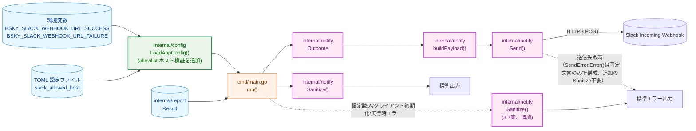
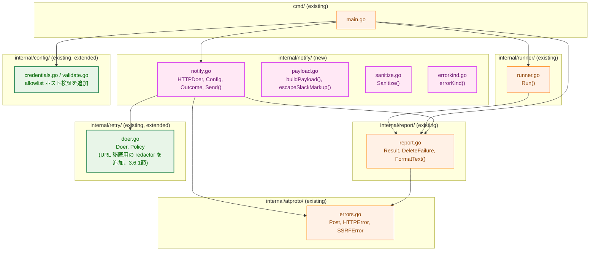
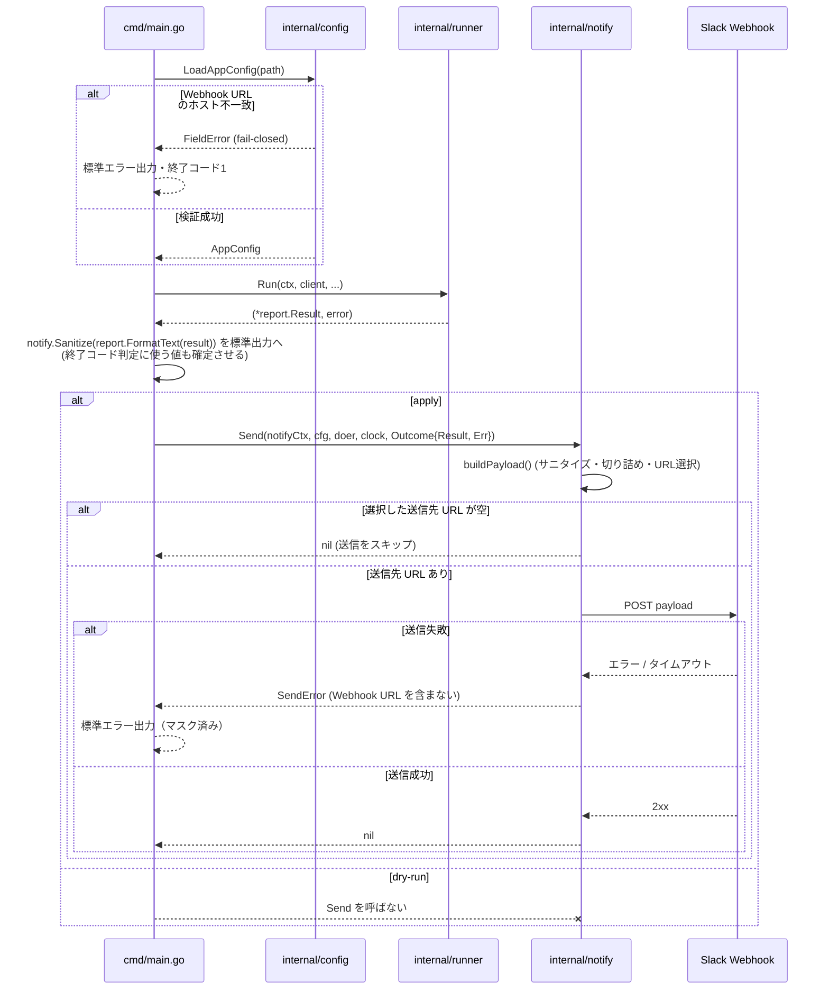
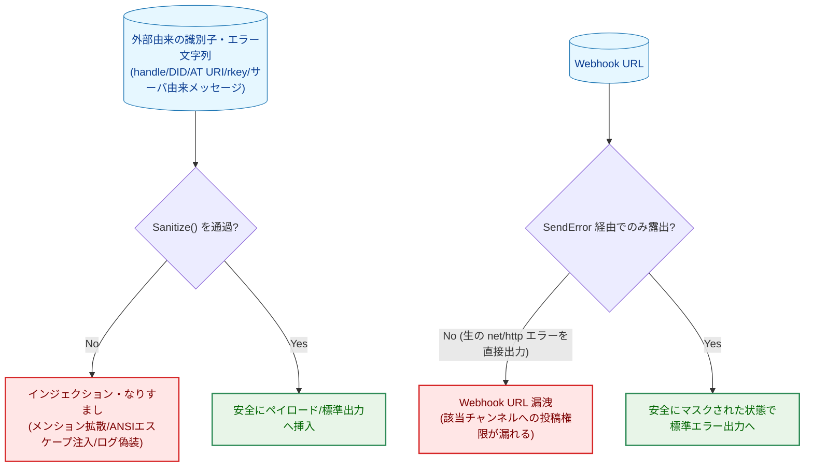

# Slack 通知 — アーキテクチャ設計書

## Document Status

| Item | Value |
|---|---|
| Status | `approved` |
| Created | 2026-07-05 |
| Review date | 2026-07-05 |
| Reviewer | isseis |
| Comments | 2026-07-05（再オープン）: F-005 のホスト検証方式を、正常系/異常系 URL の相互一致のみから、TOML `slack_allowed_host` による明示的な allowlist 方式に変更（3.1節・9節・付録を改訂）。要件定義書 [01_requirements.md](01_requirements.md) の同日付コメント参照。2026-07-07（再オープン）: 実装完了後のコードレビューで見つかった、`cmd/main.go` の設定読み込み失敗・クライアント初期化失敗・実行時エラーの標準エラー出力が `notify.Sanitize()` を経由していなかったギャップに対応するため、3.7節（新設）を追加し、3.5節・5.1節・5.2節を改訂した。要件定義書の同日付コメント参照。 |

関連ドキュメント: [要件定義書](01_requirements.md)

## 1. 設計の全体像

### 1.1 設計原則

- **YAGNI**: 通知メッセージのリッチ表現（色・絵文字・attachment・Run ID 等）は要件定義書のスコープ外であり、それらを見据えた抽象化を先取りしない。Slack Incoming Webhook の最も基本的な `text` フィールド（mrkdwn プレーンテキスト）のみを使う（3.3節）。
- **既存コンポーネントの再利用**: HTTP タイムアウト・リトライは `internal/retry.Doer`（[0005_retry_timeout](../0005_retry_timeout/01_requirements.md)）をそのまま利用し、新たなリトライ実装を作らない。実行結果の構造化データは `internal/report.Result`（[0004_cli_entrypoint](../0004_cli_entrypoint/01_requirements.md)）をそのまま入力として使い、Slack 用に構造体を再定義しない。秘匿情報のマスキングは `internal/config.SecretString`（[0001_config](../0001_config/01_requirements.md)）をそのまま利用する。
- **fail-closed（設定検証）**: 正常系・異常系 Webhook URL のホスト部が TOML `slack_allowed_host`（許可ホスト）と一致しない場合、および Webhook URL が設定されているのに `slack_allowed_host` が未設定の場合は、起動時の設定検証（`internal/config`）で検出し、通知を諦めるのではなく起動自体を失敗させる（F-005）。
- **fail-open（通知送信そのもの）**: 通知の送信失敗は削除処理の成否に影響しない（AC-02）。fail-closed は「設定が壊れている状態で実行を続けない」ことに適用され、「通知が失敗したら削除結果も失敗扱いにする」ことには適用されない。この 2 つの fail-closed/fail-open は適用対象が異なることに注意する。
- **単一責任**: 新規パッケージ `internal/notify` は「`report.Result` を Slack ペイロードに変換し送信する」ことと「外部由来文字列のサニタイズ関数を提供する」ことに専念する。Webhook URL の妥当性検証（構文・ホスト一致）は、担当パッケージを変えずに `internal/config` の責務の範囲を拡張する形で対応し、`internal/notify` には持ち込まない。

### 1.2 概念モデル



矢印 A → B は「A の処理結果・データが B の入力になる」ことを表す。点線矢印（`-.->`）は「特定の条件下でのみ発生する」処理経路を表す。

**Legend**

| 色 | 意味 |
|---|---|
| 青 (`data`) | 環境変数・`report.Result` などの静的データ |
| 橙 (`process`) | 既存コンポーネント（変更なし） |
| 緑 (`enhanced`) | 本タスクで変更する既存コンポーネント（`internal/config` の allowlist ホスト検証追加） |
| 紫 (`newpkg`) | 本タスクで新設するパッケージ（`internal/notify`） |

## 2. システム構成

### 2.1 パッケージ構造



矢印 A → B は「A が B のパッケージを import する」ことを表す。

`internal/notify` は `internal/report`（`Result`/`DeleteFailure` を読む）・`internal/retry`（HTTP タイムアウト・リトライを委譲する）に加え、`internal/atproto` にも依存する。`report.Result`/`DeleteFailure` は既に `atproto.Post` を保持している（`internal/report/report.go`）。`internal/notify` が削除対象・削除失敗の識別子（RKey）や型付きエラー（`atproto.HTTPError`/`atproto.SSRFError`）を読むには `internal/atproto` の型に直接触れる必要があるため、この依存は自然な帰結として回避しない（`atproto.Client` やセッション・認証情報には一切アクセスしない。5.2節）。`cmd/main.go` は `internal/notify` と `internal/report` の両方に依存するが、`internal/report` は `internal/notify` に依存しない（循環依存を避けるため、AC-17 の標準出力サニタイズは `report.FormatText` の出力を `cmd/main.go` が `notify.Sanitize()` でラップする形で実現する。3.2節参照）。

**Legend**

| 色 | 意味 |
|---|---|
| 橙 (`process`) | 既存コンポーネント（変更なし） |
| 緑 (`enhanced`) | 本タスクで変更する既存コンポーネント |
| 紫 (`newpkg`) | 本タスクで新設するパッケージ |

**新規・変更ファイル一覧**

| ファイル | 区分 | 内容 |
|---|---|---|
| `internal/notify/notify.go` | 新規 | `HTTPDoer`/`Config`/`Outcome`/`Send()`/`SendError` |
| `internal/notify/payload.go` | 新規 | `buildPayload()`/`escapeSlackMarkup()` |
| `internal/notify/sanitize.go` | 新規 | `Sanitize()` |
| `internal/notify/errorkind.go` | 新規 | `errorKind()` |
| `internal/config/validate.go` | 変更 | Webhook URL の allowlist ホスト検証（`slack_allowed_host`）を追加（3.1節） |
| `internal/config/errors.go` | 変更 | `ErrWebhookHostMismatch`・`ErrSlackAllowedHostMissing` を追加 |
| `internal/config/credentials_test.go` | 変更 | ホスト不一致・`slack_allowed_host` 未設定のテストケースを追加、既存2ケースのフィクスチャに `slack_allowed_host` を追加（3.1節） |
| `internal/retry/doer.go` | 変更 | URL 秘匿用の redactor オプションを追加（3.6.1節） |
| `cmd/main.go` | 変更 | `notify.Send()` 呼び出し・`notify.Sanitize()` による標準出力のラップを追加。加えて、設定読み込み失敗・クライアント初期化失敗・実行時エラーの標準エラー出力にも `notify.Sanitize()` のラップを追加（3.7節、追加） |
| `cmd/main_test.go` | 変更 | `TestRun_ApplyAllSucceed_*`/`TestRun_ApplyPartialFailure_*` のモックに Slack Webhook 向けの応答を追加（7節） |

### 2.2 設定とデータフロー



矢印 `->>` は同期呼び出し、`-->>` は戻り値、`--x` は「呼び出しが発生しない」ことを表す。標準出力への出力（削除結果のサマリ）は、Slack への送信結果を待たずに先に行う（3.5節）。送信先の選択（正常系/異常系 URL のどちらか、あるいは未設定によるスキップ）は `Send` 内部でのみ判定し、`cmd/main.go` 側では判定を行わない（3.4節・3.5節、重複判定を避けるための変更）。

**Legend**: このシーケンス図はメッセージ種別のみを表し、色分けは行わない。

## 3. コンポーネント設計

### 3.1 Webhook URL のホスト allowlist 検証（`internal/config` の拡張）

F-005（AC-11・AC-12・AC-13・AC-21）は既存の `internal/config` の設定検証責務の一部として扱う。`Config`（TOML 由来）に新規フィールド `SlackAllowedHost string`（TOML キー: `slack_allowed_host`、任意項目）を追加する。ホスト検証自体は `Config`（TOML）と `Credentials`（環境変数、Webhook URL）の両方を必要とするため、双方が確定した後（`LoadAppConfig` が両方をロードした時点）で行う新しい検証関数 `validateSlackAllowedHost(cfg Config, creds Credentials) error` として実装する。この判断の理由:

- AC-11/AC-12/AC-21 は「設定が正常に読み込まれる」「起動が失敗する」という、`LoadAppConfig` の既存の fail-closed 契約（`FieldError` を返す）とまったく同じ形の要求である。`internal/notify` に持ち込むと、起動時検証の責務が 2 箇所に分散する。
- `cmd/main.go` の `run()` は既に `config.LoadAppConfig` のエラーを「標準エラー出力 + 終了コード1」として扱う既存のフックを持つ（`cmd/main.go` の該当箇所）ため、新しいエラー経路を `main.go` に追加する必要がない。
- `slack_allowed_host` は Slack Webhook URL とは異なり、それ単体では投稿権限を持たない値（`hooks.slack.com` のようなホスト名の文字列）であるため秘匿情報ではなく、[0001_config](../0001_config/01_requirements.md) の秘匿情報分離方針（秘匿情報のみ環境変数）に従い TOML（`Config`）側のフィールドとする。

**検証内容（AC-11〜AC-13, AC-21）**:
1. 正常系・異常系の Webhook URL が両方とも未設定（空）の場合、`slack_allowed_host` の設定有無を問わず検証をスキップする（Slack 通知を使わない運用との整合、AC-21 後段）。
2. いずれか一方でも Webhook URL が設定されている場合、`slack_allowed_host` が空であれば `ErrSlackAllowedHostMissing` を返す（AC-21 前段）。
3. `slack_allowed_host` が設定されている場合、設定されている Webhook URL それぞれについて、`net/url.Parse` 済みの `Host` からポート番号を除いた部分（`net/url.URL.Hostname()` 相当）を `strings.EqualFold` で `slack_allowed_host` と比較する。一致しなければ `ErrWebhookHostMismatch` を返す（AC-12・AC-13）。

```go
// internal/config/errors.go に追加するサンプルの sentinel error（実装イメージ）
var ErrWebhookHostMismatch = errors.New("Slack webhook URL host is not in the allowed host")
var ErrSlackAllowedHostMissing = errors.New("slack_allowed_host is required when a Slack webhook URL is set")
```

**影響を受ける既存テスト**:
- `internal/config/credentials_test.go::TestLoadCredentials_Success` — 現行のフィクスチャは両 URL とも `hooks.slack.com` を使っている。`slack_allowed_host = "hooks.slack.com"` をフィクスチャの `Config` 側に追加する必要がある（変更要）。
- `internal/config/credentials_test.go::TestLoadCredentials_SlackWebhookURLOnlyOneSet` — 片方のみ設定のケース。設定されている側のみ `slack_allowed_host` と比較する（上記 3.）ため、既存の意図（片方のみの設定を正当な構成として扱う）は維持されるが、フィクスチャに `slack_allowed_host` の追加が必要（変更要）。
- 新規テストとして、(a) `slack_allowed_host` と異なるホストの URL を与えるケース（AC-12）、(b) Webhook URL を設定しつつ `slack_allowed_host` を省略するケース（AC-21）を追加する必要がある。
- 新規テストとして「ホストが異なる2つの URL」を与えるケースを追加する必要がある（AC-12）。

### 3.2 `internal/notify` の型定義

```go
// HTTPDoer is the minimal HTTP interface this package sends webhook
// requests through. Declared independently (structurally identical to
// atproto.HTTPDoer / retry.HTTPDoer), matching this codebase's existing
// convention of a package-local HTTPDoer at each package boundary. This
// does not mean internal/notify has no dependency on internal/atproto as
// a whole -- see 2.1節: it depends on internal/atproto for the Post/
// HTTPError/SSRFError types it reads via internal/report, not for
// internal/atproto.Client or session/authentication state.
type HTTPDoer interface {
    Do(req *http.Request) (*http.Response, error)
}

// Config holds the two webhook destinations. Either field may be the zero
// SecretString, meaning "not configured" -- Send skips delivery to that
// channel in that case (see 3.5節 の副作用契約).
type Config struct {
    SuccessWebhookURL config.SecretString
    FailureWebhookURL config.SecretString
}

// Outcome is the input to Send: the structured result of a run (nil if the
// run failed before producing one, e.g. login/list failure) and the error
// that aborted the run (nil on a completed run, including one with partial
// delete failures -- those are represented in Result.Failed instead).
type Outcome struct {
    Result *report.Result
    Err    error
}

// SendError identifies a webhook delivery failure without exposing the
// webhook URL itself (which internal/config treats as a secret). Never
// wraps a raw net/http/url.Error whose Error() string embeds the request
// URL; callers must render user/log-facing text via SendError.Error()
// only, never via Unwrap()'s message.
type SendError struct {
    StatusCode int // 0 for transport-level failures (no response received)
    Err        error
}

func (e *SendError) Error() string
func (e *SendError) Unwrap() error

// Send builds a Slack payload from outcome, selects the destination
// webhook URL per 3.4節, and posts it via an internal/retry.Doer built
// from doer/policy/clock (3.6節). It returns nil when notification is
// skipped because the selected destination is not configured (see 3.5節).
// clock is exposed as a parameter (not hidden behind retry.RealClock{}
// internally) so this package's own tests can inject a fake
// retry.Clock -- an exported interface already used the same way by
// internal/retry's own tests -- without incurring real backoff waits.
// Production callers (cmd/main.go) pass retry.RealClock{}.
func Send(ctx context.Context, cfg Config, doer HTTPDoer, clock retry.Clock, outcome Outcome) error

// Sanitize strips C0 control characters (including ESC, which neutralizes
// ANSI escape sequences) and newlines from s. Shared by this package's own
// payload construction (AC-16) and by cmd/main.go before writing
// identifiers/error text to stdout (AC-17), so the implementation is
// centralized in one place per AC-17.
func Sanitize(s string) string
```

### 3.3 Slack ペイロードの構築（`payload.go`）

送信するペイロードは Slack Incoming Webhook の最も基本的な形式 `{"text": "..."}`（mrkdwn プレーンテキスト）のみを使う。Block Kit 等のリッチな要素は要件定義書のスコープ外（メッセージフォーマットは後続検討）であるため採用しない。`text` フィールドは Incoming Webhook の最初期からある機能であり、Slack クライアント（デスクトップ・モバイル・ブラウザ）間の互換性差異は生じない。

**サニタイズの二段階（AC-14〜AC-16）**:
1. `Sanitize()`（3.2節）で制御文字を除去する。ANSI エスケープシーケンスは ESC (0x1B) から始まるため、この段階で無害化される。改行の除去によりログ偽装・メッセージ構造の破壊も防ぐ。
2. Slack 公式の mrkdwn エスケープ規則に従い、`&` → `&amp;`、`<` → `&lt;`、`>` → `&gt;` に置換する（`escapeSlackMarkup()`、`internal/notify` 内部限定の非公開関数）。Slack のメンション記法（`<!channel>`・`<!here>`・`<!subteam^ID>` 等）は先頭の `<` を必須とするため、この置換により無害な文字列として表示される（AC-15）。

投稿本文（body）はいかなる形でも構築対象に含めない（AC-14）。ペイロードに含めるのは次のフィールドのみ:

| フィールド | 由来 | サニタイズ |
|---|---|---|
| 実行結果（成功/失敗） | `Outcome.Result.Mode` / `len(Failed)` / `Outcome.Err != nil` | 不要（固定文字列） |
| 削除件数 | `len(Outcome.Result.Deleted)` | 不要（数値） |
| 失敗した投稿の識別子 | `DeleteFailure.Post.RKey`（AT URI/rkey） | 適用 |
| エラー種別 | `errorKind(err)`（4節） | 適用（固定カテゴリ文字列だが由来が外部起因の値を含みうるため一律適用） |

**切り詰め（AC-18）**: 構築したテキスト全体が上限（既定 4000 文字）を超える場合、末尾を切り詰めたうえで `...(truncated)` マーカーを付与する。この 4000 文字という値は、Slack 側の公式な受理上限を実測・一次情報で検証したものではなく、大量削除時のペイロード肥大化を確実に防ぐための保守的なデフォルト値である（`internal/notify` 内の定数として定義し、実運用で送信拒否（4xx）が観測された場合は値を見直す）。

### 3.4 チャンネルの振り分け（F-003）

`Send` は次の優先順位で送信先を決定する。

| 状況 | 判定 | 送信先 |
|---|---|---|
| `Outcome.Err != nil`（実行がエラー終了） | 異常系 | `Config.FailureWebhookURL` |
| `Outcome.Result != nil && len(Outcome.Result.Failed) > 0`（部分失敗） | 異常系 | `Config.FailureWebhookURL` |
| 上記以外（全件成功、または対象0件） | 正常系 | `Config.SuccessWebhookURL` |

これにより AC-05〜AC-07 を満たす。AC-08（同一 URL を両方に設定する運用）は `Config` が両フィールドに同じ `SecretString` を保持するだけで自然に成立し、特別な分岐は不要。

### 3.5 副作用契約（dry-run / apply とネットワーク送信）

| フラグ・状況 | Slack への POST | 標準エラー出力 | 標準出力 |
|---|---|---|---|
| dry-run（デフォルト） | 送信しない（AC-04） | - | `report.FormatText` の内容（サニタイズ済み） |
| `--apply`、対応する Webhook URL が設定済み | 送信する | 送信失敗時のみ、マスク済みで出力（AC-03） | 同上 |
| `--apply`、対応する Webhook URL が未設定（空） | 送信しない（要件に明示の規定はないが、`internal/config` が空値を「未設定」として許容している既存仕様と整合する取り扱い。付録の決定履歴も参照） | - | 同上 |

`cmd/main.go` は `--apply` の場合、送信先 URL が設定されているかどうかを事前判定せず常に `Send` を呼ぶ。送信先の選択（正常系/異常系のどちらか）と「選択後の URL が空なら送信をスキップして nil を返す」判定は `Send` 内部のみで行う（3.4節）。これにより、同じ振り分けロジックが `cmd/main.go` と `internal/notify` の二箇所に重複することを避ける。

**標準出力の書き込み順序**: `cmd/main.go` は `notify.Sanitize(report.FormatText(result))` による標準出力への書き込みを、`Send` の呼び出しより先に行う。`Send` は最悪ケースで数秒〜十数秒ブロックしうる（3.6節）ため、削除結果のサマリという主要な人向け出力を、その完了を待たずに確定させるためである。

**通知用タイムアウトの独立性**: 通知の送信タイムアウト・リトライは新たに開始する独立した `context.Context`（`context.Background()` に固定のタイムアウトを設定したもの）を用い、`run()` を包む実行タイムアウト用 `ctx` を再利用しない。実行タイムアウト用 `ctx` は削除処理の完了時点で残り時間がほぼ尽きている可能性があり、これを再利用すると異常系（実行タイムアウトそのものが原因のエラー）ほど通知が届きにくくなるという逆効果を生むためである。

ただし、この独立性には副作用がある: プロセス全体の最悪ケース所要時間は、もはや `execution_timeout_seconds`（[0005_retry_timeout](../0005_retry_timeout/01_requirements.md)）だけでは決まらず、「`execution_timeout_seconds` + 通知処理の最悪ケース所要時間（3.6節、既定値で約12秒）」になる。[プロジェクト概要](../../overview.md) および [セキュリティ設計](../../design/security.md) が定める多重起動対策（cron 間隔より `execution_timeout_seconds` を十分小さく設定することで、ロックファイルなしに前回実行との重複を防ぐ）は、この追加分を前提にしていない。本タスクでは `docs/design/configuration.md` の `execution_timeout_seconds` 設定ガイダンスに、通知処理の既定の最悪ケース所要時間（約12秒）を加味した余裕を持たせる旨を追記する（8節）。これは 0005 が同じ設定項目に対してリトライ最悪ケース時間の記述を追記した前例と同じ形の対応であり、新たな仕組みは導入しない。

### 3.6 HTTP タイムアウト・リトライ（F-004）

`internal/retry.Doer`（[0005_retry_timeout](../0005_retry_timeout/01_requirements.md)）をそのまま利用し、新たなリトライ実装は作らない。`internal/notify` 用の `retry.Policy` は、通知失敗が非致命的である（AC-02）ことを踏まえ、`internal/atproto` が使う値より軽量にする。

| 項目 | `internal/atproto` の既定値（参考） | `internal/notify` の既定値 |
|---|---|---|
| `MaxRetries` | 5 | 2 |
| `BaseDelay` | 1秒 | 1秒 |
| `MaxDelay` | 30秒 | 4秒 |
| 単一 HTTP 呼び出しのタイムアウト（AC-09） | - | 3秒（`http.NewRequestWithContext` に渡す `context.WithTimeout`） |

この既定値による最悪ケース所要時間は、3秒（タイムアウト）× 最大3回試行 + バックオフ待機（1秒+2秒、上限4秒未満のため頭打ちなし）の合計で約12秒であり、[0005_retry_timeout](../0005_retry_timeout/01_requirements.md) が定義する `execution_timeout_seconds` の推奨設定値（数十秒〜）より十分小さい（AC-10）。ただし3.5節の通り、この待機は実行タイムアウト用 `ctx` の残り予算を消費しない独立した予算であるため、AC-10 の「実行タイムアウトを食い尽くさない」という要求は、実行タイムアウトの残り予算と競合しないことそのものによって満たされる。一方で、この独立性がプロセス全体の最悪ケース所要時間に加える約12秒の上乗せそのものへの対応は 3.5節を参照。

**Clock の注入とテスト容易性**: `internal/retry.NewDoer` は `Clock` を要求する（`internal/retry/clock.go`）。`Send` はこれを `retry.RealClock{}` に固定せず、パラメータとして受け取る（3.2節）。`retry.Clock` は公開インターフェースであるため、`internal/notify` 自身のテストはバックオフ待機を伴う経路（`MaxRetries` 到達等）を、実待機なしに検証できる。本番呼び出し元（`cmd/main.go`）は `retry.RealClock{}` を渡す。

**リトライによるメッセージ重複の可能性（許容するトレードオフ）**: `internal/retry.Doer` は、レスポンスを受信できなかった transport エラーを一律リトライ対象として扱う（`internal/retry/doer.go` の `classify()`）。これは `internal/atproto` の削除 API 呼び出し（`DeleteRecord` の冪等性: [0002_atproto_client](../0002_atproto_client/01_requirements.md) AC-12）を前提にした設計であり、Slack Incoming Webhook の POST は必ずしも冪等ではない（Slack がリクエストを受理してメッセージを投稿した直後に、クライアント側でレスポンスを受信できず transport エラーとなった場合、リトライにより同じ内容のメッセージが重複して投稿されうる）。本タスクは `internal/retry.Doer` をそのまま再利用する方針（1.1節）を優先し、この重複投稿の可能性を許容されたトレードオフとして受け入れる。オンコール担当者は、同一実行結果を示す2通の通知が届く場合があることを踏まえて運用する。

### 3.6.1 `internal/retry` の最小拡張（Webhook URL のログ出力対策）

`internal/retry.Doer` の既存のリトライ・打ち切りログ（`logRetrying`/`logGivingUp`、`internal/retry/doer.go`）は `req.URL.String()` をそのまま `slog` に出力する。これは `internal/atproto` の呼び出し（PDS のエンドポイント URL は秘匿情報ではない）では安全だが、Slack Incoming Webhook の URL はパスの一部にトークンを含む秘匿情報であるため、`internal/notify` がこのログをそのまま出力すると Webhook URL が漏洩する（5.2節）。

この既存ログの前提（`internal/retry/doer.go` のコメントにある「XRPC 呼び出しの URL は秘匿情報を含まない」という仮定）は `internal/atproto` に対しては引き続き正しいが、`internal/notify` の利用によって初めて成り立たなくなる。そのため、`internal/retry` に最小限の拡張を加える。

```go
// Option customizes a Doer built by NewDoer beyond Policy/Clock.
type Option func(*Doer)

// WithURLRedactor overrides the URL text Doer's own retry/give-up logging
// emits, for callers whose request URL itself carries a secret (e.g. a
// Slack Incoming Webhook token embedded in the path). Callers that do not
// need this (internal/atproto's existing usage) omit it, preserving the
// current req.URL.String() logging unchanged.
func WithURLRedactor(redact func(*http.Request) string) Option

func NewDoer(inner HTTPDoer, policy Policy, clock Clock, opts ...Option) *Doer
```

`internal/notify` は `WithURLRedactor` に、Webhook のホスト名のみを返す関数（例: `"https://hooks.slack.com/services/[REDACTED]"`）を渡す。`internal/atproto` の既存呼び出しは `opts` を渡さないため、ログ出力の既存挙動は変更されない（後方互換）。

### 3.7 標準エラー出力のサニタイズ（追加、AC-17拡張）

**背景**: 実装完了後のコードレビューで、`cmd/main.go` が次の3箇所で `err.Error()` を標準エラー出力にそのまま書き込んでおり、`notify.Sanitize()` を経由していないことが判明した。

1. `config.LoadAppConfig` 失敗時（設定読み込み失敗）
2. `atproto.NewClient` 失敗時（クライアント初期化失敗）
3. `runner.Run` 失敗時（実行時エラー、`runErr != nil`）

このうち (2)・(3) は外部由来の文字列を含みうる。`atproto.HTTPError.ErrorName`（`internal/atproto/http.go` の `xrpcErrorName`）は AT Protocol サーバーのレスポンスボディの `"error"` フィールドをそのまま格納しており、悪意ある、または侵害された PDS が任意の文字列（改行・ANSIエスケープシーケンスを含む）を返しうる。`atproto.SSRFError.Endpoint` は DID 解決結果（DIDドキュメントの `serviceEndpoint`）由来であり、同様に外部起因である。これらは 5.1節の脅威モデルが対象とする「外部由来の識別子・エラー文字列」と同じ性質を持つが、3.5節の標準出力（`report.FormatText` の出力）とは異なりこれまで `Sanitize()` を経由していなかった。(1) の設定読み込み失敗はローカルの TOML/環境変数に由来し外部からの入力を含まないが、実装を一箇所に統一する（3箇所すべてを同じ経路で扱う）ことで、将来 `config.LoadAppConfig` のエラー内容が変わっても個別に判断し直す必要がないようにする。

**対応**: `cmd/main.go` の上記3箇所の `err.Error()` 出力を、いずれも `notify.Sanitize(err.Error())` でラップしてから書き込む。3.5節の標準出力（`notify.Sanitize(report.FormatText(result))`）と同じ関数を再利用し、サニタイズの実装を一箇所に集約するというAC-17の既存方針をそのまま踏襲する。

Slack 通知の送信失敗（`SendError`）については対象外のままとする: `SendError.Error()`（3.2節・4節）は `StatusCode` と `errorKind()` が返す固定形状の分類文字列のみから組み立てられ、外部由来の生文字列を含まない設計になっているため、追加のサニタイズを要しない（5.1節の脅威モデル図には、この2つの経路の違いを反映している）。

## 4. エラーハンドリング設計

```go
// SendError (3.2節で定義済み) はネットワーク層のエラー・非2xx応答の両方を
// 表す。StatusCode == 0 はレスポンスを受信できなかった場合（DNS失敗・
// タイムアウト・接続拒否等）を表す。
```

`cmd/main.go` は `Send` が返すエラーを次のように扱う（AC-02, AC-03）:

1. 削除処理自体の終了コード判定（`report.Result.Failed` の有無、または `runner.Run` のエラー）には一切影響させない。
2. `err.Error()`（= `SendError.Error()`）を標準エラー出力に書き込む。`SendError.Error()` は `StatusCode` と固定の分類文字列のみから組み立てられ、Webhook URL や生の `net/http` エラー文字列を含まない（AC-19）。

`errorKind(err error) string`（`errorkind.go`）は、`Outcome.Err` および各 `DeleteFailure.Err` を Slack 通知向けの短いカテゴリ文字列に変換する。既存の型付きエラー（`config.FieldError`、`atproto.HTTPError`、`atproto.SSRFError` 等）に対しては `errors.AsType[T]` で該当フィールド（`Field`、`Method`+`StatusCode`+`ErrorName`、`Endpoint`+`Stage` 等、秘匿情報を含まないフィールドのみ）から分類文字列を組み立て、いずれにも一致しない場合は固定の `"unknown error"` にフォールバックする。`err.Error()` を丸ごとペイロードに含めることはしない（AC-20）。エラーオブジェクトを丸ごと `%v`/`%+v` 展開する実装は採用しない。

**`"unknown error"` フォールバックの運用上の意味**: この分類のいずれにも一致しないエラーは Slack 通知上 `"unknown error"` としか表示されない。本タスクは Run ID 等の相関識別子を持たない（9節、要件定義書のスコープ外）ため、この場合の一次調査手段は Slack 通知に付随するメッセージ投稿時刻と、当該時刻前後の標準出力・標準エラー出力（cron/コンテナのログ）を突き合わせることになる。この制約は 7節のテスト戦略にも明記する。

## 5. セキュリティ考慮事項

### 5.1 脅威モデル



矢印はいずれも「判定の分岐先」を表す。

**Legend**: 青は外部由来の入力データ、赤は防止すべき事象、緑は本設計が実現する安全な経路を表す。

### 5.2 リスクへの対応

- **投稿本文経由の間接的なインジェクション（[security.md](../../design/security.md)）**: 本タスクの通知には投稿本文を一切含めない設計（AC-14）のため、body 経由のインジェクションはそもそも発生しない。ただし識別子・エラーメッセージも外部由来（handle・DID・サーバ応答に由来しうる）であるため、これらに無条件で `Sanitize()` + mrkdwn エスケープを適用する（5.1節参照）。この無条件適用は Slack ペイロード・標準出力に加え、標準エラー出力（設定読み込み失敗・クライアント初期化失敗・実行時エラーの `err.Error()`）にも及ぶ（3.7節、AC-17拡張）。
- **秘密情報漏洩（Webhook URL、`SendError` 経由）**: Go の `net/http`/`net/url` パッケージのエラーは、しばしばエラー文字列にリクエスト URL をそのまま含む（例: `*url.Error.Error()`）。Webhook URL は「知っていれば投稿できる」秘匿情報（[overview.md](../../overview.md)）であるため、`Send` はこの種の生のエラーを `SendError` でラップし、`SendError.Error()` が `StatusCode` と分類文字列のみから安全な文字列を組み立てる（4節）。`cmd/main.go` は `SendError.Error()` のみを標準エラー出力に書き込み、`Unwrap()` で得られる内部エラーの `Error()` 文字列を直接出力しない。
- **秘密情報漏洩（Webhook URL、`internal/retry` のリトライログ経由）**: `internal/retry.Doer` の既存のリトライ・打ち切りログは `req.URL.String()` をそのまま出力する設計であり、これをそのまま再利用すると Webhook URL がログに漏洩する（`internal/atproto` での既存利用ではリクエスト URL が秘匿情報でないため問題にならなかった前提が、本タスクでは成り立たない）。3.6.1節の `internal/retry.WithURLRedactor` により、`internal/notify` はこのログにホスト名のみを渡すことでこれを防ぐ。
- **秘密情報漏洩（app パスワード・セッション JWT・Authorization ヘッダー）**: `internal/notify` は `report.Result`/`DeleteFailure` のうち明示的に選択したフィールド（RKey・エラー種別）のみをペイロードに含め、`atproto.Client` やセッション情報そのものには一切アクセスしない（`internal/atproto` への依存は 2.1節の通り `Post`/`HTTPError`/`SSRFError` 型に限られ、`Client`/セッション状態には触れない）。
- **エラーオブジェクトの丸ごとシリアライズ回避（AC-20）**: 4節の `errorKind` が示す通り、型付きエラーからの明示的なフィールド選択のみを行い、`%v`/`fmt.Sprintf("%+v", err)` 等によるエラー構造体全体の展開は行わない。
- **設定改ざん（Webhook URL を攻撃者が制御するホストに向けるケース）**: F-005（3.1節）のホスト検証は TOML `slack_allowed_host` に対する allowlist 方式であり、正常系・異常系それぞれの Webhook URL のホスト部を独立に検証する。両方を同時に同一の意図しない（攻撃者が制御する）ホストに向けても、`slack_allowed_host` と一致しない限り起動時に検出される（正常系/異常系 URL の相互一致のみを検証する方式では検知できなかったケース）。ただし `slack_allowed_host` 自体が改ざんされた場合（TOML ファイルへの書き込み権限を攻撃者が得た場合）は、この allowlist も無力化される。TOML ファイル自体の改ざん対策（ファイルパーミッション等）は本タスクのスコープ外であり、[0008_security_hardening](../0008_security_hardening/) の一般的な設定改ざん対策の対象とする。
- **通知失敗の可観測性（ファイルログを持たない設計との相互作用）**: AC-03 は「サイレント失敗を避けるため最低限 stderr に出力する」ことを求めるが、この出力が実際に永続化されるかどうかは、cron/Docker 実行環境が標準エラー出力をどう扱うか（[0007_docker_distribution](../0007_docker_distribution/) の責務）に依存する。本タスクは stderr への出力までを担い、その先の収集・永続化は 0007 のスコープであるため、0007 側で標準エラー出力が実際に収集される構成になっていることを別途確認する必要がある（本ドキュメントでは未検証の前提として明示する）。

## 6. 処理フロー詳細

2.2節のシーケンス図を参照。

## 7. テスト戦略

- **ユニットテスト**: `internal/notify` は実際のネットワーク通信なしに、`payload.go` のペイロード構築・サニタイズ・切り詰めロジックを単体テストする（NF-002）。HTTP 挙動（タイムアウト・リトライ・送信失敗時の `SendError` 内容）は `net/http/httptest` によるモックサーバで検証する。リトライ・バックオフを経路上で発生させるテストは、`retry.Clock` の自前のフェイク実装（`retry.Clock` は公開インターフェースであるため `internal/notify` のテストコードから直接実装できる）を `Send` に注入し、実待機なしで検証する（3.6節）。
- **`internal/retry` の拡張テスト**: `WithURLRedactor`（3.6.1節）を指定した場合にリトライ・打ち切りログが redactor の返す文字列を使うこと、指定しない場合は既存の `req.URL.String()` のままであること（`internal/atproto` の既存挙動に回帰がないこと）をテストする。
- **セキュリティテスト**: `Sanitize()`/`escapeSlackMarkup()` に対して、悪意あるペイロード（`<!channel>`/`<!here>`/ANSI エスケープシーケンス/改行混入）を用いたテストケースを用意し、無害化されることを確認する（NF-003）。`errorKind()` および `SendError.Error()` が Webhook URL・app パスワード・セッション JWT・`Authorization` ヘッダーの値をいかなる形でも出力しないことをテストで確認する（NF-003, AC-19）。特に、リトライ・打ち切りログ経由で Webhook URL が出力されないことも、この観点でテストする（`WithURLRedactor` テストと合わせて確認）。
- **`internal/config` の拡張テスト**: 3.1節の allowlist ホスト検証について、一致・不一致・片方のみ設定・`slack_allowed_host` 未設定の4パターンをテストする（AC-11〜AC-13, AC-21）。
- **`cmd/main.go` の統合テスト**: `--apply` 時のみ通知が発生すること（AC-04）、正常系/異常系/部分失敗のチャンネル振り分け（AC-05〜AC-08）、通知失敗時に終了コードが変化しないこと（AC-02）と標準エラー出力にマスク済みの文言が出ること（AC-03）を、モック HTTP サーバを用いて検証する。「`--apply` かつ選択された送信先 URL が未設定」（3.5節）についても、対応する AC はないが回帰防止のためテストする。既存の `cmd/main_test.go` の `TestRun_ApplyAllSucceed_*` / `TestRun_ApplyPartialFailure_*` は、`run()` が Slack 宛の POST を追加で発行するようになるため、これらのテストのモック HTTP ハンドラに Slack Webhook 向けリクエストへの応答を追加する必要がある（実装時に更新が必要な既存テストとして記録する）。
- **`"unknown error"` フォールバックの扱い**: `errorKind()` のフォールバック値がテスト対象のエラー型の分類漏れを示す可能性があるため、`internal/atproto`/`internal/config` が公開する型付きエラーを一通り列挙し、意図的に分類対象から外したもの以外は `"unknown error"` にならないことを確認する（4節）。

## 8. 実装の優先順位

1. `internal/retry` に `WithURLRedactor`（3.6.1節）を追加する。`internal/atproto` の既存呼び出しに影響しない後方互換の拡張であるため、他の変更に先行して着手できる。
2. `internal/config` に allowlist ホスト検証を追加する（3.1節）。既存の設定検証パスに乗るため、他コンポーネントへの依存がなく着手できる。
3. `internal/notify` の型定義とサニタイズ関数（`Sanitize`/`escapeSlackMarkup`/`errorKind`）をユニットテストとともに実装する。
4. `internal/notify` のペイロード構築・チャンネル振り分け・切り詰めを実装する。
5. `internal/notify.Send`（HTTP 送信・`internal/retry.Doer` 統合・`WithURLRedactor`・`SendError`）を実装する。
6. `cmd/main.go` に `Send` の呼び出しと `notify.Sanitize(report.FormatText(...))` へのラップを統合する。標準出力の書き込みを `Send` 呼び出しより先に行う順序（3.5節）に注意する。
7. `docs/design/configuration.md` の `execution_timeout_seconds` 設定ガイダンスに、通知処理の既定の最悪ケース所要時間（約12秒）を加味する旨を追記する（3.5節）。

## 9. 将来の拡張性

- メッセージフォーマット（色・絵文字・Run ID・Block Kit 化）は将来必要になった場合、`payload.go` の `buildPayload()` 内部実装のみを変更すればよく、`Send`/`Config`/`Outcome` の型は変更不要となるよう設計している。
- 現行の allowlist は単一ホスト（`slack_allowed_host` は文字列 1 件）のみを許可する。複数ホストの許可（例: ワークスペースごとに異なる Webhook ホストを使う運用）が必要になった場合は、[0008_security_hardening](../0008_security_hardening/) で `slack_allowed_host` を配列に拡張する形で対応する想定。

---

## 付録: 決定履歴（Decision History）

このタスクの要件レビュー時点で見送った判断、あるいは姉妹プロジェクト `tlsrpt-digest`（`internal/notify`, `docs/tasks/0030_slack_notify`）から意図的に採用しなかった判断の記録。

- **`tlsrpt-digest` は `slog.Handler` + バッファ/`Flush()` モデル**（cron 常駐のポーラー向け）だが、bsky-cleaner は一回実行の CLI であり、0004 が生成した構造化結果を受け取って一度だけ送信するモデルで十分なため、`slog.Handler`/`Flush`/集約バッファは採用しない。
- **リトライ回数・バックオフ**: `tlsrpt-digest` は 5秒タイムアウト・3リトライ・base 2秒の指数バックオフを採用しているが、本タスクは通知失敗が非致命的（AC-02）であるため、3.6節の通りより軽量な値（3秒タイムアウト・2リトライ・base 1秒）を採用した。
- **切り詰め上限**: `tlsrpt-digest` は全体4000文字・フィールド毎1000文字という2段階の上限を持つが、本タスクは投稿本文を含まずペイロード全体が小さいため、全体4000文字の単一の上限のみを採用した（3.3節）。
- **ホスト検証は allowlist 方式を採用する**: `tlsrpt-digest` の `allowed_host` 相当の allowlist を TOML `slack_allowed_host` として採用する。正常系・異常系 URL の相互一致のみを検証する方式では防げなかった誤送信（両方を意図しない同一ホストに向けるケース）を、この方式では検出できる（3.1節・9節参照）。
