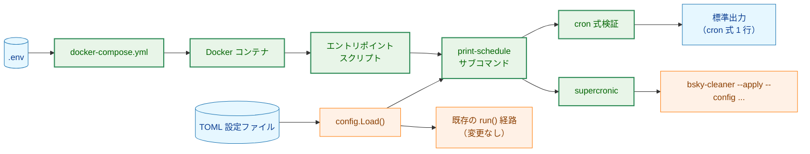
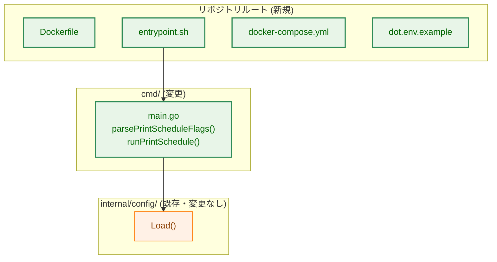
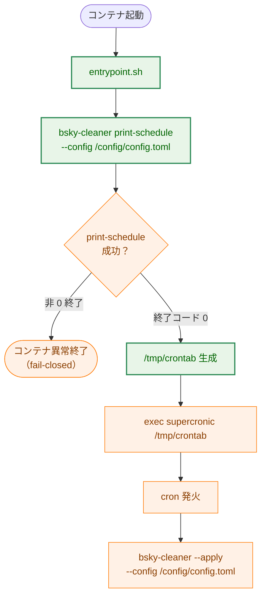
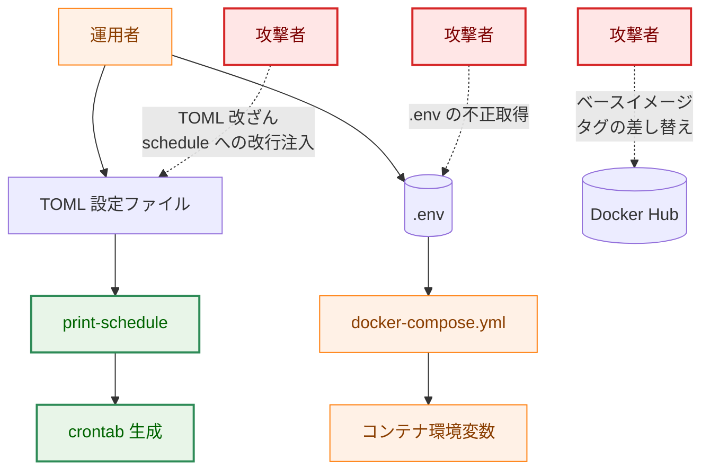
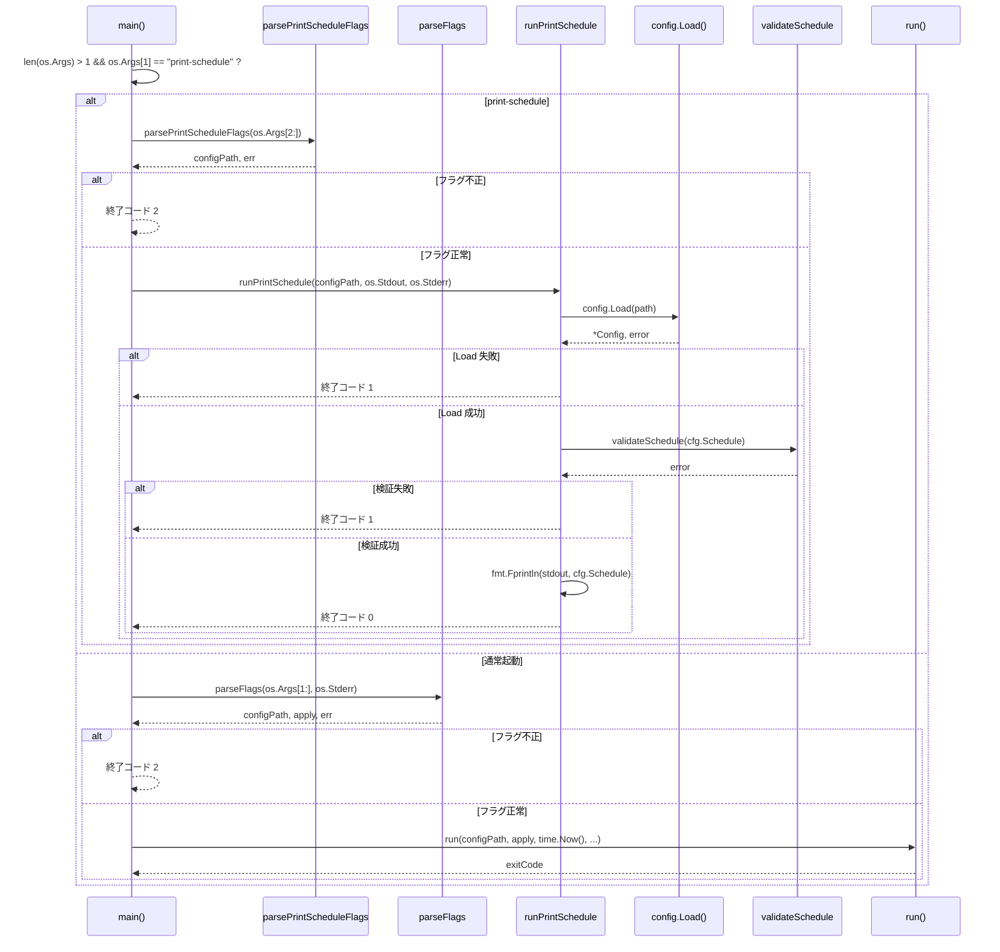
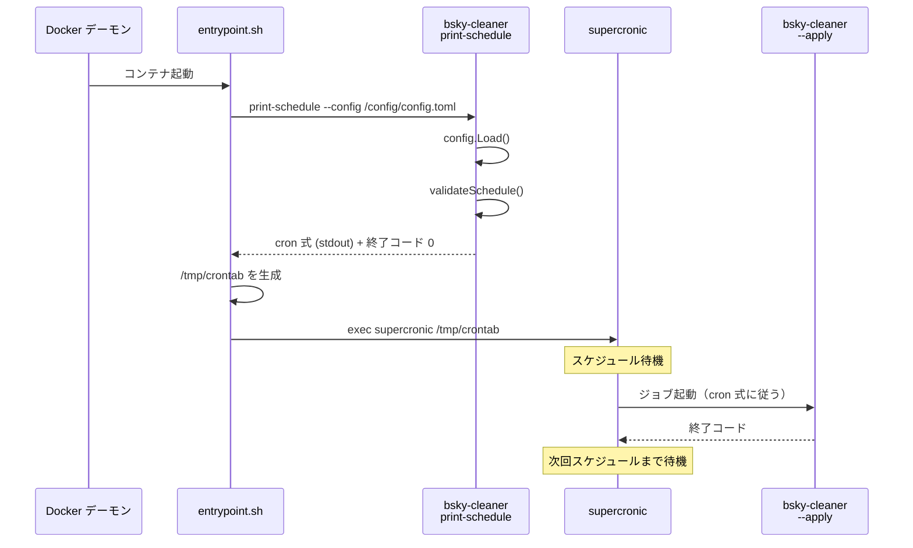

# Docker 配布 — アーキテクチャ設計書

## Document Status

| Item | Value |
|---|---|
| Status | `approved` |
| Created | 2026-07-06 |
| Review date | 2026-07-07 |
| Reviewer | isseis |
| Comments | - |

関連ドキュメント: [要件定義書](01_requirements.md)

## 1. 設計の全体像

### 1.1 設計原則

- **YAGNI**: `print-schedule` はエントリポイントスクリプトからの呼び出し専用の隠しサブコマンドであり、ユーザー用のヘルプには表示しない。CLI の既存サブコマンド機構（`flag.FlagSet`）を流用し、新たなコマンドフレームワークを導入しない。
- **fail-closed**: `print-schedule` が `schedule` フィールドの検証に失敗した場合、エントリポイントスクリプトはコンテナの起動を継続せず異常終了する（AC-10）。不完全な設定での cron 起動を防ぐ。
- **設定パースの二重実装禁止**: TOML 読み込みは既存の `config.Load()` を再利用し、`print-schedule` 内で独自の TOML パースを行わない（AC-03）。
- **秘匿情報の分離**: 既存方針（[0001_config 設計原則](../0001_config/02_architecture.md)）に従い、`docker-compose.yml` には秘匿情報を直接書かず、`.env` の変数を `environment:` 経由でコンテナに注入する（AC-11）。
- **Docker イメージの再現可能性**: ベースイメージはタグではなく digest で固定し、ビルドの再現性を確保する（AC-06）。

### 1.2 概念モデル

本タスクが導入する構成要素と、既存の CLI 実行経路との関係を示す。



矢印 A → B は「A が B を起動する／A の出力が B の入力になる」ことを表す。緑色のノードは本タスクで追加・変更される要素、橙色は既存のまま変更されない要素である。

**凡例**:

| クラス | 意味 |
|---|---|
| `data`（青） | 設定ファイル・環境変数などの静的データ |
| `process`（オレンジ） | 既存のまま変更しないコンポーネント |
| `enhanced`（緑） | 本タスクで追加・変更されるコンポーネント |

### 1.3 要件との対応

| 要件 | 対応する設計要素 |
|---|---|
| F-001 (AC-01〜04) | `cmd/main.go` の `parsePrintScheduleFlags` と `runPrintSchedule`（3.2.1） |
| F-002 (AC-05〜07) | `Dockerfile`（マルチステージビルド、digest 固定）（3.2.2） |
| F-003 (AC-08〜10) | エントリポイントスクリプト（`entrypoint.sh`）と `print-schedule` の連携（3.2.3） |
| F-004 (AC-11〜14) | `docker-compose.yml`、`dot.env.example`（3.2.4） |
| NF-001 | 専用の設計要素なし。既存の `make fmt`/`make test`/`make lint` で検証する |
| NF-002 | 既存の `.gitignore` に `.env` が含まれているため、追加作業は不要 |
| NF-003 | cron ツール選定の根拠は 3.2.3 に記載する（実装計画書に委譲するには判断材料が設計レベルの情報を要するため、本設計書に選定理由を含める。実装計画書では本節を参照する形とする） |

## 2. システム構成

### 2.1 コンポーネント配置



矢印 A → B は「A が B に依存する／A が B を呼び出す」ことを表す。緑色のノードは本タスクで追加・変更されるコンポーネント、橙色は既存のまま変更されないコンポーネントである。

**凡例**:

| クラス | 意味 |
|---|---|
| `process`（オレンジ） | 既存のまま変更しないコンポーネント |
| `enhanced`（緑） | 本タスクで追加・変更されるコンポーネント |

### 2.2 コンテナ内の起動フロー



矢印 A → B は「A の完了後に B が実行される」ことを表す。

## 3. コンポーネント設計

### 3.1 コンポーネント責任一覧

| ファイル | 変更種別 | 責任 |
|---|---|---|
| `cmd/main.go` | 変更 | `print-schedule` サブコマンドの追加：フラグパース（`parsePrintScheduleFlags`）、TOML 読み込み（`config.Load` の再利用）、`schedule` の cron 式検証と出力（`runPrintSchedule`） |
| `Dockerfile` | 新規 | マルチステージビルド：Go ビルド用ステージ（`golang:alpine` 相当）と実行用ステージ（`alpine` 相当）を分離し、ベースイメージを digest で固定する |
| `entrypoint.sh` | 新規 | コンテナ起動時に `print-schedule` を呼び出し、crontab ファイルを動的生成した上で `exec supercronic` を起動する |
| `docker-compose.yml` | 新規 | TOML 設定ファイルの volume mount、`.env` からの環境変数注入、コンテナ定義 |
| `dot.env.example` | 新規 | 必要な環境変数名をダミー値で列挙し、初期セットアップの手引きとする |
| `.gitignore` | 変更なし | `.env` は既に除外済み |

### 3.2 各コンポーネントの設計

#### 3.2.1 `print-schedule` サブコマンド（AC-01〜04）

`cmd/main.go` に隠しサブコマンド `print-schedule` を追加する。本サブコマンドは以下の責務を持つ。

1. `--config`（または `-c`）フラグで TOML ファイルのパスを受け取る
2. `config.Load(path)` を呼び出し、`Config` を取得する（`LoadAppConfig` ではない — 本サブコマンドは `schedule` の値のみを必要とし、認証情報のロードは不要である）
3. `Config.Schedule` が cron 式として構文的に妥当であることを検証する。検証内容は以下の 2 点である：
   - **改行の不在**: `schedule` の値に改行文字（`\n`、`\r`）が含まれていないことを確認する。含まれている場合、即座に非 0 でエラー終了し、標準出力には何も出力しない（AC-02）。これは crontab へのコマンドインジェクション対策であり、改行を含む値をそのまま crontab ファイルに書き込むと、crontab の追加行として任意のコマンドを注入できる脆弱性につながる。
   - **cron 5 フィールドの構文検証**: 空白で区切られた 5 つのフィールドが、各フィールドの cron 仕様上の値域（分 0-59、時 0-23、日 1-31、月 1-12、曜日 0-7）に収まっていることを確認する。各フィールドはカンマ区切りの 1 個以上の要素（`item`）からなり、各 `item` は `*` / `*/n`（ステップ）/ `a-b`（範囲）/ `a-b/n`（範囲+ステップ）/ `a`（単一値）のいずれかとする。すなわち `1-10/2`（範囲+ステップ）や `1-5,10-15`（リスト内に範囲を含む）のような組み合わせも受理する。`supercronic` を含む一般的な cron 実装が受理する構文との乖離をなくすため、単純なワイルドカード・単一範囲・単一リストだけでなく、これらの組み合わせも対象とする。`@daily` 等のマクロ形式は 5 フィールド構成ではないため対象外とし、指定された場合はエラー終了する。不正な値（例: 分に 60、月に 13）の場合は非 0 でエラー終了する（AC-04）。
4. 検証を通過した `schedule` の値を、改行なしの 1 行として標準出力に書き出す（AC-01）

**`config.Load()` の副作用の許容**: `config.Load()` は `schedule` に加えて `retention_days`・`execution_timeout_seconds` も検証する。`print-schedule` の目的は `schedule` のみの出力だが、これらのフィールドに不備がある場合も `config.Load()` がエラーを返し、`print-schedule` は非 0 で終了する。これは要件定義書で意図された動作であり、不完全な設定ファイルで cron が起動してしまうことを防ぐ（AC-10 の fail-closed を満たす）。

**新しい終了コード**: 既存の `cmd/main.go` には `exitSetupOrRunFail`（1）、`exitUsageError`（2）、`exitPartialFailure`（3）の 3 つの終了コードが定義されている。`print-schedule` のエラーは「設定不備による起動失敗」であり、セマンティクス上は `exitSetupOrRunFail`（1）が最も近い。本設計では `print-schedule` も同一の終了コード `1` で終了する。エントリポイントスクリプトは「終了コードが 0 以外なら異常終了」と判定するため、値の区別は不要である。

**フラグパースの分離**: `print-schedule` は既存の `parseFlags` とは別の関数 `parsePrintScheduleFlags` として実装する。既存の `parseFlags` は `--config` 必須・`--apply` オプションの 2 フラグ構成だが、`print-schedule` は `--config` のみで `--apply` を持たない。また、`print-schedule` はサブコマンドとして最初の位置引数で識別され、以後の引数は当該サブコマンドのフラグとして解釈される。具体的には：

- `len(os.Args) > 1` かつ `os.Args[1]` が `"print-schedule"` の場合、`main()` は `parsePrintScheduleFlags(os.Args[2:])` を呼び出す（`len(os.Args) > 1` のチェックが無いと、引数なし起動時に `os.Args[1]` への添字アクセスが index out of range で panic する）
- それ以外の場合は、既存の `parseFlags` 経路をそのまま通る

**Type definition for cron validation result**:
```go
// ScheduleValidationError reports that the schedule field failed
// cron-syntax validation.
type ScheduleValidationError struct {
    Reason string
}

func (e *ScheduleValidationError) Error() string {
    return "schedule validation failed: " + e.Reason
}
```

**Function signatures**:
```go
// parsePrintScheduleFlags parses args (excluding the "print-schedule"
// subcommand name) into a config path. It returns an error when
// --config/-c is missing or unexpected positional arguments remain,
// consistent with parseFlags's error-return contract.
func parsePrintScheduleFlags(args []string) (configPath string, err error)

// runPrintSchedule loads the TOML file at configPath, validates the
// schedule field as a cron expression, and writes it to stdout.
// Errors are written to stderr. config.Load is reused — no second
// TOML parse.
func runPrintSchedule(configPath string, stdout, stderr io.Writer) int

// validateSchedule checks that s is a syntactically valid cron
// expression: exactly 5 whitespace-separated fields whose values
// fall within the conventional cron ranges. It also rejects any
// value containing a newline (crontab injection prevention).
func validateSchedule(s string) error
```

`validateSchedule` の cron 構文検証は、外部ライブラリに依存せず、標準ライブラリのみで実装する（外部依存最小化方針に従う）。cron 5 フィールドの値域チェックは単純な整数範囲の検証であり、依存を追加してまでライブラリ化するメリットはない。

#### 3.2.2 Dockerfile（AC-05〜07）

マルチステージビルド構成をとる。

- **ビルドステージ**: Go の公式イメージ（`golang`、Alpine ベース）を使用し、`go build -o /out/bsky-cleaner ./cmd` を実行する。タグではなく digest（例: `golang@sha256:...`）で参照する。同じステージで `go install github.com/aptible/supercronic@<version>` により `supercronic` バイナリを取得する（下記「`supercronic` の取得方法」を参照）。
- **実行ステージ**: 軽量な Alpine イメージ（`alpine`、digest 固定）をベースとし、以下を同梱する：
  - ビルド済みバイナリ（`/usr/local/bin/bsky-cleaner`）
  - 内蔵 cron ツール（`supercronic`、ビルドステージから `COPY --from=build` で取得したもの）
  - エントリポイントスクリプト（`entrypoint.sh`）
  - 標準ユーザー（`bsky`、UID 10001）で実行する

**`supercronic` の取得方法**: GitHub releases から `ADD`/`curl` でバイナリを直接取得する方法は、チェックサム検証を別途実装しない限りサプライチェーン上の検証手段を持たない（ダウンロード元が改ざんされた場合に検知できない）。本設計では `go install github.com/aptible/supercronic@<version>` をビルドステージで実行する方式を採用する。この方式は Go の module checksum database（`sum.golang.org`）によるモジュール内容の検証を経るため、ベースイメージの digest 固定と同様にビルドの再現性・完全性を確保できる。バージョンは digest 相当の固定値（具体的なリリースタグ、例: `v0.2.29`）を指定し、`latest` 相当の可変参照は使わない。

**ベースイメージの digest 固定**: タグ（例: `alpine:3.21`）は移動可能なポインタであり、同一タグが異なる時点で異なるイメージを指しうる。digest による固定はビルドの再現性を保証し、ソフトウェアサプライチェーン上のリスクを低減する。

**プラットフォームの固定**: 要件定義書の Out of Scope で amd64 のみを対象とすることが決まっているため、両方の `FROM` 行に `--platform=linux/amd64` を明示する。これを指定しない場合、`docker build` を実行するホストのアーキテクチャ（例: arm64 Mac）に応じて生成イメージのアーキテクチャが変わってしまい、意図しない arm64 イメージが作られうる（Phase 3 の手動検証で arm64 開発機上の実際の挙動として確認済み）。

**マルチステージビルドの目的**: ビルド用ツールチェーン（Go コンパイラ、Alpine のビルド依存）を最終イメージから除外し、イメージサイズと攻撃対象領域を縮小する。

#### 3.2.3 エントリポイントスクリプト（AC-08〜10）

`entrypoint.sh` は以下の順序で処理を行うシェルスクリプトである。

1. `bsky-cleaner print-schedule --config "$BSKY_CONFIG_PATH"` を実行し、終了コードを確認する
2. 終了コードが非 0 の場合、エラーメッセージを標準エラー出力に書き、`exit 1` でコンテナを異常終了させる（AC-10、fail-closed）
3. 終了コードが 0 の場合、標準出力の内容（cron 式 1 行）を `/tmp/crontab` に書き込む。crontab の書式は「`schedule` の値」に続けて「`bsky-cleaner --apply --config "$BSKY_CONFIG_PATH"`」を記述する（AC-08）
4. `exec supercronic /tmp/crontab` で内蔵 cron を起動する（AC-09）

**`exec` の使用**: シェルスクリプトの最終行で `exec` を使用することで、`supercronic` プロセスが PID 1 となり、シグナル（`SIGTERM` 等）を直接受信できる。`exec` なしで `supercronic` を子プロセスとして起動すると、シェルが PID 1 を占有し、`docker stop` のシグナルが `supercronic` に転送されず、グレースフルシャットダウンができない。

**内蔵 cron ツールの選定**: `supercronic` を採用する。選定理由を以下に示す。

- **crontab 互換**: 標準的な crontab 構文をそのまま受け付けるため、TOML の `schedule` フィールドを変換なしで使用できる
- **シングルバイナリ**: Go で書かれたシングルバイナリであり、Alpine イメージに追加のランタイム依存（Python 等）を必要としない
- **フォアグラウンド実行**: コンテナ内で PID 1 としてフォアグラウンド実行する設計になっており、`exec` との相性が良い
- **ログ出力**: ジョブの標準出力・標準エラー出力を `supercronic` 自身のログに転送するため、`docker logs` で実行結果を確認できる

代替候補との比較:
- `busybox crond`: フォアグラウンドモード（`-f`）を持つが、Alpine ではデフォルトで利用可能である一方、ジョブ出力のログ転送が `supercronic` に比べて弱い
- `cron`（Vixie cron）: デーモンとしてバックグラウンド実行する前提で設計されており、コンテナの PID 1 には向かない
- 自前のスケジューラの実装: YAGNI。cron 式パース・スケジュール管理・シグナルハンドリングを自前実装するコストに見合う要件上の差別化点がない

NF-003 が要求する「選定理由の実装計画書への記載」は、実装計画書から本節を参照する形で満たす。

#### 3.2.4 `docker-compose.yml` および `dot.env.example`（AC-11〜14）

**`docker-compose.yml`** は以下の構成を持つ。

- `services.bsky-cleaner` を定義し、ビルド済みイメージを参照する
- `environment:` で以下の環境変数を `.env` から注入する（AC-11）:
  - `BSKY_HANDLE`
  - `BSKY_APP_PASSWORD`
  - `BSKY_SLACK_WEBHOOK_URL_SUCCESS`
  - `BSKY_SLACK_WEBHOOK_URL_FAILURE`
- volumes で TOML 設定ファイルのディレクトリを `/config` にマウントする（AC-13）
- 環境変数 `BSKY_CONFIG_PATH` を `/config/config.toml` に設定し、エントリポイントスクリプトと `supercronic` のジョブ定義から参照可能にする

**`dot.env.example`** は以下の環境変数をダミー値で列挙する（AC-12）:
- `BSKY_HANDLE=your-handle.bsky.social`
- `BSKY_APP_PASSWORD=xxxx-xxxx-xxxx-xxxx`
- `BSKY_SLACK_WEBHOOK_URL_SUCCESS=https://hooks.slack.com/services/...`
- `BSKY_SLACK_WEBHOOK_URL_FAILURE=https://hooks.slack.com/services/...`

**`--config` フラグと volume mount の関係**: `docker-compose.yml` の `environment:` で `BSKY_CONFIG_PATH` を設定し、エントリポイントスクリプトおよび crontab 内のジョブ定義がこの値を `--config` に渡す。`print-schedule` も同一のパスを使用し、TOML ファイルパスの指定が一元化される。

## 4. エラーハンドリング設計

### 4.1 `print-schedule` のエラー分類

| 失敗箇所 | エラー型 | 終了コード | 標準出力 | 標準エラー出力 |
|---|---|---|---|---|
| `--config` 不足 | `parsePrintScheduleFlags` のエラー | 2（usage） | （なし） | 使用方法 |
| TOML ファイル不在 | `config.ErrFileNotFound`（`fmt.Errorf("load config: %w: %w", ErrFileNotFound, err)` でラップ） | 1（setup fail） | （なし） | エラーメッセージ |
| TOML パース失敗 | `config.ErrParseFailed`（`fmt.Errorf("load config: %w: %w", ErrParseFailed, err)` でラップ） | 1（setup fail） | （なし） | エラーメッセージ |
| 必須フィールド不足 | `config.ErrMissingField`（`FieldError` でラップ） | 1（setup fail） | （なし） | エラーメッセージ |
| 値域不正 | `config.ErrInvalidValue`（`FieldError` でラップ） | 1（setup fail） | （なし） | エラーメッセージ |
| `schedule` に改行含む | `*ScheduleValidationError` | 1（setup fail） | （なし） | エラーメッセージ |
| cron 構文不正 | `*ScheduleValidationError` | 1（setup fail） | （なし） | エラーメッセージ |

`config.Load()` 由来のエラーは `fmt.Fprintln(stderr, err.Error())` で標準エラー出力に書き出す。これは既存の `run()` 関数と同一のエラー報告パターンであり、`runPrintSchedule` 内でもこのパターンを踏襲する。

### 4.2 エントリポイントスクリプトのエラー処理

エントリポイントスクリプトは `print-schedule` の終了コードのみを判定基準とする。標準エラー出力の内容はログとして `docker logs` に残るが、スクリプトがそれをパースして条件分岐することはない。

**エラー型定義**:
```go
// ScheduleValidationError reports that the schedule field failed
// cron-syntax validation.
type ScheduleValidationError struct {
    Reason string
}

func (e *ScheduleValidationError) Error() string {
    return "schedule validation failed: " + e.Reason
}
```

### 4.3 `docker-compose.yml` のエラーハンドリング

TOML ファイルの volume mount 先が存在しない場合、Docker は空ディレクトリを作成してマウントする（バインドマウントのデフォルト動作）。この場合、コンテナは起動するが `config.Load()` が `ErrFileNotFound` で失敗し、`print-schedule` が非 0 で終了する（fail-closed）。

## 5. セキュリティ考慮事項

### 5.1 脅威モデル



矢印 A → B はデータの流れを表す。点線矢印 A -.-> B は脅威（攻撃経路）を表す。

**凡例**:

| クラス | 意味 |
|---|---|
| `data`（青） | 静的データ |
| `process`（オレンジ） | 既存のまま変更しないコンポーネント |
| `enhanced`（緑） | 本タスクで追加されるコンポーネント |
| `problem`（赤） | 脅威（攻撃者・攻撃経路） |

### 5.2 脅威と対策

| 脅威 | 対策 | 対応 AC |
|---|---|---|
| TOML の `schedule` への改行注入による crontab コマンドインジェクション | `validateSchedule` が改行文字の存在を検出し、非 0 終了 + 標準出力なしで拒否する。エントリポイントスクリプトは `print-schedule` の終了コードが非 0 の場合にコンテナを異常終了させる（fail-closed） | AC-02, AC-10 |
| `.env` の漏洩（Git リポジトリへの誤 commit） | 既存の `.gitignore` が `.env` を除外済み。`dot.env.example` のみコミットし、実際の秘匿情報は含まれない | NF-002 |
| ベースイメージのタグ差し替え（サプライチェーン攻撃） | ベースイメージをタグではなく digest で固定する。意図しないイメージ更新が発生しない | AC-06 |
| cron 式の不正な値（範囲外の分・時など）による予期しない実行タイミング | `validateSchedule` が cron 5 フィールドの値域を検証し、不正な場合は拒否する | AC-04 |
| `docker-compose.yml` への秘匿情報のハードコード | `environment:` で `.env` の変数を参照する形にし、`docker-compose.yml` 本体には秘匿情報を含めない | AC-11 |

### 5.3 コンテナ実行ユーザー

`Dockerfile` の実行ステージでは、root ではなく非特権ユーザー（UID 10001）で `supercronic` および `bsky-cleaner` を実行する。万一 `supercronic` に任意コード実行の脆弱性があった場合でも、影響範囲を限定する。

## 6. 処理フロー詳細

### 6.1 `main()` の修正後の起動フロー



### 6.2 コンテナ起動から定期実行までのシーケンス



## 7. テスト戦略

### 7.1 テスト対象

| テスト分類 | テスト対象 | 検証する AC |
|---|---|---|
| ユニットテスト | `validateSchedule`（正常な cron 式・改行混入・不正な値域・フィールド数不足・範囲+ステップ/リスト内範囲などの組み合わせ構文・`@daily` 等のマクロ形式の拒否） | AC-02, AC-04 |
| ユニットテスト | `parsePrintScheduleFlags`（フラグ正常・不足） | AC-01（間接的） |
| ユニットテスト | `runPrintSchedule`（TOML 正常・TOML 不在・TOML 不正・schedule 不正） | AC-01, AC-03, AC-04 |
| コンテナテスト | Docker イメージのビルド成功 | AC-05, AC-06, AC-07 |
| コンテナテスト | コンテナ起動 → `print-schedule` の成功 → `supercronic` 起動 | AC-08, AC-09 |
| コンテナテスト | 不正な `schedule` 値でのコンテナ起動 → 異常終了 | AC-10 |
| コンテナテスト | `docker compose up` → コンテナ起動 → 定期実行開始 | AC-13, AC-14 |
| 静的検証 | `dot.env.example` の存在と環境変数名列挙 | AC-12 |
| 静的検証 | `docker-compose.yml` に秘匿情報が直接書かれていないこと | AC-11 |
| 静的検証 | `.gitignore` に `.env` が含まれていること | NF-002 |

### 7.2 既存テストへの影響

- `cmd/main_test.go`: `run()` 関数のシグネチャは変更されないが、`main()` 関数が `len(os.Args) > 1 && os.Args[1] == "print-schedule"` の分岐を追加するため、`main()` 自体をテストする場合は新たなテストケースが必要になる。既存の `run()` の単体テスト（`TestRun_*`）は影響を受けない。
- `cmd/main.go` の `parseFlags` は変更されず、既存の `TestParseFlags_*` はそのまま通過する。
- その他の `internal/` パッケージのテストは影響を受けない。本タスクはどの内部パッケージにも変更を加えない。

### 7.3 コンテナテストの実施方針

AC-05〜AC-07（Dockerfile）、AC-08〜AC-10（エントリポイントスクリプト連携）、AC-13〜AC-14（docker-compose）の検証には、Docker デーモンを必要とするテストが必要である。これらのテストは Go の標準テストフレームワークでは実行できない（Docker デーモンが利用可能であることが前提となる）ため、以下の方針をとる：

- **CI での自動化が難しいテスト**: `docker build` の成功確認（AC-07）、コンテナの起動と異常終了の確認（AC-10）は、CI 環境に Docker デーモンが存在する場合にのみ実行する
- **実装計画書で手動検証手順を明示する**: コンテナテストは `03_implementation_plan.md` に手順を記載し、開発者がローカル環境で実施する

## 8. 実装優先順位

### フェーズ 1: コア CLI 機能

1. `validateSchedule` 関数の実装
2. `parsePrintScheduleFlags` 関数の実装
3. `main()` の `print-schedule` 分岐の追加
4. `runPrintSchedule` 関数の実装
5. ユニットテストの作成（`cmd/main_test.go` に追加）

### フェーズ 2: Docker 配布基盤

6. Dockerfile の作成
7. エントリポイントスクリプトの作成
8. `docker build` の動作確認

### フェーズ 3: docker-compose 設定と統合テスト

9. `docker-compose.yml` の作成
10. `dot.env.example` の作成
11. `docker compose up` による統合動作確認

## 9. 将来の拡張性

- **マルチアーキテクチャ対応**: 本タスクでは amd64 のみを対象とする（要件定義書 Out of Scope）。将来 arm64 対応が必要になった場合、Dockerfile の `FROM --platform` または `docker buildx` によるマルチアーキテクチャビルドへ拡張する。本設計のマルチステージビルド構成は、この拡張と互換性がある。
- **`.env` の暗号化（`git-crypt`）の導入**: 本タスクのスコープ外だが、運用者が `git-crypt` を導入する際に本設計と競合する要素はない。`dot.env.example` はそのままコミットされ、`.env` のみが暗号化対象となる。
- **別の cron 実装への差し替え**: `supercronic` の選定はエントリポイントスクリプト内の 1 行（`exec` の引数）にカプセル化されているため、差し替えは局所的である。TOML の `schedule` フィールドと `print-schedule` の契約（標準的な cron 5 フィールド構文を出力する）は、他の cron 実装でもそのまま再利用できる。

## 付録 A: 決定履歴

> 本タスクは設計の初版であり、過去の設計を置き換えたり撤回したりする決定は存在しない。以下の設計判断は要件定義書と既存設計の制約に基づく初回決定である。
>
> - **`config.Load` の再利用による `print-schedule` の副次的な検証**: `config.Load` が `schedule` 以外のフィールド（`retention_days`、`execution_timeout_seconds`）も検証するため、これらの値が不正な場合も `print-schedule` が非 0 で終了する。これは cron が不完全な設定で起動しないことを保証する fail-closed な振る舞いであり、要件定義書で意図された動作として明記されている。
> - **cron 構文検証の自前実装**: 外部ライブラリ（`robfig/cron` 等）を導入せず、標準ライブラリのみで実装する判断。cron 5 フィールドの値域チェックは単純な文字列処理であり、依存を追加するコスト（バージョン追従、脆弱性対応）に見合う複雑性はない。外部依存最小化方針に従う。
> - **`supercronic` の選定**: コンテナネイティブな cron 実装であり、フォアグラウンド実行・ジョブログの転送・シングルバイナリの 3 要件を満たす唯一の候補であった。`busybox crond` も要件を部分的に満たすが、ジョブ出力のログ転送の弱さが `docker logs` によるデバッグを困難にするため不採用とした。
