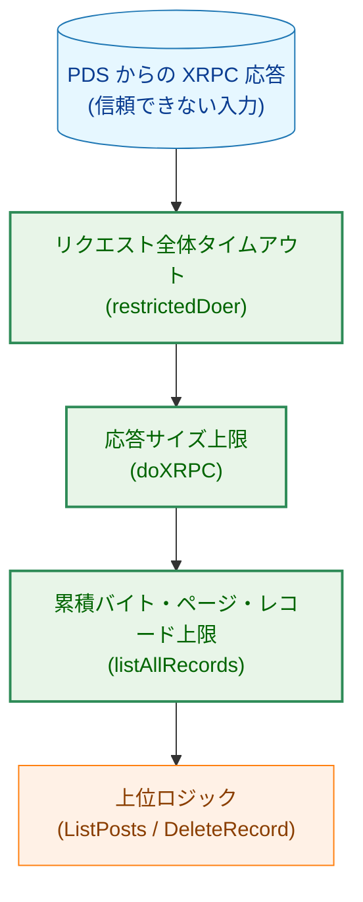
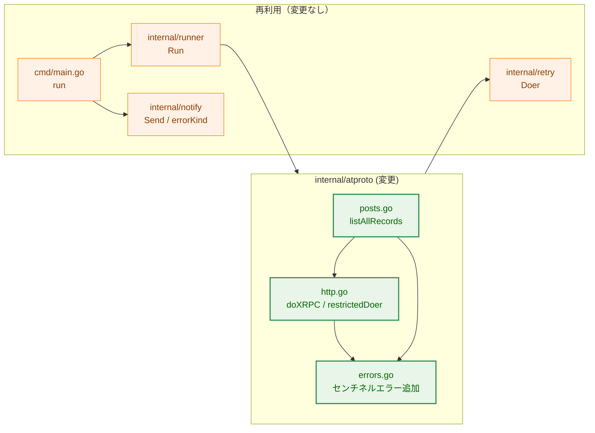
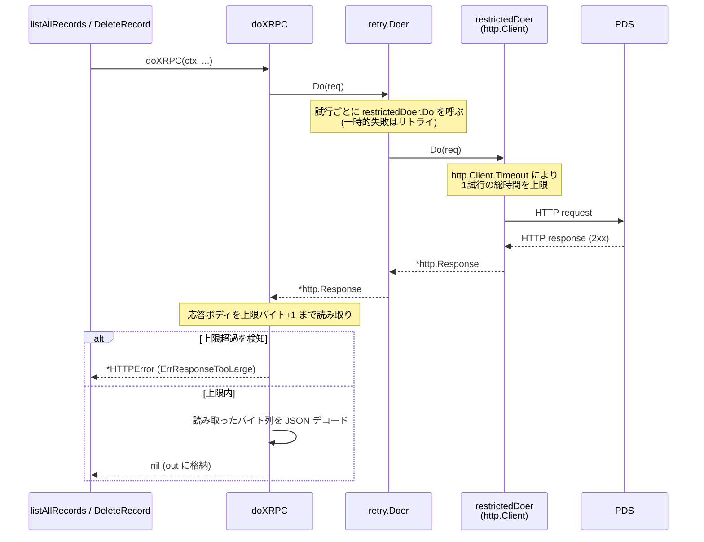
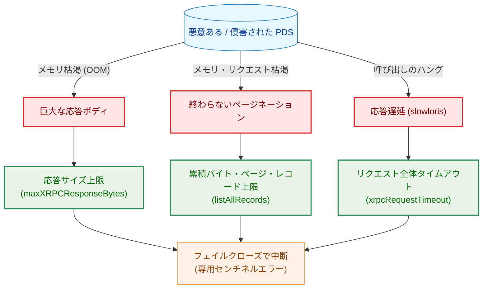
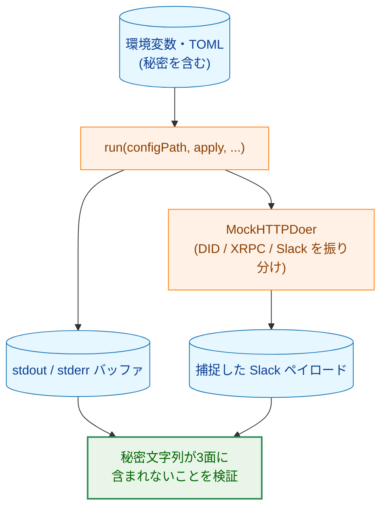

# セキュリティ強化・仕上げ — アーキテクチャ設計書

## Document Status

| Item | Value |
|---|---|
| Status | `approved` |
| Created | 2026-07-06 |
| Review date | 2026-07-06 |
| Reviewer | isseis |
| Comments | - |

## 1. 設計の全体像

### 1.1 本タスクの位置付け

本タスクは初期リリース前の最終工程であり、性格の異なる3種類の作業を含む。

- **DoS 系防御の新規実装（AC-04）**: [セキュリティ設計](../../design/security.md) が「防御が抜けている」と明記している3項目を `internal/atproto` に実装する。これが本タスク唯一の新規プロダクションコードである。
- **横断的な検証（AC-01・AC-02・AC-05・AC-06）**: 複数コンポーネントを結合した状態でしか確認できないエンドツーエンドの秘密情報非漏洩と、削除処理全体の冪等性・異常系を、結合テストで検証する。新しいプロダクションコードは追加しない。
- **棚卸しと決定の記録（AC-03・AC-04）**: [セキュリティ設計](../../design/security.md) の全リスクカテゴリについて、対応する実装・テストへのトレーサビリティ一覧と、未対応項目の対応可否判断を、本タスクの実装計画書に記録する。

各コンポーネント（`internal/config`・`internal/atproto`・`internal/retry`・`internal/cleanup`・`internal/runner`・`internal/notify`・`internal/report`・`cmd`）はタスク 0001〜0007 で実装済みである。本設計書はそれらの現在の構造を前提に、DoS 系防御をどこにどう挿入し、横断的検証をどのテスト層に配置するかを示す。

### 1.2 設計原則

- **フェイルクローズ**: DoS 系の上限に到達した場合、応答を途中まで採用して続行するのではなく、専用のセンチネルエラーで処理を中断する。既存の `ErrPaginationStalled`（`listAllRecords` の停止条件）と同じ扱いに合わせる。
- **既存資産の再利用（YAGNI・DRY）**: 応答サイズの上限は、DID 解決経路（`internal/atproto/did.go`）が既に採用している `io.LimitReader` ベースの上限と同じ考え方をとる。横断的検証は、既存の結合テスト（`cmd/main_test.go`・`internal/atproto/runner_integration_test.go`）と同じテストハーネス（`atprototestutil.MockHTTPDoer` によるネットワーク遮断）を再利用する。
- **秘密情報を運ばないエラー設計の踏襲**: 新設するエラーも、既存の `HTTPError`／`SSRFError` と同様に、XRPC メソッド名・件数・上限値といった秘密を含みえない値のみを保持する（[4.2 節](#42-errorkind-との連携と可観測性)）。
- **外部依存の最小化**: DoS 系防御はいずれも標準ライブラリ（`io`・`net/http`）のみで実現し、新規の外部依存を追加しない。

### 1.3 概念モデル

本タスクが扱う関心事は「壊れた・攻撃者管理下の PDS からの応答」を境界で遮断すること、および「結合後に初めて観測できる性質（秘密非漏洩・冪等性）」をテストで固定することの2つである。次の図は、DoS 系防御が XRPC 応答経路上のどこに位置するかの概念を示す。



**凡例**: 矢印 A → B は「A の出力（またはデータ）が B を通過して B に渡る」ことを表す。青（`data`）は信頼できない入力データ、橙（`process`）は変更しない既存コンポーネント、緑（`enhanced`）は本タスクが追加する防御を示す。応答は `restrictedDoer`（タイムアウト）→ `doXRPC`（サイズ上限）→ `listAllRecords`（累積バイト・ページ・レコード上限）の順に単一経路で通過する。`listAllRecords` の上限は投稿一覧取得（`ListPosts`）経路にのみ存在し、`DeleteRecord` は `T3`・`T1` のみを通る。

## 2. システム構成

### 2.1 コンポーネント配置

本タスクの変更対象は `internal/atproto` パッケージに閉じる（新規パッケージは作らない）。横断的検証のテストは、検証対象の結合範囲に応じて `cmd`（設定読み込みからコンソール出力・Slack 通知までの全経路）と `internal/atproto`（`runner.Run` を実 `*atproto.Client` で駆動する経路）に配置する。



**凡例**: 矢印 A → B は「A が B を呼び出す、または A が B に依存する」ことを表す。緑（`enhanced`）は本タスクが変更するファイル、橙（`process`）は変更せず再利用するコンポーネントを示す。

### 2.2 データフロー（XRPC 呼び出し1回）

`doXRPC` を1回呼び出したときの、本タスク追加の防御を含む処理順序を示す。応答サイズ上限とリクエスト全体タイムアウトは互いに補完関係にあり、前者はメモリ枯渇を、後者は応答遅延によるハングをそれぞれ独立に抑える。



**凡例**: 実線矢印は同期呼び出し、破線矢印は戻り値を表す。`doXRPC` が呼ぶ `c.httpDoer` は本番では `retry.NewDoer(newRestrictedDoer(...))` であり（`client.go`）、各リトライ試行が個別の `restrictedDoer.Do`（＝個別の `http.Client.Timeout`）になる。

## 3. コンポーネント設計

### 3.1 応答サイズ上限（doXRPC）

`doXRPC`（`internal/atproto/http.go`）は現在、成功応答を `json.NewDecoder(resp.Body).Decode(out)` で無制限に読み込む。ここに応答サイズの上限を導入する。DID 文書経路（`did.go` の `maxDIDDocumentResponseBytes`）と防御の意図（応答ボディのサイズを上限で抑える）は共通だが、超過の扱いは以下のとおり `did.go` とは異なる契約とする。

- **超過を「検知」する（黙って切り詰めない）**: 応答ボディを上限バイト＋1 まで読み取り、上限＋1 に到達した場合は超過と判定してデコードを試みず、`*HTTPError`（`Err: ErrResponseTooLarge`）を返す。上限内の場合のみ、読み取ったバイト列をデコードする。この「上限＋1 まで読んで超過を判定する」やり方は、`internal/retry` の `drainAndClose`（`io.CopyN(dst, body, maxDrainBytes+1)`）が既に用いているものと同じである。
- 非2xx 応答の `error` 名を読む `xrpcErrorName` の入力ボディにも、同じ上限を適用する（エラーボディ経由の枯渇も塞ぐ）。
- 上限値は定数 `maxXRPCResponseBytes` で表す。`listRecords` は1ページ最大100レコードであり、正当なアカウントの1応答は数 MB に収まるため、これに十分な余裕を持たせた値（8 MiB 程度）を採用する。値は実装時に確定する。

> **既存の `did.go` との差（なぜ同じ実装にしないか）**: `did.go` は `json.NewDecoder(io.LimitReader(body, N)).Decode(...)` を用いる。この構成は上限に達しても超過を通知せずストリームを黙って切り詰めるため、(a) 切り詰めた先頭が偶然正しい JSON だと部分データでデコードが成功してしまい（フェイルオープン。削除ツールにとって一覧の過少取得は静かな不具合になる）、(b) トークン途中で切れると汎用のデコードエラーになり「大きすぎた」ことを呼び出し元から識別できない。本タスクの `doXRPC` は上記の「上限＋1 で超過を検知する」契約により、両方を避け、常に専用センチネル `ErrResponseTooLarge` で中断する。`did.go` は 0002 で既にクローズ済みかつ独自の上限を備えているため、本タスクでは変更しない。

> **中間（リトライ対象）応答ボディは別経路で既に上限済み**: 429/5xx 等のリトライ対象応答のボディは、`retry.Doer` の `drainAndClose`（`maxDrainBytes` = 64 KiB）が読み捨て時に上限を課している。`maxXRPCResponseBytes` が実際に見るのは、リトライを抜けて呼び出し元へ返る最終応答のボディ（成功時のデコード、および最終エラー時の `xrpcErrorName`）のみである。エラーボディ経由の枯渇対策は、この2経路の合わせ技で成立する。

### 3.2 累積バイト・ページ・レコード数上限（listAllRecords）

`listAllRecords`（`internal/atproto/posts.go`）は現在、カーソルが直前と同一値になった場合（`ErrPaginationStalled`）のみ停止する。攻撃者が毎回異なるカーソル値を返し続けるとこの検知をすり抜けるため、ページネーション全体に上限を設ける。各上限は互いに独立した枯渇ベクトルを1つずつ塞ぐ。

- **累積バイト数の上限**（`maxListTotalBytes`、メモリの主たる上限）: `listAllRecords` は全ページの `listRecord`（`Value` は生の `json.RawMessage`）を `all` に蓄積し続ける。ここでページをまたいだ累積バイト量（蓄積した各 `Value` の長さの総和）に上限を設ける。これがメモリ枯渇に対する実効的なガードである。**理由**: `doXRPC` の1応答上限（`maxXRPCResponseBytes` ≒ 8 MiB、[3.1 節](#31-応答サイズ上限doxrpc)）はあくまで1ページ単位であり、レコード数・ページ数の「件数」上限だけでは、攻撃者が「8 MiB 近い巨大ページ」を多数返すことでメモリを積み上げられてしまう（件数上限に達する前に `ページ数 × 8 MiB` が積み上がる）。累積バイト上限はこの積み上げを直接止める。
- **総ページ数の上限**（`maxListPages`、反復回数の上限）: レコードを含まない（バイト量が増えない）空ページを異なるカーソルで返し続ける攻撃を、累積バイト上限とは独立に遮断する。正当な大規模アカウントは多数の小さなページを要するため、この値は十分大きく取る。
- **総レコード数の上限**（`maxListRecords`、件数の上限）: `{}` のような極小レコードを大量に返し、`listRecord`／`Post` のスライスと構造体オーバーヘッドでメモリを積み上げる攻撃を遮断する。累積バイト上限は小さな `Value` の総和では動きにくいため、件数の上限を別に設ける（[セキュリティ設計](../../design/security.md) が名指しする「総レコード数の上限」に対応する）。
- いずれかの上限に到達した場合、既存の `ErrPaginationStalled` と同じくフェイルクローズで新センチネル `ErrPaginationLimitExceeded` を返して処理を中断する（途中までの結果を採用しない）。
- 上限値は、想定される最大投稿数（件数・累積バイト量の両面）を十分上回りつつ、`maxListTotalBytes` が許容可能な常駐メモリ量（例: 数百 MiB 程度）に収まるよう設定する。正当なアカウントが上限に達しない値とすることで正常系への影響を避ける。具体値は実装時に確定する。

### 3.3 リクエスト全体タイムアウト（restrictedDoer）

XRPC 呼び出しに使う `http.Client`（`newRestrictedDoer` が構築する `restrictedDoer.client`）は現在、接続確立のタイムアウト（`dialTimeout`）のみを持ち、リクエスト全体のタイムアウト（`http.Client.Timeout`）を持たない。ここに定数 `xrpcRequestTimeout`（`dialTimeout` を上回る値、30秒程度）で全体タイムアウトを設定する。

- `http.Client.Timeout` は接続・送信・応答ボディ読み取りまでの1リクエストの総時間を上限とし、応答遅延（slowloris 的挙動）によるハングを、実行タイムアウトの残り予算とは独立した1回あたりの上限として抑える。
- `restrictedDoer` は `retry.Doer` にラップされて呼ばれ、リトライの各試行が個別の `Do` 呼び出しになるため、`http.Client.Timeout` は各試行に独立して適用される（試行間で共有されない）。`internal/notify` が `perAttemptTimeoutDoer` で実現している「試行ごとの独立タイムアウト」と同じ性質を、XRPC 経路では `http.Client.Timeout` そのもので満たす。
- **テスト用の差し替え口**: `xrpcRequestTimeout` 自体は本番専用の定数のままとし、パッケージ変数化はしない。`newRestrictedDoer` のシグネチャに `timeout time.Duration` 引数を追加し（`newRestrictedDoer(verifiedAddrs []net.IP, host string, timeout time.Duration)`）、本番の唯一の呼び出し元 `newPDSDoer`（`client.go`）は定数 `xrpcRequestTimeout` をそのまま渡す。[7.1 節](#71-単体テストdos-系防御)の遅延応答サーバーによる挙動テストは `internal/atproto` パッケージ内部（`http_test.go`、`package atproto`）から `newRestrictedDoer` を短い `timeout` 値で直接呼び出して検証する。`newPDSDoer` のようなパッケージ変数の save/restore（`t.Cleanup` によるグローバル状態の一時書き換え）を用いないため、このパッケージのテストが将来 `t.Parallel()` を使っても壊れない。

> **DID 解決経路の扱い（本タスクのスコープ外だが記録）**: DID 解決（`resolveHandleToDID`／`resolveDIDDocument`）は `cmd/main.go` が渡す `http.DefaultClient`（全体タイムアウトなし）を用いる。この経路は AC-04 が挙げる「XRPC の `http.Client`」ではなく、また `did.go` が応答サイズ上限を、`context.WithTimeout`（実行タイムアウト）が deadline を既に付与しているため、ハングは実行タイムアウトの範囲に収まる。本タスクでは AC-04 が名指しする XRPC 経路のみを対象とし、DID 解決経路への独立タイムアウト付与は行わない。この残余は棚卸し（AC-03）に記録する。

### 3.4 追加する型・定数（インターフェイス定義）

新しいインターフェイスや構造体は追加しない。追加するのは以下のセンチネルエラー（`internal/atproto/errors.go`）と、各防御の上限を表す非公開定数（`http.go`・`posts.go`）のみである。

```go
// ErrResponseTooLarge は、XRPC 応答ボディが maxXRPCResponseBytes を
// 超えたことを示す。*HTTPError の Err としてラップして返る。
var ErrResponseTooLarge = errors.New("XRPC response exceeds size limit")

// ErrPaginationLimitExceeded は、listAllRecords が累積バイト数・総ページ
// 数・総レコード数のいずれかの上限に達したことを示す。
// ErrPaginationStalled と同じくサーバーのプロトコル逸脱であり、通信障害
// とは区別される。
var ErrPaginationLimitExceeded = errors.New("pagination byte/page/record limit exceeded")
```

### 3.5 コンポーネント責務一覧

| ファイル | 区分 | 責務 | 更新が必要な既存テスト |
|---|---|---|---|
| `internal/atproto/http.go` | 変更 | `doXRPC` に応答サイズ上限を追加し、超過時に `ErrResponseTooLarge` を `*HTTPError` で返す。`newRestrictedDoer` の `http.Client` に `xrpcRequestTimeout` を設定する。`xrpcErrorName` の読み取りにも上限を適用する。 | `internal/atproto/http_test.go`（小さいボディを扱う既存ケースは影響なし。上限超過・タイムアウトの新規ケースを追加） |
| `internal/atproto/posts.go` | 変更 | `listAllRecords` に累積バイト数・総ページ数・総レコード数の上限を追加し、超過時に `ErrPaginationLimitExceeded` を返す。 | `internal/atproto/posts_test.go`（少数ページの既存ケースは影響なし。上限超過の新規ケースを追加） |
| `internal/atproto/errors.go` | 変更 | センチネル `ErrResponseTooLarge`・`ErrPaginationLimitExceeded` を追加。 | なし（追加のみ） |
| `internal/atproto/http_test.go` | 変更 | 応答サイズ上限・リクエスト全体タイムアウトの単体テストを追加。 | 該当ファイル自体 |
| `internal/atproto/posts_test.go` | 変更 | 累積バイト・ページ・レコード数上限の単体テストを追加。 | 該当ファイル自体 |
| `cmd/secret_leak_integration_test.go` | 新規 | F-001（AC-01・AC-02）: `run` を各正常系・異常系で駆動し、stdout・stderr・Slack ペイロードのいずれにも秘密情報が現れないことを検証。既存の `hermeticHandler`／`validConfigPath`／`setEnvCredentials` を再利用。 | なし（新規） |
| `internal/atproto/idempotency_integration_test.go` | 新規 | F-003（AC-05・AC-06）: `runner.Run` を実 `*atproto.Client` ＋モックトランスポートで駆動し、一覧取得後の既削除・実行タイムアウト中断・再実行時の重複削除の安全性を検証。 | なし（新規） |

> `cmd` パッケージには既に `main_test.go` が存在するが、秘密非漏洩の検証はテストの意図が明確に分かれるため独立したファイルに置く。ファイル名は実装時に既存の命名慣習に合わせて確定してよい。

## 4. エラーハンドリング設計

### 4.1 エラー型

本タスクは新しいエラー*型*を追加せず、既存の型を再利用する。

- **応答サイズ超過**: `*HTTPError{Method, StatusCode, ErrorName, Err: ErrResponseTooLarge}` として返す。`Method`（XRPC メソッド名）・`StatusCode` は秘密を含まないという既存の不変条件をそのまま満たす。加えて、成功応答（2xx）のボディ超過は `StatusCode` が 200 になり `errorKind` 上で正常な 2xx と見分けが付かなくなるため、`ErrorName` に固定マーカー（例: `"ResponseTooLarge"`）を設定し、Slack 通知でも「応答サイズ超過による中断」と判別できるようにする（[4.2 節](#42-errorkind-との連携と可観測性)）。この固定マーカーは PDS 応答由来の値ではなく本パッケージが決め打つ定数であり、秘密を含まない。
- **ページ／レコード上限超過**: 既存の `ErrPaginationStalled` と同じ形（`fmt.Errorf("list posts: list %s: %w", collection, ErrPaginationLimitExceeded)`）で返す。`collection` は固定のコレクション名（`app.bsky.feed.post` 等）であり秘密を含まない。
- **リクエスト全体タイムアウト**: `http.Client.Timeout` 発火時、`net/http` は通信エラーを返す。これは既存の `doXRPC` が `ErrTransportFailure` でラップする経路をそのまま通り、`retry.Doer` は一時的エラーとしてリトライ対象に分類する（`SSRFError` のような永続エラーではない）。新しい分岐は不要である。低速な PDS に対しては1回の XRPC 呼び出しで `http.Client.Timeout` の発火が最大 `MaxRetries` 回（＋初回）繰り返されうるが、これは通常の一時的エラーと同じ有界なリトライであり、最終的には外側の実行タイムアウト `ctx`（`cmd/main.go` の `context.WithTimeout`）が全体を打ち切る。バックオフ待機中の deadline 到達は 0005 の `Clock.Sleep` により遅延なく中断される（[0005_retry_timeout](../0005_retry_timeout/01_requirements.md) AC-08）。

### 4.2 errorKind との連携と可観測性

新しいエラーが `internal/notify` の `errorKind`（Slack 通知の分類文字列）にどう現れるかを整理する。`errorKind` はフェイルクローズで、未知のエラー型を `"unknown error"` に落とすため、いずれの経路でも秘密は漏れない。

- `ErrResponseTooLarge` は `*HTTPError`（`ErrorName` に固定マーカーを設定、[4.1 節](#41-エラー型)）でラップされるため、`errorKind` は `"atproto http error: <method> status=<code> error=ResponseTooLarge"` として分類する。マーカーが無いと成功応答（`status=200`）由来の超過が正常な 2xx と区別できなくなるため、この固定マーカーによって Slack 上でも中断理由が判別可能になる。
- `ErrPaginationLimitExceeded` は `*HTTPError` ではないため、`errorKind` は既存の `ErrPaginationStalled` と同様に `"unknown error"` に落ちる。ただし `cmd/main.go` の `run` は実行エラーの `Error()` を stderr へ出力しており、そこには `"pagination byte/page/record limit exceeded"` の具体的文言が残るため、オンコールは stderr から原因を特定できる。この非対称は既存の `ErrPaginationStalled` と同じ挙動であり、本タスクで `errorKind` を変更する必要はない。

## 5. セキュリティ考慮事項

### 5.1 脅威モデル（DoS 系防御）

[セキュリティ設計](../../design/security.md) が挙げる「壊れた・攻撃者管理下の PDS によるリソース枯渇（DoS）」の3経路と、本タスクが挿入する防御の対応を示す。SSRF 対策（`validatePDSEndpoint`／`restrictedDoer` による宛先固定）を通過した*後*の応答内容が攻撃手段になる、という前提のモデルである。



**凡例**: 矢印 A → B は「A（攻撃 / データ）が B によって処理・遮断される」ことを表し、`ATK` から出る辺のラベルは各攻撃が狙う枯渇の種類を示す。青（`data`）は攻撃元、赤（`problem`）は攻撃経路、緑（`enhanced`）は本タスクが追加する防御、橙（`process`）は最終的な安全な帰結を示す。`A2`（終わらないページネーション）に対する `D2` は、[3.2 節](#32-累積バイトページレコード数上限listallrecords)の累積バイト・総ページ数・総レコード数の3上限の総称である。

### 5.2 秘密情報の非漏洩（横断的検証）

秘密情報とは、app パスワード・セッション JWT・`Authorization` ヘッダー値・Slack Webhook URL を指す。各コンポーネントは既に個別の秘密マスキング（`config.SecretString`／`atproto` の `secretString`／`HTTPError`・`SSRFError`・`SendError` の秘密非包含／`redactWebhookURL`）を備えている。本タスクは、それらを結合した状態で3つの出力面（標準出力・標準エラー出力・Slack 通知ペイロード）に秘密が現れないことを結合テストで固定する（[6.1 節](#61-秘密非漏洩の結合テスト)）。本タスクではこれらのマスキング機構を変更しない。

### 5.3 副作用契約（dry-run と `--apply`）

本タスクは新しいフラグ・モードを追加しないが、秘密非漏洩の検証（AC-01・AC-02）は両モードを対象とするため、既存の副作用契約を明示する。

| モード | `deleteRecord` の送信 | Slack 通知の送信 | 秘密非漏洩の検証範囲 |
|---|---|---|---|
| dry-run（既定） | 抑止（送信しない） | 抑止（`cmd/main.go` の `run` は `apply` が真のときのみ通知） | stdout・stderr |
| `--apply` | 実行する | 実行する | stdout・stderr・Slack ペイロード |

秘密非漏洩は両モードで満たされる必要があるため、AC-01 の正常系テストは両モードを対象とする。Slack ペイロードへの秘密混入は `--apply` 時のみ観測可能なため、その検証は `--apply` の経路で行う。

## 6. 処理フロー詳細

### 6.1 秘密非漏洩の結合テスト（AC-01・AC-02）

`cmd` パッケージで `run` を駆動する。`run` は `httpDoer` を `internal/atproto`（DID 解決・XRPC）と `internal/notify`（Slack）の両方に渡すため、単一の `MockHTTPDoer` ハンドラで DID・XRPC・Slack の各リクエストを振り分けられる。Slack への POST はハンドラ内でボディを捕捉し、検証対象の出力面とする。

**禁止文字列集合（実行時生成の秘密を含める）**: 検証で「出力面に現れてはならない秘密」の集合は、環境変数・TOML 由来の値（app パスワード・成功／失敗の両 Webhook URL）だけでは不十分である。セッション JWT と `Authorization` ヘッダー値（`"Bearer " + AccessJWT`、`delete.go`）は環境変数ではなくモックの `createSession` 応答から実行時に生成されるため、これらは、認証失敗・削除・タイムアウト時のエラーやログを通じて最も漏洩しやすい。そこでモックが返す `AccessJWT` を既知の固定リテラルとし、禁止文字列集合を **{app パスワード, 既知の `AccessJWT`, `"Bearer " + 既知の AccessJWT`, 成功 Webhook URL, 失敗 Webhook URL}** とし、3出力面すべてに対して部分文字列一致で検証する。



**凡例**: 矢印 A → B は「A から B へデータが渡る」ことを表す。青（`data`）はデータの入出力、橙（`process`）はテストが駆動する既存コンポーネント、緑（`enhanced`）はテストの検証点を示す。

- **AC-01（正常系）**: ログイン成功・一覧取得・削除・Slack 通知まで通し、3面に秘密の値が現れないことを検証する。副作用契約（[5.3 節](#53-副作用契約dry-run-と---apply)）に従い dry-run と `--apply` の両方を対象とする。
- **AC-02（異常系 (a)〜(f)）**: モックを各段で失敗させ、AC-01 と同様に秘密が現れないことを検証する。
  - (a) 認証失敗: `createSession` に非2xx を返す。
  - (b) ネットワークエラー: モックが通信エラー（`Do` がエラー）を返す。
  - (c) DID/PDS エンドポイント解決エラー: `.well-known` 応答を不正値／非2xx にする。
  - (d) 削除呼び出しの失敗: `deleteRecord` に非2xx を返す。
  - (e) Slack 通知の送信失敗: Slack への POST に非2xx を返す。
  - (f) 実行タイムアウト到達: 短い `execution_timeout_seconds` と、`ctx` を尊重して待機するモックで deadline 到達を発生させる。

### 6.2 冪等性・異常系の結合テスト（AC-05・AC-06）

`internal/atproto`（`atproto_test` パッケージ）で `runner.Run` を実 `*atproto.Client` ＋ `MockHTTPDoer` で駆動する。既存の `runner_integration_test.go` と同じ配線パターンを用いる。

- **AC-05（一覧取得後の既削除）**: `deleteRecord` は AT Protocol の仕様上、既に存在しないレコードに対しても 2xx を返す（`delete.go` のコメント参照）。モックが対象 rkey の `deleteRecord` に 2xx を返すことで、一覧取得後に対象が消えていてもクラッシュせず正常系として扱われることを検証する。
  - **残余（記録）**: `deleteRecord` は対象の有無にかかわらず 2xx を返すため、クライアント境界では「既に削除済み」と「通常の削除成功」を区別できない。したがって本テストが固定するのは「2xx → 成功」という挙動のみであり、実 PDS が存在しないレコードに 404 を返すよう挙動を変えた場合の退行は検出できない。この「Bluesky が既削除に 2xx を返す」という前提自体は、実 API を使わない方針（NF-002）ゆえ本テストでは検証されない。
- **AC-06（タイムアウト中断と再実行の安全性）**: 複数の削除対象のうち、N 件目の削除成功後に実行タイムアウトへ到達する状況を作る。
  - **決定的な再現方法**: モックに削除呼び出しを計数させ、N 件目までは 2xx を返し、N+1 件目で `ctx.Done()` を待って（あるいは即座に `ctx` エラーを返して）短く設定した実行タイムアウトの deadline を確実に踏ませる。これにより壁時計に依存しない決定的な中断を再現する。
  - **実際の終端状態**: `runner.Run`（`runner.go`）は削除ループ内で `ctx` を明示的に確認しないため、deadline 到達後も残りの各対象は `DeleteRecord` に入り、キャンセル済み `ctx` 由来のエラーを即座に受けて `Result.Failed` に振り分けられる。すなわち終端状態は **`Deleted`（削除済み）と `Failed`（残り全件）** の2つに分かれ、「未着手」という別バケットは現状の実装では観測されない。テストの表明はこの実挙動（残りの対象がすべて `Failed` に入り、各々がキャンセル済み `ctx` で1回の空振り試行を消費する）に対して書く。可観測性の注記として、deadline 到達後もランナーが残り対象を空振りで反復するため、deadline 以降に `ctx` エラー付きの「delete post failed」ログが対象数ぶん連続して出る（有界だがオンコールが驚かないよう記録する）。
  - **再実行の安全性**: 続けて同じ対象集合で2回目の `runner.Run` を駆動し、既削除 rkey への再削除が 2xx を返す（重複削除がエラーにならない）ことを検証する。この安全性は `DeleteRecord` の冪等性（[0002_atproto_client](../0002_atproto_client/01_requirements.md) AC-12）と、実行タイムアウトの強行中断の扱い（[0005_retry_timeout](../0005_retry_timeout/01_requirements.md) AC-08・AC-09）に依拠する（本タスクはこれらの挙動を再実装せず、結合状態での成立を検証するのみ）。

## 7. テスト戦略

### 7.1 単体テスト（DoS 系防御）

| 対象 | 検証内容 | 配置 |
|---|---|---|
| 応答サイズ上限 | `maxXRPCResponseBytes` 超過の応答で `ErrResponseTooLarge`（`*HTTPError` 経由）が返り、上限内の応答は従来どおりデコードされること | `internal/atproto/http_test.go` |
| リクエスト全体タイムアウト | 低速応答に対して `http.Client.Timeout` が実際に発火し、`Do` がタイムアウトエラーを返すこと（`httptest` の遅延応答サーバーで挙動を検証する）。「定数の設定値をそのまま突き合わせる」だけの検証は、後日タイムアウトが外れても素通りするため採用しない。 | `internal/atproto/http_test.go` |
| 累積バイト・ページ・レコード上限 | 巨大ページを積み上げる（累積バイト超過）／異なるカーソルの空ページを返し続ける（ページ数超過）／極小レコードを大量に返す（レコード数超過）各応答で `ErrPaginationLimitExceeded` が返ること、上限内では従来どおり全件取得されること | `internal/atproto/posts_test.go` |

### 7.2 結合テスト（横断的検証）

- 秘密非漏洩（AC-01・AC-02）: [6.1 節](#61-秘密非漏洩の結合テストac-01ac-02)。
- 冪等性・異常系（AC-05・AC-06）: [6.2 節](#62-冪等性異常系の結合テストac-05ac-06)。
- いずれも実 Bluesky API に依存せず、`atprototestutil.MockHTTPDoer` によりネットワークを遮断して再現可能とする（NF-002）。

### 7.3 棚卸しの検証（AC-03・AC-04）

- AC-03: [セキュリティ設計](../../design/security.md) の全リスクカテゴリと、対応する実装・テストへのトレーサビリティ一覧を実装計画書に静的成果物として記載する（列挙は同文書の記載を正とする）。
- AC-04: 未対応・不十分と判明した項目の対応可否判断を実装計画書に記載する。DoS 系3項目は本タスクで実装する（[3 節](#3-コンポーネント設計)）ため「対応済み」として記録し、[0002_atproto_client](../0002_atproto_client/01_requirements.md)／[0005_retry_timeout](../0005_retry_timeout/01_requirements.md) へ差し戻さない。DID 解決経路の独立タイムアウト（[3.3 節](#33-リクエスト全体タイムアウトrestricteddoer)）とファイルシステム権限管理（要件定義書 Out of Scope）は「本タスクでは非対応」としてその理由とともに記録する。

## 8. 実装優先順位

| フェーズ | 内容 | 対応 AC |
|---|---|---|
| Phase 1 | DoS 系3防御の実装と単体テスト（`http.go`・`posts.go`・`errors.go`） | AC-04 |
| Phase 2 | 冪等性・異常系の結合テスト（`internal/atproto`） | AC-05・AC-06 |
| Phase 3 | 秘密非漏洩の結合テスト（`cmd`） | AC-01・AC-02 |
| Phase 4 | 棚卸し一覧・決定記録の実装計画書への記載 | AC-03・AC-04 |

Phase 1 を先行させる理由は、DoS 系防御が唯一の新規プロダクションコードであり、後続の結合テストが安定した実装の上で回るようにするためである。Phase 4 の棚卸しは Phase 1〜3 の結果（何を実装し何を見送ったか）を反映する必要があるため最後に置く。

## 9. 将来の拡張性

- **DoS 上限値のチューニング**: `maxXRPCResponseBytes`・`maxListPages`・`maxListRecords`・`xrpcRequestTimeout` は非公開定数として実装する。将来、極端に投稿数の多いアカウントや運用実績に応じて調整が必要になった場合は、これらを設定値（TOML）に昇格させる余地があるが、本タスクでは YAGNI により定数に留める。
- **DID 解決経路への独立タイムアウト**: [3.3 節](#33-リクエスト全体タイムアウトrestricteddoer)の残余。将来 DID 解決経路の堅牢化が必要になった場合は、`cmd/main.go` が渡す `http.DefaultClient` を全体タイムアウト付きクライアントに差し替える形で対応できる。
- **`errorKind` へのページ上限エラーの追加分類**: 現状 `ErrPaginationLimitExceeded` は Slack 上 `"unknown error"` に落ちる（[4.2 節](#42-errorkind-との連携と可観測性)）。Slack 側でも具体的分類が必要になった場合は、`internal/notify/errorkind.go` に分岐を追加すればよい。

## 付録: 決定履歴

- 本設計書の記述はすべて現時点の設計を表す。過去の検討経緯・却下案は各タスク（0001〜0007）の設計書および git 履歴を参照。
- 0006 の Slack Webhook ホスト検証は、当初「2つの URL の相互ホスト一致」のみであったが、その後 `slack_allowed_host` 許可リスト（`internal/config`、[0006_slack_notification](../0006_slack_notification/01_requirements.md)）が導入され、「両 URL が同一の意図しないホストを指す」ギャップは解消済みである。本タスクの棚卸し（AC-03）ではこれを「対応済み」として扱う。
