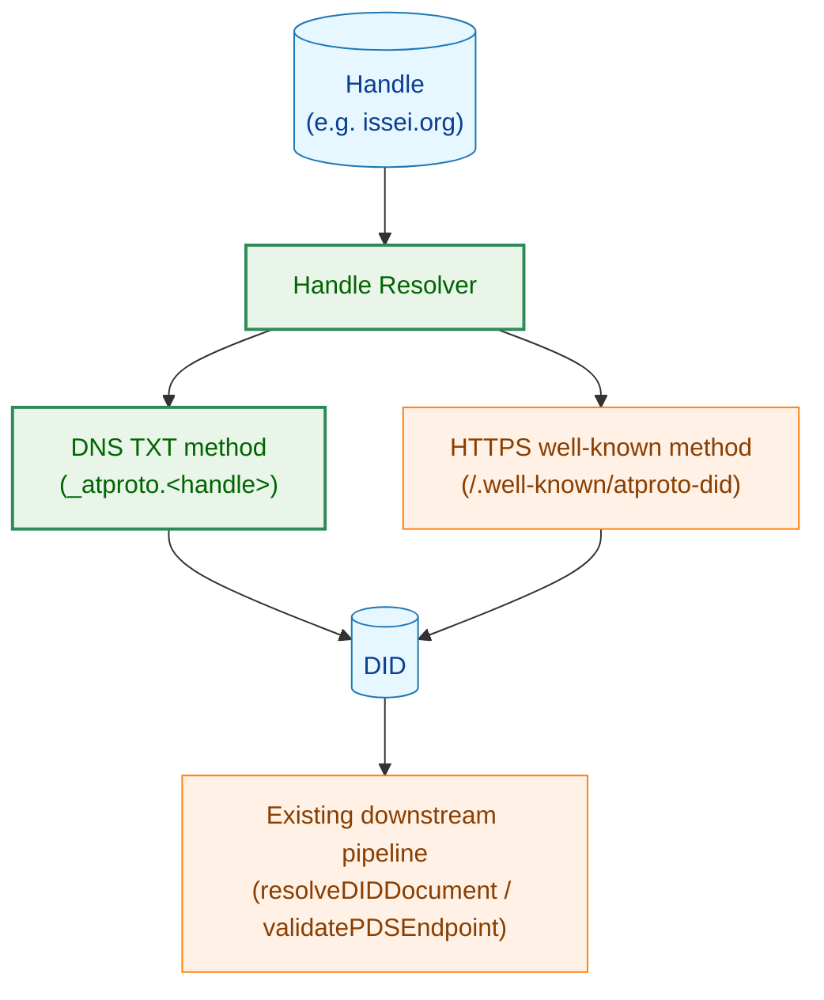
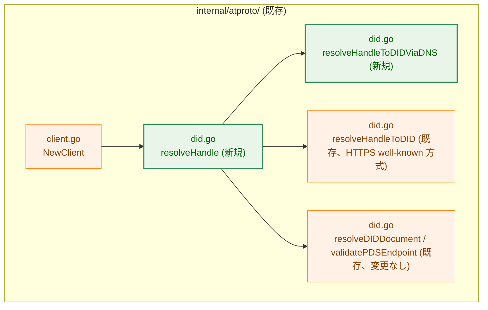
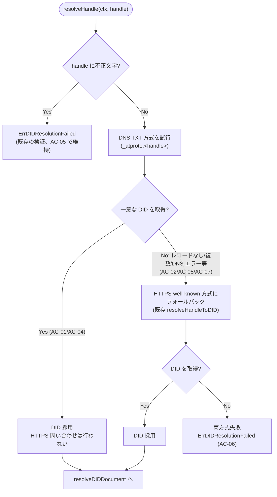
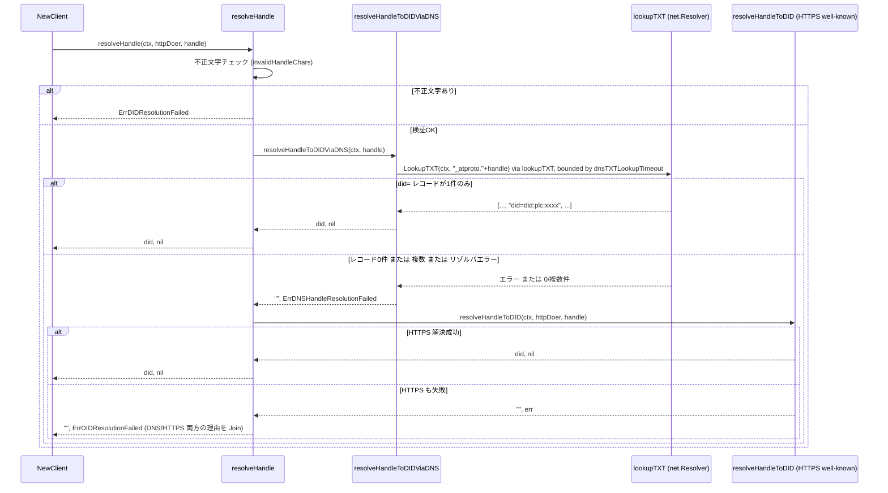

# DNS TXT によるハンドル解決 — アーキテクチャ設計書

## Document Status

| Item | Value |
|---|---|
| Status | `draft` |
| Created | 2026-07-07 |
| Review date | - |
| Reviewer | - |
| Comments | - |

## 1. 設計の全体像

### 1.1 設計原則

- **YAGNI**: DNS 解決のトランスポート自体（DoH、カスタムリゾルバ）には手を入れず、Go 標準ライブラリの `net.Resolver` のみを用いる（[01_requirements.md](01_requirements.md) Out of Scope）。
- **既存パイプラインの再利用**: DNS TXT 方式で得られた DID も、既存の HTTPS well-known 方式で得られた DID と全く同じ経路（`resolveDIDDocument` → `validatePDSEndpoint`）を通す。DID の取得方法が増えても、それより先の SSRF 対策・PDS エンドポイント検証には新しい迂回路を作らない。
- **Fail-closed**: DNS 応答が曖昧（複数レコード）・不正（`did=` プレフィックスなし）な場合は DID を確定させず、解決失敗として扱う。
- **既存コードとの一貫性**: 新規に追加する DNS リゾルバ抽象は、既存の `lookupIPAddr`（`internal/atproto/did.go`）と同じパターン（本番はパッケージ変数に標準ライブラリの関数を束縛し、テストはその変数を差し替える）を踏襲する。

### 1.2 概念モデル

ハンドル解決は「DID を得るための2つの独立した方式」から成り、呼び出し元（`NewClient`）から見ると1つの解決結果（DID、または両方式が失敗したことを示すエラー）だけが見える。

矢印 A → B は「A の出力が B の入力になる（データが流れる）」ことを表す。



凡例:
- 緑（`enhanced`）: 本タスクで新規追加・変更するコンポーネント
- オレンジ（`process`）: 既存のまま変更しないコンポーネント
- 青（`data`）: データ（値そのもの）

Handle Resolver は「DNS TXT を試し、失敗すれば HTTPS well-known にフォールバックする」という優先順位ロジックそのものであり、新規コンポーネントとして追加する。DID から先（`resolveDIDDocument`/`validatePDSEndpoint`）は完全に既存のまま、DID の値だけを受け取る。

## 2. システム構成

### 2.1 パッケージ内配置

新規ロジックはすべて既存パッケージ `internal/atproto` 内、既存ファイル `did.go` に追記する形で実装する（DID 解決という既存の責務の一部であり、新規パッケージを起こす理由がない — YAGNI／Separation of Concerns）。

矢印 A → B は「A が B を呼び出す」ことを表す。



凡例:
- 緑（`enhanced`）: 新規追加コンポーネント
- オレンジ（`process`）: 既存のまま変更しない、または呼び出し元が変わるだけのコンポーネント

`NewClient`（`client.go`）は現在直接呼んでいる `resolveHandleToDID` の呼び出しを、新設するオーケストレーション関数 `resolveHandle` の呼び出しに置き換える。これが本タスクにおける `client.go` 側の唯一の変更点であり、`resolveDIDDocument`/`validatePDSEndpoint` 以降のロジックには一切手を入れない。

### 2.2 データフロー（優先順位・フォールバック）



凡例: 矢印は「処理の遷移」を表す。菱形は分岐条件、実線矢印はラベルどおりの条件で次のステップへ進むことを表す。

この変更により、既存の HTTPS well-known 方式のみで検証されているアカウントも含め、すべてのハンドル解決で DNS TXT 問い合わせが1回追加される（成功すれば HTTPS 問い合わせは発生しないため、既存アカウントの解決結果自体は変わらない）。これは全ユーザーに対する外部から観測可能な副作用の変化である。[01_requirements.md](01_requirements.md) が DNS TXT 方式を必須の優先経路として要求している（F-002、AC-04）ため、この変化は意図した挙動として受け入れる。

## 3. コンポーネント設計

### 3.1 データ構造・インターフェース拡張

DNS TXT レコード取得は、既存の `lookupIPAddr`（`did.go`、`checkRequestHostSafety`/`validatePDSEndpoint` が参照する DNS 解決のパッケージ変数）と全く同じパターンを踏襲する: 本番実装を標準ライブラリの関数値に束縛したパッケージ変数として宣言し、関数の引数としては受け取らず関数本体から直接参照する。テストはこの変数を差し替える（`did_test.go` の `stubSymbolicHostLookup` が `lookupIPAddr` に対して行っているのと同じ手法）。`resolveHandle`/`resolveHandleToDIDViaDNS` の引数リストに DNS リゾルバを追加しないため、`NewClient`（3.2 節）の呼び出し変更は「関数名を差し替えるだけ」で完結し、新しい引数を配線する必要がない。

```go
// txtLookuper is the minimal DNS interface this package needs, so unit
// tests can supply a fake instead of performing a real DNS query.
type txtLookuper interface {
    LookupTXT(ctx context.Context, name string) ([]string, error)
}

// lookupTXT defaults to net.DefaultResolver, structurally satisfying
// txtLookuper without an adapter. Tests substitute a fake resolver via the
// exported test-only helper described in 3.3 -- resolveHandleToDIDViaDNS
// below references this package variable directly, exactly as
// checkRequestHostSafety/validatePDSEndpoint reference lookupIPAddr.
var lookupTXT txtLookuper = net.DefaultResolver

// dnsTXTLookupTimeout bounds a single DNS TXT lookup (NF-004), independent
// of xrpcRequestTimeout (http.go), which bounds HTTP requests. No retry is
// applied at this layer: resolveHandle's fallback to the HTTPS well-known
// method (5.3) is the retry-equivalent for this method's failure.
const dnsTXTLookupTimeout = 3 * time.Second
```

新設するオーケストレーション関数と DNS 方式解決関数の高レベルシグネチャ:

```go
// resolveHandle resolves handle to a DID, trying the DNS TXT method first
// and falling back to the HTTPS well-known method if DNS resolution does
// not yield a unique DID. It is the single entry point NewClient uses for
// handle resolution.
func resolveHandle(ctx context.Context, httpDoer HTTPDoer, handle string) (string, error)

// resolveHandleToDIDViaDNS resolves handle to a DID using the DNS TXT
// record method (_atproto.<handle> TXT "did=..."), referencing the
// lookupTXT package variable directly (no resolver parameter -- see
// above). It returns ErrDNSHandleResolutionFailed-wrapped errors for "no
// record", "multiple candidate records", and resolver-level failures
// alike -- callers that only need to decide "fall back or not" can treat
// them uniformly via errors.Is. It applies dnsTXTLookupTimeout to the
// lookup itself, in addition to whatever deadline ctx already carries.
func resolveHandleToDIDViaDNS(ctx context.Context, handle string) (string, error)
```

`resolveHandleToDID`（既存、HTTPS well-known 方式）はシグネチャ・実装とも変更しない。

`resolveHandleToDIDViaDNS` は取得した TXT レコードのうち `did=` プレフィックスを持たないものは候補から除外し（AC-03）、残った候補が一意であれば採用、0件または複数件であれば解決失敗として扱う（AC-02/AC-07）。

`resolveHandle` は DNS TXT・HTTPS well-known いずれの方式を試す前にも、既存の `invalidHandleChars` チェック（`resolveHandleToDID` が内部で行っている検証、`did.go:29-34`）を一度だけ適用する。この文字集合（`/?#@ \t\r\n`）はもともと HTTPS well-known 方式の URL 構造を守るために定義されたものだが、制御文字・空白・URL 構造記号を排除するという性質上、DNS クエリ名 `_atproto.<handle>` の構築時に混入してほしくない文字とも重なるため、DNS TXT 方式にもそのまま適用してよいと判断する。DNS ラベル長（253 バイト上限）等、DNS 固有の追加制約は本タスクでは検証しない — `_atproto.` を前置した結果として不正な名前になった場合は `lookupTXT` 自体がエラーを返し、通常の DNS リゾルバエラーとして扱われる（AC-08、4.2 節）。

### 3.2 コンポーネント責務一覧

| ファイル | コンポーネント | 責務 | 種別 |
|---|---|---|---|
| `internal/atproto/did.go` | `txtLookuper` インターフェース | DNS TXT 問い合わせの抽象化（テスト容易性、NF-003） | 新規 |
| `internal/atproto/did.go` | `lookupTXT` パッケージ変数 | 本番は `net.DefaultResolver`、テストはフェイクに差し替え | 新規 |
| `internal/atproto/did.go` | `dnsTXTLookupTimeout` 定数 | DNS TXT 問い合わせ単体のタイムアウト（NF-004） | 新規 |
| `internal/atproto/did.go` | `resolveHandleToDIDViaDNS` | `_atproto.<handle>` TXT レコード取得・`did=` 抽出・妥当性検証（F-001, F-003） | 新規 |
| `internal/atproto/did.go` | `resolveHandle` | DNS TXT → HTTPS well-known の優先順位・フォールバック制御、解決方式のログ出力（F-002） | 新規 |
| `internal/atproto/did.go` | `resolveHandleToDID` | HTTPS well-known 方式によるハンドル解決 | 既存・変更なし |
| `internal/atproto/errors.go` | `ErrDNSHandleResolutionFailed` | DNS TXT 方式の解決失敗を示す型付きセンチネルエラー（AC-08） | 新規 |
| `internal/atproto/client.go` | `NewClient` | `resolveHandleToDID` の直接呼び出しを `resolveHandle` の呼び出しに置き換え | 変更 |
| `internal/atproto/test_helpers.go` | `StubDNSTXTLookup`（仮称） | `lookupTXT` をフェイクに差し替えるエクスポート済みテストヘルパー（`StubPassthroughPDSDoer` と同じパターン、`atproto_test` 外部パッケージからも呼べる） | 新規 |
| `internal/atproto/runner_integration_test.go` | 既存の `NewClient` 呼び出し | `StubDNSTXTLookup` を注入し、DNS TXT 方式が実 DNS へ問い合わせないようにする | 変更 |
| `internal/atproto/idempotency_integration_test.go` | 既存の `NewClient` 呼び出し | 同上 | 変更 |

### 3.3 既存挙動への影響とテスト更新

`resolveHandleToDID` 自体の実装は変更しないため、`did_test.go` 内でこの関数を直接呼んでいるテスト（`TestResolveHandleToDID_*` 相当、`did_test.go:307`, `:323`）はそのまま有効であり、変更不要。

一方、`NewClient` を経由してハンドル解決の統合的な挙動を検証しているテストは、`resolveHandle` 経由になったことで DNS TXT 方式が先に試行されるようになるため、いずれも DNS TXT 方式が「レコードなし」で確実にフォールバックするようフェイクを注入する必要がある。対象は次の3ファイルである。

- `client_test.go`（`handleResolutionHandler` を使うテスト群、`package atproto`）: パッケージ内部からは `lookupTXT` を直接差し替えられる。
- `runner_integration_test.go`、`idempotency_integration_test.go`（いずれも `package atproto_test`、外部ブラックボックステスト）: `lookupTXT` は非公開のパッケージ変数であり、外部パッケージからは差し替えられない。両ファイルは `publicIPLiteral` をハンドルとして使い、既存の `lookupIPAddr` がそれをローカルに解決できることを利用して実 DNS 問い合わせを避けている（`did_test.go` の該当コメント参照）。しかし `resolveHandle` が先に `_atproto.<publicIPLiteral>` への TXT 問い合わせを試みるため、この対策だけでは実 DNS 問い合わせを防げない。

このため、`StubPassthroughPDSDoer`（`test_helpers.go`、`//go:build test`）と同じ設計パターンで `lookupTXT` を差し替えるエクスポート済みテストヘルパー（例: `StubDNSTXTLookup(t *testing.T)`、空レコードを返すフェイクをインストールする）を追加し、上記3ファイルすべてに注入する。注入しない場合、テスト環境で `lookupTXT` が実 DNS に問い合わせてしまい、テストがネットワーク依存になったり、CI 環境でハングしたり不安定になったりする原因になる。

## 4. エラーハンドリング設計

### 4.1 エラー型

```go
// ErrDNSHandleResolutionFailed identifies a DNS TXT handle-resolution
// failure: no record, multiple ambiguous records, NXDOMAIN, timeout, or
// any other resolver-level error. Callers distinguish the specific cause
// only if they need to (e.g. via errors.AsType[*net.DNSError]); the
// fallback decision in resolveHandle treats all of these uniformly.
var ErrDNSHandleResolutionFailed = errors.New("DNS TXT handle resolution failed")
```

既存の `ErrDIDResolutionFailed` は、DNS TXT・HTTPS well-known いずれの方式も失敗した最終結果（AC-06）を表すために引き続き使う。`resolveHandle` が両方式失敗時に返すエラーは、`errors.Join` で DNS 側・HTTPS 側それぞれの失敗理由を保持しつつ `ErrDIDResolutionFailed` でラップし、`errors.Is(err, ErrDIDResolutionFailed)` で判別できるようにする。

### 4.2 エラー分類方針

| 状況 | 対応 AC | エラー |
|---|---|---|
| TXT レコードが 0 件 | AC-02 | `ErrDNSHandleResolutionFailed`（HTTPS へフォールバック） |
| `did=` プレフィックスを持つ TXT レコードが複数件 | AC-07 | `ErrDNSHandleResolutionFailed`（HTTPS へフォールバック） |
| DNS リゾルバ自体のエラー（NXDOMAIN、タイムアウト等） | AC-08 | `ErrDNSHandleResolutionFailed`（元のリゾルバエラーを `%w` でラップ、HTTPS へフォールバック） |
| DNS TXT・HTTPS 双方が失敗 | AC-06 | `ErrDIDResolutionFailed`（両方の失敗理由を `errors.Join`） |

`resolveHandleToDIDViaDNS` はこれら3つの失敗系統を区別せず同じセンチネルエラーで返す。呼び出し元（`resolveHandle`）は「DNS で失敗した」という事実だけを見てフォールバックするため、原因ごとに分岐する必要がない。原因の詳細は `%w` チェーンに保持されるため、ログ出力やデバッグ時には `errors.AsType[*net.DNSError]` 等で個別に取り出せる。

### 4.3 ログ出力（オンコール可観測性）

[01_requirements.md](01_requirements.md) 1.1節の動機となったインシデント（`WARN retrying HTTP request` が繰り返し出力され、原因の特定に手間取った事例）を踏まえ、`resolveHandle` は「どちらの方式で解決に成功したか」「DNS TXT 方式がなぜ失敗し HTTPS へフォールバックしたか」をオペレーターがログから追えるよう、以下のタイミングで `slog` によるログを出力する（`internal/retry` パッケージの `logRetrying`/`logGivingUp` と同様、ログ出力自体は戻り値やエラーの型には影響しない補助情報として扱う）。

- DNS TXT 方式で解決に成功した場合: `slog.Info`（例: `"resolved handle via DNS TXT"`、`handle` フィールドのみ。DID は機密ではないため含めてよいが、必須ではない）
- DNS TXT 方式が失敗し HTTPS well-known 方式へフォールバックする場合: `slog.Warn`（例: `"DNS TXT handle resolution failed, falling back to HTTPS well-known"`、`handle` と失敗理由の文字列を含む）
- 両方式とも失敗した場合: 個々の失敗はそれぞれ上記の `slog.Warn`／HTTPS 側の既存リトライログ（`retry.Doer`）で既に出力されているため、`resolveHandle` 自身は追加のログを出さず、呼び出し元にエラーを返すのみとする。

## 5. セキュリティ考慮事項

### 5.1 SSRF/認証情報漏洩リスクへの対応（AC-09）

DNS TXT 方式で得られる DID は、単なる文字列であり、DNS 応答そのものが直接ネットワーク接続先を決定するわけではない。DID から先の処理（`resolveDIDDocument` による DID ドキュメント取得、`validatePDSEndpoint` による PDS エンドポイントの安全性検証）は、DID の取得経路（DNS TXT か HTTPS well-known か）に関わらず完全に同一のコードパスを通る（3.1 節のシグネチャ参照: `resolveHandle` の戻り値は `resolveHandleToDID` と同じ `(string, error)` であり、`NewClient` はその先で分岐しない）。したがって、DNS 解決を追加したことによる迂回経路は生まれない。

### 5.2 悪意ある DNS 応答に対する fail-closed

- 複数の `did=` レコードが存在する場合（解決先が曖昧なケース、例えばキャッシュポイズニングや設定ミスにより複数の DID が競合している状態）、DID を確定させず解決失敗として扱う（AC-07）。これにより「攻撃者が追加した TXT レコードが正規レコードと共存し、どちらか一方が偶然採用される」という状況を排除する。
- DNS 応答自体の真正性（DNSSEC 等によるレコードの改ざん検知）は本タスクのスコープ外である。DNS 応答の改ざんは既存の HTTPS well-known 方式でも同水準のリスク（DNS ハイジャックにより誤ったサーバーに誘導される）を内包しており、本タスクがこのリスクを新規に発生させるわけではない。DNS 解決結果を無条件に信頼せず、その先で得られる DID ドキュメント・PDS エンドポイントを `validatePDSEndpoint` で再検証する既存の多層防御構造がこのリスクを緩和している。
- 悪意ある、または侵害された権威 DNS サーバーが `_atproto.<handle>` に対して大量の TXT レコードを返すことでメモリ・CPU を消費させる攻撃について: `net.Resolver.LookupTXT` が読み取る DNS 応答自体が、UDP/TCP の DNS プロトコル上のメッセージサイズ上限（実務上は数十 KB 程度）に収まるため、`did.go` の既存コードが HTTP レスポンスに対して行っている `io.LimitReader` のような追加の上限は設けない。これは `resolveHandleToDIDViaDNS` 単体の呼び出し回数が `NewClient` 実行あたり高々1回であり、DID ドキュメント取得や XRPC 呼び出しのような繰り返し実行されるレスポンス処理と異なるためでもある。

### 5.3 DNS 問い合わせのハング対策とフォールバックの信頼性（NF-004）

DNS TXT 問い合わせには専用の固定タイムアウト `dnsTXTLookupTimeout = 3 * time.Second`（3.1 節）を設ける。`context.WithTimeout(ctx, dnsTXTLookupTimeout)` は親 ctx から派生させるため、実行タイムアウトの残り予算がこれより短い場合は自動的にその短い方が優先される（`context.WithTimeout` の標準的な合成規則であり、本タスク側で追加の調整は不要）。3秒という値は、既存の XRPC リクエスト全体のタイムアウト `xrpcRequestTimeout = 30 * time.Second`（`http.go`）よりも大幅に短く設定している — DNS 問い合わせは通常ミリ秒〜数百ミリ秒で完了するオペレーションであり、失敗時に HTTPS へフォールバックする前提（後述）では、この待ち時間を実行タイムアウト予算の大半を使うほど長く取る理由がない。

DNS TXT 方式にはリトライを行わず、失敗時は HTTPS well-known 方式へフォールバックする（既存 `resolveHandleToDID` は `didResolutionDoer`（`client.go`）による HTTP レベルの指数バックオフを既に持つ）。この設計が意味する最悪ケースのレイテンシは次の通りである。

- DNS TXT のみが一過性の理由（UDP パケットロス、リゾルバの一時的エラー等）で失敗した場合: `dnsTXTLookupTimeout`（最大3秒）を消費した後、HTTPS well-known 方式が1回で成功すれば追加の遅延はごく僅かで済む。
- DNS TXT が失敗し、かつ HTTPS well-known 方式も一過性の理由で失敗し続ける場合: `dnsTXTLookupTimeout`（最大3秒）に加えて、`defaultRetryPolicy`（`client.go`、`MaxRetries: 5, BaseDelay: 1s, MaxDelay: 30s`）に基づく最大約31秒のリトライが発生し、合計で最大約34秒を要してから最終的に失敗する。

DNS TXT のみで検証されているアカウント（[01_requirements.md](01_requirements.md) 1.1節の動機となった `issei.org` のケース）にとって、この構成は「DNS TXT 方式が存在しない状態（本タスク以前は解決不可能で即座に失敗していた）」と比べれば解決成功率を大きく改善する。ただし DNS TXT 方式単体でのリトライを持たないため、一過性の DNS 障害時には HTTPS フォールバック分の追加リトライ待ち（最大約31秒）が発生しうるという新しいトレードオフを許容している。このトレードオフは、DNS 単体でのリトライを追加する複雑さ（かつ実行タイムアウト予算をさらに消費する）よりも、「別方式へのフォールバック」という既存の仕組みで解決する方が YAGNI の観点で優れると判断し、受け入れる。将来この最大約34秒が実行タイムアウトの予算を圧迫すると分かった場合は、DNS TXT 方式に少数回（例: 1回）の即時リトライを追加することを検討する（9章「将来の拡張性」）。

この方針は [01_requirements.md](01_requirements.md) 5章「スコープ外の根拠」で述べられている「DNS ルックアップは HTTP リクエストではなく `retry.Doer` の対象外である」という判断とも整合する。

### 5.4 DNS リゾルバの実装差異（未検証のリスク）

Go の `net.Resolver` は、ビルド・実行環境によって pure Go 実装と cgo（libc）実装のいずれかが使われ、ネットワーク条件（`/etc/nsswitch.conf` の設定、`GODEBUG=netdns=...` 環境変数、glibc/musl の違い等）によって自動的に切り替わりうる。cgo 実装では、`ctx` がキャンセル・タイムアウトした後もバックグラウンドで基盤の C ライブラリ呼び出しが残留する場合があることが Go の既知の制限として知られている。本リポジトリの `Dockerfile` は `CGO_ENABLED` を明示的に固定しておらず、ビルド環境（`golang` イメージ、glibc ベース）と実行環境（`alpine` イメージ、musl ベース）で `net.Resolver` の実際の挙動を本設計内では検証していない。

この差異は `dnsTXTLookupTimeout` のタイムアウト自体を無効化するものではない（`LookupTXT` の呼び出し自体は ctx キャンセル時にエラーを返して制御を戻すため、`resolveHandle` の処理はブロックされない）が、cgo 実装環境ではタイムアウト後もバックグラウンドでリソース（goroutine・OS スレッド）が一時的に残留する可能性がある。本タスクでは、この残留は同一プロセス内で頻発するものではなく（`NewClient` は実行あたり高々1回しか DNS TXT 解決を行わない）、実害が限定的であるとして未検証のまま受け入れるリスクとして明示する。将来、本番環境での `net.Resolver` の実装（pure Go か cgo か）を確定させる必要が生じた場合は、`GODEBUG=netdns=go` の明示的な指定や `CGO_ENABLED=0` でのビルドを検討する。

### 5.5 セキュリティ設計ドキュメントとの関係

[セキュリティ設計](../../design/security.md) が挙げるリスクカテゴリのうち「AT Protocol のフェデレーション構造に起因するリスク（意図しないホストへの認証情報送信）」に本タスクは直接関わるが、5.1 節の通り、DID から先の検証パイプラインを変更しないため、既存の対策方針から逸脱しない。他のリスクカテゴリ（投稿本文経由のインジェクション、リソース枯渇、Docker サプライチェーン等）は本タスクの変更範囲外であり、N/A。

## 6. 処理フロー詳細



## 7. テスト戦略

### 7.1 ユニットテスト

- `resolveHandleToDIDViaDNS`: `lookupTXT` パッケージ変数を `txtLookuper` を満たすフェイクに差し替え、以下をネットワーク I/O なしで検証する。
  - `did=` レコード1件 → 成功（AC-01）
  - レコード0件 → `ErrDNSHandleResolutionFailed`（AC-02）
  - `did=` プレフィックスを持たないレコードのみ → 無視されて解決失敗扱い（AC-03）
  - `did=` プレフィックスを持つレコードが複数件 → `ErrDNSHandleResolutionFailed`（AC-07）
  - リゾルバがエラー（NXDOMAIN 相当、タイムアウト相当）を返す → `errors.Is`/`errors.AsType[T]` で判別可能な型付きエラー（AC-08）
- `resolveHandle`:
  - DNS TXT 方式が成功する場合、フェイク `httpDoer` に一切リクエストが飛ばないことを検証（AC-04 — モックへの呼び出し回数アサーションで検証）
  - DNS TXT 方式が失敗する場合、HTTPS well-known 方式にフォールバックし、既存 AC-01〜AC-03（0002_atproto_client）の挙動が維持されることを検証（AC-05）
  - 両方式が失敗する場合、`ErrDIDResolutionFailed` が返り処理が中断されることを検証（AC-06）

### 7.2 統合テスト

- `client_test.go`（`package atproto`、パッケージ内部）の `NewClient` 経由テストは `lookupTXT` を直接「レコードなし」のフェイクに差し替える。
- `runner_integration_test.go`・`idempotency_integration_test.go`（`package atproto_test`、外部ブラックボックス）は、新設する `StubDNSTXTLookup`（3.2/3.3節）を呼び出して同じフェイクを注入する。
- いずれも、DNS TXT 方式が確実にフォールバックした上で、HTTPS well-known 方式の既存挙動（成功パス・エラーパス双方）が壊れていないことを回帰確認する（AC-05 の「既存の挙動を壊さない」というゴールの直接検証）。

### 7.3 セキュリティテスト

- AC-09 を静的に検証する: `resolveHandle` の戻り値が `resolveHandleToDID` 単体を呼んでいた旧経路と同じ型（`(string, error)`）であり、`NewClient` 内で DID の取得方式によって分岐する新しい分岐が追加されていないことをコードレビュー観点表・実装計画でチェック項目化する（`static` 検証）。
- 複数 `did=` レコードに対する fail-closed 挙動（AC-07）は、上記ユニットテストで動的に検証済み。

## 8. 実装優先順位

1. **Phase 1**: `errors.go` に `ErrDNSHandleResolutionFailed` を追加。
2. **Phase 2**: `did.go` に `txtLookuper` インターフェース・`lookupTXT` パッケージ変数・`dnsTXTLookupTimeout` 定数・`resolveHandleToDIDViaDNS` を追加し、ユニットテストを書く（7.1節前段）。
3. **Phase 3**: `did.go` に `resolveHandle`（ログ出力含む）を追加し、優先順位・フォールバックのユニットテストを書く（7.1節後段）。
4. **Phase 4**: `test_helpers.go` に `StubDNSTXTLookup` を追加する。
5. **Phase 5**: `client.go` の `NewClient` を `resolveHandle` 呼び出しに切り替え、`client_test.go`・`runner_integration_test.go`・`idempotency_integration_test.go` にフェイク差し替え/`StubDNSTXTLookup` 呼び出しを追加して回帰確認する（7.2節）。

## 9. 将来の拡張性

- DoH やカスタムリゾルバへの対応が将来必要になった場合、`txtLookuper` インターフェースが既にその抽象化点になっているため、`lookupTXT` の実体を差し替えるだけで対応でき、`resolveHandleToDIDViaDNS`/`resolveHandle` 側の変更は不要である。
- DNS TXT 方式の再試行方針（現在は無リトライ、HTTPS へのフォールバックのみ）を将来見直す場合も、`resolveHandleToDIDViaDNS` の内部実装のみの変更で完結し、`resolveHandle` の優先順位ロジックには影響しない。
