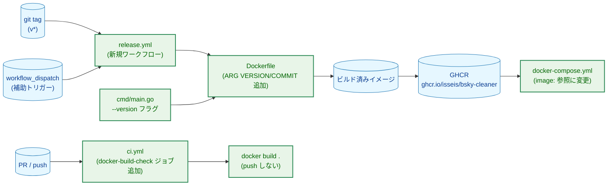
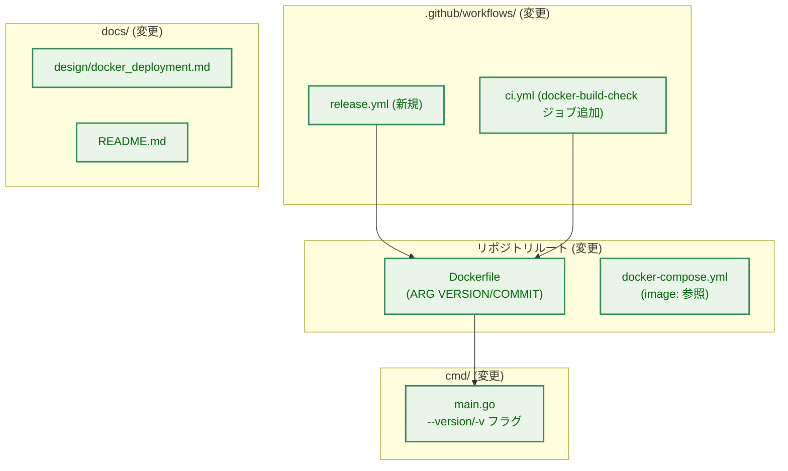
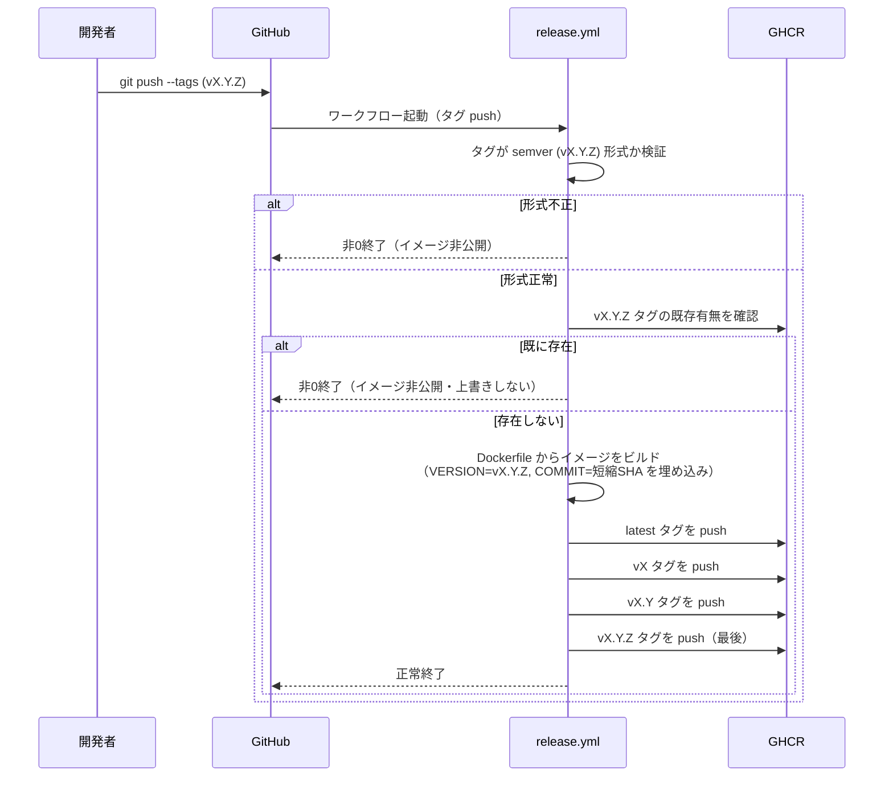
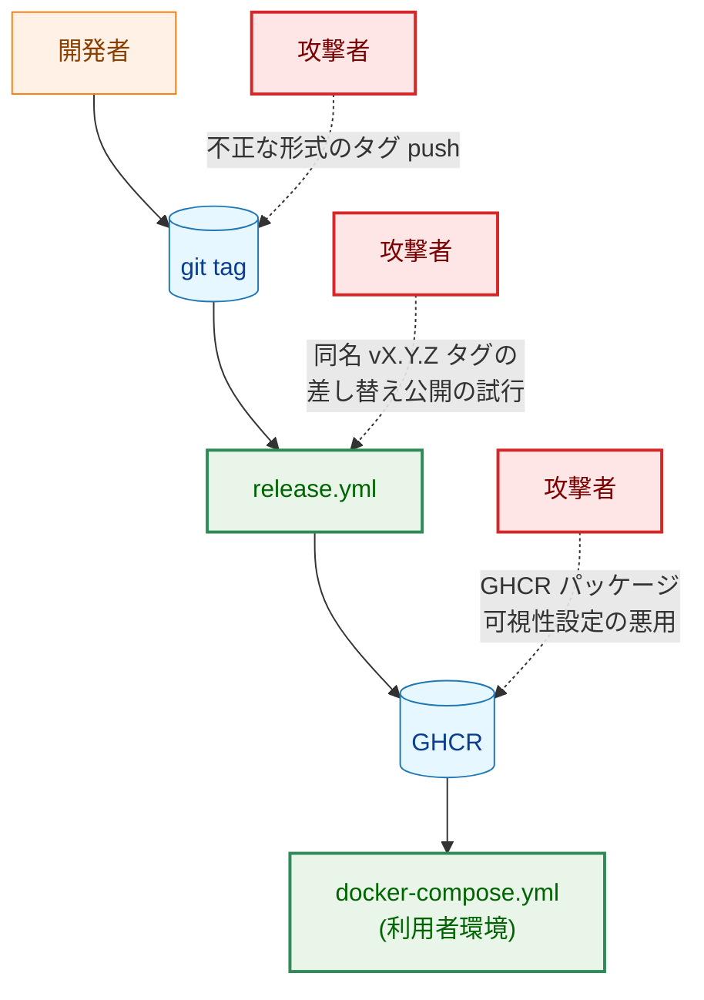
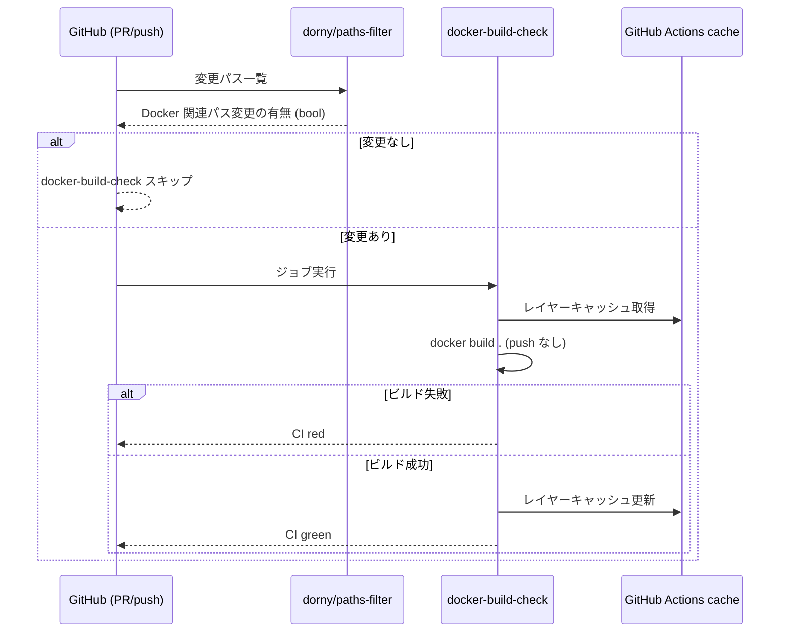

# Docker イメージのビルド済み配布 — アーキテクチャ設計書

## Document Status

| Item | Value |
|---|---|
| Status | `draft` |
| Created | 2026-07-08 |
| Review date | - |
| Reviewer | - |
| Comments | - |

関連ドキュメント: [要件定義書](01_requirements.md)

## 1. 設計の全体像

### 1.1 設計原則

- **fail-closed**: タグが semver 形式に一致しない場合、および `vX.Y.Z` タグが GHCR に既に存在する場合、ワークフローは公開を行わず非 0 で終了する（AC-02, AC-03a）。
- **既存資産の再利用**: [0007_docker_distribution](../0007_docker_distribution/01_requirements.md) で導入した `Dockerfile`（マルチステージビルド・digest 固定・`linux/amd64` 固定）をそのまま再利用し、`ARG` によるビルド時バージョン埋め込みのみを追加する。TOML パースや cron 連携（`print-schedule`／`entrypoint.sh`）には変更を加えない。
- **秘匿情報分離方針の踏襲**: `docker-compose.yml` の秘匿情報分離方針（`.env` → `environment:`）は変更しない。本タスクは `build:` → `image:` の参照方式のみを変更する。
- **YAGNI**: マルチアーキテクチャ対応・イメージ署名/SBOM・複数レジストリ公開は要件定義書のスコープ外であり、本設計でもそれらのための抽象化（例: レジストリ切り替え可能なパラメータ化）を導入しない。
- **外部依存最小化（CI ワークフロー観点）**: GitHub Actions の marketplace action は Go の実行時依存とは性質が異なる（配布物に含まれず、ビルド成果物のサプライチェーンに影響しない）。そのため、**GHCR への書き込み権限（`packages: write`）を持たない読み取り専用の用途**であれば、広く使われている確立されたパターンを採用してよいものとする。F-005 のパスフィルタ実装（3.2.7）でこの判断を適用する。ただし `release.yml`（F-001）が使う `docker/login-action`／`docker/build-push-action` は `packages: write` 権限下で実行され、改ざんされた action バージョンがそのままイメージ公開権限の乗っ取りに直結するため、この緩和の対象外とし、コミット SHA 固定を必須とする（3.2.1）。

### 1.2 概念モデル

本タスクが導入・変更する構成要素と、既存の Docker 配布基盤（0007）との関係を示す。



矢印 A → B は「A の完了・成立が B の実行契機になる／A の出力が B の入力になる」ことを表す。緑色のノードは本タスクで追加・変更される要素、橙色は既存のまま変更されない要素である。

**凡例**:

| クラス | 意味 |
|---|---|
| `data`（青） | git タグ・ビルド成果物・レジストリなどの静的データ |
| `enhanced`（緑） | 本タスクで追加・変更されるコンポーネント |

本図に登場するコンポーネントはすべて本タスクで追加・変更されるため、`process`（変更なしの既存コンポーネント）クラスは使用しない。

### 1.3 要件との対応

| 要件 | 対応する設計要素 |
|---|---|
| F-001 (AC-01〜04, AC-06〜07) | `.github/workflows/release.yml`（3.2.1, 3.2.2） |
| F-001 (AC-05) | GHCR パッケージ可視性の手動切り替え手順（3.2.6。ワークフロー自体はこの AC を満たさない、運用手順で満たす） |
| F-002 (AC-08〜11a) | `Dockerfile` の `ARG` 追加（3.2.3）、`cmd/main.go` の `--version` フラグ（3.2.4） |
| F-003 (AC-12〜14) | `docker-compose.yml`（3.2.5） |
| F-004 (AC-15〜17) | [Docker 配布の詳細設計](../../design/docker_deployment.md) と README の追記（3.2.6） |
| F-005 (AC-18〜22) | `.github/workflows/ci.yml` への `docker-build-check` ジョブ追加（3.2.7） |
| NF-001 | 専用の設計要素なし。既存の `make fmt`/`make test`/`make lint` で検証する |
| NF-002 | `docker-build-check` ジョブは既存 `ci.yml` の workflow レベルの `on:` 設定を変更せず、新規ジョブとして並行追加するのみ |
| NF-003 | `release.yml` は `GITHUB_TOKEN` のみを用いる（3.2.1） |
| NF-004 | `vX.Y.Z` タグ push を最後に置く順序設計（3.2.2, AC-03b）で満たす |
| NF-005 | 3.2.7 で許容時間の目安と、それを裏付ける `timeout-minutes` の上限設定を明記する |

## 2. システム構成

### 2.1 コンポーネント配置



矢印 A → B は「A が B に依存する／A が B を呼び出す」ことを表す。

**凡例**:

| クラス | 意味 |
|---|---|
| `enhanced`（緑） | 本タスクで追加・変更されるコンポーネント |

### 2.2 リリース公開のデータフロー



## 3. コンポーネント設計

### 3.1 コンポーネント責任一覧

| ファイル | 変更種別 | 責任 |
|---|---|---|
| `.github/workflows/release.yml` | 新規 | タグ push / `workflow_dispatch` を契機に、semver 検証・既存タグ確認・イメージビルド・GHCR へのタグ push（順序制御込み）を行う |
| `Dockerfile` | 変更 | ビルドステージに `ARG VERSION`／`ARG COMMIT` を追加し、`go build` に `-ldflags` でバージョン情報を埋め込む |
| `cmd/main.go` | 変更 | `--version`/`-v` フラグの追加：ビルド時変数（`version`/`commit`）の保持、フォーマット関数、`--config` 要求から独立した早期終了経路 |
| `cmd/main_test.go` | 変更 | `--version`/`-v` の新規テストケース追加（既存の `TestParseFlags_*`／`TestRun_*` は非影響） |
| `docker-compose.yml` | 変更 | `build: .` を `image: ghcr.io/isseis/bsky-cleaner:vX.Y.Z` に置き換え、バージョン更新方法・digest 参照・`latest` の位置づけをコメントで明記 |
| `.github/workflows/ci.yml` | 変更 | `docker-build-check` ジョブを追加。パスフィルタとレイヤーキャッシュにより実行頻度・所要時間を抑制する。既存の `test`/`lint` ジョブは変更なし |
| `docs/design/docker_deployment.md` | 変更 | リリース公開手順（タグ push・`workflow_dispatch` 動作確認）、GHCR パッケージ可視性の手動切り替え手順を追記 |
| `README.md` | 変更 | 利用者向けの `docker compose pull && docker compose up -d` 手順、`--version` フラグの説明を追記 |

### 3.2 各コンポーネントの設計

#### 3.2.1 `release.yml` のトリガーとタグ検証（AC-01〜02, AC-06〜07）

新規ワークフローファイル `.github/workflows/release.yml` を、既存の `ci.yml` とは独立して追加する（AC-07）。

- **トリガー**: `push` の `tags: ['v*']`、および入力にタグ名を1つ取る `workflow_dispatch`（AC-01）。`ci.yml` 側のブランチ push トリガーとは独立しており、互いに影響しない。
- **タグの解決**: `push` 契機の場合は `github.ref_name` から、`workflow_dispatch` 契機の場合は入力値からタグ名を得る。以降の処理はトリガー種別によらず同一のタグ名変数を用いる。
- **semver 検証（AC-02）**: タグ名が正規表現 `^v[0-9]+\.[0-9]+\.[0-9]+$` に一致することを検証する。一致しない場合はここで非 0 終了し、後続のビルド・push は一切実行しない（fail-closed）。`workflow_dispatch` 入力についても同じ検証を適用する。
- **チェックアウト対象**: `actions/checkout` はこの解決済みタグ（`push` 契機ではトリガーとなったタグの ref、`workflow_dispatch` 契機では入力タグの ref）をチェックアウトする。存在しないタグ名が `workflow_dispatch` に指定された場合、チェックアウト自体が失敗し、これも fail-closed の一形態として機能する。
- **権限（AC-06）**: `permissions: contents: read, packages: write` のみを宣言する。GHCR へのログインは `docker/login-action` に `${{ secrets.GITHUB_TOKEN }}` を渡す方式とし、追加のシークレット登録は不要である。この認証方式は、既存 0007 の `Dockerfile` にも変更を加えることなくそのまま組み込める。
- **同時実行の抑止（並行実行によるタグ保護の回避防止）**: 同一タグに対する `release.yml` の実行（タグ push と `workflow_dispatch` の手動再実行が競合するケースを含む）が並行して走ると、双方が「既存タグなし」（3.2.2）の判定を通過してから push するレースが生じ、AC-03a の上書き保護が意図通りに働かない可能性がある。これを避けるため、ワークフローには解決済みタグ名をキーとする `concurrency`（例: `group: release-<タグ名>`, `cancel-in-progress: false`）を設定し、同一タグに対する実行を直列化する。`cancel-in-progress: false` とするのは、先行実行を打ち切ると「push 順序の途中で打ち切られた不完全な状態」（4.1 参照）が生じかねないため、それを意図的に避けるためである。
- **write 権限を持つ action のバージョン固定**: `docker/login-action`／`docker/build-push-action` はいずれも `packages: write` 権限下、すなわちイメージの公開権限を持った状態で実行される。マイナー/メジャーバージョンタグ（例: `@v3`）参照では、当該 action のリポジトリが侵害された場合に改変済みのコードがそのまま次回実行で使われてしまう（1.1 節で述べた通り、これは CI 専用 action の一般的な緩和条件の対象外である）。本設計ではこの 2 action をコミット SHA で固定参照する。読み取り専用の `dorny/paths-filter`（3.2.7、`ci.yml` 側）はこの対象外とし、タグ参照のままでよい。
- **タイムアウト（AC-07 に付随する運用要件）**: ジョブに `timeout-minutes` を明示的に設定する（目安 15 分。ベースイメージ pull やレジストリ応答の遅延で無期限にランナーを占有することを防ぐ）。値がない場合は GitHub Actions のデフォルト上限までジョブが「実行中か停止したか」判別しにくい状態で残り得るため、この上限を明示することで異常終了を早期に検知できるようにする。

#### 3.2.2 既存タグ確認とタグ push の順序制御（AC-03, AC-03a, AC-03b, NF-004）

**既存タグ確認の方式**: GHCR ログイン後、`docker manifest inspect ghcr.io/isseis/bsky-cleaner:vX.Y.Z` を実行し、終了コードが 0（=マニフェストが取得できた＝既に存在する）であれば、公開を行わず非 0 終了する（AC-03a）。この方式を選定した理由は次の通り。

- 直前の GHCR ログインステップと同じ認証情報（`docker/login-action` が設定した資格情報）をそのまま利用でき、GitHub の Packages REST API（`gh api`）向けに別途スコープ・呼び出し方を検討する必要がない。
- `docker manifest inspect` は Docker CLI の標準機能であり、レジストリ実装（GHCR）に依存した独自 API 呼び出しを追加しない。

**「不在」と「問い合わせ失敗」の区別（fail-closed の徹底）**: `docker manifest inspect` の終了コードだけでは、「タグが本当に存在しない」場合と「レジストリの一時的な 5xx・レート制限・ネットワーク不調・認証エラー等、問い合わせ自体が失敗した」場合を区別できない。前者と後者を区別せず一律「存在しない」として処理を継続する設計は、根拠として不十分である。GHCR ログインステップの成功を安全側の根拠とみなせるのは認証エラーのケースだけであり、一時的なレジストリ障害やレート制限は認証設定とは無関係に発生しうるためである。そのため本設計では、`docker manifest inspect` の出力（レジストリが返す "manifest unknown" 相当のエラー文字列）を確認し、**「存在しないことが確認できた」場合にのみ処理を継続し、それ以外の失敗（出力が期待した不在エラーと一致しない場合）はすべて fail-closed（非 0 終了・公開なし）とする**。これにより、一時的なレジストリ障害時に「存在しない」と誤認してタグ保護をすり抜ける経路を塞ぐ。運用者は、この場合はワークフローを再実行すればよい（対象タグはまだ push されていないため、手動の後始末は不要）。

**push 順序（AC-03b, NF-004）**: イメージは一度だけローカルにビルドし（`docker buildx build --platform linux/amd64 --load`）、その後 `docker tag` + `docker push` を対象タグごとに個別に実行する。順序は次の通り固定する。

1. `latest`
2. `vX`
3. `vX.Y`
4. `vX.Y.Z`（最後）

この順序により、4 番目の `vX.Y.Z` push より前段のいずれかのステップ（浮動タグの push 失敗など）で処理が中断した場合でも、`vX.Y.Z` はまだ GHCR に存在しないため、運用者はタグの手動削除なしにワークフローを再実行できる（NF-004）。

**失敗理由の可観測性**: semver 検証失敗・既存タグ検出・ビルド失敗・浮動タグ push 失敗・`vX.Y.Z` push 失敗は、それぞれ独立したステップとして実装し、ステップ名に失敗理由が明示されるようにする（例:「Validate tag format」「Check existing vX.Y.Z tag」）。これにより、オンコール担当者は GitHub Actions の実行一覧上でどの分岐が失敗したかを、ステップ内の詳細ログを開く前に判別できる。

#### 3.2.3 バージョン埋め込み用の `Dockerfile` 変更（AC-10）

既存のビルドステージ（0007 で導入済み、digest 固定・`--platform=linux/amd64` 固定は変更しない）に、以下を追加する。

- `ARG VERSION=dev`
- `ARG COMMIT=""`
- `go build` 呼び出しに `-ldflags "-X main.version=${VERSION} -X main.commit=${COMMIT}"` を追加する

`release.yml` はビルド時に `--build-arg VERSION=vX.Y.Z --build-arg COMMIT=<短縮SHA>` を指定する。ローカル開発者が素の `docker build .`（`--build-arg` 指定なし）や `make build`／`go build ./cmd` を実行した場合は `ARG` のデフォルト値（`VERSION=dev`, `COMMIT=""`）がそのまま使われ、後述 3.2.4 の `formatVersion` により `dev` のみが出力される（AC-09。`make build`／`go build` の呼び出し方自体への変更は不要）。

`docker-build-check`（3.2.7）は GHCR への push を行わない確認ビルドであり、`--build-arg` を指定しない（＝デフォルト値のまま）でよい。ビルドが成功することだけを検証する（AC-19）。

#### 3.2.4 `--version`/`-v` フラグ（`cmd/main.go`）（AC-08〜09, AC-11〜11a）

**設計方針**: 既存の `parseFlags` は `-h`/`--help` を「`fs.Parse` 実行前に `args` を直接走査し、見つかった時点で使用方法を出力してすぐ返す」という早期検出パターンで扱っている（他の不正フラグと組み合わさっていても確実に反応するため）。`--version`/`-v` もこれと同じ早期検出パターンに乗せるが、出力先が異なる（`--version` は標準出力へ 1 行を出力するのに対し、`-h`/`--help` は使用方法を引数 `out` へ書き込み、`out` は呼び出し側で実際には標準エラー出力に固定されている）ため、`parseFlags` 内では「バージョン情報の出力を要求されたこと」をエラー値として呼び出し元に伝えるだけにとどめ、実際の標準出力への書き込みは `main()` 側が行う。

これにより、`--config` の要否判定（`parseFlags` 内の後半にある `configPath == ""` チェック）に到達する前に処理が終わるため、AC-11a（`--config` なしで `--version` を実行してもエラーにならない）が自然に満たされる。

**型・関数シグネチャ**:

```go
// errVersionRequested is a sentinel error returned by parseFlags when
// --version/-v was given, analogous to flag.ErrHelp.
var errVersionRequested = errors.New("version requested")

// formatVersion renders the build-time version/commit variables into the
// single-line string --version prints. When commit is empty (a build with
// no embedded version information), it returns version alone.
func formatVersion() string
```

`parseFlags` の既存シグネチャ（`func parseFlags(args []string, out io.Writer) (configPath string, apply bool, err error)`）は変更しない。`-h`/`--help` の早期走査ループに `--version`/`-v` の判定を追加し、該当した場合は `errVersionRequested` を返す。`main()` は `errors.Is(err, errVersionRequested)` を判定し、`fmt.Fprintln(os.Stdout, formatVersion())` の後 `os.Exit(exitOK)` する（AC-08）。

ドキュメント目的で、`fs.BoolVar` にも `version`/`v` を登録し（`-h`/`--help` が早期走査と `fs.BoolVar` 登録の両方で扱われているのと同じパターン）、`--help` 実行時のフラグ一覧に表示されるようにする。実際の分岐は早期走査側で完結するため、この登録済み変数自体が読まれることはない。

**ビルド時変数**: `formatVersion` が参照する2つのパッケージレベル変数（バージョン文字列、コミット SHA）を用意し、Docker ビルド時に `-ldflags -X` で上書きする（3.2.3）。ローカルの `go build`/`make build` はこれらを上書きしないため、初期値（バージョン文字列側は `dev`、コミット SHA 側は空文字列）のまま残り、`formatVersion` はこれを `dev` の1行として出力する。

**早期検出パターンの既知の限界の継承**: この早期走査は既存の `-h`/`--help` 検出と同じ弱点を引き継ぐ。すなわち `--config -v` のように、直前のフラグの値として `-v` という文字列が渡された場合でも、走査はそれをバージョン要求と誤認する（フラグ名と値を区別しない単純な文字列一致であるため）。これは新規に持ち込む欠陥ではなく、`-h`/`--help` について既に許容されている挙動を再利用した結果であり、本設計ではこれを既存の許容範囲内として扱う。

**AC-11（ネットワーク・設定ファイル・認証情報への非依存）**: `--version` の早期検出は `config.LoadAppConfig`／`atproto.NewClient` の呼び出しより前、かつそれらと独立したコードパスで完結するため、これらに触れない。

#### 3.2.5 `docker-compose.yml` の `image:` 参照化（AC-12〜14）

`build: .` を削除し、`image: ghcr.io/isseis/bsky-cleaner:vX.Y.Z`（初回リリース時点の具体的なバージョン、例 `v1.0.0`）に置き換える。`latest` をデフォルト値にはしない（AC-12）。

隣接するコメントに以下を明記する（AC-13）。

- バージョンを上げる際は、利用者がこの `image:` 行を新しいタグへ明示的に書き換える必要があること
- より厳密にイメージを固定したい場合は、タグの代わりに digest 参照（`ghcr.io/isseis/bsky-cleaner@sha256:...`）も使えること
- `latest` は「最新パッチを試す」目的でのみ利用を推奨し、通常運用のデフォルトには使わないこと

この変更により、ローカルに `bsky-cleaner` のソースコードが存在しない環境でも、`docker-compose.yml`・`.env`・TOML 設定ファイルのみを用意した状態で `docker compose pull && docker compose up -d` によりコンテナが起動する（AC-14）。ボリュームマウント・環境変数注入等、0007 で確立した構成要素はそのまま維持する。

**ロールアウト順序の制約**: `docker-compose.yml` の `image:` 行が参照するバージョンタグは、対応するイメージが実際に GHCR へ push 済みであり、かつ AC-05 のパッケージ可視性切り替えが完了して匿名 pull が可能になった後にのみ、`main` ブランチに反映（マージ）する。この順序を守らない場合、その間に本リポジトリを取得した利用者が `docker compose pull` で「イメージが見つからない」または「private で pull 権限がない」エラーに遭遇する。8 節の実装フェーズはこの順序（実タグでの初回リリース・可視性切り替えを先に完了させてから `docker-compose.yml` を更新する）を前提とする。

#### 3.2.6 ドキュメント整備（AC-15〜17）

**[Docker 配布の詳細設計](../../design/docker_deployment.md)** に以下を追記する。

- 開発者向けリリース公開手順: `git tag vX.Y.Z && git push --tags` によるタグ push、および動作確認用に `workflow_dispatch` から対象タグ名を指定して手動実行する手順（AC-15）
- GHCR パッケージ可視性の一度きりの手動切り替え手順: `GITHUB_TOKEN` の権限では変更できないため、パッケージ初回作成後に運用者が GitHub の Package 設定画面から手動で public に切り替える必要があること（AC-17, AC-05 関連）

**README.md** に、利用者向けの取得・起動手順（`docker-compose.yml`・`.env`・TOML 設定ファイルを用意し、バージョンタグを確認・更新したうえで `docker compose pull && docker compose up -d` を実行する）と、`--version` フラグの使用例を追記する（AC-16）。

#### 3.2.7 `ci.yml` への `docker-build-check` ジョブ追加（AC-18〜22）

既存の `ci.yml`（`test`/`lint` ジョブ）に、`docker-build-check` ジョブを並行して追加する（NF-002, AC-20）。

- **実行内容**: `docker/build-push-action`（`push: false`、`--build-arg` 指定なし）を用いて `docker build .` 相当のビルドを実行し、成功/失敗のみを判定する（AC-18, AC-19）。GHCR へのログインステップ自体をこのジョブに含めないため、資格情報を持たない（5.2 参照）。
- **タイムアウト**: ジョブに `timeout-minutes`（目安 10 分）を設定し、キャッシュミス時のビルド遅延がジョブを無期限に占有しないようにする（NF-005）。
- **パスフィルタ（AC-21）**: 既存の `ci.yml` はワークフロー全体に `paths-ignore: ['**.md', 'docs/**']` を宣言しているが、これは全ジョブに一律適用されるものであり、「Docker イメージのビルド結果に影響するパスに変更があるときだけ実行する」という本ジョブ固有の条件（Dockerfile・`go.mod`/`go.sum`・`cmd/`・`internal/`・`entrypoint.sh` 配下の変更時のみ）はワークフロー全体の `on:` だけでは表現できない。そのため、確立されたパターンである `dorny/paths-filter` アクションで対象パスの変更有無を判定し、その結果を `docker-build-check` ジョブの `if:` 条件に使う。この判定はジョブ単位で完結し、`test`/`lint` ジョブのトリガー条件には一切影響しない。
  - 自前の `git diff` ステップで同等の判定を書くことも可能だが、`dorny/paths-filter` は同種の用途で広く使われている確立されたパターンであり、自前実装との差分は複雑性の追加であって要件上の利点がない（YAGNI）。CI 専用の marketplace action は配布バイナリのサプライチェーンには含まれないため、外部依存最小化方針（Go の実行時依存を対象とする）の対象外として扱う。
- **レイヤーキャッシュ（AC-22）**: `docker/build-push-action`（`push: false` で使用）の `cache-from`/`cache-to` に GitHub Actions キャッシュ（`type=gha`）を指定し、レイヤーキャッシュを再利用する。
- **所要時間の目安（NF-005）**: キャッシュヒット時（依存関係・`Dockerfile` に変更がない典型的な PR）はおおむね数十秒〜1分程度で完了することを目安とする。依存関係更新など大きなキャッシュミスが発生するケースでは数分を要しうるが、これは AC-21 のパスフィルタにより実行頻度自体が抑えられているため許容する。この目安はあくまで期待値であり、実際に暴走ビルドを打ち切る強制力を持つのは上記の `timeout-minutes` 設定である。

## 4. エラーハンドリング設計

### 4.1 `release.yml` のエラー分類

| 失敗箇所 | 挙動 | 公開への影響 |
|---|---|---|
| タグ形式が semver 不一致（`push`／`workflow_dispatch` 共通） | ワークフロー非 0 終了 | 公開なし（AC-02） |
| `workflow_dispatch` 入力タグが実在しない git tag | チェックアウトステップが失敗 | 公開なし |
| GHCR ログイン失敗 | 後続の既存タグ確認・push ステップが失敗 | 公開なし |
| `vX.Y.Z` タグが GHCR に既存 | 既存タグ確認ステップで非 0 終了 | 公開なし（AC-03a） |
| 既存タグ確認の問い合わせ自体が失敗（レジストリ一時障害・レート制限等、「不在」と確認できない場合） | 既存タグ確認ステップで非 0 終了（fail-closed。3.2.2 参照） | 公開なし。運用者は再実行できる |
| 同一タグに対する並行実行（タグ push と `workflow_dispatch` の重複等） | `concurrency` 設定により後続実行は待機／キューイングされる（3.2.1） | 同時 push によるレースは発生しない |
| イメージビルド失敗 | ビルドステップで非 0 終了 | 公開なし |
| 浮動タグ（`latest`/`vX`/`vX.Y`）の push 失敗 | 該当ステップで非 0 終了。`vX.Y.Z` はまだ push されていない | `vX.Y.Z` は未公開のまま。手動後始末なしで再実行可能（NF-004） |
| `vX.Y.Z` の push 失敗 | ステップ非 0 終了 | 浮動タグは新バージョンを指した状態で残る。運用者が GHCR 上の `vX.Y.Z` の状態を確認したうえで再実行する |

**失敗の検知手段**: 上記いずれの失敗も GitHub Actions 標準のワークフロー失敗通知（実行者へのメール等）に依存する。Slack 等への追加のアラート送信は本タスクでは行わない。理由は、そのためには `release.yml` 向けに `GITHUB_TOKEN` 以外の追加シークレット（Slack Webhook URL 等）を GitHub Actions 側に登録する必要があり、これは NF-003（GHCR への公開に追加シークレットを必要としない）の意図するシークレット最小化と衝突するためである。より即時性の高い通知が必要になった場合の拡張方針は 9 節に記載する。

### 4.2 `cmd/main.go` の `--version` エラーハンドリング

`--version`/`-v` の早期検出経路にエラーは存在しない（フラグ値の妥当性検証を伴わない単純な文字列一致判定であるため）。`formatVersion` も入力を取らず、失敗しうる処理を含まない。

## 5. セキュリティ考慮事項

### 5.1 脅威モデル



矢印 A → B はデータ・制御の流れを表す。点線矢印 A -.-> B は脅威（攻撃経路）を表す。

**凡例**:

| クラス | 意味 |
|---|---|
| `data`（青） | 静的データ |
| `process`（オレンジ） | 既存のまま変更しないコンポーネント |
| `enhanced`（緑） | 本タスクで追加・変更されるコンポーネント |
| `problem`（赤） | 脅威（攻撃者・攻撃経路） |

### 5.2 脅威と対策

| 脅威 | 対策 | 対応 AC |
|---|---|---|
| 不正な形式のタグ（`v` 以外、非 semver）による誤った公開 | semver 正規表現検証で拒否し、非 0 終了・公開なし | AC-02 |
| 同一バージョン番号で内容の異なるイメージの黙った再公開 | `vX.Y.Z` タグを push 前に既存有無を確認し、既存の場合は非 0 終了。再公開が必要な場合は運用者が GHCR 側で手動削除してから再実行する | AC-03a |
| 同一タグに対する `release.yml` の並行実行によるタグ保護のすり抜け（TOCTOU） | タグ名をキーとする `concurrency` 設定で同一タグの実行を直列化する（3.2.1） | AC-03a, NF-004 |
| 既存タグ確認の問い合わせ失敗（レジストリ一時障害等）を「不在」と誤認して保護をすり抜ける | 「不在が確認できた」場合にのみ処理を継続し、それ以外の失敗はすべて fail-closed とする（3.2.2） | AC-03a |
| `docker/login-action`／`docker/build-push-action`（GHCR への書き込み権限を持つ）の改ざん・サプライチェーン攻撃 | この 2 action をタグではなくコミット SHA で固定参照する（3.2.1） | AC-06 |
| 追加シークレットの管理負担・漏洩リスク | `GITHUB_TOKEN` のみを用い、追加シークレット登録を不要にする | AC-06, NF-003 |
| GHCR パッケージが意図せず private のまま公開されない、または誤って public になる | 可視性変更は `GITHUB_TOKEN` の権限では行えない設計とし、運用者による GitHub UI 上の明示的な一度きりの操作を必須にする（自動化しない） | AC-05 |
| `docker-compose.yml` の `latest` 参照によるレビューなしのバージョン切り替え | デフォルトを具体的なバージョンタグにし、`latest` は明示的な選択時のみ使われるようコメントで案内する | AC-12, AC-13 |
| `docker-build-check`（AC-18）ジョブが誤って GHCR へ push してしまう | `push: false` を明示し、レジストリへの資格情報（GHCR ログイン）自体をこのジョブに与えない設計とする | AC-18 |
| `docker-build-check` が PR 由来（fork PR を含む）の `Dockerfile` を任意にビルドすることによる、GitHub ホストランナー上でのコード実行（`RUN` 命令経由） | GHCR ログイン・`packages: write` 権限をこのジョブに一切与えないため、たとえビルド中に任意コードが実行されても GHCR への公開権限やそれに紐づく資格情報の窃取には至らない。fork からの PR では GitHub のデフォルトのワークフロー権限モデルにより、リポジトリのシークレットはそもそもこのジョブの実行コンテキストに渡らない（この前提が本設計の安全性の根拠であり、実装時に `pull_request`（`pull_request_target` ではない）トリガーを用いることで維持する） | AC-18 |

既存の 0007 の脅威（ベースイメージのタグ差し替え、`.env` 漏洩等）への対策は変更しない。

## 6. 処理フロー詳細

`release.yml` 全体のシーケンスは 2.2 節を参照。`docker-build-check` ジョブの処理フローを以下に示す。



矢印 A → B は処理の呼び出し・データの受け渡しを表す。

## 7. テスト戦略

### 7.1 テスト対象

| テスト分類 | テスト対象 | 検証する AC |
|---|---|---|
| ユニットテスト | `formatVersion`（`commit` あり／なしそれぞれのフォーマット） | AC-08, AC-09 |
| ユニットテスト | `parseFlags`（`--version`/`-v` の早期検出、`--config` 未指定でもエラーにならないこと） | AC-11a |
| 静的検証 | `--version` 実行パスがネットワーク／設定ファイル読み込み／認証情報参照を行うコードに到達しないこと（コードレビューでの経路確認） | AC-11 |
| ワークフロー静的検証 | `release.yml` の `on:` 設定（`tags: ['v*']`、`workflow_dispatch`） | AC-01 |
| ワークフロー静的検証 | `release.yml` が `ci.yml` と独立したファイルであること | AC-07 |
| ワークフロー静的検証 | `release.yml` の権限宣言に `GITHUB_TOKEN` 以外のシークレット参照がないこと | AC-06, NF-003 |
| ワークフロー静的検証 | `release.yml` の `concurrency` 設定（タグ名をキーとするグループ、`cancel-in-progress: false`） | AC-03a, NF-004 |
| ワークフロー静的検証 | `docker/login-action`／`docker/build-push-action` の参照がコミット SHA 固定であること | AC-06 |
| ワークフロー静的検証 | `release.yml`／`docker-build-check` ジョブに `timeout-minutes` が設定されていること | NF-005 |
| 手動検証（`workflow_dispatch`） | 不正な形式のタグ名を指定した実行が拒否されること | AC-02 |
| 手動検証（`workflow_dispatch`） | 既存の `vX.Y.Z` タグを指定した再実行が拒否されること | AC-03a |
| 手動検証 | 既存タグ確認の問い合わせを意図的に失敗させた場合（例: 一時的なネットワーク遮断）に fail-closed で非公開のまま終了すること | AC-03a |
| 手動検証 | 実タグ push でのフルフロー（4 タグの push・順序・GHCR 上のイメージ内容） | AC-03, AC-03b, AC-04, AC-10 |
| 静的検証 | `docker-compose.yml` に `build:` キーが存在せず `image:` 参照になっていること、`latest` がデフォルトでないこと | AC-12 |
| 静的検証 | `docker-compose.yml` 隣接コメントの3項目（バージョン更新・digest 参照・`latest` の位置づけ）の記載 | AC-13 |
| ワークフロー静的検証 | `ci.yml` の `docker-build-check` ジョブ定義（`push: false`、パスフィルタ、キャッシュ設定） | AC-18, AC-21, AC-22 |
| 手動検証 | Dockerfile を意図的に壊した状態での PR で `docker-build-check` が red になること | AC-19 |
| 手動検証 | ドキュメントのみの変更 PR で `docker-build-check` がスキップされること | AC-21 |

### 7.2 既存テストへの影響

- `cmd/main_test.go`: 既存の `TestParseFlags_*`／`TestRun_*` は `parseFlags` の既存シグネチャ・既存フラグの挙動を変更しないため非影響。`--version`/`-v` 用の新規テストケースを追加する。
- `.github/workflows/ci.yml` の既存 `test`/`lint` ジョブ定義・トリガー条件は変更しない（AC-20）。
- `Dockerfile` の `ARG` 追加はデフォルト値を持つため、`--build-arg` を指定しない既存の `docker build .` 呼び出し（0007 のコンテナテスト等）の挙動に変更はない。
- `internal/` 配下のパッケージには変更を加えないため、それらのテストは非影響。

## 8. 実装優先順位

### フェーズ 1: バージョン埋め込みと `--version`

1. `cmd/main.go` に `version`/`commit` 変数、`formatVersion`、`errVersionRequested`、早期検出ロジックを追加
2. `Dockerfile` に `ARG VERSION`/`ARG COMMIT` と `-ldflags` を追加
3. ユニットテストの作成（`cmd/main_test.go`）

### フェーズ 2: GHCR 公開ワークフロー

4. `.github/workflows/release.yml` の作成（トリガー・semver 検証・既存タグ確認・ビルド・順序付き push）
5. `workflow_dispatch` によるドライラン的な動作確認（実際に GHCR へ公開される点に留意し、テスト用の暫定タグ番号で検証する）

### フェーズ 3: 配布経路とドキュメント

**順序に注意**: 3.2.5 のロールアウト順序の制約により、6 は 8 の完了（実タグの push・GHCR パッケージ可視性の public 切り替え）を待ってから `main` に反映する。

6. `docker-compose.yml` の `image:` 参照化（8 の完了後に `main` へ反映）
7. `docs/design/docker_deployment.md` と `README.md` の追記
8. 実タグでの初回リリースと、GHCR パッケージ可視性の手動切り替え

### フェーズ 4: CI ビルド確認

9. `.github/workflows/ci.yml` への `docker-build-check` ジョブ追加（パスフィルタ・キャッシュ含む）
10. Dockerfile を意図的に壊した PR での red 確認、無関係な PR でのスキップ確認

## 9. 将来の拡張性

- **マルチアーキテクチャ対応**: 本タスクでは `linux/amd64` のみを対象とする（要件定義書 Out of Scope）。将来 arm64 対応が必要になった場合、`release.yml` のビルドステップを `docker buildx build --platform linux/amd64,linux/arm64` に拡張し、マニフェストリストとして push する形に変更できる。既存タグ確認・push 順序制御の設計はこの拡張と両立する。
- **イメージ署名・SBOM**: 本タスクのスコープ外（要件定義書）。`release.yml` に `cosign` 署名ステップや SBOM 生成ステップを追加する余地は、既存の push ステップの後段に独立したステップとして追加できる形になっている。
- **複数レジストリへの公開**: 本タスクは GHCR のみを対象とする。将来的に Docker Hub 等への同時公開が必要になった場合、GHCR 向けの push ステップ列を別レジストリ向けに複製する形で対応でき、既存タグ確認・順序制御のロジック自体はレジストリ非依存である。
- **リリース失敗の即時アラート**: 本タスクでは GitHub Actions 標準のワークフロー失敗通知（4.1 参照）にとどめ、Slack 等への即時アラート送信は行わない（追加シークレットが必要になり NF-003 の意図と衝突するため）。運用実績上、実行者へのメール通知だけでは検知が遅れると判断された場合、失敗時のみ実行する `if: failure()` ステップを追加し、別途登録した Webhook シークレットへ通知する形に拡張できる。

## 付録 A: 決定履歴

> 本タスクは 0007 で確立した Docker 配布基盤の上に「ビルド済み配布」を追加するものであり、0007 の設計判断（マルチステージビルド、ベースイメージ digest 固定、`linux/amd64` 固定、`.env`/`environment:` による秘匿情報分離、`print-schedule`／`entrypoint.sh` の cron 連携）を置き換えるものではない。以下は本タスクで新たに行った決定である。
>
> - **既存タグ確認に `docker manifest inspect` を採用**（GitHub Packages REST API ではなく）: GHCR ログインで得た資格情報をそのまま使え、レジストリ固有の API 呼び出しを追加しないため。
> - **「不在」と「問い合わせ失敗」を区別する fail-closed 設計への修正**: レビューにより、認証エラーだけでなくレジストリの一時障害・レート制限等でも「不在」との誤認が起こりうると指摘され、初版の「認証エラーのみを想定した楽観的な継続」から、「不在が確認できた場合にのみ継続し、それ以外は fail-closed」という設計に修正した（3.2.2）。
> - **同一タグに対する `concurrency` 設定の追加**: レビューにより、タグ push と `workflow_dispatch` の重複実行が既存タグ確認のレースを生み、AC-03a の保護をすり抜けうると指摘され、タグ名をキーとする `concurrency` 設定を追加した（3.2.1）。
> - **`docker/login-action`／`docker/build-push-action` のコミット SHA 固定**: レビューにより、当初の「CI 専用 marketplace action は外部依存最小化方針の対象外」という判断が、`packages: write` 権限下で動く action にはそのまま適用できないと指摘され、書き込み権限を持つ action に限定してコミット SHA 固定を必須とするよう方針を修正した（1.1, 3.2.1）。
> - **`--version` の実装をヘルプ表示と同じ早期検出パターンに統一**: `-h`/`--help` の既存パターン（`fs.Parse` 前の直接走査）を再利用することで、`--config` 必須チェックに触れる前に処理を終えられ、新たな分岐構造を導入せずに AC-11a を満たせる。この再利用に伴い、`-h`/`--help` が元々持つ「フラグの値としての文字列を誤検出しうる」という既知の限界を `--version` も引き継ぐ（3.2.4）。
> - **CI のパスフィルタに `dorny/paths-filter` を採用**（自前の `git diff` ステップではなく）: 広く使われる確立されたパターンであり、自前実装は複雑性の追加に見合う利点がない（YAGNI）。この action は読み取り専用（`packages: write` を持たない）であるため、Go の実行時依存を対象とする外部依存最小化方針の適用対象外として扱った。
