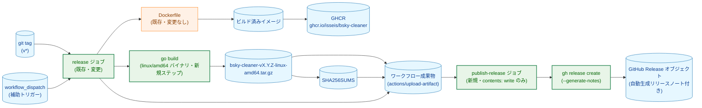
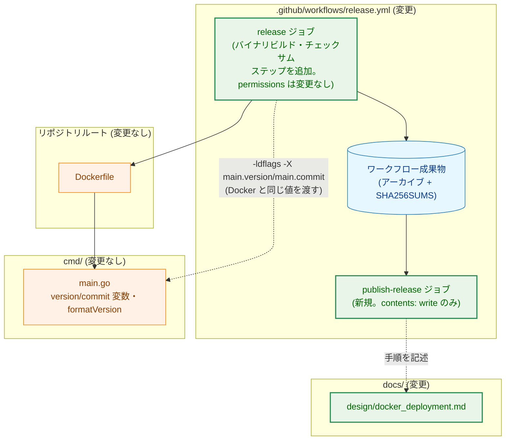
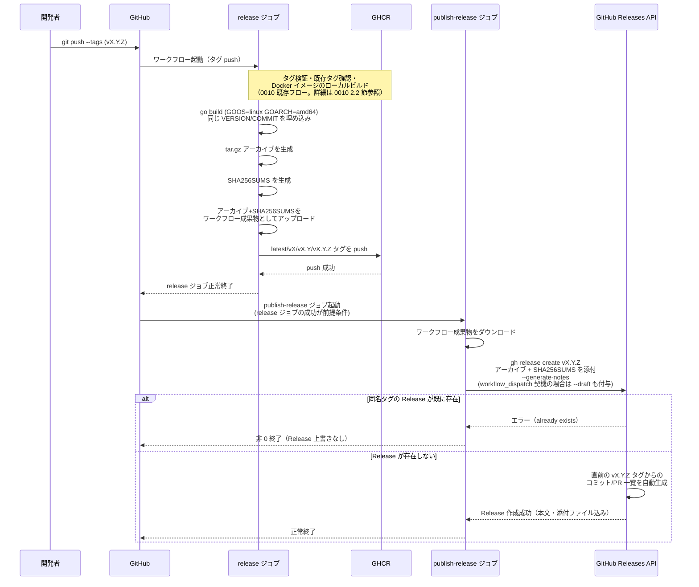
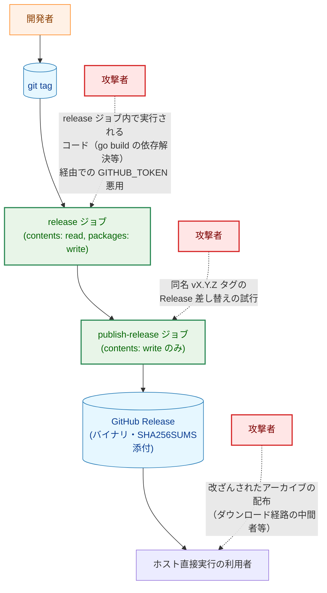

# GitHub Release へのバイナリ添付とリリースノート自動生成 — アーキテクチャ設計書

## Document Status

| Item | Value |
|---|---|
| Status | `draft` |
| Created | 2026-07-08 |
| Review date | - |
| Reviewer | - |
| Comments | - |

関連ドキュメント: [要件定義書](01_requirements.md)、[0010 アーキテクチャ設計書](../0010_docker_image_release/02_architecture.md)

## 1. 設計の全体像

### 1.1 設計原則

- **fail-closed**: 既に同名タグの GitHub Release が存在する場合、ワークフローは上書きせず非 0 で終了する（AC-07）。
- **既存資産の再利用**: [0010_docker_image_release](../0010_docker_image_release/02_architecture.md) で導入済みの `release.yml`（タグ解決・semver 検証・既存タグ確認・`concurrency` によるレース防止・順序付き GHCR push）と、`cmd/main.go` の `version`/`commit` ビルド時変数・`formatVersion` をそのまま再利用する。バージョン埋め込みの仕組み自体（`-ldflags -X main.version=... -X main.commit=...`）を新設せず、Docker イメージのビルドに使っているのと同じ `VERSION`/`COMMIT` の値をバイナリビルドにも渡す。
- **確立された挙動の活用（YAGNI）**: GitHub Release の重複作成防止（AC-07）は `gh release create` が同名タグの Release に対して既にエラーを返す既存動作をそのまま利用し、Docker の既存タグ確認（`docker manifest inspect` + `check-existing-tag.sh`）のような専用の事前チェックスクリプトを新設しない。同様に、リリースノート生成も GitHub 標準の `--generate-notes` 機能をそのまま使い、PR ラベルに基づくセクション分割等の独自ロジックは追加しない（要件定義書 2章 Out of Scope）。
- **ジョブ分割によるトークン権限の最小化**: 既存の `release.yml` は単一ジョブで完結しており、ジョブ全体に対して `permissions` が宣言される。本タスクで `contents: write` を追加する必要があるのは GitHub Release 作成ステップのみである。しかし単一ジョブのまま追加すると、同じジョブ内で実行される他のすべてのステップ（Docker イメージビルド、`go build` によるバイナリビルドとその依存モジュール解決など、外部コードが実行されうる箇所を含む）が、`contents: write`（リポジトリへの push・タグ付け替え・ブランチ操作の権限）を帯びたトークンに常時アクセスできる状態になってしまう。これは `packages: write` が対象とする「レジストリへの公開権限」より広い権限であり、本タスクが持ち込む新たなリスクである。そのため本設計では、既存の単一ジョブ（`release`）はこれまで通り `contents: read, packages: write` のまま変更せず、GitHub Release 作成のみを行う後続ジョブ（`publish-release`）を新設して `contents: write` はそちらにのみ与える（3.2.1, 5.2）。
- **外部依存最小化（CI ワークフロー観点）**: バイナリビルドには Go ツールチェーンが必要なため `actions/setup-go` を追加するが、これは `packages: write`／`contents: write` のいずれも直接行使する action ではなく、[0010 の判断基準](../0010_docker_image_release/02_architecture.md)（書き込み権限を持つ action のみコミット SHA 固定を必須とする）に照らして、既存の `ci.yml` と同じタグ参照（`actions/setup-go@v6`）のままでよい。GitHub Release の作成・アセット添付は追加の marketplace action を使わず、ランナーに標準搭載された `gh` CLI で行う。
- **公開前の安全な検証手段の確保**: `gh release create` は実行すると即座に公開状態の Release を作成する。`workflow_dispatch` による動作確認のたびに本物の公開 Release を作成すると、Release 一覧が検証用のノイズで汚染される。本設計では `workflow_dispatch` 契機の実行にのみ `--draft` を付与し、`push`（タグ push）契機の本番リリースはこれまで通り公開状態で作成する（3.2.3）。

### 1.2 概念モデル

本タスクが `release.yml` に追加する構成要素と、0010 で導入済みの既存構成要素との関係を示す。`release` ジョブと `publish-release` ジョブの分割は本タスクで新設する構造であり、ジョブ内の各ステップは 2.1 節・3.1 節で詳述する。



矢印 A → B は「A の完了・成立が B の実行契機になる／A の出力が B の入力になる」ことを表す。緑色のノードは本タスクで追加・変更される要素、橙色は既存のまま変更されない要素、青色は静的データ・成果物である。

**凡例**:

| クラス | 意味 |
|---|---|
| `data`（青） | git タグ・ビルド成果物・レジストリ・ワークフロー成果物・Release オブジェクトなどの静的データ |
| `process`（橙） | 既存のまま変更されないコンポーネント |
| `enhanced`（緑） | 本タスクで追加・変更されるコンポーネント |

### 1.3 要件との対応

| 要件 | 対応する設計要素 |
|---|---|
| F-001 (AC-01〜02) | `release` ジョブへのバイナリビルド・アーカイブ生成ステップ追加（3.2.1） |
| F-002 (AC-03〜04) | `release` ジョブへのチェックサム生成ステップ追加（3.2.1） |
| F-003 (AC-05〜07) | 新設する `publish-release` ジョブでの GitHub Release 作成（3.2.3） |
| F-004 (AC-08〜09) | `gh release create --generate-notes` の利用（3.2.3） |
| F-005 (AC-10) | [Docker 配布の詳細設計](../../design/docker_deployment.md) への追記（3.2.4） |
| NF-001 | 専用の設計要素なし。既存の `make fmt`/`make test`/`make lint` で検証する |
| NF-002 | 本タスクは既存の `release` ジョブの Docker ビルド・push ステップの内容・順序を変更しないため、0010 の既存 AC の挙動は変わらない（4.1 節参照） |
| NF-003 | ワークフロー全体としては `GITHUB_TOKEN` のみを用いる。`release` ジョブの `permissions`（`contents: read, packages: write`）は変更せず、`contents: write` は新設する `publish-release` ジョブにのみ与える（3.1, 5.2） |

## 2. システム構成

### 2.1 コンポーネント配置



矢印 A → B は「A が B に依存する／A が B を呼び出す」ことを、点線矢印は「実行時に値を渡す関係、またはドキュメント上の参照関係（依存や呼び出しではない）」を表す。

**凡例**:

| クラス | 意味 |
|---|---|
| `enhanced`（緑） | 本タスクで追加・変更されるコンポーネント |
| `process`（橙） | 既存のまま変更されないコンポーネント |
| `data`（青） | 静的データ・ワークフロー成果物 |

### 2.2 リリース公開のデータフロー

0010 で確立済みのタグ検証〜Docker イメージ push までの流れ（[0010 アーキテクチャ設計書 2.2 節](../0010_docker_image_release/02_architecture.md)参照）に、本タスクが追加するバイナリビルド〜GitHub Release 作成までの流れを組み込んだ全体シーケンスを示す。バイナリビルド・アーカイブ・チェックサム生成は、**Docker イメージの4タグ push より前**（ローカルイメージビルド直後）に実行する。これにより、バイナリビルドが失敗した場合に Docker イメージが一切 push されていない状態を保証できる（4.1 節）。



`workflow_dispatch` 契機の実行では `bootstrap_first_release` 入力（0010 で既に導入済み、既存タグ確認をスキップする補助フラグ）が使われる場合があるが、これは `release` ジョブ内の Docker タグ確認ステップのみに影響する入力であり、本タスクで追加するバイナリビルド・Release 作成のステップの挙動には影響しない。

## 3. コンポーネント設計

### 3.1 コンポーネント責任一覧

| ファイル | 変更種別 | 責任 |
|---|---|---|
| `.github/workflows/release.yml` | 変更 | **`release` ジョブ**（既存、`permissions: contents: read, packages: write` は変更なし）: 既存の Docker イメージビルド・push フローに加え、`linux/amd64` バイナリのビルド・tar.gz アーカイブ生成・`SHA256SUMS` 生成を行い、ワークフロー成果物としてアップロードする。**`publish-release` ジョブ**（新規、`permissions: contents: write` のみ、`needs: release`）: ワークフロー成果物をダウンロードし、GitHub Release を作成してアセットを添付し、リリースノートを自動生成する |
| `docs/design/docker_deployment.md` | 変更 | 「リリース公開手順（開発者向け）」に GitHub Release とバイナリ添付に関する記述を追記する |

本タスクは Go ソースコード（`cmd/main.go` 等）に変更を加えないため、影響を受ける既存の `*_test.go` はない。バイナリビルドが利用する `version`/`commit`/`formatVersion` は 0010 で導入済みのまま変更しない。現行の `release.yml` の `permissions`（ワークフロー宣言）を直接検証する既存の静的テストは存在しないため、本タスクによる変更で更新が必要な既存テストはない。

### 3.2 各コンポーネントの設計

#### 3.2.1 バイナリビルドとアーカイブ生成（AC-01〜02, `release` ジョブ）

既存の「Build image」ステップ（Docker イメージのローカルビルド。`push: false, load: true`）の**直後、Docker イメージの4タグ push（`latest`/`vX`/`vX.Y`/`vX.Y.Z`）より前**に、以下を行う新規ステップを追加する。

- `actions/setup-go@v6` を用いて Go ツールチェーンをセットアップする。バージョン解決には `go-version-file: go.mod` を指定し、Docker イメージ側のビルドステージ（digest 固定のベースイメージに同梱された Go バージョン）とは独立に、リポジトリの `go.mod` を単一の情報源とする。両者の Go バージョンが完全に一致することまでは保証しないが、少なくともバイナリ側は `go.mod` の宣言と常に整合する。
- `GOOS=linux GOARCH=amd64 go build -ldflags "-X main.version=${VERSION} -X main.commit=${COMMIT}" -o dist/bsky-cleaner ./cmd`
  - `${VERSION}`/`${COMMIT}` は既存の `steps.resolve-tag.outputs.resolved_tag`／`steps.short-sha.outputs.sha`（Docker イメージビルドの `--build-arg` に渡しているのと同じ値）をそのまま参照する。これにより AC-02（アーカイブ内バイナリと GHCR 上の Docker イメージ内バイナリが同一の `vX.Y.Z (短縮コミットSHA)` を `--version` で出力すること）を、値の一元管理によって保証する。
  - 出力先を `dist/` とし、`make build`/`Makefile` が使うローカル開発用の `build/`（`.gitignore` 対象）とは別のディレクトリにする。CI 専用の一時的なビルド成果物を開発者のローカルビルド出力と混同しないための区別であり、両者に機能的な違いはない。
- `tar czf dist/bsky-cleaner-${TAG}-linux-amd64.tar.gz -C dist bsky-cleaner`（AC-01）

`GOOS=linux GOARCH=amd64` を明示するのは、将来 `ubuntu-latest` ランナーのアーキテクチャが変わった場合でも生成物のアーキテクチャを固定するためである（現在の `ubuntu-latest` は `linux/amd64` であり、クロスコンパイルの実体を伴わない）。

**このステップの配置がもたらす性質**: バイナリビルド・アーカイブ生成をこの位置（Docker ローカルビルド後・push 前）に置くことで、`go build` やアーカイブ生成が失敗した場合、Docker イメージはまだ1つも GHCR に push されていない状態でワークフローが終了する。これにより 4.1 節で扱う失敗時の状態がシンプルになる（「Docker が一部だけ公開され、バイナリだけ失敗する」という中間状態が生じない）。

**タイムアウト**: `release` ジョブの既存の `timeout-minutes: 15`（[0010 3.2.1](../0010_docker_image_release/02_architecture.md)）は変更しない。追加するステップ（Go セットアップ・バイナリビルド・アーカイブ・チェックサム生成・成果物アップロード）は、Docker イメージのビルドに比べて所要時間が短く、既存の余裕の範囲に収まる想定である。`publish-release` ジョブは新設のため、独立した `timeout-minutes`（目安 5 分。成果物ダウンロードと `gh release create` のみで完結する軽量なジョブのため）を設定する（3.2.3）。

#### 3.2.2 チェックサムファイルの生成とワークフロー成果物化（AC-03〜04, `release` ジョブ）

アーカイブ生成の直後に、同じ `dist/` ディレクトリ内で次を実行する。

```sh
cd dist && sha256sum bsky-cleaner-${TAG}-linux-amd64.tar.gz > SHA256SUMS
```

`sha256sum` はチェックサムファイルにアーカイブと同じ相対パスを記録するため、利用者がアーカイブと `SHA256SUMS` を同じディレクトリに配置して `sha256sum -c SHA256SUMS` を実行すれば検証できる（AC-04）。

続けて `dist/` 配下のアーカイブと `SHA256SUMS` を `actions/upload-artifact` でワークフロー成果物としてアップロードする。これは 3.2.3 の `publish-release` ジョブが同じファイルを利用するために必要である（ジョブをまたいでファイルを受け渡す標準的な手段であり、GHCR や Release とは異なる一時的なストレージであるため、`contents: write` のような追加権限を必要としない）。

#### 3.2.3 GitHub Release の作成とアセット添付・リリースノート自動生成（AC-05〜09, 新設 `publish-release` ジョブ）

`release` ジョブの成功を前提条件（`needs: release`）とする新設ジョブ `publish-release` を追加する。このジョブの `permissions` は `contents: write` のみとし、`packages: write` は宣言しない（GHCR への操作を行わないため）。`timeout-minutes` は 5 分程度を目安に設定する（3.2.1）。

処理内容:

1. `actions/download-artifact` で 3.2.2 のアーカイブと `SHA256SUMS` を取得する。
2. 次を実行する。

```sh
gh release create "${TAG}" \
  dist/bsky-cleaner-${TAG}-linux-amd64.tar.gz \
  dist/SHA256SUMS \
  --title "${TAG}" \
  --generate-notes \
  ${DRAFT_FLAG}
```

- **Release 作成契機と添付（AC-05〜06）**: `gh release create` は指定タグに対する Release オブジェクトを作成し、後続の引数に列挙したファイルをアセットとして同時にアップロードする。追加の `gh release upload` ステップを要しない。
- **重複防止（AC-07, fail-closed）**: `gh release create` は、指定タグに対する Release が既に存在する場合エラーを返し非 0 終了する（GitHub CLI の既存動作）。本設計はこの動作をそのまま利用し、Docker の既存タグ確認（[0010 3.2.2](../0010_docker_image_release/02_architecture.md)）のような事前チェックスクリプトを新設しない（1.1 節「確立された挙動の活用」参照）。
- **`--draft` によるテスト時の安全性確保**: `${DRAFT_FLAG}` は `workflow_dispatch` 契機の実行時にのみ `--draft` を展開し、`push`（タグ push）契機の本番実行では空文字列（公開状態のまま作成）とする。`gh release create` は一度実行すると即座に公開 Release を作成してしまうため、動作確認のたびに本番の Release 一覧を検証用のエントリで汚染することを避ける。ドラフト作成後、動作確認が完了すれば `gh release delete` で削除するか、実際に公開したい場合は `gh release edit --draft=false` で明示的に昇格させる。
- **リリースノート自動生成（AC-08〜09）**: `--generate-notes` は GitHub 標準の生成機能を呼び出し、直前の `vX.Y.Z` タグ（GitHub が Release 一覧から自動検出する）からのコミット・PR の一覧を本文として生成する。
  - **AC-09（初回リリース）に関する未検証リスク**: GitHub の公式ドキュメント（Automatically generated release notes）は、比較対象タグの選択が任意であることを述べているのみで、比較対象が一件も存在しない場合（初回リリース）の具体的な生成内容やエラーの有無を明記していない。本設計はこの場合でも動作しエラーにならないことを前提としているが、これは実機検証済みの事実ではなく、ドキュメントの記載から推測した未検証の前提である。実装フェーズの `workflow_dispatch`（`--draft` 付き）による動作確認（8節フェーズ4）で、比較対象タグが存在しない状態を意図的に作って実際の挙動を確認し、想定と異なる場合（エラーになる、本文が極端に短い等）はここで設計を見直す。
- **本文サイズ・生成時間**: 本プロジェクトの規模（コミット数・PR数）では、GitHub の Release 本文サイズ上限や生成時間が問題になるとは考えにくく、本設計では専用の対策を設けない。将来コミット履歴が大きく増えた場合に生成が遅延・失敗する可能性はあるが、9節の拡張候補として扱う。

#### 3.2.4 ドキュメント整備（AC-10）

[Docker 配布の詳細設計](../../design/docker_deployment.md) の「リリース公開手順（開発者向け）」節に、`.github/workflows/release.yml` が自動的に行う処理の説明に、次を追記する。

- バイナリアーカイブ（`bsky-cleaner-vX.Y.Z-linux-amd64.tar.gz`）と `SHA256SUMS` を添付した GitHub Release が作成されること
- `sha256sum -c SHA256SUMS` によるダウンロード後の検証手順
- Release 本文が GitHub 標準の自動生成リリースノートであること
- `workflow_dispatch` による動作確認では Release がドラフトとして作成されること、確認後は削除するか明示的に公開する必要があること

## 4. エラーハンドリング設計

### 4.1 `release.yml` のエラー分類（本タスクで追加する部分）

既存のエラー分類（[0010 4.1 節](../0010_docker_image_release/02_architecture.md)）に、本タスクで追加するステップの失敗パターンを追記する。3.2.1 で述べた通り、バイナリビルド・アーカイブ・チェックサム生成は Docker イメージの push より前に実行されるため、これらの失敗時には Docker イメージはまだ1つも push されていない。

| 失敗箇所 | 挙動 | 公開への影響 |
|---|---|---|
| バイナリビルド失敗（`go build`） | `release` ジョブが非 0 終了 | Docker イメージは push 前のため、公開なし |
| アーカイブ／チェックサム生成失敗 | `release` ジョブが非 0 終了 | 同上。公開なし |
| ワークフロー成果物のアップロード失敗 | `release` ジョブが非 0 終了 | 同上。公開なし。`publish-release` ジョブは `needs: release` により実行されない |
| GitHub Release 作成時、同名タグの Release が既に存在（AC-07） | `publish-release` ジョブで `gh release create` が非 0 終了 | Docker イメージは `release` ジョブの成功時点で既に4タグとも push 済みの状態で残る。Release は上書きされない |
| GitHub Release 作成時のアセットアップロード失敗（ネットワーク不調等） | `publish-release` ジョブで `gh release create` が非 0 終了 | Release オブジェクト自体は作成され、アセットの一部のみ添付された不完全な状態になり得る。運用者は `gh release view <tag>` で添付状況を確認し、必要なら `gh release upload` で不足分を追加した上で復旧する |

**Docker 公開と Release 作成の間の不整合ウィンドウ**: `publish-release` ジョブは `release` ジョブの成功後に実行されるため、`release` ジョブが成功した（＝ Docker イメージが4タグとも push 済み）にもかかわらず `publish-release` ジョブが失敗すると、「Docker イメージは公開済みだが GitHub Release は存在しない」という一時的な不整合状態が生じる。

- **推奨する復旧方法**: 運用者が `gh release create` を手動実行して Release を作成する。このとき、`release` ジョブが生成したアーカイブ・`SHA256SUMS`（ワークフロー成果物からダウンロードできる）をそのまま使う。
- **推奨しない復旧方法**: ワークフロー全体（`git push --tags` の再実行や `workflow_dispatch` での再実行）を再度行うことは推奨しない。`release` ジョブの既存タグ確認（[0010 3.2.2](../0010_docker_image_release/02_architecture.md)）は `vX.Y.Z` タグが既に GHCR に存在することを検出して非 0 終了するため、`publish-release` ジョブまで到達できない。GHCR 上のタグを削除してからワークフロー全体を再実行する方法は、**イメージ内容が元の push と完全に同一であることを運用者が確認できる場合を除き、行わない**こと。この操作は、0010 で確立した「同一バージョン番号で内容の異なるイメージの黙った再公開を防ぐ」という既存タグ保護（AC-03a）を意図的に迂回する行為に等しく、安易な復旧手段として選んではならない。
- **「Re-run failed jobs」ボタンは使わない**: GitHub Actions の「Re-run failed jobs」は、失敗したステップだけをやり直すのではなく、失敗した `publish-release` ジョブ全体を最初から再実行しようとする。しかし `publish-release` ジョブ自体に失敗の直接原因（同名 Release の存在等）が残っている限り同じ理由で再度失敗するだけであり、根本原因の解消にはならない。運用者はこのボタンに頼らず、上記の手動復旧手順に従う。

### 4.2 その他

`go build`／`sha256sum`／`gh release create` はいずれも標準のコマンド終了コードに従うため、専用のエラー型・エラーハンドリング関数は導入しない。

## 5. セキュリティ考慮事項

### 5.1 脅威モデル



矢印 A → B はデータ・制御の流れを表す。点線矢印 A -.-> B は脅威（攻撃経路）を表す。

**凡例**:

| クラス | 意味 |
|---|---|
| `data`（青） | 静的データ |
| `process`（橙） | 既存のまま変更しないコンポーネント |
| `enhanced`（緑） | 本タスクで追加・変更されるコンポーネント |
| `problem`（赤） | 脅威（攻撃者・攻撃経路） |

### 5.2 脅威と対策

| 脅威 | 対策 | 対応 AC |
|---|---|---|
| 同名タグの GitHub Release の黙った差し替え | `gh release create` の既存動作により、同名タグの Release が既に存在する場合は非 0 終了し上書きしない | AC-07 |
| `contents: write` 権限を持つジョブ内で、無関係なステップ（Docker ビルド・`go build` の依存モジュール解決等）が同じトークンにアクセスできてしまう権限範囲の肥大化 | `contents: write` を単一ジョブ全体に追加するのではなく、GitHub Release 作成のみを行う `publish-release` ジョブを新設してそちらにのみ与える。既存の `release` ジョブの `permissions`（`contents: read, packages: write`）は変更しない。両ジョブとも `packages: write` と `contents: write` を同時に持つことはない | NF-003 |
| バイナリビルドに追加した `actions/setup-go` の改ざん・サプライチェーン攻撃 | `packages: write`／`contents: write` のいずれも直接行使しない、既存の `ci.yml` と同じタグ参照（`actions/setup-go@v6`）を用いる。[0010 の判断基準](../0010_docker_image_release/02_architecture.md)（書き込み権限を持つ action のみコミット SHA 固定を必須とする）に照らし、コミット SHA 固定の対象外として扱う | NF-003 |
| `gh release create --generate-notes` が即座に公開状態の Release を作成してしまい、動作確認のたびに本番の Release 一覧が検証用エントリで汚染される、または生成された本文を人が確認しないまま公開される | `workflow_dispatch` 契機の実行にのみ `--draft` を付与し、ドラフト状態での確認を可能にする（3.2.3） | AC-05, AC-08 |
| ダウンロードしたアーカイブの改ざん（配布経路上の中間者等） | `SHA256SUMS` による整合性検証手段を提供する（AC-03〜04）。ただし `SHA256SUMS` 自体は GitHub Release 上の別アセットであり、GitHub Release ページ自体が改ざんされた場合の防御にはならない。イメージ署名/SBOM 相当の暗号学的な出所証明（例: `cosign` 署名）は要件定義書のスコープ外であり、本設計でも導入しない（[0010 と同じスコープ外判断を踏襲](../0010_docker_image_release/02_architecture.md)） | AC-03, AC-04 |
| リリースノート自動生成に外部から注入されたコミットメッセージ・PR タイトルが含まれ、Release 本文に不適切な内容が混入する | GitHub 標準の `--generate-notes` 機能に処理を委譲しており、本タスク独自のサニタイズ処理は追加しない。コミットメッセージ・PR タイトル自体は既存のブランチ保護・レビュープロセスの管理下にあり、本タスクが新たに導入するリスクではない | N/A |

既存の 0010 の脅威（不正な形式のタグ、GHCR タグの黙った再公開、`docker/login-action`／`docker/build-push-action` の改ざん等）への対策は変更しない。

## 6. 処理フロー詳細

`release.yml` 全体のシーケンスは 2.2 節を参照。Docker イメージビルド・push までの詳細フローは変更されないため [0010 アーキテクチャ設計書 2.2 節](../0010_docker_image_release/02_architecture.md)を参照する。

## 7. テスト戦略

### 7.1 テスト対象

本タスクは Go ソースコードに変更を加えないため、ユニットテストは追加しない。すべての受け入れ基準はワークフロー静的検証および実タグでの手動検証で確認する。

| テスト分類 | テスト対象 | 検証する AC |
|---|---|---|
| ワークフロー静的検証 | `release` ジョブにバイナリビルド・アーカイブ生成ステップが定義されていること（`GOOS=linux GOARCH=amd64`、`-ldflags` に `resolve-tag`/`short-sha` の出力を使用）、かつ Docker push ステップより前に配置されていること | AC-01 |
| ワークフロー静的検証 | `release` ジョブにチェックサム生成ステップ（`sha256sum`）とワークフロー成果物アップロードステップが定義されていること | AC-03 |
| ワークフロー静的検証 | `publish-release` ジョブが `needs: release` を持ち、`permissions: contents: write` のみを宣言し、`gh release create` が `--generate-notes` 付きで定義されていること | AC-05, AC-06, AC-08 |
| ワークフロー静的検証 | `release` ジョブの `permissions` が変更されておらず（`contents: read, packages: write`）、`contents: write` は `publish-release` ジョブにのみ存在すること | NF-003 |
| 手動検証（実タグ push） | ワークフロー実行後に生成されたアーカイブ内バイナリの `--version` 出力が GHCR 上の Docker イメージと一致すること | AC-02 |
| 手動検証（実タグ push） | アーカイブと同じディレクトリで `sha256sum -c SHA256SUMS` が成功すること | AC-04 |
| 手動検証（実タグ push） | `gh release view <tag>` で Release が取得でき、アーカイブと `SHA256SUMS` が添付ファイルに含まれること | AC-05, AC-06 |
| 手動検証（`workflow_dispatch`、既存タグ再指定） | 既に Release が存在するタグを指定した再実行が非 0 終了し、Release が上書きされないこと | AC-07 |
| 手動検証（`workflow_dispatch`、`--draft` 付き） | 比較対象となる過去タグが存在しない状態で `gh release create --generate-notes --draft` を実行し、エラーにならず本文が生成されることを実機で確認する。3.2.3 の未検証リスクの解消を兼ねる | AC-09 |
| 静的検証 | `docs/design/docker_deployment.md` に GitHub Release・バイナリ添付・チェックサム検証手順・`--draft` の扱いの記述が追記されていること | AC-10 |

### 7.2 既存テストへの影響

- `cmd/main_test.go`: 本タスクは `cmd/main.go` に変更を加えないため非影響。
- `.github/workflows/ci.yml`: 変更しない。
- `release.yml` の `permissions`（ワークフロー宣言）を直接検証する既存の静的テスト・CI チェックは存在しないため、本タスクの `publish-release` ジョブ新設・権限分割による既存テストへの影響はない。
- [0010](../0010_docker_image_release/02_architecture.md) が導入した Docker イメージビルド・push のロジック・ステップ順序（`release` ジョブ内、`permissions` も含む）は変更しないため、0010 の既存の手動検証項目（AC-01〜AC-22 相当）は非影響（NF-002）。

## 8. 実装優先順位

### フェーズ 1: バイナリビルドとアーカイブ生成

1. `release` ジョブに `actions/setup-go@v6`（`go-version-file: go.mod`）セットアップステップを追加
2. 「Build image」ステップの直後・Docker push ステップの前に `GOOS=linux GOARCH=amd64 go build` によるバイナリビルドステップを追加（既存の `resolve-tag`/`short-sha` の出力を再利用）
3. tar.gz アーカイブ生成ステップを追加

### フェーズ 2: チェックサム生成とジョブ間受け渡し

4. `SHA256SUMS` 生成ステップを追加
5. `actions/upload-artifact` によるワークフロー成果物アップロードステップを追加

### フェーズ 3: GitHub Release 作成ジョブの新設

6. `publish-release` ジョブ（`needs: release`、`permissions: contents: write` のみ）を新設し、`actions/download-artifact` でアーカイブ・`SHA256SUMS` を取得
7. `gh release create --generate-notes` ステップを追加（`workflow_dispatch` 契機時のみ `--draft` を付与）

### フェーズ 4: 検証とドキュメント整備

8. `workflow_dispatch`（`--draft` 付き）による動作確認。比較対象タグが存在しない状態を意図的に作り、AC-09 の未検証リスクを実機で解消する
9. 既存タグ再指定時の fail-closed 動作の手動確認
10. [Docker 配布の詳細設計](../../design/docker_deployment.md) への追記

## 9. 将来の拡張性

- **macOS/Windows バイナリの提供**: 本タスクでは `linux/amd64` のみを対象とする（要件定義書 Out of Scope）。将来必要になった場合、バイナリビルドステップを OS/アーキテクチャごとにマトリクス化し、アーカイブ名のサフィックスを変えて `gh release create` に渡すファイル一覧を増やす形で拡張できる。
- **PR ラベルに基づくリリースノートのカテゴリ分け**: 本タスクのスコープ外（要件定義書 Out of Scope）。将来必要になった場合、`.github/release.yml` の追加と `gh release create --generate-notes` の設定でカテゴリ分けを有効化できる。既存の `--generate-notes` 呼び出し自体を置き換える必要はない。
- **イメージ署名・SBOM・バイナリの暗号学的署名**: 本タスクのスコープ外（要件定義書 Out of Scope、[0010 の既存スコープ外判断](../0010_docker_image_release/02_architecture.md)を踏襲）。将来必要になった場合、`publish-release` ジョブの後段に `cosign` 等による署名ステップを独立して追加できる。
- **Release 作成のみの独立した再試行**: 4.1 節で述べた「Docker push は成功したが Release 作成が失敗する」不整合ウィンドウの発生頻度が実運用上高いと判明した場合、`publish-release` ジョブを `workflow_dispatch` から単独で再実行できるトリガー（例: 対象タグとアーカイブの参照方法を入力させる）を追加する拡張余地がある。
- **リリースノート本文サイズ・生成時間の上限対応**: 3.2.3 で述べた通り、現状の規模では専用の対策を設けていない。将来コミット履歴が大幅に増加した場合、GitHub の Release 本文サイズ上限に抵触する可能性があり、その場合は生成後の本文サイズを検証し、超過時に警告する仕組みの追加を検討する。

## 付録 A: 決定履歴

> 本タスクは 0010 で確立した GHCR 公開ワークフロー（`release.yml`）の上に「GitHub Release オブジェクトの作成・バイナリ添付・リリースノート自動生成」を追加するものであり、0010 の設計判断（タグ検証・既存タグ確認・`concurrency` によるレース防止・順序付き GHCR push・`docker/login-action`/`docker/build-push-action` のコミット SHA 固定）を置き換えるものではない。以下は本タスクで新たに行った決定である。
>
> - **GitHub Release の重複防止に専用チェックスクリプトを追加しない**: `gh release create` が同名タグの Release に対して既にエラーを返す既存動作をそのまま利用する。Docker の既存タグ確認（`docker manifest inspect` + `check-existing-tag.sh`）は「不在」と「問い合わせ失敗」を区別する必要があったのに対し、`gh release create` の失敗はそのままエラー終了として扱ってよく、同等の区別ロジックを必要としない（3.2.3）。
> - **バイナリビルド・アーカイブ生成を Docker push より前に配置**: レビューにより、当初案（Docker push 後にバイナリビルドを配置）では失敗パターンが複雑になり、かつ設計書内の記述（3.2.1 の説明と 2.2/4.1 の記述）が矛盾していたと指摘された。バイナリビルドを Docker のローカルビルド直後・push 前に配置することで、バイナリビルド失敗時に Docker イメージが一切 push されない、より単純な失敗状態に修正した（3.2.1, 4.1）。
> - **`release.yml` を `release`/`publish-release` の2ジョブに分割**: レビューにより、`contents: write` を単一ジョブ全体に追加すると、Docker ビルドや `go build` の依存解決など無関係なステップまでもがその権限を帯びたトークンにアクセスできてしまい、0010 が確立した「必要な権限だけを与える」という方針からの後退になると指摘された。GitHub Release 作成のみを行う `publish-release` ジョブを新設し、`contents: write` はそちらにのみ与える設計に修正した（1.1, 3.2.3, 5.2）。
> - **`workflow_dispatch` 実行時のみ `--draft` を付与**: レビューにより、`gh release create` が即座に公開状態の Release を作成するため、動作確認のたびに本番の Release 一覧が検証用エントリで汚染されると指摘された。`workflow_dispatch` 契機の実行にのみ `--draft` を付与する設計に修正した（1.1, 3.2.3）。
> - **AC-09（初回リリース時のリリースノート自動生成）を未検証リスクとして明記**: レビューにより、GitHub の公式ドキュメントは比較対象タグがない場合の具体的な挙動を明記しておらず、当初案はこれを実証済みの事実であるかのように記述していたと指摘された。ドキュメントで確認できる範囲（比較対象タグの選択は任意）とそれ以上の未検証部分を明確に区別し、実装フェーズの `workflow_dispatch`（`--draft` 付き）での実機確認により解消する計画を明記した（3.2.3, 8節）。
> - **Docker タグ削除による復旧を推奨手順から除外**: レビューにより、当初案が「GHCR タグを削除してワークフロー全体を再実行する」ことを他の復旧手段と並列に提示しており、これは 0010 が確立した既存タグ保護（AC-03a）を運用者自身が迂回する行為に等しいと指摘された。この手順は「イメージ内容が完全に同一であることを確認できる場合を除き行わない」という明示的な注意喚起に変更した（4.1）。
> - **`actions/setup-go` はコミット SHA 固定の対象外とした**: 0010 で確立した「書き込み権限を持つ action のみ固定必須」という判断基準をそのまま適用し、`packages: write`／`contents: write` を行使しない `setup-go` は `ci.yml` と同じタグ参照のままとした。ただし `go-version-file: go.mod` を指定し、Go バージョン解決の一貫性は高めた（3.2.1, 5.2）。
