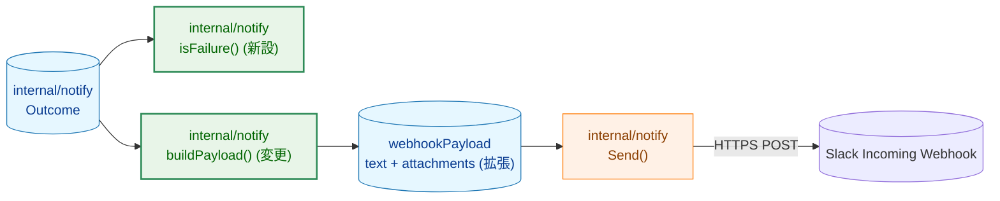
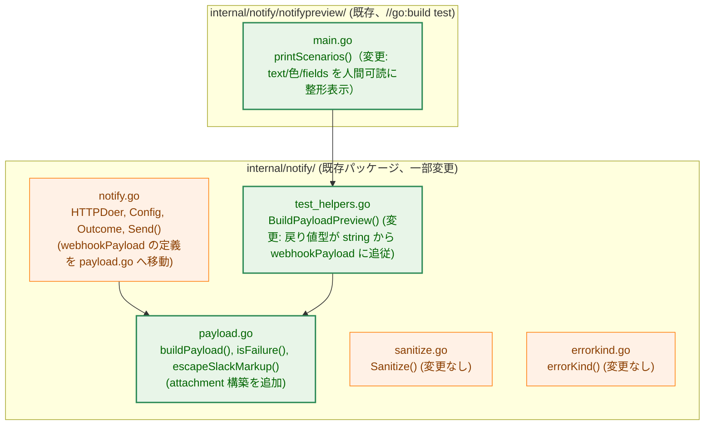
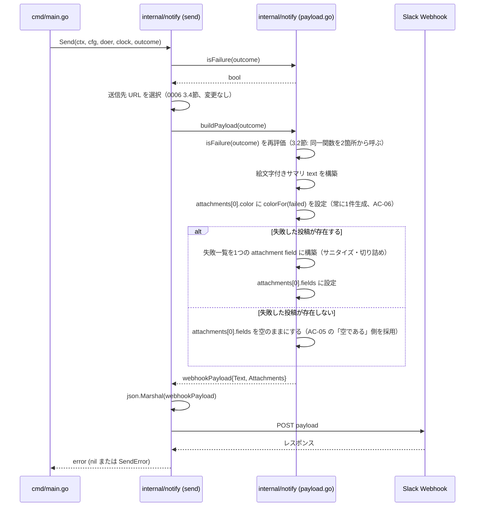
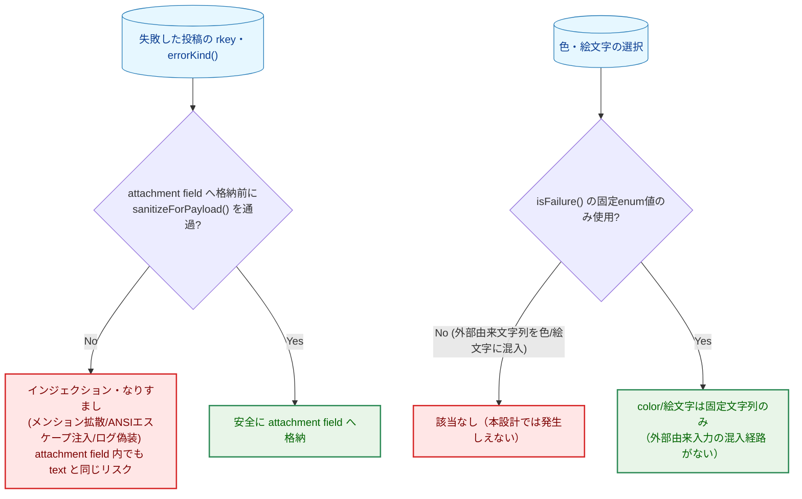

# Slack 通知リッチフォーマット — アーキテクチャ設計書

## Document Status

| Item | Value |
|---|---|
| Status | `approved` |
| Created | 2026-07-09 |
| Review date | 2026-07-09 |
| Reviewer | isseis |
| Comments | - |

関連ドキュメント: [要件定義書](01_requirements.md)

## 1. 設計の全体像

### 1.1 設計原則

- **既存コンポーネントの再利用**: [0006_slack_notification](../0006_slack_notification/02_architecture.md) が確立した `internal/notify` の型（`HTTPDoer`/`Config`/`Outcome`/`Send`/`SendError`）、サニタイズ関数（`Sanitize`/`escapeSlackMarkup`/`sanitizeForPayload`）、エラー分類（`errorKind`）、チャンネル振り分けロジックはそのまま再利用し、変更しない。本タスクが変更するのは `payload.go` が構築するペイロードの**構造**（`{"text": "..."}` のみ → `text` + `attachments`）である。
- **単一責任の踏襲**: `internal/notify` は「`report.Result` を Slack ペイロードに変換し送信する」責務のみを持つ（0006 1.1節）。本タスクはこの責務の範囲内（ペイロードの見た目をリッチにする）であり、新規パッケージは導入しない。
- **YAGNI**: 要件定義書の Out of Scope（黄色/警告色、Run ID・Hostname トレーラフィールド、Block Kit `blocks`）は採用しない。Slack legacy attachments API（`attachments[].color` + `fields`）という、要求（色分け・サマリ/詳細分離）を過不足なく満たす最小の拡張にとどめる。
- **判定基準の単一化**: 「どちらのチャンネルに送るか」（0006 3.4節）と「どちらの色・絵文字にするか」（本タスク F-001・F-003）は、同一の判定関数から導出する（AC-08）。この判定は現在 `send()` 内にインライン展開されているブール式 `outcome.Err != nil || (outcome.Result != nil && len(outcome.Result.Failed) > 0)` を、`payload.go` に共有関数として抽出することで実現する（3.2節）。

### 1.2 概念モデル



矢印 A → B は「A の処理結果・データが B の入力になる」ことを表す。`ISFAIL` と `BUILD` はいずれも `OUTCOME` を独立に受け取る。`BUILD`（`buildPayload`）が `ISFAIL`（`isFailure`）の戻り値をパラメータとして受け取るわけではない点に注意する（3.3節の通り、`buildPayload` は内部で `isFailure(outcome)` を自ら再度呼び出す）。

**Legend**

| 色 | 意味 |
|---|---|
| 青 (`data`) | データ（`Outcome` 入力、構築されるペイロード） |
| 橙 (`process`) | 既存コンポーネント（本タスクでは変更なし） |
| 緑 (`enhanced`) | 本タスクで変更・新設するロジック（いずれも `internal/notify` パッケージ内） |

## 2. システム構成

### 2.1 パッケージ構造

新規パッケージは導入しない。既存の `internal/notify` パッケージ内、`payload.go`（および `notify.go` の呼び出し側1行）のみを変更する。



矢印 A → B は「A が B の関数・型を呼び出す/参照する」ことを表す。

**Legend**

| 色 | 意味 |
|---|---|
| 橙 (`process`) | 既存コンポーネント（呼び出し関係の変更のみ、または変更なし） |
| 緑 (`enhanced`) | 本タスクでロジックを変更するファイル |

**新規・変更ファイル一覧**

| ファイル | 区分 | 内容 |
|---|---|---|
| `internal/notify/payload.go` | 変更 | `webhookPayload`/`slackAttachment`/`slackField` 型を追加（`notify.go` から移動・拡張）。`buildPayload()` の戻り値を `string` から `webhookPayload` に変更。`isFailure()`・色/絵文字選択・詳細フィールド構築を追加（3.2節・3.3節） |
| `internal/notify/notify.go` | 変更 | `webhookPayload` 型定義を削除（`payload.go` へ移動）。`send()` 内の `json.Marshal(webhookPayload{Text: buildPayload(outcome)})` を `json.Marshal(buildPayload(outcome))` に変更。`send()` 内のインライン `failed` 判定式を `isFailure(outcome)` 呼び出しに置き換える |
| `internal/notify/payload_test.go` | 変更 | 既存の文字列ベースのアサーションを `webhookPayload` のフィールドベースのアサーションに更新。新規ケース（色・絵文字・attachment 有無・`isFailure`）を追加 |
| `internal/notify/test_helpers.go` | 変更 | `BuildPayloadPreview` の戻り値型を `buildPayload` に追従させて `string` から `webhookPayload` に変更する（ラッパー自体のロジックは変わらない） |
| `internal/notify/notifypreview/main.go` | 変更 | `printScenarios()` を、`notify.BuildPayloadPreview()` が返す `webhookPayload` を人間可読な形（`text` + 色 + fields）に整形して表示するよう変更（3.5節） |
| `docs/dev/developer_guide/package_reference.md` | 変更 | `internal/notify` の説明にある「`text` field only」という記述を、`text` + `attachments`（色・絵文字付き）に更新する |

`internal/notify` 以外のパッケージ（`internal/report`・`internal/atproto`・`internal/retry`・`cmd/main.go`）への変更はない。`Outcome`/`Config`/`Send`/`SendError` のシグネチャも変更しない（0006 9節が意図した「将来のフォーマット変更は `payload.go` の内部実装のみで完結する」という設計がここで実際に成立することを確認する）。

### 2.2 データフロー



矢印 `->>` は同期呼び出し、`-->>` は戻り値を表す。0006 の 2.2節で定義済みの送信先選択・リトライ・エラーハンドリングの流れ（`Send` 呼び出しより前後の部分）は変更しないため、ここでは `buildPayload` 内部の新しい構築ステップのみを図示する。

**Legend**: このシーケンス図はメッセージ種別のみを表し、色分けは行わない。

## 3. コンポーネント設計

### 3.1 判定ロジックの共有化（`isFailure`）

現在 `send()`（`notify.go`）にインライン展開されている判定式を、`payload.go` に独立した関数として抽出する。

```go
// isFailure reports whether outcome represents a failed run: an error that
// aborted the run before completion, or a completed run with at least one
// delete failure. Both notify.go's destination-webhook selection (0006
// 3.4節) and payload.go's color/emoji selection (本タスク F-001・F-003) call
// this single function, so the two decisions cannot diverge (AC-08).
func isFailure(outcome Outcome) bool
```

`send()` は自前のブール式評価をこの呼び出しに置き換える。挙動は変更しない（既存のテスト `TestSend_*`（0006 で作成済み）が示す振る舞いを保つ、純粋なリファクタリング）。

### 3.2 ペイロード型の拡張（`payload.go`）

`webhookPayload` を `notify.go` から `payload.go` に移動し、Slack legacy attachments API のための型を追加する。

```go
// webhookPayload is the Slack Incoming Webhook request body. text carries
// the emoji-prefixed one-line summary (F-001, F-002); attachments always
// holds exactly one color-coded block (AC-06/AC-07), whose fields entry
// carries the failure detail only when outcome has at least one delete
// failure to report (AC-04/AC-05). Uses Slack's legacy attachments API
// (color + fields), not Block Kit (see 5.3節 for the compatibility
// rationale and 9節 for why Block Kit is deferred).
type webhookPayload struct {
    Text        string            `json:"text"`
    Attachments []slackAttachment `json:"attachments,omitempty"`
}

// slackAttachment is a single color-coded block. buildPayload always
// produces exactly one (color always applies -- AC-06/AC-07 require it
// regardless of whether there is failure detail to list); Slack's
// attachments array supports more, but nothing in scope needs a second one
// (YAGNI).
type slackAttachment struct {
    Color  string       `json:"color,omitempty"`
    Fields []slackField `json:"fields,omitempty"`
}

// slackField is a single title/value pair rendered inside an attachment.
// Short=false is always used (this design never needs Slack's two-column
// layout), so the field is omitted from the JSON tag set rather than
// exposed as a knob no caller varies.
type slackField struct {
    Title string `json:"title"`
    Value string `json:"value"`
}
```

`slackField` に `Short bool` フィールドを持たせない理由は付録の決定履歴を参照（YAGNI: 本タスクの `fields` は常に単一要素であり2列レイアウトを要しない）。

### 3.3 `buildPayload` の再設計

`buildPayload` の戻り値を `string` から `webhookPayload` に変更する。

```go
// buildPayload renders outcome as a Slack webhookPayload: an emoji-prefixed
// summary line (F-001, F-002) plus exactly one color-coded attachment
// (F-003, AC-06/AC-07) whose single field lists every failed post's rkey
// and error category, populated only when outcome has at least one delete
// failure to report (AC-04/AC-05). It includes only the run's outcome
// (success/failure), delete count, failed posts' rkeys, and error category
// text (errorKind) -- never post body content, which atproto.Post has no
// field for in the first place. outcome.Result may be nil (the run aborted
// before producing one, e.g. a login failure); this never panics, treating
// the delete count as 0 and rendering only outcome.Err's category. Both
// text and the failure-list field value are independently length-bounded
// (3.4節): unlike the pre-task version, text is not a fixed-length
// sentence -- the outcome.Err != nil branch embeds errorKind(outcome.Err),
// which can carry externally-sourced text of unbounded length (see 3.4節).
func buildPayload(outcome Outcome) webhookPayload
```

**構築手順**:
1. `failed := isFailure(outcome)`（3.1節）を評価する。
2. `text` を構築する: `failed` に応じた絵文字（`emojiSuccess = "✅"` / `emojiFailure = "❌"`）を先頭に付け、既存の `buildPayload`（変更前）が組み立てていたのと同じ一行サマリ文（`"bsky-cleaner run succeeded: deleted %d post(s)."` 等、0006 3.3節の分岐をそのまま踏襲）を続ける。このサマリ文からは失敗した投稿ごとの個別行（rkey・エラー種別）を除く（AC-03。従来はサマリ文の下に個別行を連結していたが、本タスクでその部分を attachment 側に移す）。構築した `text` に対して 3.4節の切り詰めを適用する。
3. `attachments` には常に1件、`slackAttachment{Color: colorFor(failed)}` を設定する（AC-06/AC-07）。これは失敗した投稿の有無によらない: `isFailure(outcome)` が `true` になるケースには、部分失敗（`Result.Failed` が1件以上）だけでなく「`Result.Failed` は0件だが `outcome.Err != nil`」（例: ログイン失敗などランを中断させたエラー）も含まれる（3.1節）ため、色付けは attachment の存在の有無ではなく、常に `failed` の値から決定する必要がある。
4. `outcome.Result != nil && len(outcome.Result.Failed) > 0` の場合のみ、失敗した投稿ごとに `sanitizeForPayload(rkey)`: `sanitizeForPayload(errorKind(err))` の行を改行区切りで連結したテキストを構築し、3.4節の切り詰めを適用したうえで、単一の `slackField{Title: "Failed posts", Value: <構築したテキスト>}` を作り、3で作った `attachments[0].Fields` に設定する。
5. 失敗した投稿が0件の場合、`attachments[0].Fields` はゼロ値（空スライス、JSON では `omitempty` により省略）のままとする。この場合でも `attachments[0].Color` は3で設定済みのため、attachment 自体は常に送信される。

**AC-05 の「生成されない、または空である」の採否**: 要件定義書 AC-05 は「詳細用の attachment（またはその `fields`）は生成されない、または空である」という二択を許容している。本設計はこのうち「attachment 自体は常に生成し、`fields` を空にする」側を採る。これは AC-06（正常終了時に `color` へ緑系の値が設定される）と両立させるための必然的な選択であり、「attachment を生成しない」側を採ると AC-06 を満たす経路が存在しなくなるためである。

**AC-04 の「構造化フィールド」の解釈**: AC-04 は「各投稿の rkey とエラー種別が attachment の `fields` に構造化フィールドとして格納される」ことを求める。本設計は投稿ごとに個別の `slackField` を作らず、すべての失敗を単一の `slackField{Title: "Failed posts", Value: <rkey: errorKind の行を改行連結したテキスト>}` にまとめる（付録の決定履歴を参照）。これは「(rkey, errorKind) のペアを Title/Value という構造化された形（自由なプレーンテキストの text フィールドに埋め込むのではなく）で格納する」という AC-04 の趣旨を、`fields` エントリ数を1件に抑えつつ満たす解釈である。投稿ごとに `fields` を分ける解釈（`go-safe-cmd-runner` 方式）とは異なる選択であるため、実装着手前にこの解釈でよいか確認する。

```go
// colorFor maps isFailure's result to a Slack legacy attachment color:
// "good" (green) for a fully successful run, "danger" (red) for any
// failure. No intermediate "warning" tier (see appendix decision history).
func colorFor(failed bool) string
```

### 3.4 切り詰め（AC-10）

既存の `maxPayloadLength`（4000）・`truncatedMarker`（`"...(truncated)"`）・`truncationCutPoint()`（0006 3.3節）を、`truncate(s string) string`（`s` を切り詰めてマーカーを付与する小さな共通ヘルパーとして抽出したもの）を介して再利用する。適用対象は「ペイロード全体のテキスト」ではなく、**独立した2箇所**にする:

1. `text`（3.3節 手順2）: 変更前の `buildPayload` は `text` 1つに全内容を連結してから切り詰めていたため、`outcome.Err != nil` 分岐が組み込む `errorKind(outcome.Err)` の出力も暗黙に切り詰め対象に含まれていた。`errorKind()`（`errorkind.go`）は `atproto.HTTPError.ErrorName`（PDS のレスポンスボディ由来）や `atproto.SSRFError.Endpoint`（DID 解決結果由来）をそのまま埋め込む分岐を持ち、これらの値自体には `errorKind()` 側の長さ上限がない（`atproto.HTTPError.ErrorName` を生成する `xrpcErrorName` はレスポンスボディ全体を 8MiB で打ち切るのみで、フィールド単体を短く制限しない）。本タスクで `text` の切り詰めを失敗一覧フィールド側に付け替えたまま `text` 自体の切り詰めを省略すると、悪意ある・侵害された PDS が返す長大な `ErrorName` によって `text`（ひいては HTTP POST ボディ全体）が無制限に肥大化しうる。これは 0006 が守っていた保証の後退であるため、本タスクでも `text` に対して独立に `truncate()` を適用し、この保証を維持する。
2. 失敗一覧フィールドの `Value`（3.3節 手順4）: 変更前と同じ役割（大量の削除失敗による肥大化防止）を引き継ぐ。

**この設計を選ぶ理由（AC-10 の決定）**: 可変長になり得る成分は「`text`」と「失敗一覧フィールドの `Value`」の2箇所に増えた（変更前は `text` 1箇所のみ）。両者は互いに独立した Slack ペイロード上のフィールドであり、一方の内容量がもう一方の許容量を圧迫する関係にはないため、2箇所それぞれに同じ `maxPayloadLength` を独立に適用する方式を採り、両者を跨いだ合算予算のような複雑な仕組み（`tlsrpt-digest` のような全体/フィールド2段階、0006 付録で見送り済み）は持ち込まない。

**`maxPayloadLength` を流用することの留意点**: この定数はもともと Slack の実際の受理上限を検証していない保守的な既定値であり（0006 3.3節がすでに明記）、本タスクはこれを「`text` フィールド全体の上限」から転用し、「`text` と attachment field `Value` それぞれ単体の上限」という新しい意味で使う。Slack 側の実際の許容量は `text` と `attachments[].fields[].value` とで異なる可能性があり、この転用によって未検証の前提を新しい適用箇所に広げることになる。8節の実装優先順位に、`make notify-preview-send`（3.5節）による実際の Webhook への送信確認を明示のステップとして加え、実運用前に確認する。

### 3.5 開発者プレビューツールへの影響（`notifypreview`）

`internal/notify/notifypreview/main.go` の `printScenarios()`（既存、`internal/notify/notifypreview/main.go`）は `notify.BuildPayloadPreview(s.outcome)` の戻り値をそのまま `fmt.Printf` していたが、戻り値の型が `string` から `webhookPayload`（非公開型）に変わるため、そのままでは表示できない。`internal/notify/test_helpers.go` の `BuildPayloadPreview` は `buildPayload` を露出させるラッパーのままとする（戻り値の型が追従して変わるのみ）。`printScenarios` は戻り値を人間が読める形（`text` の内容、色、フィールドのタイトル/値）に整形して出力するよう変更する。JSON マーシャルした生ペイロードをそのまま表示する案は、`text` 中の改行や絵文字がエスケープされて読みにくくなるため採らない。

**`make notify-preview-send`（実際の Webhook への送信）への影響**: `notifypreview` の `sendScenarios()`（`main.go`）は `printScenarios()` とは独立した経路であり、`notify.BuildPayloadPreview()`/`webhookPayload` を経由せず、各シナリオを本番と同じ `notify.Send()` にそのまま渡す。`Send()` 内部で `buildPayload()` を呼び出し `json.Marshal` してから POST するため、`buildPayload()` の戻り値型変更は `sendScenarios()` のコード自体には影響しない（変更不要）。したがって `make notify-preview-send` は本タスクの変更後も、`scenarios()`（`fixtures.go`）が列挙する正常系（`success-empty`/`success-apply`）・異常系（`partial-failure`/`run-error`/`truncation`）のすべてのシナリオを、色・絵文字付きの実際のペイロードとして Slack のテストチャンネルに送信できる。5.3節・3.4節で述べた「Slack 側の実際の受理挙動の未検証リスク」の解消は、この `make notify-preview-send` による実送信確認によって行う（8節）。

## 4. エラーハンドリング設計

新規のエラー型は導入しない。`buildPayload` はこれまでと同様、失敗しない関数として設計する（0006 と同じ方針: `outcome.Result` が `nil` でもパニックしない）。`isFailure`・`colorFor` も入力を返り値に変換するだけの純粋関数であり、エラーを返さない。

## 5. セキュリティ考慮事項

### 5.1 脅威モデル



矢印はいずれも「判定の分岐先」を表す。

**Legend**: 青は入力データ、赤は防止すべき事象、緑は本設計が実現する安全な経路を表す。

### 5.2 リスクへの対応

- **投稿本文経由の間接的なインジェクション・メンション拡散・ANSI エスケープ・ログ偽装（[security.md](../../design/security.md)、0006 5.2節の継続）**: 失敗一覧フィールドの `Value` に格納する rkey・エラー種別は、`text` フィールドに格納していた変更前と同じく `sanitizeForPayload()`（`Sanitize()` + `escapeSlackMarkup()`、変更なし）を経由してから格納する（AC-09）。格納先が `text` から attachment field の `Value` に変わっても、Slack はいずれのテキストフィールドに対しても同じ mrkdwn 記法（メンション記法含む）を解釈するため、サニタイズ・エスケープの必要性・実装は変わらない。
- **秘密情報の混入（0006 5.2節の継続）**: 本タスクは `attachments[].color`・絵文字という、あらかじめ列挙された固定文字列（`good`/`danger`、`✅`/`❌`）のみを新たに追加する。これらはいずれも `isFailure()`（真偽値）から導出される定数であり、外部由来の文字列・秘匿情報が混入する経路がない（AC-11・AC-12 は 0006 で確立済みの契約の継続であり、本タスクで新たな混入経路を追加しない）。
- **投稿本文の非含有（0006 AC-14 の継続）**: `attachments[].fields` に追加する値は rkey・エラー種別のみであり、`atproto.Post` は依然として body フィールドを持たない（AC-12）。

### 5.3 legacy attachments API のクライアント互換性

本プロジェクト（`_context.md` の Domain-specific セクション）には「対象クライアント環境」の明示的な一覧定義がない。そこで、[Slack 公式ドキュメント](https://api.slack.com/reference/messaging/attachments)（`attachments` は "legacy" と明記されつつ現在も Incoming Webhook でサポートされている）と、姉妹プロジェクト `go-safe-cmd-runner` が本番運用で同じ `color`/`fields` の組み合わせを使用している実績（[go-safe-cmd-runner の探索結果](../0006_slack_notification/02_architecture.md) 参照、本タスクの `01_requirements.md` 1.1節）を根拠に、Slack Desktop/Mobile/Web クライアントいずれでも `color`（メッセージ左端の縦線の色）と `fields`（タイトル/値のペア）が描画されることを確認済みとする。Block Kit への将来的な移行時は、この根拠が引き続き成立するかを再確認する必要がある（9節）。

## 6. 処理フロー詳細

2.2節のシーケンス図を参照。

## 7. テスト戦略

- **ユニットテスト（`payload_test.go`）**:
  - `isFailure()`: `Outcome` の4パターン（完全成功／`Err != nil`／`Result == nil` かつ `Err == nil`／部分失敗）それぞれで期待通りの真偽値を返すことを検証する。`Result == nil` かつ `Err == nil` の組み合わせは `runner.Run` の契約上生成されない想定の入力だが（`internal/runner` は必ずどちらかを非 nil で返す）、`isFailure` はこの入力に対しても `false` を返し防御的に扱う。この場合 `buildPayload` の別分岐（`case outcome.Result == nil:` → `"unknown error"` 文言）と矛盾した見た目（`color: good` なのに `text` が失敗を示す文言）になりうることをテストコード上のコメントで明記し、実装時に `cmd/main.go` がこの組み合わせを実際には生成しないことを再確認する。
  - `buildPayload()`:
    - 完全成功時: `text` に `emojiSuccess`（✅）を含み、`Attachments` が1件で `Color == colorGood`、`Fields` が空であること（AC-01, AC-05, AC-06）。
    - エラー終了時（`outcome.Err != nil` かつ `Result.Failed` が0件、例: ログイン失敗）: `text` に `emojiFailure`（❌）を含み、`Attachments` が1件で `Color == colorDanger`、`Fields` が空であること（AC-02, AC-07）。attachment が失敗一覧の有無によらず常に生成され色付けされることを、このケースで明示的に確認する（3.3節の設計判断そのものの回帰テスト）。
    - 部分失敗時: `text` に `emojiFailure`（❌）を含み、`Attachments[0].Color == colorDanger`。失敗した投稿ごとの rkey・エラー種別が `Attachments[0].Fields` の値に含まれ、`text` には含まれないこと（AC-02, AC-03, AC-04, AC-07）。
    - `outcome.Err != nil` の分岐で `errorKind(outcome.Err)` が長大な外部由来文字列（`atproto.HTTPError.ErrorName`・`atproto.SSRFError.Endpoint` を模した長い文字列）を返す場合でも、`text` が `maxPayloadLength` 以内に切り詰められ `truncatedMarker` が付与されること（AC-10、3.4節で追加した `text` 自体への切り詰め適用の回帰テスト）。
    - 悪意ある rkey・エラー種別（メンション記法・ANSI エスケープ・改行混入）を含む `DeleteFailure` を与えた場合、`Attachments[0].Fields` の値がサニタイズ・エスケープ済みであること（AC-09、既存のセキュリティテストパターンを attachment field 向けに追加）。
    - 大量の失敗（既存の `notifypreview` の `truncation` シナリオと同数、200件）を与えた場合、失敗一覧フィールドの `Value` が `maxPayloadLength` 以内に切り詰められ `truncatedMarker` が付与されること（AC-10）。既存の `TestBuildPayload_Truncat*`（0006 で作成済み、対象が `text` から `Attachments[0].Fields[0].Value` に変わる）はこの新しい格納先を検証するよう更新する。
    - `Config.SuccessWebhookURL`/`FailureWebhookURL`・app パスワード・セッション JWT・`Authorization` ヘッダーの値が `webhookPayload` のいずれのフィールドにも含まれないこと（AC-11、0006 NF-003 の継続）。
- **`send()` の既存テスト**: `isFailure()` への置き換えが送信先選択の既存の振る舞い（0006 で確立済みの AC-05〜AC-08）を変えないことを回帰テストで確認する。JSON マーシャル結果を検証している既存テスト（もしあれば）は新しいペイロード構造に合わせて更新する。
- **`notifypreview` の手動確認**: `make notify-preview` を実行し、各シナリオ（`success-empty`/`success-apply`/`partial-failure`/`run-error`/`truncation`）の出力が絵文字・色・フィールド分離を含む形で人間可読に表示されることを目視で確認する（自動テストではなく開発者向けの受け入れ確認、0006 で同様の位置づけ）。
- **`make notify-preview-send` による実送信確認（新規）**: テスト用 Slack チャンネルの Webhook URL を `BSKY_SLACK_WEBHOOK_URL_TEST` に設定したうえで `make notify-preview-send` を実行し、上記5シナリオすべてが実際の Slack クライアント（少なくとも1種類、例: デスクトップアプリまたはブラウザ）上で絵文字・色付き attachment・フィールド分離を含めて意図通りに描画されることを目視で確認する。3.4節で述べた「`maxPayloadLength` を新しい適用箇所（`text`・attachment field 単体）に転用することの未検証リスク」は、この確認によって解消する（実装完了・レビュー可能の前提条件とする）。

## 8. 実装の優先順位

1. `payload.go` に `webhookPayload`/`slackAttachment`/`slackField` 型を追加し、`notify.go` から `webhookPayload` の定義を削除する（型のみの変更、まだ `buildPayload` は変更しない）。
2. `isFailure()` を `payload.go` に追加し、`send()`（`notify.go`）のインライン判定式をこれに置き換える（純粋なリファクタリング、振る舞いは変えない）。既存テストが緑のままであることを確認する。
3. `buildPayload()` を新しい戻り値型 `webhookPayload` に対応させ、絵文字付きサマリ・常時生成される色付き attachment・失敗一覧フィールドを実装する（3.3節）。attachment が `isFailure(outcome)` から独立せず常に色付けされること（AC-06/AC-07）を最初に実装し、あとから失敗一覧フィールドの追加（AC-04）を実装する順序にする。
4. 切り詰め用の共通ヘルパー `truncate()`（3.4節）を抽出し、`text` と失敗一覧フィールドの `Value` の両方に独立して適用する。
5. `internal/notify/test_helpers.go` の `BuildPayloadPreview` の戻り値型を `buildPayload` に追従させる。
6. `payload_test.go` を新しいペイロード構造に合わせて更新し、7節のテストケースを追加する。
7. `internal/notify/notifypreview/main.go` の `printScenarios()` を新しいペイロード構造の整形表示に対応させる（3.5節）。
8. `make notify-preview-send` による実送信確認（7節）を行い、`maxPayloadLength` の新しい適用箇所が実運用上問題ないことを確認する。
9. `docs/dev/developer_guide/package_reference.md` の `internal/notify` の説明を更新する。

## 9. 将来の拡張性

- **黄色（警告）の追加**: 将来、明確な「警告」状態（例: リトライ発生を伴う成功）の要件が生じた場合、`colorFor`/絵文字選択関数のシグネチャを `bool` から3値（またはenum）に拡張することで対応できる。`isFailure()` を単一の判定源とする設計（1.1節）は維持したまま、その戻り値を渡す先の関数だけを差し替えられる。
- **Run ID・Hostname の追加**: 将来 Run ID の概念が導入された場合、`slackField` をもう1件追加する形（`fields = append(fields, slackField{Title: "Run ID", Value: runID})`）で対応でき、`webhookPayload`/`slackAttachment` の型自体は変更不要である。
- **Block Kit への移行**: 本タスクは legacy attachments API にとどめる（5.3節・要件定義書 Out of Scope）。将来 Block Kit（`blocks` フィールド）へ移行する場合は、`buildPayload()` の内部実装のみを変更すればよく、`Send`/`Config`/`Outcome` の型は変更不要となるよう設計している（0006 9節から継続する設計方針）。legacy attachments API 自体の廃止・非互換変更を能動的に監視する仕組みは本タスクでは導入しないが、`SendError`（4xx 応答）の継続的な増加は、Slack 側がこの API の受理を絞り始めた場合の実用上の検知シグナルになりうる。

---

## 付録: 決定履歴（Decision History）

- **`slackField.Short` を持たない**: `go-safe-cmd-runner` の参考実装は複数フィールドの2列レイアウトのために `Short bool` を使うが、本タスクは失敗一覧を単一フィールドにまとめる設計（3.3節）のため、この設定項目は導入しなかった（YAGNI）。
- **黄色（警告）を採用しない**: 要件定義書 01_requirements.md の作成時にユーザーに確認した結果、bsky-cleaner の実行結果は「完全成功」「一部失敗を含む異常系」の2分法のみであり、`go-safe-cmd-runner` の3段階（success/warning/error）に対応する明確な「警告」状態が存在しないため、green/red の2色構成とした（要件定義書5節）。
- **失敗一覧を複数フィールドではなく単一フィールドにまとめる**: `go-safe-cmd-runner` は投稿（コマンド）ごとに個別の `fields` エントリを作るが、本タスクでは大量削除時に数百件規模になりうる失敗一覧を投稿ごとに個別フィールド化すると、Slack 上での可読性が悪化し、かつ切り詰め処理も複雑化する（フィールド単位の件数上限管理が必要になる）。単一フィールドに改行区切りで連結する設計にすることで、既存の切り詰めロジック（0006 3.3節）をほぼそのまま再利用できる（3.4節）。
