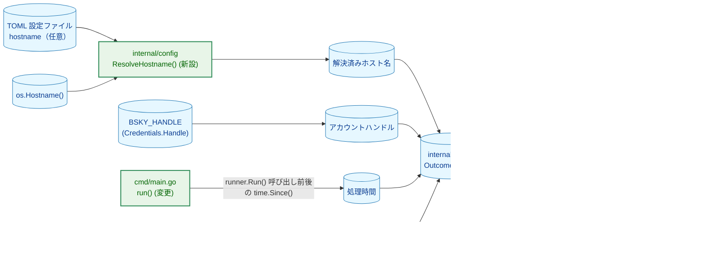
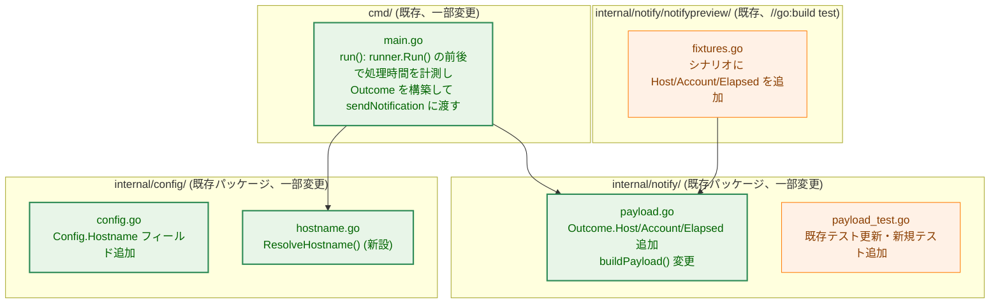
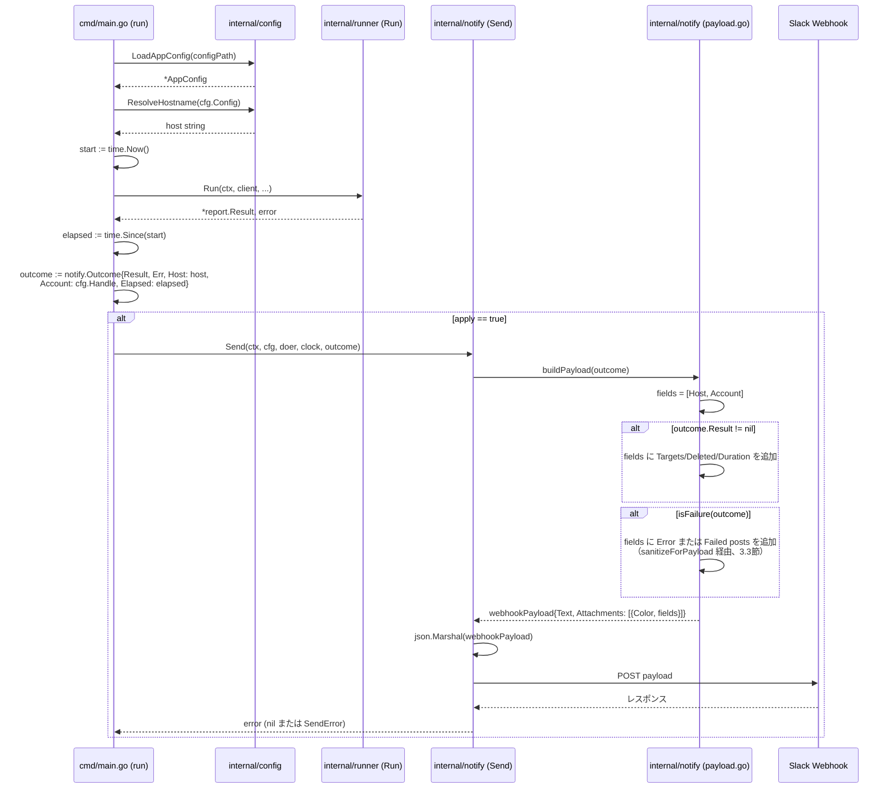
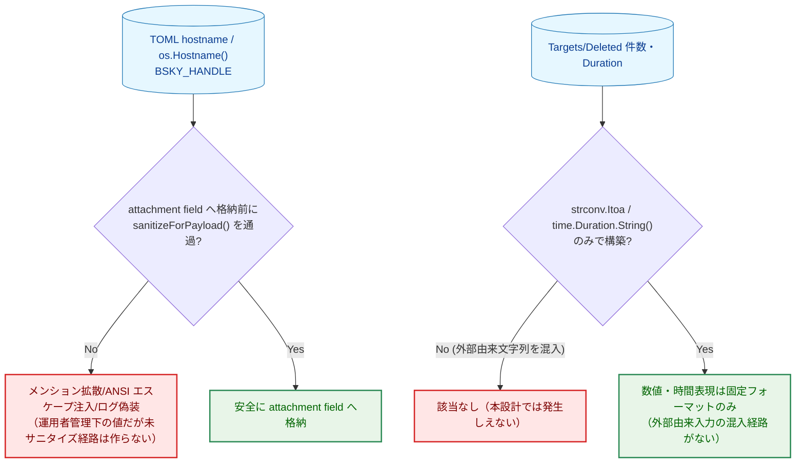

# Slack 通知への実行コンテキスト情報・統計情報の追加 — アーキテクチャ設計書

## Document Status

| Item | Value |
|---|---|
| Status | `approved` |
| Created | 2026-07-10 |
| Review date | 2026-07-10 |
| Reviewer | isseis |
| Comments | - |

関連ドキュメント: [要件定義書](01_requirements.md)

## 1. 設計の全体像

### 1.1 設計原則

- **既存コンポーネントの再利用**: [0006_slack_notification](../0006_slack_notification/02_architecture.md)・[0012_slack_rich_formatting](../0012_slack_rich_formatting/02_architecture.md) が確立した `internal/notify` の型（`HTTPDoer`/`Config`/`Send`/`SendError`）、サニタイズ関数（`Sanitize`/`escapeSlackMarkup`/`sanitizeForPayload`）、切り詰めヘルパー（`truncate`）、チャンネル振り分け判定（`isFailure`）はそのまま再利用し、変更しない。本タスクが変更するのは `Outcome` 型のフィールド追加と、`payload.go` の `buildPayload` が構築するペイロードの中身（`fields` の追加・`text` からの件数除去）である。
- **単一責任の踏襲**: `internal/notify` は「`report.Result`（および実行コンテキスト）を Slack ペイロードに変換し送信する」責務のみを持つ。ホスト名・アカウントハンドル・処理時間という「実行コンテキスト情報」の収集自体は `internal/notify` の責務ではなく、`cmd/main.go`（実行の起点）と `internal/config`（TOML 設定値の解決）が担い、`internal/notify` はそれらを `Outcome` の追加フィールドとして受け取るだけにとどめる。
- **YAGNI**: 要件定義書の Out of Scope（PDS ホストの付加、Block Kit への移行、黄色/警告色、通知先振り分けロジックの変更）は採用しない。ホスト名解決ロジック（`config.ResolveHostname`）は `internal/config` に置く最小限の関数のみを追加し、新規パッケージは導入しない。
- **既存パターンの継続利用**: `internal/config` は TOML の必須/任意フィールドをすでに `RetentionDays`（必須）・`Schedule`/`SlackAllowedHost`（任意、空文字列 = 未設定）という形で扱っている。`hostname` フィールドもこの任意フィールドのパターン（`rawConfig` に素の `string` として追加し、空文字列を「未設定」として扱う）をそのまま踏襲する（3.1節）。新しいバリデーション方式は導入しない。

### 1.2 概念モデル



矢印 A → B は「A の処理結果・データが B の入力になる」ことを表す。ホスト名・アカウントハンドル・処理時間の3つはいずれも `cmd/main.go` の `run()` が収集し、単一の `Outcome` 値にまとめてから `internal/notify` に渡す。`internal/notify` 自身は `os.Hostname()` も TOML も直接読まない。`run()`（`MAIN`）は本タスクで `Outcome` の構築・時間計測ロジックを新たに持つため（3.6節）、呼び出しタイミングのみが変わる既存コンポーネントではなく `enhanced`（緑）に分類する。

**Legend**

| 色 | 意味 |
|---|---|
| 青 (`data`) | データ（設定値・環境値・構築される値） |
| 緑 (`enhanced`) | 本タスクで新設・変更するロジック |

## 2. システム構成

### 2.1 パッケージ構造

新規パッケージは導入しない。`internal/config`・`internal/notify`・`cmd/main.go` を変更する。



矢印 A → B は「A が B の関数・型を呼び出す/参照する」ことを表す。

**Legend**

| 色 | 意味 |
|---|---|
| 橙 (`process`) | 既存コンポーネント（テストデータ更新のみ、または呼び出し関係の変更なし） |
| 緑 (`enhanced`) | 本タスクでロジックを変更・新設するファイル |

**新規・変更ファイル一覧**

| ファイル | 区分 | 内容 |
|---|---|---|
| `internal/config/config.go` | 変更 | `Config` に `Hostname string` を追加。`rawConfig` に `Hostname string `toml:"hostname"`` を追加（3.1節） |
| `internal/config/validate.go` | 変更 | `validateConfig` が `raw.Hostname` を `Config.Hostname` にそのまま引き渡すよう1行追加（`SlackAllowedHost` と同じ扱い。バリデーションルールは追加しない） |
| `internal/config/hostname.go` | 新規 | `ResolveHostname(cfg Config) (string, error)` を追加（3.1節、AC-03/AC-04/AC-05/AC-17）。`os.Hostname()` 失敗時に呼び出し元へエラーを伝播できるよう、戻り値を `(string, error)` とする（AC-17、要件定義書 2026-07-10 追記分） |
| `internal/config/hostname_test.go` | 新規 | `ResolveHostname` の3パターン（TOML指定・未指定でos.Hostname()成功・os.Hostname()失敗相当）を検証 |
| `internal/notify/payload.go` | 変更 | `Outcome` に `Host string`/`Account string`/`Elapsed time.Duration` を追加。`buildPayload()` を変更し、常に1件の attachment を生成して Host/Account フィールドを先頭に含め、`outcome.Result != nil` の場合は統計フィールド（Targets/Deleted/Duration）を追加する（3.2節・3.3節）。`text` のテンプレートから件数表現を削除する（3.4節） |
| `internal/notify/payload_test.go` | 変更 | `TestBuildPayload_SuccessOutcome_IncludesDeleteCountAndStatus`・`TestBuildPayload_ResultAndErrNil_HasNoAttachment` を新しい期待値に更新（3.5節）。Host/Account/統計フィールドの有無・サニタイズを検証する新規テストケースを追加 |
| `internal/notify/notifypreview/fixtures.go` | 変更 | 各シナリオの `Outcome` に `Host`/`Account`/`Elapsed` のサンプル値を設定し、プレビュー出力で新フィールドを確認できるようにする |
| `cmd/main.go` | 変更 | `run()` 内で `runner.Run()` 呼び出しの直前直後を `time.Now()`/`time.Since()` で計測し、`config.ResolveHostname(cfg.Config)` と `cfg.Handle` を合わせて `notify.Outcome` を構築する。`sendNotification` の引数を `result *report.Result, runErr error` から `outcome notify.Outcome` に変更する（3.6節） |
| `cmd/main_test.go` | 変更 | `sendNotification` 呼び出し経路のテストを新しいシグネチャに追従させる（挙動を検証している既存テストの意図は変えない） |
| `docs/design/configuration.md` | 変更 | TOML フィールド一覧表に `hostname`（任意）の行を追加 |
| `docs/dev/developer_guide/package_reference.md` | 変更 | `internal/notify` の説明を、`text` + `attachments`（実行コンテキスト・統計情報を含む）に更新する。`internal/config` の説明に `ResolveHostname`（ホスト名解決）を追記する |
| `README.md` | 変更 | 「Safety」節に、Slack 通知は at-least-once 配信を保証しない旨の記述を追加（5.4節, AC-15） |
| `README.ja.md` | 変更 | 「Safety」節に対応する日本語記述を追加（README.md との対訳、AC-15） |
| `docs/overview.md` | 変更 | 「Execution Result Notification」節に、通知は best-effort でありプロセスクラッシュ時に削除結果の通知が失われうる旨の記述を追加（5.4節, AC-16） |
| `docs/overview.ja.md` | 変更 | 「Execution Result Notification」節に対応する日本語記述を追加（AC-16） |

`internal/report`・`internal/atproto`・`internal/retry`・`internal/runner` への変更はない。`runner.Run` のシグネチャ・契約（0004 で確立済み）は変更しない — 処理時間の計測は `cmd/main.go` 側で `runner.Run` を呼び出す前後を挟むだけで実現でき、`runner.Run` 自身に計測ロジックを持たせる必要がないため（YAGNI）。

### 2.2 データフロー



矢印 `->>` は同期呼び出し、`-->>` は戻り値を表す。`Run()` 呼び出しの計測区間（`start`/`elapsed`）が `LoadAppConfig`・`ResolveHostname`・`atproto.NewClient` を含まないことに注意（AC-11、3.6節）。

**Legend**: このシーケンス図はメッセージ種別のみを表し、色分けは行わない。

## 3. コンポーネント設計

### 3.1 ホスト名の解決（`internal/config`）

`Config` に任意フィールド `Hostname` を追加する。既存の `SlackAllowedHost`（任意、空文字列 = 未設定）と同じ形で、ポインタを使わず素の `string` として扱う。`RetentionDays`/`ExecutionTimeoutSeconds` は `rawConfig` でポインタ型を使い、キー欠如とゼロ値を区別して必須チェックを行っている。一方 `Hostname` は「キー自体が無い」場合と「空文字列が指定されている」場合を区別する必要が AC-04 にないため、これらとは異なる扱いでよい。

```go
// Config (internal/config/config.go) に追加するフィールド。
type Config struct {
    // ...既存フィールドは変更なし...

    // Hostname is the operator-specified identifier for the machine
    // running bsky-cleaner (TOML key "hostname", optional). Empty means
    // "not configured"; ResolveHostname falls back to os.Hostname() in
    // that case.
    Hostname string
}
```

ホスト名の解決（TOML 値優先、未設定なら `os.Hostname()`、それも失敗したら空文字列）を行う関数を新設する。

```go
// ResolveHostname returns cfg.Hostname if non-empty (AC-03), otherwise the
// result of os.Hostname() (AC-04). If os.Hostname() also fails, it returns
// ("", err): the notification field still falls back to "" (AC-05, a
// best-effort hostname field must never cause notification delivery itself
// to fail), but the error itself is now returned to the caller so it can be
// logged (AC-17,要件定義書 2026-07-10 追記分).
func ResolveHostname(cfg Config) (string, error)
```

呼び出し元は `cmd/main.go` の `run()` のみであり、`LoadAppConfig` 成功後（＝ TOML 読み込み自体は失敗していない状態）にのみ呼ばれる。`os.Hostname()` の失敗は環境依存の稀なケースであり、これによって通知全体を止めない方針（AC-05）は `internal/notify.Send` の既存方針（配信失敗が CLI の終了コードに影響しない、0006 の設計）と整合する。`run()` は返り値のエラーを `slog.Warn` で警告ログに出力しつつ（AC-17）、ホスト名フィールド自体は引き続き空文字列で通知処理を継続する（3.6節）。

### 3.2 `Outcome` 型の拡張（`internal/notify/payload.go`）

```go
// Outcome is the input to buildPayload/Send.
type Outcome struct {
    Result *report.Result
    Err    error

    // Host identifies the machine that ran bsky-cleaner (config.ResolveHostname's
    // result). Always set by cmd/main.go, regardless of Result/Err (F-001).
    Host string

    // Account is the Bluesky handle bsky-cleaner authenticated as
    // (config.Credentials.Handle). Always set by cmd/main.go, regardless
    // of Result/Err (F-001).
    Account string

    // Elapsed is the wall-clock duration of the runner.Run() call that
    // produced Result/Err, measured by cmd/main.go immediately before and
    // after that single call (AC-11). Meaningful only when Result != nil;
    // buildPayload ignores it otherwise (a run that aborted before
    // producing a Result has no statistics to report, per AC-10).
    Elapsed time.Duration
}
```

`Host`/`Account` は `Result`/`Err` の値によらず常に設定される値である一方、`Elapsed` は `Result != nil` の場合にのみ表示に使われる。この非対称性は、`Host`/`Account` が「どの実行か」という識別情報（常に必要、F-001）であるのに対し、`Elapsed`/`Targets`/`Deleted` は「削除処理まで到達した実行の統計情報」（F-002、削除判定に到達しなかった実行では意味を持たない）という要件上の違いをそのまま反映している。

### 3.3 `buildPayload` の再設計

```go
// buildPayload renders outcome as a Slack webhookPayload. text is always a
// short, fixed-shape, emoji-prefixed sentence with no numeric counts
// (F-003). Exactly one attachment is always generated (F-001; see 3.5節 for
// why this differs from the previous "no attachment on full success"
// design) whose fields always begin with Host and Account (F-001,
// AC-01/AC-02), followed by Targets/Deleted/Duration when outcome.Result
// != nil (F-002, AC-07/AC-08/AC-09/AC-10), followed by an Error or Failed
// posts field when the run failed (unchanged from 0012, see
// docs/tasks/0012_slack_rich_formatting/02_architecture.md 3.3節). The
// attachment's Color is colorDanger on failure and unset (no colored bar)
// on success -- this task does not introduce a "good" color, continuing
// 0012's decision that a two-state (success/failure) result does not need
// distinct success coloring (see 0012 Appendix: Decision History, "黄色
// （警告）を採用しない"; this task extends that reasoning to "success also
// does not need a distinct color", since nothing in F-001/F-002/F-003
// requires one).
func buildPayload(outcome Outcome) webhookPayload
```

**構築手順**:

1. `text` を構築する: `isFailure(outcome)` 相当の分岐に応じた絵文字を先頭に付けた固定文言のみを組み立てる。件数（削除件数・失敗件数）は一切埋め込まない（AC-12・AC-13・AC-14）。
   - 完全成功: `"✅ bsky-cleaner run succeeded."`
   - `outcome.Err != nil`: `"❌ bsky-cleaner run failed."`（変更なし。元から件数を含まない）
   - `outcome.Result == nil && outcome.Err == nil`（防御的なケース）: `"❌ bsky-cleaner run failed: unknown error."`（変更なし）
   - 部分失敗（`Result.Failed` が1件以上）: `"❌ bsky-cleaner run completed with failures."`（件数表現を削除）
   - 構築した `text` に対して既存の `truncate()` を適用する（変更なし。外部由来の可変長文字列を含まない固定長の定型文であるため、通常は切り詰めが発生しない）。
2. `fields` の構築を開始する。まず `sanitizeForPayload(outcome.Host)` を `slackField{Title: "Host", Value: ...}` として、続けて `sanitizeForPayload(outcome.Account)` を `slackField{Title: "Account", Value: ...}` として追加する（AC-01, AC-02, NF-003）。空文字列であっても（`ResolveHostname` が `os.Hostname()` 失敗時に返す値、AC-05）フィールド自体は生成し、`Value` が空文字列になる。
3. `outcome.Result != nil` の場合、`slackField{Title: "Targets", Value: strconv.Itoa(len(outcome.Result.Targets))}`・`slackField{Title: "Deleted", Value: strconv.Itoa(len(outcome.Result.Deleted))}`・`slackField{Title: "Duration", Value: outcome.Elapsed.String()}` を追加する（AC-07, AC-08, AC-09）。`outcome.Result == nil` の場合はこの3フィールドをいずれも追加しない（AC-10）。`Duration` の値は3.6節で述べる通り `runner.Run()` の呼び出し区間のみを計測したものであり、`atproto.NewClient`（DID/PDS 解決）や `config.LoadAppConfig` の所要時間を含まない。オンコール担当者がこの `Duration` を実行全体のレイテンシと誤読しないよう、この範囲限定はフィールド名ではなく3.6節の記述で明示する（AC-11 が求める計測区間そのものであり、意図した仕様である）。
4. `isFailure(outcome)`（変更なし、[0012_slack_rich_formatting/02_architecture.md](../0012_slack_rich_formatting/02_architecture.md) 3.1節「共有化」は 0012 で完了済み）が `true` の場合、0012 で確立済みの分岐（`outcome.Err != nil` なら `"Error"` フィールド、部分失敗なら `"Failed posts"` フィールド、いずれも `sanitizeForPayload` と `truncate` を適用）をそのまま `fields` に追加する（変更なし、0012 の AC-04/AC-07 の失敗詳細表示は 0012 の挙動を継続）。
5. `attachments = []slackAttachment{{Color: color, Fields: fields}}` を常に1件生成する。`color` は `isFailure(outcome)` が `true` なら `colorDanger`、`false` なら空文字列（`omitempty` によりJSON上は省略され、Slack上は色付きの縦線が表示されない）。

Host/Account に `truncate()` を適用しない理由: `truncate()` は PDS のレスポンスボディ由来で長さに上限のない `errorKind()` の出力（3.4節、0012 で導入済み）に対する防御であり、Host/Account はいずれも運用者が TOML/環境変数で設定する値（`hostname` フィールド・`BSKY_HANDLE`）であって、攻撃者が制御できる外部入力ではない。長さを制限する必要のない値に切り詰め処理を適用しないことで、この関数を単純に保つ（YAGNI）。

### 3.4 F-003 の適用範囲（`text` からの件数除去）

3.3節手順1の通り、件数表現が残っていたのは「完全成功」「部分失敗」の2分岐のみである（他の2分岐はもともと件数を含んでいない）。この2箇所を固定文言に置き換えることで AC-12・AC-13 を満たす。絵文字（`emojiSuccess`/`emojiFailure`）と状態文言（"succeeded"/"failed"/"completed with failures"）は維持するため、0012 が確立した「`text` の絵文字で正常系/異常系を判別できる」という保証（0012 AC-01/AC-02）は後退しない（AC-14）。

### 3.5 既存ポリシーの例外: 完全成功時にも attachment を生成する（F-001, AC-06）

- **既存ポリシーとその所在**: [0012_slack_rich_formatting/02_architecture.md](../0012_slack_rich_formatting/02_architecture.md) 3.3節・Appendix「決定履歴」は、「完全成功時は表示すべき失敗詳細が存在しないため `attachments` を生成しない」ことを明示的な設計判断としている（フェーズ8の実送信確認で、`Fields` が空の color-only attachment が一部の Incoming Webhook 互換クライアントで不可視になることが判明したため）。同ドキュメントの AC-05/AC-06 がこの挙動を要求している。
- **本タスクが例外とする理由**: F-001（AC-01/AC-02/AC-06）は「正常系・異常系を問わず、ホスト名・アカウントハンドルを `fields` に含める」ことを求めており、これは 0012 が想定していなかった「常に空ではない構造化データを持つ」という状況を作り出す。0012 が回避しようとした問題（`Fields` が空の color-only attachment が不可視になる）は、本タスクでは `Fields` が Host/Account によって常に空ではなくなるため、そもそも発生しない。したがって 0012 の設計判断の前提（「完全成功時は表示すべきデータが無い」）が本タスクによって成立しなくなり、attachment を常に生成する設計に戻すことがこの前提の変化に対する正しい対応である。
- **更新が必要な既存テスト**: `internal/notify/payload_test.go` の `TestBuildPayload_SuccessOutcome_IncludesDeleteCountAndStatus`（`assert.Empty(t, got.Attachments)` の箇所を、Host/Account フィールドを含む1件の attachment を期待する形に更新）と `TestBuildPayload_ResultAndErrNil_HasNoAttachment`（テスト名・アサーションとも、Host/Account フィールドを含む attachment が生成されることを期待する形に更新。テスト名も実態に合わせて変更する）。

### 3.6 `cmd/main.go` の変更

```go
// sendNotification builds and sends the Slack notification for one apply
// run, using its own timeout/context independent of run's execution-timeout
// ctx. outcome is fully constructed by the caller (run), including
// Host/Account/Elapsed, so this function's only responsibility remains
// "send a given Outcome" (unchanged from 0006/0012).
func sendNotification(cfg *config.AppConfig, httpDoer atproto.HTTPDoer, outcome notify.Outcome) error
```

`run()` は `runner.Run()` の呼び出しの直前に `start := time.Now()` を取り、戻り値を受け取った直後に `elapsed := time.Since(start)` を計算する（AC-11）。この区間には `config.LoadAppConfig`・`config.ResolveHostname`・`atproto.NewClient`（DID/PDS 解決）のいずれも含まれない。`apply` が `true`／`false` のいずれでも `runner.Run()` は1回だけ呼ばれる既存の構造（0004 で確立済み）を変えないため、計測コードは `apply` の分岐より前に置く。

`host, hostErr := config.ResolveHostname(cfg.Config)` を呼び出し、`hostErr != nil` の場合は `slog.Warn` で警告ログを出力する（AC-17。`host` は `hostErr != nil` でも空文字列のまま使い、通知処理自体は継続する。Slack への警告ポストは行わない）。続けて `outcome := notify.Outcome{Result: result, Err: runErr, Host: host, Account: cfg.Handle, Elapsed: elapsed}` を構築し、`apply` が `true` の場合のみ `sendNotification(cfg, httpDoer, outcome)` を呼ぶ（既存の「通知は `--apply` 実行時のみ送る」という 0006 以来の方針は変更しない）。`ResolveHostname` の呼び出しは `apply` が `false`（dry-run）の場合には実行しても意味がないが、副作用のない軽量な呼び出しであり、`apply` の分岐で呼び出しを分けるより `Outcome` を一箇所で組み立てるほうが読みやすいため、`apply` の値によらず常に計算する（YAGNI: 分岐を増やす最適化はしない）。

**F-001 の「正常終了・異常終了のいずれも」の範囲**: AC-01/AC-02 が指す「異常終了」は、`sendNotification` が実際に呼ばれる実行、すなわち `runner.Run()` の呼び出しに到達した実行（`runner.Run()` 自身が返すエラーを含む）を指す。`config.LoadAppConfig`（TOML/環境変数の読み込み）や `atproto.NewClient`（DID/PDS 解決、SSRF 検証を含む）が `runner.Run()` の呼び出し前に失敗した場合、`run()` はその時点で `return`し、`if apply` ブロック（`sendNotification` の唯一の呼び出し箇所）に到達しないため、Slack 通知自体が送信されない。これは 0004/0006 で確立済みの既存の構造であり、本タスクが変更するものではない。したがって Host/Account フィールドの追加は、この既存の「通知が送信されない実行パス」を新たに通知対象にするものではなく、あくまで「通知が送信される実行」における `fields` の内容を拡張するにとどまる。DID/PDS 解決失敗（SSRF 関連エラーを含む）を Slack 通知の対象に含めるかどうかは、`sendNotification` の呼び出しタイミング自体の見直しを要する別関心事であり、本タスクの Out of Scope（要件定義書2節）である F-001〜F-003 のいずれにも含まれないため、本タスクでは扱わない。

## 4. エラーハンドリング設計

新規のエラー型は導入しない。`ResolveHostname` は `(string, error)` を返す（AC-17、要件定義書 2026-07-10 追記分）が、`os.Hostname()` のエラーをそのまま返すだけであり、通知フィールド自体は呼び出し元（`run()`）が `hostErr` の有無によらず常に空文字列にフォールバックさせる（AC-05 が要求する best-effort 方針を維持する）。`ResolveHostname` が返すエラーは `run()` が `slog.Warn` でログ出力するのみに用い、通知送信や CLI の終了コードには影響させない。`buildPayload` は 0006/0012 と同様、失敗しない関数のままである。

## 5. セキュリティ考慮事項

### 5.1 脅威モデル



矢印はいずれも「判定の分岐先」を表す。

**Legend**: 青は入力データ、赤は防止すべき事象、緑は本設計が実現する安全な経路を表す。

### 5.2 リスクへの対応

- **投稿本文経由の間接的なインジェクション・メンション拡散・ANSI エスケープ・ログ偽装（[security.md](../../design/security.md)、0006/0012 5.2節の継続）**: 本タスクが新たに追加する Host/Account フィールドは Bluesky の投稿本文由来ではなく、運用者が TOML/環境変数で明示的に設定する値である。しかし、Slack の mrkdwn 記法解釈自体はフィールドの入力元によらず一様であるため、NF-003 の要求どおり `sanitizeForPayload()`（`Sanitize()` + `escapeSlackMarkup()`、変更なし）を経由してから格納する。これにより、TOML/環境変数の設定内容が侵害された場合（本ツールの脅威モデルの外側だが、多層防御として）でも Slack メッセージ構造を壊せない。
- **統計フィールド（Targets/Deleted/Duration）の混入経路**: これらは `len(outcome.Result.Targets)`/`len(outcome.Result.Deleted)`/`outcome.Elapsed` という数値・時間の型のみから `strconv.Itoa`/`time.Duration.String()` で構築され、投稿内容や PDS レスポンス由来の自由文字列を経由しない。したがってサニタイズ対象にする必要がない（5.1節の脅威モデル参照）。
- **秘密情報の混入（0006/0012 5.2節の継続）**: `Host`（`config.ResolveHostname`）・`Account`（`config.Credentials.Handle`）はいずれもアプリパスワード・セッション JWT・`Authorization` ヘッダー値・Slack Webhook URL を含まない。`config.Credentials.AppPassword`/`SlackSuccessWebhookURL`/`SlackFailureWebhookURL` はいずれも `config.SecretString` 型であり、`Outcome` のいずれのフィールドにも代入されない（NF-004）。
- **投稿本文の非含有（0006/0012 の継続）**: 本タスクで追加するフィールドはいずれも投稿本文を含まない（NF-005）。

### 5.3 legacy attachments API のクライアント互換性

本タスクは attachment の構造（`color` + `fields`）そのものを変更しない — `fields` に含まれる要素の種類が増えるのみであり、0012 5.3節で確認済みの互換性根拠（Slack Desktop/Mobile/Web、および Mattermost での `color`/`fields` の描画実績）がそのまま適用できる。ただし「完全成功時にも attachment を生成する」設計変更（3.5節）は 0012 のフェーズ8確認では検証されていない新しい状態（`Fields` が2件だけの、danger色ではない attachment）であり、かつ 0012 のフェーズ8で実際に「空 attachment の不可視化」問題が再現したのは Mattermost であったため（0012 Appendix「決定履歴」参照）、8節の実装優先順位に `make notify-preview-send` による Mattermost を含む実送信確認を明示のステップとして含める。

**この確認が失敗した場合のフォールバック**: 万一 Mattermost（またはその他確認対象クライアント）で、`Fields` が2件（Host/Account）のみの danger色ではない attachment が依然として描画されない場合、0012 のフェーズ8で最終的に不採用となった「attachment 本体の `Text` フィールドに内容を複製する」対応は再度不採用とする。代わりに、成功時のみ `Color: colorGood`（`"good"`）等の明示的な色を設定する対応を優先する（`Fields` が空でないことではなく `Color` の明示的な設定が可視化に必要という新しい仮説の検証になる）。この場合 3.3節手順5・付録「決定履歴」を合わせて更新する。実装優先順位（8節）ではこの確認をテスト・ドキュメント更新より前に前倒しし、フォールバックが必要になった場合の手戻りを最小化する。

### 5.4 運用上の既知の制限: 通知配信の保証なし（F-004）

Slack 通知には at-least-once 配信の保証がない。`runner.Run()` がポストの削除を完了して `*report.Result` を返した後、`internal/notify.Send()` の呼び出しが完了する前に、何らかの理由（プロセスクラッシュ、強制終了、OOM Kill、ネットワーク障害、Slack 側の障害・タイムアウトなど）により通知の送信が失敗または未完了に終わった場合、削除自体は AT Protocol の `com.atproto.repo.deleteRecord` 呼び出し時点で既に確定しているにもかかわらず、その実行結果を伝える Slack 通知は永久に送信されない。

この制限は 0006（[0006_slack_notification](../0006_slack_notification/02_architecture.md)）で確立された既存の設計の性質であり、`internal/notify` がプロセス内のメモリ上で `Outcome` を一度限り送信するだけで、永続化された再送キューや outbox パターンを持たないことに起因する。本タスクは通知ペイロードの内容（Host/Account/統計情報）を拡張するのみであり、この配信保証の欠如を新たに生み出すものでも悪化させるものでもない。

本タスクではこの制限に対する配信保証機構（outbox パターン、永続化された再試行キュー等）を設計・実装しない（要件定義書 Out of Scope）。F-004/AC-15/AC-16 が求めるのは、この制限を運用者が認識できるようドキュメント化することのみであり、対象は README.md・README.ja.md（「Safety」節）と docs/overview.md・docs/overview.ja.md（「Execution Result Notification」節）である（実際の記述内容は2.1節のファイル一覧・8節の実装優先順位を参照）。

## 6. 処理フロー詳細

2.2節のシーケンス図を参照。

## 7. テスト戦略

- **ユニットテスト（`internal/config/hostname_test.go`、新規）**:
  - `cfg.Hostname` が空文字ではない場合、その値がそのまま返ること（AC-03）。
  - `cfg.Hostname` が空文字列の場合、`os.Hostname()` の値が返ること（AC-04）。実際の `os.Hostname()` は環境依存のため、返り値が空でないことのみを確認する（CI環境で `os.Hostname()` が失敗するケースは通常存在しないため、AC-05 の「失敗時に空文字列を返す」分岐は関数を `os.Hostname` を差し替え可能な形にはせず、コードレビューで確認する防御的分岐として扱う。テスト容易性より実装の単純さを優先する: `os.Hostname` を関数変数として注入可能にするのはこの1分岐のためだけの抽象化であり、YAGNI に反する）。
- **ユニットテスト（`internal/notify/payload_test.go`）**:
  - `buildPayload()`:
    - 完全成功時: `Attachments` が1件生成され、`Fields` に `Title: "Host"`・`Title: "Account"` が含まれ、値がそれぞれ `outcome.Host`/`outcome.Account` と一致すること（AC-01, AC-02, AC-06）。`Color` が空文字列（`colorDanger` ではない）であること。
    - 異常終了時（`outcome.Err != nil`、例: ログイン失敗）: `Attachments[0].Fields` に `Title: "Host"`・`Title: "Account"` が（`Title: "Error"` に加えて）含まれること（AC-01, AC-02）。
    - `outcome.Result != nil` の場合: `Fields` に `Title: "Targets"`・`Title: "Deleted"`・`Title: "Duration"` が含まれ、それぞれ `len(Result.Targets)`・`len(Result.Deleted)`・`outcome.Elapsed.String()` と一致すること（AC-07, AC-08, AC-09）。
    - `outcome.Result == nil` の場合: `Fields` に `Title: "Targets"`・`"Deleted"`・`"Duration"` のいずれも含まれないこと（AC-10）。
    - 完全成功時・部分失敗時の `text` に、削除件数・失敗件数を示す数値が含まれないこと（AC-12, AC-13）。`emojiSuccess`/`emojiFailure` が引き続き含まれること（AC-14）。
    - 悪意ある Host/Account 値（メンション記法・ANSI エスケープ・改行混入）を与えた場合、対応する `Fields` の値がサニタイズ・エスケープ済みであること（NF-003、既存のセキュリティテストパターンを Host/Account 向けに追加）。
    - `Config.SuccessWebhookURL`/`FailureWebhookURL`・app パスワード・セッション JWT・`Authorization` ヘッダーの値が `webhookPayload` のいずれのフィールドにも含まれないこと（NF-004、0006/0012 の継続）。
  - 3.5節で述べた `TestBuildPayload_SuccessOutcome_IncludesDeleteCountAndStatus`・`TestBuildPayload_ResultAndErrNil_HasNoAttachment` の更新。
- **`cmd/main_test.go` の既存テスト**: `sendNotification` のシグネチャ変更に伴うコンパイル追従に加え、以下を追加する。
  - `TestRun_ApplyAllSucceed_ReturnsExitCode0AndPrintsResult` 等の既存テストに、`runner.Run()` の呼び出し前後で計測した `Elapsed` が0以上であることを検証するアサーションを追加する（AC-09・AC-11 の統合的な確認。単体の時間精度は検証せず、「計測されている（ゼロ値でない、または少なくともゼロ以上）」ことのみを確認する）。
  - `run()` が構築する `notify.Outcome` の `Host`/`Account` が、`payload_test.go` が検証する「値が正しく `fields` に反映される」ことだけでなく、実際に TOML `hostname`／`cfg.Handle` の値そのものから来ていることを検証するテストを追加する（例: TOML に既知の `hostname` 値を設定したテスト用設定ファイルで `run()` を実行し、送信された payload の Host フィールドがその値と一致することを確認する。モック `HTTPDoer` が受信したリクエストボディを検査するか、`notify.Send` を差し替え可能にする既存のテスト基盤を利用する）。これにより、Host/Account の取り違え（例: 実装時に両者を入れ替える）を `payload_test.go` 単体では検出できないという抜け穴を塞ぐ。
- **`notifypreview` の手動確認**: `make notify-preview` を実行し、全シナリオの出力に Host/Account フィールドが含まれ、`success-apply` 等の `Result != nil` シナリオで Targets/Deleted/Duration フィールドが表示されることを目視で確認する。
- **`make notify-preview-send` による実送信確認**: 5.3節で述べた「完全成功時に danger色ではない attachment を送る」という新しい状態が、Mattermost を含む実際の Slack Incoming Webhook 互換クライアントで意図通り描画されること（可視のブロックとして表示され、0012 のフェーズ8で発生した「空 attachment の不可視化」問題が再発しないこと）を確認する。失敗した場合は5.3節のフォールバックを適用する。
- **ドキュメント記述の確認（AC-15, AC-16、static check）**: 通知配信保証に関するドキュメント化はテキストの存在確認のみで検証可能な純粋な文書要件であるため、単体テストは追加しない。README.md/README.ja.md の Safety 節、docs/overview.md/docs/overview.ja.md の Execution Result Notification 節に、該当する記述が存在することをコードレビュー（および必要なら grep 等の static check）で確認する。

## 8. 実装の優先順位

1. `internal/config` に `Hostname` フィールドと `ResolveHostname()` を追加する（3.1節）。既存の `Config`/`rawConfig` 拡張パターンをそのまま踏襲するため、他フェーズと独立して先に着手できる。
2. `internal/notify/payload.go` の `Outcome` に `Host`/`Account`/`Elapsed` を追加する（型のみの変更、まだ `buildPayload` は変更しない）。
3. `buildPayload()` を変更し、常に Host/Account フィールドを含む attachment を生成するようにする（3.3節手順2・5、AC-01/AC-02/AC-06）。この時点で 3.5節の例外（既存テスト2件の破壊）が顕在化するため、該当テストを新しい期待値に更新する。
4. `internal/notify/notifypreview/fixtures.go` のシナリオに Host/Account のサンプル値を追加し、`make notify-preview-send` で Mattermost を含む実クライアントに送信して、完全成功時（`Fields` が2件、danger色ではない attachment）の描画を早期に確認する（5.3節）。この時点で描画に問題があれば、統計フィールド・`text` 変更（手順5・6）に進む前に5.3節のフォールバックを適用し、手戻りを避ける。
5. `buildPayload()` に統計フィールド（Targets/Deleted/Duration）の追加を実装する（3.3節手順3、AC-07〜AC-10）。
6. `text` のテンプレートから件数表現を削除する（3.3節手順1・3.4節、AC-12〜AC-14）。
7. `cmd/main.go` の `run()`/`sendNotification` を変更し、`runner.Run()` の前後の時間計測・`Outcome` の構築を行う（3.6節、AC-11）。
8. `internal/notify/notifypreview/fixtures.go` のシナリオに Elapsed のサンプル値を追加する（Host/Account は手順4で追加済み）。
9. `payload_test.go`・`hostname_test.go`・`main_test.go` に7節のテストケースを追加・更新する。
10. `make notify-preview-send` による最終的な実送信確認（7節）を行い、統計フィールドを含む全シナリオの描画に問題がないことを確認する。
11. `docs/design/configuration.md`・`docs/dev/developer_guide/package_reference.md` を更新する。
12. `README.md`・`README.ja.md`・`docs/overview.md`・`docs/overview.ja.md` に、Slack 通知配信が at-least-once ではない（プロセスクラッシュ時に削除完了の通知が失われうる）旨の記述を追加する（5.4節、AC-15/AC-16）。実際の文言はこのステップの実装時に確定させる。

## 9. 将来の拡張性

- **PDS ホストの追加**: 将来 `atproto.Client` に PDS ホストの公開アクセサが追加された場合、`Outcome` にもう1フィールド追加し `buildPayload` の `fields` にもう1件足すだけで対応できる（`webhookPayload`/`slackAttachment` の型自体は変更不要）。
- **複数 Run ID・並列実行の区別**: 現状 bsky-cleaner は「単一アカウントを1プロセスが処理する」設計（プロジェクト概要）であり、Run ID のような実行単位識別子は要件にない。将来必要になった場合も、Host/Account と同じパターン（`Outcome` にフィールド追加）で対応できる。
- **黄色（警告）・Block Kit への移行**: 0012 9節の記述を継続する。本タスクによる `fields` の増加は `buildPayload()` 内部の実装のみで完結しており、`Send`/`Config` の型は変更していないため、将来の移行コストに影響しない。

---

## 付録: 決定履歴（Decision History）

- **Host/Account に `truncate()` を適用しない**: 3.3節で述べた通り、`truncate()` は PDS レスポンス由来で長さに上限のない `errorKind()` の出力に対する防御であり、運用者が設定する Host/Account には同種のリスクがないため、この防御を新たに適用対象に加えなかった（YAGNI）。
- **成功時の attachment に色を付けない**: F-001〜F-003 のいずれの要件も成功時の色分けを求めておらず、0012 の「黄色（中間状態）は採用しない」という判断（要件定義書 Out of Scope に本タスクでも継続と明記）と同じ理由（2値の結果表現で足りる）から、成功時用の新しい色定数（例: `colorGood`）を導入しなかった。
- **通知配信保証機構（outbox パターン等）を実装しない**: `runner.Run()` 完了後の通知喪失は 0006 由来の既知の制限であり、本タスクのスコープ（Host/Account/統計フィールドの追加）とは独立した別関心事である。ユーザーの判断により、機構の実装は行わず、制限の明文化（F-004、AC-15/AC-16）にとどめた（要件定義書 Out of Scope 参照）。
- **`ResolveHostname` に `os.Hostname` の差し替え可能な抽象化を導入しない**: AC-05 の「`os.Hostname()` 失敗時に空文字列を返す」という分岐を単体テストで直接踏むには `os.Hostname` を関数変数として注入可能にする必要があるが、この分岐のためだけに抽象化を導入するのは YAGNI に反すると判断し、コードレビューでの確認にとどめた（7節）。
- **`sendNotification` の引数を `notify.Outcome` にまとめる**: 当初案では `result *report.Result, runErr error, host string, account string, elapsed time.Duration` の5引数を個別に渡す設計を検討したが、`run()` 側で1箇所に `Outcome` を組み立ててから渡す設計のほうが呼び出しシグネチャが単純になり、`sendNotification` の責務（「与えられた `Outcome` を送信する」）も明確になるため、後者を採用した（3.6節）。
