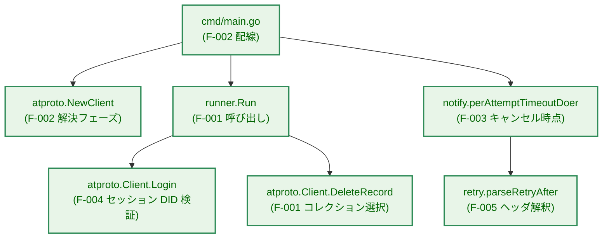
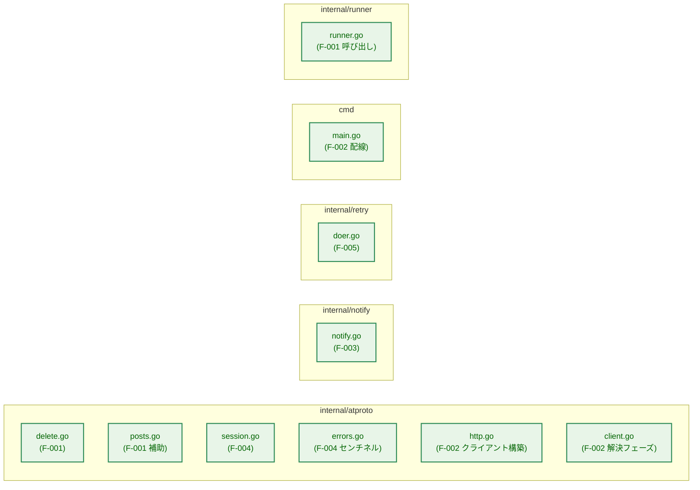
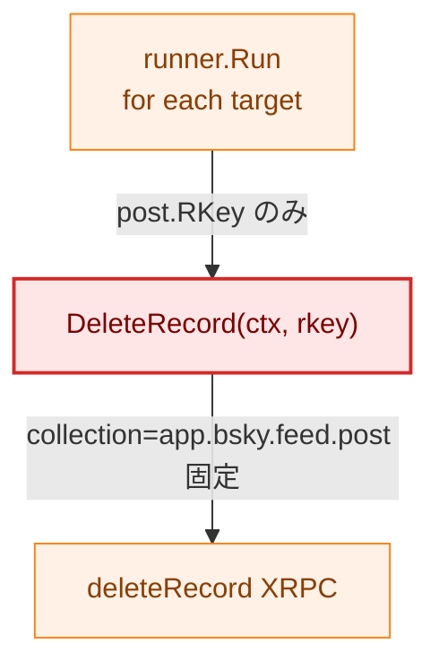
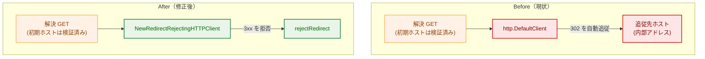
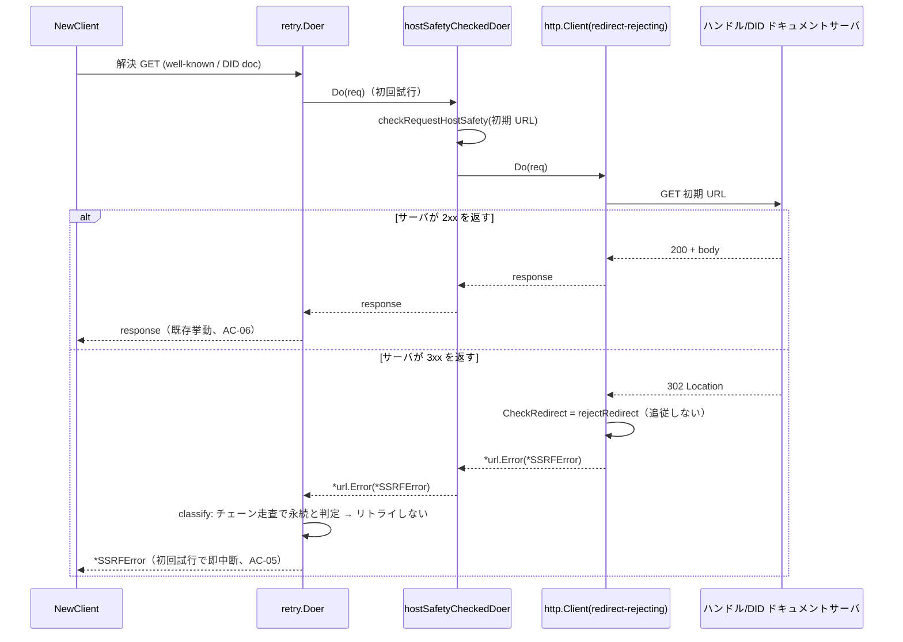
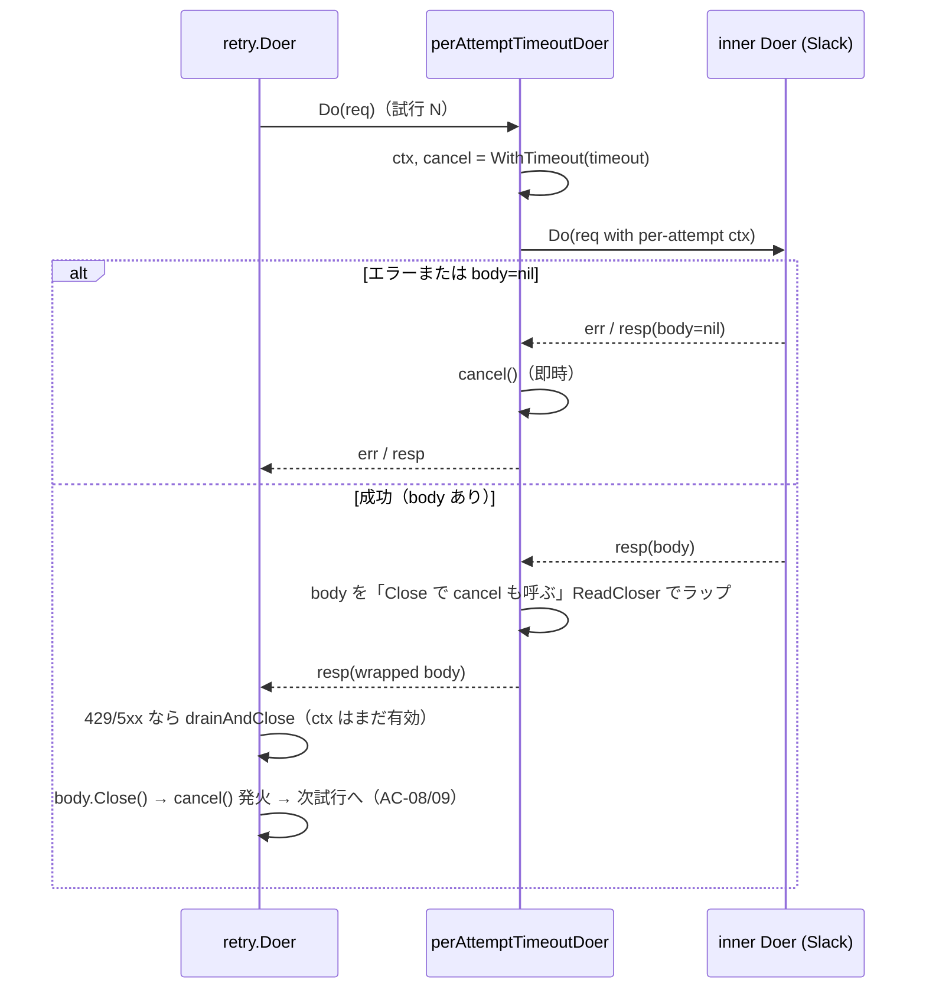

# セキュリティレビュー指摘事項の修正 — アーキテクチャ設計書

## Document Status

| Item | Value |
|---|---|
| Status | `approved` |
| Created | 2026-07-11 |
| Review date | 2026-07-11 |
| Reviewer | isseis |
| Comments | - |

関連ドキュメント: [要件定義書](01_requirements.md)

## 1. 設計の全体像

### 1.1 設計原則

本タスクは新機能の追加ではなく、[01_requirements.md](01_requirements.md) で列挙した5件の既存実装の欠陥（F-001〜F-005）を、それぞれ最小差分で修正するものである。したがって設計全体を貫く原則は次の通りである。

- **既存の安全性方針の再利用（DRY）**: 新しい防御機構を発明せず、既に確立された仕組みを欠陥箇所にも適用する。とくに F-002 のリダイレクト拒否は、PDS 本通信で既に使われている `rejectRedirect`（`internal/atproto/http.go`）をそのまま DID 解決フェーズの HTTP クライアントにも適用する。
- **Fail-closed**: 想定外の状態（PDS が解決済み DID と異なる DID を返す、解決先が予期しないリダイレクトを返す）では処理を継続せず、型付きエラーで中断する（F-002・F-004）。
- **最小差分・YAGNI**: 各修正は該当欠陥の是正に必要な変更のみを行い、無関係なリファクタリングや将来機能の先取りを含めない（[01_requirements.md](01_requirements.md) NF-004）。
- **既存挙動の保全**: 正常系（リダイレクトを伴わない解決、一致する DID、整数秒の `Retry-After`）の外部から観測可能な挙動は変えない。回帰は既存テストで担保する。
- **セキュリティ設計ドキュメントとの整合**: F-002・F-004 は [セキュリティ設計](../../design/security.md) が挙げる「AT Protocol のフェデレーション構造に起因するリスク（意図しないホストへの認証情報送信）」の系列に属する。本タスクはその方針を強化する方向にのみ変更し、逸脱しない（5章）。

### 1.2 対象コンポーネントの概観

5件の修正は3つのパッケージ（`internal/atproto`・`internal/notify`・`internal/retry`）と配線元の `cmd/main.go` にまたがる。下図は「どの欠陥がどのコンポーネントに属するか」を示す。矢印 A → B は「A が B を呼び出す（制御が A から B へ渡る）」ことを表す。



凡例:
- 緑（`enhanced`）: 本タスクで変更するコンポーネント

いずれのコンポーネントも新規パッケージではなく既存ファイルへの変更であるため、[Package Reference](../../dev/developer_guide/package_reference.md) のパッケージ構成自体は変わらない（各パッケージ責務の記述にリダイレクト拒否・セッション DID 検証の一文を追記する程度）。

### 1.3 副作用契約（dry-run / apply）

本タスクは既存の dry-run 既定・`--apply` オプトインの副作用契約を変更しない。F-001（コレクション選択）と F-003（通知リトライ）はいずれも `--apply` 時のみ発生する副作用に関わる修正であり、次の契約を維持する。

| モード | `deleteRecord` 送信（F-001） | Slack 通知送信（F-003） |
|---|---|---|
| dry-run（既定） | 一切行わない | 一切行わない |
| `--apply` | 削除対象1件ごとに1回、当該レコードが属するコレクションを指定して送信する | 実行終了後に成否に応じて1回送信（本タスクはその内部リトライの信頼性のみを是正） |

F-002（DID 解決のリダイレクト拒否）はモードに依存しない。DID 解決は dry-run・apply どちらでも `NewClient` 内で行われ、いずれのモードでも認証情報送信前の外向き GET が対象である。

## 2. システム構成

### 2.1 変更対象ファイルの配置



凡例:
- 緑（`enhanced`）: 本タスクで変更するファイル

### 2.2 依存関係への影響

パッケージ間の依存グラフ（`cmd` → `runner`/`atproto`/`notify`、`atproto`/`notify` → `retry`）は変更しない。F-001 は `runner` → `atproto` の呼び出しインターフェース（`runner.Client`）のシグネチャを変えるが、依存の向きは変わらない。F-002 は `cmd/main.go` が `NewClient` へ渡す HTTP クライアントの実体を差し替えるだけで、パッケージ依存は増えない。

## 3. コンポーネント設計

### 3.1 F-001: リポスト削除時のコレクション選択

#### 現状と問題

現在の `DeleteRecord` はリクエストのコレクションを常に `collectionFeedPost`（`app.bsky.feed.post`）で固定している。



凡例: 赤（`problem`）は欠陥のあるコンポーネント。矢印は制御・データの流れを表す。

`runner.Run` は削除対象 `atproto.Post`（`Type` フィールドを持つ）を走査しながら `post.RKey` だけを `DeleteRecord` に渡すため、リポスト（`PostTypeRepost`）であってもコレクションが `app.bsky.feed.post` として送信される。`deleteRecord` の lexicon は存在しない rkey に対しても 200 を返す（[01_requirements.md](01_requirements.md) F-001 参照）ため、リポストの rkey が `app.bsky.feed.post` 側に存在しなければ実際には何も削除されないまま成功として計上され、偶然一致した場合は削除対象外のレコードが消える。

#### 修正方針

削除対象は `atproto.Post` によって一意に決まり、削除先コレクションはその `Type` から一意に定まる。したがってコレクション決定ロジックを `atproto` パッケージ内（lexicon 定数 `collectionFeedPost`/`collectionRepost` を保持する側）に閉じ込め、`DeleteRecord` のシグネチャを rkey ではなく `Post` を受け取る形に変更する。呼び出し元（`runner`）はコレクション文字列を知らないまま、走査中の `Post` をそのまま渡す。

```go
// DeleteRecord deletes post from the authenticated account's own
// repository, choosing the collection from post.Type (reposts live in
// app.bsky.feed.repost, everything else in app.bsky.feed.post). repo is
// always c.session.DID, never a caller-supplied value.
func (c *Client) DeleteRecord(ctx context.Context, post Post) error

// collectionForPostType maps a PostType to the XRPC collection its record
// lives in: PostTypeRepost -> app.bsky.feed.repost, the three known post
// types -> app.bsky.feed.post. An unrecognized PostType returns an error
// (fail-closed) rather than guessing a writable collection to delete from.
func collectionForPostType(t PostType) (string, error)
```

`runner.Client` インターフェースおよびその呼び出しも同じシグネチャに合わせる。

```go
// Client (internal/runner) — DeleteRecord takes the full target Post so the
// atproto client can select the correct collection from its type.
type Client interface {
    Login(ctx context.Context, appPassword config.SecretString) error
    ListPosts(ctx context.Context) ([]atproto.Post, error)
    DeleteRecord(ctx context.Context, post atproto.Post) error
}
```

`collectionForPostType` は既知の4種別を明示的に扱う。`PostTypeOriginal`/`PostTypeReply`/`PostTypeQuote` は `app.bsky.feed.post`、`PostTypeRepost` は `app.bsky.feed.repost` を返す。未知種別（`cleanup.SelectDeletionTargets` が既に削除対象から除外しているため通常は到達しない）に対しては、既定コレクションを推測して削除を実行するのではなく **fail-closed**（エラーを返し `DeleteRecord` がそのレコードを削除しない）とする。既定値として実在の書き込み可能コレクション（`app.bsky.feed.post`）を返す設計は、将来 `PostType` の追加や分類バグで未知種別が到達した場合に「推測したコレクションへ削除を送る」ことになり、本タスクが是正しようとしている F-001 そのもの（コレクション取り違えによる誤削除）を再導入してしまう。したがって `collectionForPostType` は `(collection string, err error)` を返し、未知種別ではエラーを返す（[CLAUDE.md](../../../../CLAUDE.md) の Fail-closed 原則）。この失敗は当該1件の削除失敗として `report.Result.Failed` に計上され、他の削除対象の処理は継続する（`runner.Run` の既存の「個別失敗を継続」挙動）。

> **代替案の検討**: シグネチャを `DeleteRecord(ctx, rkey string, collection string)` とし、コレクション文字列を呼び出し元から渡す案も考えられる。しかしこれはコレクション lexicon 名という `atproto` 内部の知識を `runner` に漏らすことになり、[CLAUDE.md](../../../../CLAUDE.md) の「Separation of Concerns」に反する。`Post` を渡す案の方が、削除対象の同定と種別からのコレクション導出を `atproto` 内に閉じられるため優れる。

### 3.2 F-002: DID 解決フェーズのリダイレクト拒否

#### 現状と問題

`NewClient` は DID 解決（ハンドルの well-known 取得・DID ドキュメント取得）に、呼び出し元から渡された `httpDoer` を `newHostSafetyCheckedDoer` でラップして使う。本番では `cmd/main.go` がこの `httpDoer` に `http.DefaultClient` を渡している。`hostSafetyCheckedDoer.Do` はリクエストの初期 URL のホスト安全性だけを検証し、その後 `http.DefaultClient.Do` に委譲する。`http.DefaultClient` は `CheckRedirect` を設定していないため 3xx を最大10回まで自動追従し、追従先ホストは初期 URL に対する安全性検証を経由しない。

これに対し PDS 本通信で使う `restrictedDoer` は、自身が構築する `*http.Client` に `CheckRedirect: rejectRedirect`（`http.go`）を設定してリダイレクトを一律拒否している。両者は非対称であり、解決フェーズ側に同等の防御がない。

#### 修正方針

`restrictedDoer` と同じ `rejectRedirect` を、DID 解決フェーズが使う HTTP クライアントにも適用する。具体的には、`atproto` パッケージにリダイレクト拒否ポリシーを持つ `*http.Client` を返す小さなコンストラクタを新設し、`cmd/main.go` が `http.DefaultClient` の代わりにこれを `run`（ひいては `NewClient`）へ渡す。`rejectRedirect` は既存関数をそのまま再利用し、`hostSafetyCheckedDoer` 自体のロジックは変更しない。

```go
// NewRedirectRejectingHTTPClient returns the shared outbound *http.Client
// cmd/main.go injects for both DID resolution and Slack webhook delivery. It
// rejects every HTTP redirect (reusing rejectRedirect, the same policy
// restrictedDoer applies to PDS traffic) so a handle server or did:web
// document host cannot redirect an unauthenticated resolution GET to an
// internal address; the same policy is harmless for Slack (which does not
// redirect). Transport and timeout otherwise match http.DefaultClient's
// defaults, preserving existing behavior.
func NewRedirectRejectingHTTPClient() *http.Client
```

リダイレクトが発生すると `http.Client.Do` は `rejectRedirect` の返す `*SSRFError` を `*url.Error` でラップして返す。既存の `resolveHandleToDID`/`resolveDIDDocument` は `errors.AsType[*SSRFError]` でこれを取り出す経路を既に持つため（`did.go`）、`*atproto.SSRFError` として呼び出し元へ伝播する（AC-05）。`rejectRedirect` が返す段階識別子は既存の `SSRFStageDialRevalidation`（その doc コメントが「CheckRedirect が 3xx を拒否した場合」を既に包含している）をそのまま用いる。

**リトライ層との相互作用（重要な挙動）**: 解決フェーズの HTTPDoer は `NewClient` で `retry.NewDoer(newHostSafetyCheckedDoer(httpDoer), defaultRetryPolicy, ...)` として `retry.Doer` に包まれている（`client.go`）。`retry.classify`（`doer.go`）は永続エラーの判定を `errors.As` によるエラーチェーン全体の走査で行うため、`*url.Error` でラップされた `*SSRFError`（`Permanent() == true`）もチェーン内で検出され、**リダイレクト拒否は初回試行で永続と判定されてリトライされず、バックオフ待機なしに即座に中断する**。この初回1回の試行でも `rejectRedirect` が追従を拒むため、内部アドレスへの接続は一度も行われず、`*SSRFError` が呼び出し元へ浮上する（セキュリティ上の結果＝AC-05 は満たされる）。この挙動は既存の PDS 側 `restrictedDoer`（同じ `rejectRedirect` を `retry.Doer` 配下で使う）と対称である。

> **追記（2026-07-12、0016 完了により更新）**: 0015 の実装時点では `retry.classify` が永続判定をトップレベルの素の型アサーション `doErr.(permanentError)` で行っていたため、`*url.Error` でラップされた `*SSRFError` はアサーションに一致せず、リダイレクト拒否は `defaultRetryPolicy`（`MaxRetries: 5`）の回数だけ再試行されてから浮上していた（各試行とも内部アドレスへは接続せず AC-05 は満たすが、外部から観測される挙動は「リトライ予算 1+2+4+8+16 ≒ 31秒 を消費してから中断」だった）。この積み残しは [0016_retry_wrapped_permanent_error](../0016_retry_wrapped_permanent_error/01_requirements.md) が `retry.classify` を `errors.As` ベースのチェーン走査へ変更して是正済みであり、本節・§5.1・§6.1・付録B の記述は上記の「初回試行で即中断」へ更新済みである。

#### 共有クライアントとしての位置づけ

`cmd/main.go` は現在 `http.DefaultClient` を1つ生成し、`NewClient`（DID 解決）と `notify.Send`（Slack Webhook 送信）の双方へ渡している。本修正はこの共有クライアントの実体をリダイレクト拒否クライアントに差し替えるため、Slack Webhook 送信もリダイレクトを拒否するようになる。これは意図した安全側の副作用である。Slack Incoming Webhook は正常時 200 を返しリダイレクトを行わないため正常系に影響はなく、万一 Webhook エンドポイントが 3xx を返す場合はそれを配信失敗として扱う方が望ましい（通知の配信失敗は CLI の終了コードに影響しない、[0006_slack_notification](../0006_slack_notification/01_requirements.md)）。DID 解決専用に別クライアントへ分離する案は、現状の「1クライアントを共有する」構成をより複雑にするだけで利得がないため採らない（YAGNI）。

### 3.3 F-003: Slack 通知リトライのコンテキストキャンセル時点

#### 現状と問題

`perAttemptTimeoutDoer.Do` は各試行の直前に `context.WithTimeout` で per-attempt コンテキストを派生させ、`defer cancel()` で `Do` の戻り時に即キャンセルする。しかしレスポンスボディの読み取りは、`Do` が返した後に外側の `retry.Doer` が行う。とくにリトライ可能な 429/5xx では `retry.Doer` が次試行の前に `drainAndClose` でボディをドレインする（`doer.go`）。キャンセル済みコンテキストに紐づくこのドレイン読み取りは `context.Canceled` を返しうるため、`drainAndClose` がそれを検知してリトライループ全体を中断する。結果として 429/5xx を受けても再送されず通知が失われうる。（最終成功時の `notify.send` はレスポンスボディを読まず、ステータスコードのみを確認して `Close` するため、欠陥が顕在化するのは 429/5xx のドレイン経路に限られる。）

> この欠陥はループバック経由の高速な httptest では顕在化しにくい。小さなレスポンスボディが既に OS/トランスポートのバッファに載っていれば、キャンセルが効く前に読み取りが EOF に達してしまうためである。実ネットワーク越しの Slack が本文付きの 429/5xx を返す状況で確定的に発現する。既存テスト（`TestSend_MaxRetriesExceeded_ReturnsSendError_BoundedAttempts` 等）が現状で緑なのはこのマスキングによるものであり、欠陥がないことを意味しない。

#### 修正方針

per-attempt コンテキストのキャンセルを「`Do` の戻り時」ではなく「レスポンスボディの `Close` 時」に結びつける。`Do` がエラーを返した場合、またはレスポンスボディが `nil` の場合は、読み取るべきボディが存在しないため即座にキャンセルする。成功時はレスポンスボディを、`Close` 時に元の `Close` と per-attempt の `cancel` の双方を呼ぶ `io.ReadCloser` でラップして返す。これにより per-attempt タイムアウトはボディ読み取り中も有効なまま保たれ（AC-11）、かつリトライ判定後のドレイン読み取りが有効なコンテキストの下で完了できる（AC-08/AC-09）。

このパターンは「レスポンスボディが `Do` の呼び出しより長く生存するリクエストにコンテキストタイムアウトを適用する」際の定石であり、`perAttemptTimeoutDoer` 内に閉じた変更で完結する。`retry.Doer`・`drainAndClose`・`notify.send` 側のロジックは変更しない。

`perAttemptTimeoutDoer` の外部シグネチャ（`HTTPDoer` の `Do`）は不変であり、キャンセル時点のみが変わる。

### 3.4 F-004: Login におけるセッション DID の検証

#### 現状と問題

`Login` は `createSession` レスポンスの `DID` を検証せずそのまま `c.session.DID` に格納する。`NewClient` が解決・検証済みの `c.did` と突き合わせないため、異常な PDS が想定と異なる DID を返しても検知されず、その DID が `DeleteRecord` の `repo` フィールド（削除先リポジトリの同定）に使われてしまう。

#### 修正方針

`createSession` レスポンスをデコードした後、`respBody.DID` が `c.did` と一致するか検証する。一致しない場合は新設の型付きセンチネルエラーでラップして返し、`c.session` は変更しない（`nil` のままか以前の値のまま）ので、以降の `DeleteRecord` は `c.session == nil` ガードにより実行されない（AC-13）。

```go
// ErrSessionDIDMismatch reports that the DID returned by createSession does
// not match the DID NewClient resolved and validated for the handle, so the
// session must not be trusted for any authenticated (delete) call.
var ErrSessionDIDMismatch = errors.New("session DID does not match resolved DID")
```

不一致時のエラーメッセージには解決済み DID と応答 DID の双方を含めてデバッグ可能にするが、DID はいずれも公開識別子でありアクセス JWT 等の機密は含めない（AC-14）。エラーは `errors.Is(err, ErrSessionDIDMismatch)` で判別可能とする。検証は既存の `createSession` 応答デコードの直後に行い、`c.did` を参照する（`c.did` は `NewClient` が設定済み）。

### 3.5 F-005: Retry-After ヘッダのパース厳格化

#### 現状と問題

`parseRetryAfter` は秒数形式を `time.ParseDuration(value + "s")` で解釈する。RFC 9110 10.2.3 の delta-seconds は非負整数であるべきところ、`time.ParseDuration` は単位付き文字列を受理してしまうため、`Retry-After: 5m` が `"5ms"`（5ミリ秒）と誤解釈され、バックオフが意図せず極端に短くなる。

#### 修正方針

秒数形式のパースを `strconv.Atoi` による非負整数解釈に置き換える。整数として解釈でき正値であればその秒数を、0以下であれば0（フォールバック）を返す。整数として解釈できない値は HTTP-date として解釈を試み、それも失敗すれば0を返して既存の指数バックオフにフォールバックする。HTTP-date 分岐（`http.ParseTime`、未来なら差分秒数・過去なら0）は変更しない（AC-17）。

**オーバーフロー安全性**: 現行の `time.ParseDuration` は範囲外の大きさをエラーとして拒否し、結果的に安全側（HTTP-date 試行 → 0 → 指数バックオフ）へフォールバックしていた。`strconv.Atoi` は `int` 上限までの巨大な整数を受理してしまうため、`time.Duration(seconds) * time.Second` の乗算が `int64` をオーバーフローして意図せず小さな正値になり、`backoffDelay` の `min(wait, MaxDelay)` を通過してバックオフをほぼゼロに短縮させうる（[CLAUDE.md](../../../../CLAUDE.md) が挙げる「Bluesky のレート制限に対するランナウェイリトライ」リスクに直結する）。これを防ぐため、`time.Duration` への乗算の前にパース済み秒数へ妥当な上界（例えば 24 時間相当の秒数など、現実的な `MaxDelay` を十分上回りつつオーバーフローしない定数）を設けてクランプする。上界を超える値はその上界値（`backoffDelay` 側で `MaxDelay` にキャップされる）として扱い、乗算オーバーフローを構造的に排除する。この上界は `Retry-After` の現実的な値（秒〜数十分オーダー）を制約しないため、正常系の解釈には影響しない。

```go
// parseRetryAfter interprets a 429 response's Retry-After header per RFC 9110
// 10.2.3: a non-negative integer number of seconds, or an HTTP-date. Any
// other form (e.g. a unit-suffixed duration like "5m") is treated as no
// usable hint and returns 0, falling back to exponential backoff. A value
// resolving to zero or negative also returns 0.
func parseRetryAfter(value string) time.Duration
```

この変更により、小数秒（`5.5`）や単位付き（`5m`）といった RFC 非準拠の値は一律無視される。従来これらは `time.ParseDuration` が受理していたが、`Retry-After` の仕様上は不正値であり、バックオフを短縮させない方が安全である。

### 3.6 コンポーネント責務・変更一覧

| ファイル | コンポーネント | 変更内容 | 種別 |
|---|---|---|---|
| `internal/atproto/delete.go` | `DeleteRecord` | シグネチャを `(ctx, rkey string)` から `(ctx, post Post)` へ変更し、コレクションを `collectionForPostType(post.Type)` で選択（F-001） | 変更 |
| `internal/atproto/posts.go` | `collectionForPostType`（新規） | `PostType` → コレクション lexicon 名の写像。未知種別は `(-, ErrUnknownPostType)` を返し fail-closed（F-001） | 新規 |
| `internal/atproto/session.go` | `Login` | `createSession` 応答 DID と `c.did` の一致検証を追加（F-004） | 変更 |
| `internal/atproto/errors.go` | `ErrSessionDIDMismatch`・`ErrUnknownPostType`（新規） | セッション DID 不一致（F-004）／未知 `PostType`（F-001）を示す型付きセンチネル | 新規 |
| `internal/atproto/http.go` | `NewRedirectRejectingHTTPClient`（新規） | `rejectRedirect` を設定した共有 `*http.Client`（DID 解決＋Slack 送信で共用）を返す（F-002） | 新規 |
| `internal/atproto/http.go` | `rejectRedirect` | 変更なし・F-002 で再利用 | 既存 |
| `internal/atproto/client.go` | `NewClient` | 変更なし（解決フェーズは注入される `httpDoer` を使うため、リダイレクト拒否は注入側で担保） | 既存 |
| `internal/runner/runner.go` | `Client` インターフェース / `Run` | `DeleteRecord` 呼び出しを `(ctx, post)` へ変更（F-001） | 変更 |
| `internal/notify/notify.go` | `perAttemptTimeoutDoer.Do` | per-attempt コンテキストのキャンセルをボディ `Close` 時へ移動（F-003） | 変更 |
| `internal/retry/doer.go` | `parseRetryAfter` | 秒数解釈を `strconv.Atoi` へ変更（F-005） | 変更 |
| `cmd/main.go` | `main` / `run` 配線 | `http.DefaultClient` を `atproto.NewRedirectRejectingHTTPClient()` に差し替え（F-002） | 変更 |

### 3.7 既存テストへの影響

`DeleteRecord` のシグネチャ変更（F-001）は次のテスト・テストダブルを更新対象とする。いずれも呼び出し形を `(ctx, post)` へ合わせる修正であり、削除対象の同定ロジック自体のテスト意図は変わらない。

| ファイル | 更新内容 |
|---|---|
| `internal/runner/test_helpers_test.go` | `fakeClient.DeleteRecord` のシグネチャのみ `(ctx, post atproto.Post)` へ変更。差分を最小化するため、`DeleteRecordCalls` には `post.RKey` を記録し、`DeleteRecordErrs` も `post.RKey` でルックアップする（キー型・マップは現状のまま） |
| `internal/runner/runner_test.go` | `runner_test.go` のアサーション（`[]string{"first","second"}` 等）は rkey ベースのまま変更不要（`fakeClient` が `post.RKey` を記録するため）。`runner.Run` の呼び出しが `DeleteRecord(ctx, post)` になる点のみ内部的に反映 |
| `internal/atproto/delete_test.go` | `client.DeleteRecord(ctx, "abc123")` を `Post{RKey: "abc123", ...}` を渡す形へ更新。加えて F-001 の AC 検証テスト（下記 7.1）を追加 |
| `internal/atproto/errors_test.go` | `DeleteRecord` 呼び出し2箇所（`:70`, `:84`）を `Post` 引数へ更新 |
| `internal/atproto/client_test.go` | `DeleteRecord` 呼び出し（`:58`）を `Post` 引数へ更新 |

`fakeClient` が `post.RKey` を記録・参照する形にすることで、`runner` 層のテスト（コレクション／`Type` をアサートしない）はコレクション選択ロジックに立ち入らず、最小差分（NF-004）に収まる。

`cmd/` および `internal/atproto` の HTTP モック経由の統合テスト（`cmd/main_test.go`・`cmd/secret_leak_integration_test.go`・`internal/atproto/idempotency_integration_test.go`・`internal/atproto/runner_integration_test.go`）は、`deleteRecord` リクエスト本文から rkey を読む方式である。削除対象が `app.bsky.feed.post` 種別である限り、送信されるコレクションは従来通り `app.bsky.feed.post` のままなので、これらの既存アサーションは変更不要である（リポストを削除する新規ケースのみ 7.1 で追加する）。

F-003 のキャンセル時点変更は、既存の `internal/notify/notify_test.go` の各テスト（`TestSend_*`）の想定挙動を変えない（それらはループバック環境で現状も緑であり、修正後も緑のまま）。F-005 は既存の `TestDoer_Do_*RetryAfter*` 系テスト（整数秒・HTTP-date・上限キャップ）の想定を変えない。いずれも新規 AC 検証テストを追加する形で担保する（7章）。

## 4. エラーハンドリング設計

### 4.1 新規エラー型

F-004 で `ErrSessionDIDMismatch`（`internal/atproto/errors.go`）を追加する。既存のセンチネルエラー群（`ErrDIDResolutionFailed`・`ErrAuthenticationFailed` 等）と同じく `errors.New` で定義し、`Login` が `fmt.Errorf("login: session DID %q does not match resolved DID %q: %w", ...)` の形でラップして返す。`%w` により `errors.Is` で判別できる。

F-001 の fail-closed 化（3.1）に伴い、未知 `PostType` を示すセンチネル `ErrUnknownPostType`（`internal/atproto/errors.go`）も追加する。`collectionForPostType` がこれを返し、`DeleteRecord` がラップして呼び出し元へ伝播する。`runner.Run` はこれを当該レコードの削除失敗として `report.Result.Failed` に計上し、処理を継続する。

F-002 のリダイレクト拒否は新規エラー型を追加せず、既存の `*SSRFError`（`SSRFStageDialRevalidation`）をそのまま用いる。F-003・F-005 はエラーの分類・型を変えない。

### 4.2 機密漏洩の考慮

`ErrSessionDIDMismatch` を含む不一致エラーのメッセージは DID（公開識別子）のみを含み、アクセス JWT・アプリパスワードといった機密は含めない。これは既存の `HTTPError`/`SSRFError` が「機密を含まないフィールドのみを保持する」方針（`errors.go` の各 doc コメント、[セキュリティ設計](../../design/security.md) の秘密漏洩リスク）と一致する。

## 5. セキュリティ考慮事項

### 5.1 F-002 の脅威モデル（リダイレクト経由の SSRF）

DID 解決フェーズの GET は認証情報を伴わないが、blind SSRF（内部ネットワーク・メタデータサービスへの到達可否をレスポンス挙動から観測する攻撃）の経路になりうる。悪意ある/侵害されたハンドルサーバ、あるいは応答データ自体が信頼できない did:web ドキュメント配信元が 3xx を返すと、`http.DefaultClient` がそれを追従し、追従先は初期 URL に対する `checkRequestHostSafety` を経由しない。



凡例:
- 赤（`problem`）: 欠陥のあるコンポーネント／到達先
- 緑（`enhanced`）: 修正後のコンポーネント
- オレンジ（`process`）: 変更のない前提

矢印は制御・データの流れを、ラベルはその辺で起きる挙動を表す。修正前は 302 を自動追従して未検証の内部アドレスへ到達しうるのに対し、修正後は `rejectRedirect` が追従を拒み `*SSRFError` を返す（6.1 の通り `retry.Doer` は初回試行で永続と判定して即中断し、`*SSRFError` を呼び出し元へ浮上させる。この即中断挙動は [0016_retry_wrapped_permanent_error](../0016_retry_wrapped_permanent_error/01_requirements.md) による是正済み — 3.2 の追記参照）。

この修正は [セキュリティ設計](../../design/security.md) の「意図しないホストへの認証情報送信（実質 SSRF）」の対策方針を、既存の `restrictedDoer`（PDS 本通信）から DID 解決フェーズへ拡張するものであり、既存方針の強化にあたる。DNS リバインディングによる TOCTOU 窓（初期のホスト検証と実接続の間で DNS 応答が変わる可能性）について、本タスクで塞ぐのはリダイレクト経路のみである。解決フェーズの1回の GET 内でのアドレス再解決に対する IP ピン留めは PDS 側（`restrictedDoer`）と異なり導入しない — これは [01_requirements.md](01_requirements.md) の Out of Scope（解決フェーズの複数アドレス・ピン留め）に沿い、リダイレクト拒否という本タスクの範囲に絞るためである。

### 5.2 F-004 の多層防御としての位置づけ

セッション DID 検証は、`NewClient` による DID 解決・PDS エンドポイント検証を既に通過した後段に位置する追加のチェックである。既存の防御（解決済み DID・検証済み PDS への接続ピン留め）を前提としつつ、「検証済み PDS が想定と異なる DID を返す」という残余の異常系を fail-closed で捕捉する。これにより、削除操作の `repo` が常に解決・確認済みの DID と一致することを保証する。

### 5.3 その他リスクカテゴリ

[セキュリティ設計](../../design/security.md) の他のリスクカテゴリ（投稿本文経由のインジェクション、リソース枯渇、Docker サプライチェーン等）は本タスクの変更範囲外であり N/A。F-003・F-005 は可用性・レート制限順守（バックオフの正確性）に関わるが、新たな攻撃面は導入しない。

### 5.4 常設設計ノートの要否

[_context.md](../../../../.claude/commands/_context.md) の条件付き設計ノート方針は「AT Protocol クライアント・レート制限・認証/セッション・破壊的操作に触れる機能では、`docs/dev/architecture_design/` に専用設計ノートを追加する」ことを求める。本タスクはこれらの領域に触れるが、いずれも新規サブシステムの導入ではなく既存挙動のバグ修正であり、方針自体は既存の [セキュリティ設計](../../design/security.md) が定める SSRF・秘密漏洩・レート制限の各方針をそのまま踏襲する。したがって新規の常設設計ノートは設けず、本アーキテクチャ設計書内で個別の是正を記述するに留める（YAGNI）。

## 6. 処理フロー詳細

### 6.1 F-002: リダイレクト拒否のシーケンス

解決フェーズの HTTPDoer は `retry.Doer` → `hostSafetyCheckedDoer` → `*http.Client` の順で入れ子になっている。下図は 3xx 応答が `rejectRedirect` で拒否され、`retry.Doer` が初回試行で永続と判定して即中断し、`*SSRFError` が浮上するまでを示す（[0016_retry_wrapped_permanent_error](../0016_retry_wrapped_permanent_error/01_requirements.md) による是正後の挙動 — 3.2 の追記参照）。矢印は呼び出し（実線・右向き）と戻り（点線・左向き）の順序を表す。



DID ドキュメント取得先が `plc.directory`（did:plc）と did:web ドメインのいずれであっても、同じ `retry.Doer`（`didResolutionDoer`）を経由するため、リダイレクト拒否の適用範囲に漏れはない。

### 6.2 F-003: リトライ時のキャンセル時点



矢印は呼び出し・戻りの順序を表す。

## 7. テスト戦略

### 7.1 F-001（コレクション選択）

- `DeleteRecord` が `PostTypeRepost` の `Post` に対し `collection=app.bsky.feed.repost` を含む本文を送ることをモック経由で検証（AC-01）。
- `PostTypeOriginal`/`Reply`/`Quote` では `collection=app.bsky.feed.post` を送ることを検証（AC-02）。
- 両コレクションに同一 rkey が存在するシナリオで、リポスト削除が `app.bsky.feed.repost` 側のみを対象とし `app.bsky.feed.post` 側の同名 rkey を消さないことを、送信されたコレクションのアサーションで検証（AC-03）。
- apply 実行で、削除の HTTP 応答が成功（2xx）なら `report.Result.Deleted`、失敗（非 2xx・トランスポート失敗）なら `Failed` に計上されることを `runner` 経由で検証（AC-04）。なお `deleteRecord` の lexicon は存在しない rkey にも 200 を返すため「サーバ側で実在レコードを実際に消したか」は原理的に観測できず、本テストが検証するのは「正しいコレクションへ送った上で、HTTP 成否が Deleted/Failed に正しく振り分けられること」である。リポストは `ListPosts` が `app.bsky.feed.repost` の AT-URI から rkey を得ているため、当該コレクションに実在するレコードであり、コレクション修正後の削除は実質的に有効である。
- 未知 `PostType`（到達しないはずの防御ケース）を `DeleteRecord` に与えると `ErrUnknownPostType` を返し、`repo`/`collection` を推測した削除リクエストを送らない（fail-closed）ことを検証。

### 7.2 F-002（リダイレクト拒否）

- `NewRedirectRejectingHTTPClient()` が返すクライアントを、302 を返す `httptest.Server` に対して直接使い、`*atproto.SSRFError` を返す（追従しない）ことを検証（AC-05）。`hostSafetyCheckedDoer` のループバックホスト検証を回避してリダイレクトポリシー単体を検証するため、この経路はクライアントを直接叩く。
- 既存のモック（2xx を返す `MockHTTPDoer`）経由のハンドル解決・DID ドキュメント取得のユニットテストが変更なく緑であることを回帰確認（AC-06）。
- `internal/atproto` の DNS TXT 解決系テスト（[0009_dns_handle_resolution](../0009_dns_handle_resolution/01_requirements.md)）に退行がないことを確認（AC-07、DNS は HTTP を伴わないため本質的に無影響）。

### 7.3 F-003（通知リトライ）

429/5xx のリトライを確定的に検証するため、per-attempt コンテキストの状態を反映するレスポンスボディを返すテストダブルを用いる。ボディの `Read` は、渡された per-attempt コンテキストが完了済みなら `ctx.Err()` を返す実装とする。

- 429 → 200 のシーケンスで、リトライが行われ最終的に `Send` が `nil` を返すことを検証（AC-08）。バグのある実装（`Do` 戻り時キャンセル）では初回で `context.Canceled` により中断し `SendError` になるため、本テストで確定的に差分が出る。
- 5xx → 200 でも同様にリトライが機能することを検証（AC-09）。
- 常に 429 を返す場合、リトライ上限（`MaxRetries+1` 試行）に達した後 `*notify.SendError` を返すことを検証（AC-10）。
- ボディ `Read` が per-attempt コンテキストの完了までブロックするダブルで、per-attempt タイムアウトが読み取りを含めて有効であり無制限に待たされないことを検証（AC-11）。

### 7.4 F-004（セッション DID 検証）

- `createSession` 応答 DID が `c.did` と一致する場合、`Login` が成功し `c.session` が設定されることを検証（AC-12）。
- 不一致の場合、`Login` がエラーを返し `c.session` が設定されず、後続の `DeleteRecord` が `ErrAuthenticationFailed`（`c.session == nil` ガード）で実行されないことを検証（AC-13）。
- 不一致エラーが `errors.Is(err, ErrSessionDIDMismatch)` で判別可能で、メッセージにアクセス JWT が含まれないことを検証（AC-14）。

### 7.5 F-005（Retry-After パース）

- `Retry-After: 5` が 5 秒として解釈されることを検証（AC-15）。
- `Retry-After: 5m` が無視され（0 を返し）指数バックオフにフォールバックすること、すなわち 5 ミリ秒と誤解釈されないことを検証（AC-16）。
- 有効な HTTP-date（未来・過去）の既存解釈が変わらないことを回帰確認（AC-17）。
- 巨大な整数秒（例 `Retry-After: 9999999999`）が乗算オーバーフローで極端に短い待機に化けず、上界クランプにより `MaxDelay` にキャップされる（サブ秒待機にならない）ことを検証（3.5 のオーバーフロー安全性を担保する追加テスト。AC-16 の意図——RFC 非準拠・危険な値でバックオフを短縮させない——を巨大値方向へ拡張するもの）。

## 8. 実装優先順位

各修正は相互に独立しており、任意の順序で実装・レビュー可能である。破壊的操作の正当性に直結する順に並べる。

1. **F-001**（重大: 誤削除防止）: `collectionForPostType` 追加 → `DeleteRecord`/`runner.Client` シグネチャ変更 → 影響テスト更新 → AC 検証テスト追加。
2. **F-004**（fail-closed 強化）: `ErrSessionDIDMismatch` 追加 → `Login` に検証追加 → テスト。
3. **F-002**（SSRF 対策拡張）: `NewRedirectRejectingHTTPClient` 追加 → `cmd/main.go` 配線差し替え → テスト。
4. **F-003**（通知信頼性）: `perAttemptTimeoutDoer` のキャンセル時点変更 → テスト。
5. **F-005**（バックオフ正確性）: `parseRetryAfter` の秒数解釈変更 → テスト。

## 9. 将来の拡張性

- F-002 で導入する `NewRedirectRejectingHTTPClient` は、将来 DID 解決フェーズに per-request タイムアウトやアドレスピン留め（Out of Scope とした項目）を加える必要が生じた際の拡張点になる。クライアント構築を1箇所に集約したことで、追加のトランスポート制御を注入しやすい。
- F-001 の `collectionForPostType` は、将来 like（`app.bsky.feed.like`）等の別コレクションの削除に対応する場合の写像追加点になる。

## 付録A: 受け入れ基準 ↔ 設計トレーサビリティ

| AC | 対応節 | 検証方法 |
|---|---|---|
| AC-01/02/03/04 | 3.1, 7.1 | test |
| AC-05/06/07 | 3.2, 6.1, 7.2 | test |
| AC-08/09/10/11 | 3.3, 6.2, 7.3 | test |
| AC-12/13/14 | 3.4, 7.4 | test |
| AC-15/16/17 | 3.5, 7.5 | test |

各 AC を検証する具体的なテスト関数名・実装位置は `03_implementation_plan.md` の「受け入れ基準の検証」節で対応付ける。

## 付録B: 決定履歴

- **F-001 のシグネチャ選択**: `DeleteRecord(ctx, rkey, collection string)` ではなく `DeleteRecord(ctx, post Post)` を採る理由は 3.1 の引用ブロックを参照（コレクション lexicon 名を `runner` に漏らさないため）。
- **F-002 の共有クライアント**: DID 解決用と Slack 通知用でクライアントを分離しない理由は 3.2「共有クライアントとしての位置づけ」を参照（現状の1クライアント共有構成を保つ、リダイレクト拒否は双方で安全側）。
- **F-002 のリダイレクト検知手法**: `restrictedDoer` と同じ `rejectRedirect`（`CheckRedirect`）を再利用し、レスポンスステータスを事後検査する別機構を新設しない理由は 3.2 を参照（本番の `http.DefaultClient` は 3xx を追従後の最終応答しか返さないため、事後検査だけでは本番の追従を防げない。トランスポート層でのリダイレクト拒否が必須）。
- **F-002 のリトライ層挙動を「即中断」と記述しない（0015 実装時点の判断。0016 完了により後述のとおり解消）**: レビュー指摘を受け、0015 実装時点ではリダイレクト拒否が `retry.Doer` により永続エラーと即断されず `MaxRetries` 回リトライされてから浮上する事実を 3.2・6.1 に明記した。`retry.classify` を `errors.As` ベースに変える改善は `internal/retry` の契約変更を伴うため 0015 のスコープ外とし、当時は挙動の明示に留めた。（2026-07-12 追記: この積み残しは [0016_retry_wrapped_permanent_error](../0016_retry_wrapped_permanent_error/01_requirements.md) が `retry.classify` を `errors.As` ベースのチェーン走査へ変更して是正済みであり、これに伴い 3.2・6.1 の記述は「初回試行で即中断」へ更新済み — 3.2 の追記参照。）
- **F-001 の未知種別を fail-closed 化**: レビュー指摘を受け、`collectionForPostType` の未知種別に対する既定コレクション（`app.bsky.feed.post`）返却を取りやめ、`ErrUnknownPostType` を返す fail-closed 設計に変更した（3.1）。既定コレクションへの削除は本タスクが是正する誤削除を再導入するため。
- **F-005 のオーバーフロー安全性**: レビュー指摘を受け、`strconv.Atoi` が失う `time.ParseDuration` のレンジ外拒否を、乗算前の秒数クランプで補う設計を 3.5 に追加した。
