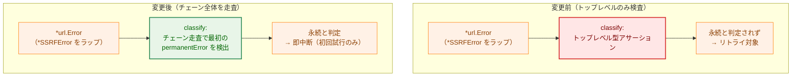
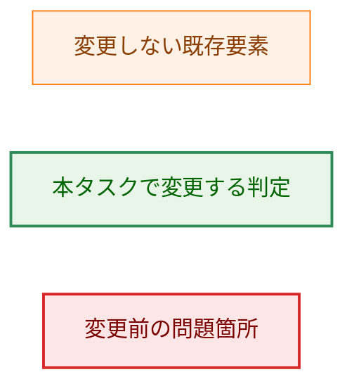
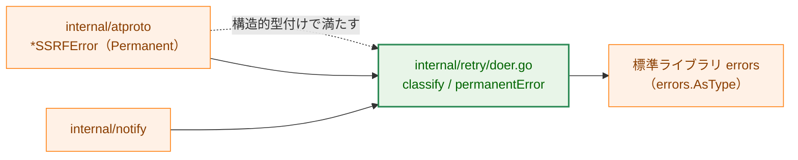
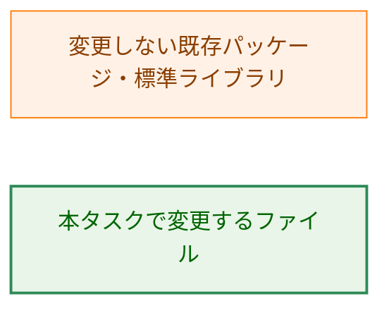
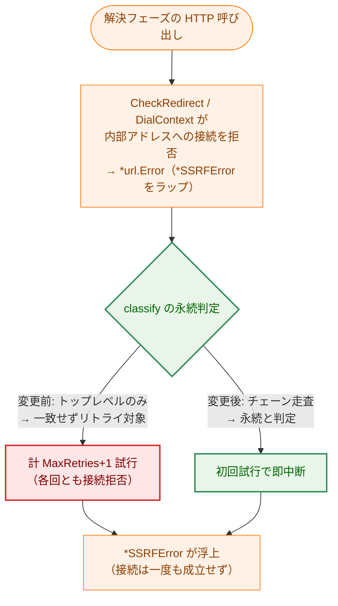
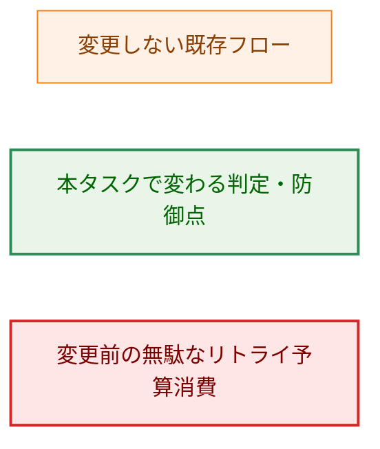
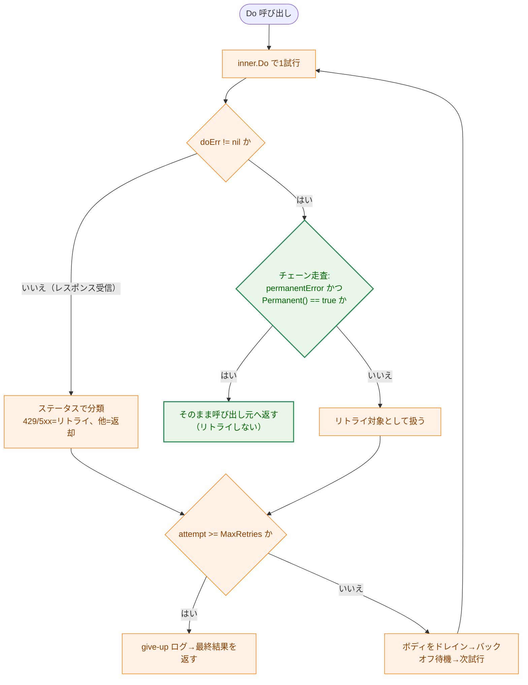
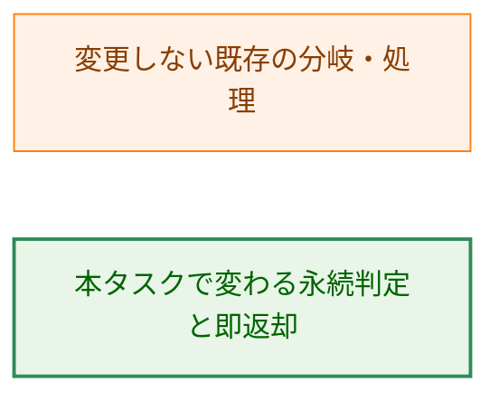

# ラップされた永続エラーのリトライ抑止 — アーキテクチャ設計書

## Document Status

| Item | Value |
|---|---|
| Status | `draft` |
| Created | 2026-07-12 |
| Review date | - |
| Reviewer | - |
| Comments | - |

## 1. 設計の全体像

### 1.1 設計原則

- **最小差分（YAGNI）**: 変更対象は `internal/retry` の永続エラー判定1箇所と、それを説明する既存コメントのみに限定する。`permanentError` インターフェースの契約（`Permanent() bool`）、リトライ方針、戻り値契約、他パッケージには一切手を入れない（要件 F-001・NF-004）。
- **フェイルクローズの維持**: 本変更はセキュリティ上の結果（SSRF 拒否＝内部アドレスへ接続しない）を変えない。変わるのは「拒否が確定するまでに消費するリトライ予算」だけであり、拒否そのものは変更前も変更後も成立する（後述 §5）。
- **疎結合の維持**: `*atproto.SSRFError` は `internal/retry` をインポートせず、構造的型付けのみで `permanentError` を満たしている。判定側（`internal/retry`）の走査方法だけを変えることで、この疎結合構造を保つ（要件 NF-003・5章）。
- **既存挙動の非回帰**: 永続エラーを含まないエラー（トランスポート失敗・DNS 一時エラー等）と、レスポンス（`nil` エラー）に対する既存のリトライ可否分類は、いっさい変更しない（AC-03・AC-04）。

### 1.2 問題の概念モデル

現在の永続エラー判定は、`Doer.Do` が受け取ったエラーチェーンの**トップレベル**だけを素の型アサーションで検査する。永続エラーが他のエラーでラップされていると、トップレベルはラップ側の型（例: `*url.Error`）であり `permanentError` を満たさないため、永続と判定されずリトライ対象に分類されてしまう。本タスクは判定をチェーン全体の走査へ変更し、ラップの有無にかかわらず永続エラーを検出する。



図の凡例（矢印 A → B は「A を入力として B の処理・判定へ進む」制御フローを表す）:



### 1.3 副作用契約

本タスクにはモード切替フラグ（`--dry-run` / `--apply` 等）は存在しない。ただし永続判定は**外部への HTTP 送信回数という副作用**に影響するため、その契約を明示する。

| 対象 | 変更前 | 変更後 |
|---|---|---|
| チェーンのどこかに永続エラーを含む失敗（ラップされた `*atproto.SSRFError` 等） | `MaxRetries+1` 回まで `inner.Do` を送信し、各試行の間にバックオフ待機（`Clock.Sleep`）を挟んでから中断 | 初回試行の1回のみ `inner.Do` を送信し、バックオフ待機なしに即中断（AC-02） |
| トップレベルが直接永続エラー | 初回試行の1回のみ・待機なしで中断 | 同左（既存挙動の維持、AC-01） |
| 永続エラーを含まない失敗・非成功レスポンス・成功 | 既存のリトライ可否分類に従う | 同左（変更なし、AC-03・AC-04） |

いずれの経路でも、リダイレクト拒否の各試行では `rejectRedirect` が追従を拒むため内部アドレスへは一度も接続されない。変更後はその「拒否付き試行」自体が初回1回に短縮される。

## 2. システム構成

### 2.1 変更対象ファイルの配置

変更は `internal/retry` パッケージ内に閉じる。新規パッケージ・新規ファイルの追加はない。



図の凡例（矢印 A → B は「A が B に依存する／B を利用する」ことを表す。点線ラベル付き矢印は依存ではなく構造的型付けによるインターフェースを満たすことを表す）:



`internal/atproto` から `internal/retry` への実線矢印は、`NewClient` が発信 HTTPDoer を `retry.NewDoer` で包む既存の利用関係（`internal/atproto/client.go`）を表す。点線矢印は `*SSRFError` が `internal/retry` をインポートせず `permanentError` を構造的に満たす既存関係を表す。いずれも本タスクが新設する関係ではない。

### 2.2 依存関係への影響

`internal/retry` は引き続き標準ライブラリのみに依存する（NF-003）。判定に用いる `errors.AsType[permanentError]` は標準ライブラリ `errors` の機能であり、新規外部依存を導入しない（NF-002）。

## 3. コンポーネント設計

### 3.1 永続エラー判定の変更（F-001）

判定を担うのは `classify`（`internal/retry/doer.go`）である。現状はトップレベルの素の型アサーションで永続エラーを検出しているが、これをエラーチェーン全体の走査へ変更する。走査は標準ライブラリの `errors.As` 相当（Go 1.26 では `errors.AsType[permanentError]`）を用い、「チェーン先頭側から最初にマッチした1件」の `Permanent()` で判定を確定する。これは要件 F-001 が定める意味論と一致する。なお `errors.As`／`errors.AsType` はターゲットにインターフェース型を指定でき（`error` を埋め込まないインターフェースでも可）、チェーン内でそのインターフェースに代入可能な要素を探索する。本コードベースの既存の `errors.AsType` 利用は具体的なポインタ型（`*SSRFError` 等）を対象にしているが、`permanentError` のようなインターフェースを対象にする用法も標準の `errors.As` 契約で正当である。

> **判定の一意性と誤検知の考慮**: 「最初にマッチした1件で確定」で問題ないのは、`permanentError` を実装するエラー型が現状 `*atproto.SSRFError`（`Permanent()` は常に `true`）1つだけであり、1つのチェーンに `Permanent()` の異なる複数実装が同居する状況が存在しないためである（要件 F-001 の注記・2章 Out of Scope）。また、この走査はチェーン全体（`errors.Join` による木構造の分岐も含む）を対象とするため、「本来はリトライ可能な失敗が、その内側に永続エラーをラップ／`Join` している」場合には、そのエラー全体が永続と判定される点に注意が必要である。現状はこの取り違えは起きない（`permanentError` 実装は `*SSRFError` の1つのみで、`internal/atproto` はトランスポート失敗を `ErrTransportFailure` として `*SSRFError` と構造的に区別しており（`internal/atproto/errors.go`）、リトライ可能なエラーが永続エラーをラップ／`Join` する経路は存在しない）。将来、`Permanent()` が `false` を返し得る実装や値の異なる複数実装をチェーンに含み得る状況を導入する場合、あるいはリトライ可能な失敗の内側に永続エラーをラップ／`Join` するコードを追加する場合は、この判定方針の見直しが必要になる。

#### なぜトップレベル判定では要件を満たせないか

既存のトップレベル型アサーションは、永続エラーが最上位に露出している場合しか検出できない。`http.Client.Do` は `CheckRedirect`／`DialContext` が返す `*SSRFError` を `*url.Error` でラップして返すため、トップレベルは `*url.Error` となり判定に一致しない。要件（ラップされていても即中断）を満たすには、チェーンをたどって内側の永続エラーを検出する走査が必須であり、より単純なトップレベル判定では達成できない。走査は既存の標準ライブラリ機能で実現できるため、新たな抽象や型の追加は不要である。

### 3.2 型・シグネチャ（現状）

本タスクは以下の既存のインターフェース・関数シグネチャを変更しない。参照のため現状を示す。

```go
// 変更なし。判定側だけがこのインターフェースをチェーン走査で検査するよう変わる。
type permanentError interface {
    Permanent() bool
}

// シグネチャは変更なし。doErr != nil の分岐内で、永続判定をトップレベル
// アサーションからチェーン走査へ変更する。
func classify(resp *http.Response, doErr error) (retryable bool, retryAfter time.Duration, outcomeResp *http.Response, outcomeErr error)
```

`Doer.Do` の戻り値契約（レスポンスとエラーを同時に非 `nil` で返さない）も変更しない（AC-05）。

### 3.3 コメント整合（AC-06）

判定機構を説明している `internal/retry/doer.go` の既存コメントを、変更後の実態（チェーン走査）へ整合させる。対象は次の3箇所。

- `permanentError` インターフェース定義のコメントにある「plain type assertion」という記述。
- `Doer` 型のコメントにある永続エラー判定の説明。
- `classify` のコメントにある永続エラー判定の説明。

「呼び出し元がこのパッケージの型をインポートせずにオプトアウトできる」という構造的型付けの利点を述べたコメントは変更後も成立するため、そのまま残す。これらのコメント更新は無関係なリファクタリングではなく、変更後の実態と食い違うコメントを正す最小差分の一部である（NF-004）。

### 3.4 コンポーネント責務・変更一覧

| ファイル | 区分 | 責務・変更内容 | 関連 AC |
|---|---|---|---|
| `internal/retry/doer.go` | 変更 | `classify` の `doErr != nil` 分岐で、永続判定をトップレベル型アサーションからチェーン走査（`errors.AsType[permanentError]`）へ変更。あわせて `permanentError`／`Doer`／`classify` の該当コメントを整合。 | F-001 / AC-01〜AC-06 |
| `internal/retry/doer_test.go` | 変更（テスト追加） | ラップされた永続エラーが初回試行のみで中断し `Clock.Sleep` が発生しないことを検証するケースを追加（AC-02）。既存の `TestDoer_Do_PermanentFailures_NotRetried`（トップレベル永続、AC-01）、非永続エラーのリトライ検証（AC-03）、レスポンス分類の検証（AC-04）は現状のまま緑を維持する。 | AC-01〜AC-05 |

既存テストのうち、本変更で**挙動が変わって更新が必要になるものは存在しない**。`TestDoer_Do_PermanentFailures_NotRetried` の `permanent_error` ケースはトップレベル永続エラーであり、変更後も同じく初回1回で中断する（回帰しない）。`internal/atproto` 側の `TestNewRedirectRejectingHTTPClient_RejectsRedirect`（`internal/atproto/http_test.go`）は素の `*http.Client` を直接検証しており `retry.Doer` を介さないため、本変更の影響を受けない。

## 4. エラーハンドリング設計

### 4.1 新規エラー型

なし。本タスクは既存のエラー型・センチネル・インターフェースを一切追加・変更しない。判定側の走査範囲のみを変更する。

### 4.2 エラーの伝播とメッセージ

`classify` が永続と判定した場合、`Do` は受け取ったエラーを**そのまま**（ラップも改変もせず）呼び出し元へ返す。したがってエラーメッセージ・チェーン構造・`errors.Is`／`errors.AsType` による呼び出し元での判定可能性は変更前後で不変である。呼び出し元は従来どおり `errors.AsType[*atproto.SSRFError]` 等でチェーン内の `*SSRFError` を取り出せる。

### 4.3 機密漏洩の考慮

判定に用いる `*SSRFError` が保持するのは拒否されたスキーム／ホストのみであり、機密（アプリパスワード・セッション JWT）を含まない（`internal/atproto/errors.go` の該当コメント）。本変更はエラーの中身を読まず、チェーン内の型の有無のみを検査するため、ログ・通知への機密漏洩経路を新たに生まない。

## 5. セキュリティ考慮事項

### 5.1 脅威モデル（SSRF 拒否とリトライ予算）

本変更のセキュリティ上の焦点は「変更によって SSRF 防御が弱まらないこと」である。下図は、リダイレクト拒否／検証済みアドレス外への接続拒否が発生したときの制御フローを、変更前後で対比する。



図の凡例（矢印 A → B は「A の後に B へ進む」制御フローを、分岐ラベルは判定結果を表す）:



**防御の不変性**: 変更前も変更後も、拒否付きの各試行では `rejectRedirect`／`DialContext` ラッパーが内部アドレスへの追従・接続を拒むため、SSRF 対象への接続は一度も成立しない。変更が縮めるのは「拒否が確定するまでに消費するリトライ予算（変更前は 1+2+4+8+16 ≒ 31 秒相当のバックオフを含む最大 `MaxRetries+1` 試行）」であり、防御の成立そのものではない。したがって本変更は防御を弱めず、むしろ無駄なリトライ予算消費を排除してフェイルクローズの中断を速める方向に働く。

### 5.2 判定タイミングの一貫性（決定性）

永続判定は `inner.Do` が返したエラーチェーンだけを入力とし、環境状態や実行時刻に依存しない。同じエラーチェーンに対しては常に同じ判定結果を返すため、dry-run／実行時や環境差による判定のぶれは生じない。

### 5.3 他タスクの設計ポリシーに対する例外

本設計は、[0015_security_review_fixes](../0015_security_review_fixes/02_architecture.md) が明記した既存挙動を意図的に変更する。三点を明示する。

1. **元のポリシーと記載箇所**: 0015 の `02_architecture.md` §3.2・§6.1・付録B は、「`*url.Error` でラップされた `*SSRFError` はトップレベル型アサーションに一致せず、リダイレクト拒否は `MaxRetries`（=5）回リトライされてから浮上する」という当時の事実を記述している。0015 はこの是正を「共有パッケージ `internal/retry` の契約変更を伴うためスコープ外」と判断し、事実の明示に留めた（0015 付録B）。
2. **本設計を例外とする理由**: 本タスク（0016）はまさにその積み残しを、`internal/retry` 単体を対象として個別に是正するものである（0016 要件 1.1）。是正後は、ラップされた `*SSRFError` は初回試行で永続と判定され、バックオフ待機なしに即中断する。
3. **旧挙動を assert している既存テスト**: `internal/retry`・`internal/atproto` を調査した結果、「ラップされた永続エラーが `MaxRetries` 回リトライされる」ことを assert する既存テストは**存在しない**。0015 の当該挙動はテストではなく設計書の散文としてのみ記述されている。したがってコードのテスト更新は不要であり、追随が必要なのは 0015 設計書の散文である。この散文追随は本タスクの受け入れ基準には含めず（0016 要件 2章 Out of Scope・6章）、完了時の申し送り事項とする（§8）。

### 5.4 観測可能性（オンコール可視性）

`retry.Doer` が出力するログは `logRetrying`（バックオフ待機完了後）と `logGivingUp`（リトライ予算枯渇時）の2種のみであり、永続判定で即中断する経路（`classify` が非リトライを返して `Do` がそのまま返す経路）は**いずれのログ行も出力しない**。これはトップレベル永続エラーに対する既存挙動であり、本タスクはそれをラップされた永続エラーへ拡張する。したがって、ラップされた `*SSRFError` に対して**変更前は最大 5 行の retry ログ＋1 行の give-up ログ（計6行）が出ていたのが、変更後は `retry.Doer` からは0行になる**。

ただし SSRF 拒否そのものの可視性は失われない。浮上した `*SSRFError` は呼び出し元（`cmd/main.go` の実行結果エラー処理）で、標準エラー出力（`notify.Sanitize` を通した実行エラーの出力）および失敗時 Slack 通知に含めて報告される。すなわちオンコールは「SSRF による拒否が起きた」という事実を引き続きこれらの経路から把握できる。`retry.Doer` 層のログ差分は「無駄なリトライの痕跡が消える」ことを意味するに留まり、拒否自体の説明可能性には影響しない。

## 6. 処理フロー詳細

下図は `Doer.Do` の1回の呼び出しにおける、変更後の永続判定を含むリトライ制御フローを示す。矢印は「前の処理の後に次へ進む」制御フローを、菱形は判定を表す。



図の凡例（矢印 A → B は制御フロー、分岐ラベルは判定結果を表す）:



変更点は「チェーン走査による永続判定」ノードのみである。`doErr == nil` 側のステータス分類（429/5xx をリトライ、2xx・401・非 429 4xx を返却）、リトライ予算判定、ドレイン、バックオフ待機は既存のまま変更しない（AC-04）。

## 7. テスト戦略

### 7.1 単体テスト

`internal/retry/doer_test.go` に既存のテスト骨格（`fakeClock` による `Clock.Sleep` 呼び出し記録、`mockDoerFunc` によるハンドラ差し替え、`permanentTestError`）をそのまま用い、各 AC を検証する。

| AC | 検証内容 | 方針 |
|---|---|---|
| AC-01 | トップレベル永続エラーが従来どおり初回1回で中断 | 既存 `TestDoer_Do_PermanentFailures_NotRetried` の `permanent_error` ケースで担保（回帰確認） |
| AC-02 | ラップされた永続エラー（`fmt.Errorf("...: %w", ...)`／`*url.Error` 相当）が初回1回で中断し、`Clock.Sleep` が発生しない | `permanentTestError` を1段以上ラップして返すケースを追加。`inner.Do` の呼び出し回数 == 1 かつ `fakeClock.SleepCalls` が空であることを assert。少なくとも1ケースでは実運用の発生源である `*url.Error{Err: permanentTestError}` を用いて `retry.Doer` 経由の検出を直接検証する（`fmt.Errorf` は `Unwrap() error` 等価のスタンドインとして併用可）。なお素の `*url.Error` でラップされた `*SSRFError` を `errors.AsType` が透過検出できること自体は `internal/atproto` 側の既存テストでも担保されている（ただしそちらは `retry.Doer` を経由しない） |
| AC-03 | 永続エラーを含まない失敗（素のトランスポートエラー等）が従来どおりリトライされる | 既存の非永続失敗のリトライ検証で担保（永続判定の誤検知がないこと） |
| AC-04 | `doErr == nil` のレスポンス分類（2xx・401・非 429 4xx・429・5xx）が不変 | 既存のステータス別リトライ可否テスト群で担保 |
| AC-05 | `Do` がレスポンスとエラーを同時に非 `nil` で返さない | 永続判定経路の戻り値が `(nil, err)` であることを assert（AC-02 のテストに含める） |
| AC-06 | 判定機構を説明する `doer.go` のコメントが実態（チェーン走査）と整合 | `static`（コードレビュー・目視）で検証。純粋にテキスト整合の基準であり、テストコード化は不要（要件プロセスガイド §4 の例外に該当） |

### 7.2 統合テスト

本変更は `internal/retry` 単体に閉じ、外部サービスや複数パッケージ協調の新規経路を導入しないため、専用の統合テストは追加しない。`internal/atproto` 側の既存テスト（`retry.Doer` を介した解決フェーズの挙動）は現状のまま緑を維持する。

### 7.3 セキュリティテスト

SSRF 防御の成立（内部アドレスへ接続しないこと）を検証する既存テストは `internal/atproto` 側にあり、本変更でその結果は変わらない。本タスクが追加で担保すべきセキュリティ上の観点は「無駄なリトライ予算を消費せず即中断する」ことであり、これは AC-02 の単体テスト（試行回数 == 1・待機なし）で確認する。

## 8. 実装優先順位

単一の小さな変更であり、フェーズ分割は行わない。以下の順で実施する。

1. `internal/retry/doer.go`: `classify` の `doErr != nil` 分岐の永続判定をチェーン走査へ変更（F-001）。
2. `internal/retry/doer.go`: `permanentError`／`Doer`／`classify` の該当コメントを整合（AC-06）。
3. `internal/retry/doer_test.go`: AC-02（ラップされた永続エラー）の検証ケースを追加。
4. `make fmt`・`make test`・`make lint` を緑にする（NF-001）。

**申し送り事項（本タスクの受け入れ基準外）**: 本タスク完了後、[0015_security_review_fixes](../0015_security_review_fixes/02_architecture.md) §3.2・§6.1・付録B の「リダイレクト拒否は `MaxRetries` 回リトライされてから浮上する」旨の記述を「初回試行で永続と判定され即中断する」に更新する必要がある（0016 要件 6章）。

## 9. 将来の拡張性

- **複数の永続エラー実装・誤検知への対応**: 現状は `permanentError` 実装が `*atproto.SSRFError`（`Permanent()` は常に `true`）1つのみのため「チェーン先頭側から最初にマッチした1件で確定」で十分である。将来 `Permanent()` が `false` を返し得る実装や値の異なる複数実装を1チェーンに含み得る状況を導入する場合、あるいはリトライ可能な失敗の内側に永続エラーをラップ／`errors.Join` するコードを追加する場合は、この判定方針の見直しが必要になる（§3.1 の注記を参照）。これらの変更は本タスクのスコープ外である（要件 2章 Out of Scope）。
- **インターフェース契約の安定性**: 判定側の走査範囲のみを変えたため、`permanentError`（`Permanent() bool`）の契約と、実装側が `internal/retry` をインポートせず構造的型付けで満たす疎結合は保たれる。新たな永続エラー型は、この契約を満たすだけで追加のインポートなしにリトライからオプトアウトできる。

## 付録A: 受け入れ基準 ↔ 設計トレーサビリティ

| AC | 設計箇所 | 検証方法 |
|---|---|---|
| AC-01 | §3.1・§3.4・§6 | test（既存 `TestDoer_Do_PermanentFailures_NotRetried`） |
| AC-02 | §1.3・§3.1・§3.4・§7.1 | test（追加） |
| AC-03 | §1.1・§1.3・§6 | test（既存） |
| AC-04 | §1.3・§6 | test（既存） |
| AC-05 | §3.2 | test（AC-02 テストに含める） |
| AC-06 | §3.3 | static（コメント整合の目視） |

## 付録B: 決定履歴

> 本文（§1〜§9）は変更後の現在の設計を記述する。以下は設計判断の背景であり、詳細な変更経緯は git 履歴および各要件定義書を参照のこと。

- **判定を `errors.As` ベースのチェーン走査に変更（インターフェース定義は不変）**: 目的（ラップされた永続エラーの即中断）は判定側の走査範囲拡大だけで達成でき、`permanentError` の定義変更や新たな永続エラー型の導入は不要である（YAGNI・要件 2章 Out of Scope）。`*atproto.SSRFError` が `internal/retry` をインポートせず構造的型付けで満たす疎結合を壊さないため、インターフェース側には手を入れない（要件 5章）。
- **0015 の「リトライ枯渇後に浮上」記述の追随を本タスクの受け入れ基準に含めない**: コード修正（`internal/retry`）とドキュメント整合（0015 設計書）は別レビュー単位であり、本タスクの緑判定をドキュメント更新に依存させないため（要件 5章・6章）。§8 の申し送り事項として扱う。
