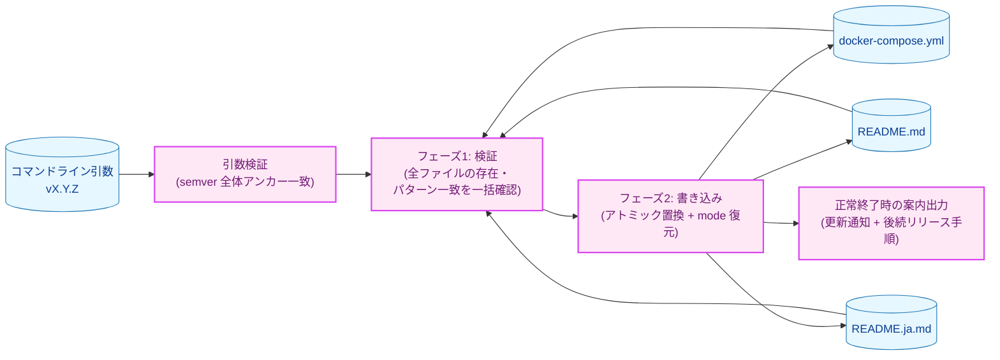
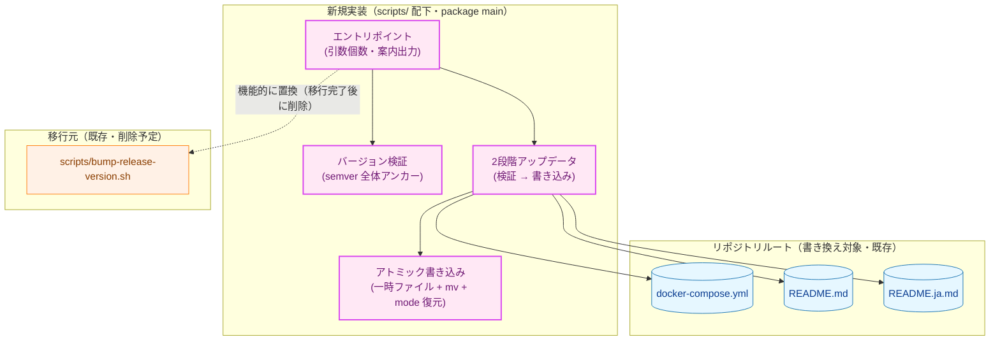
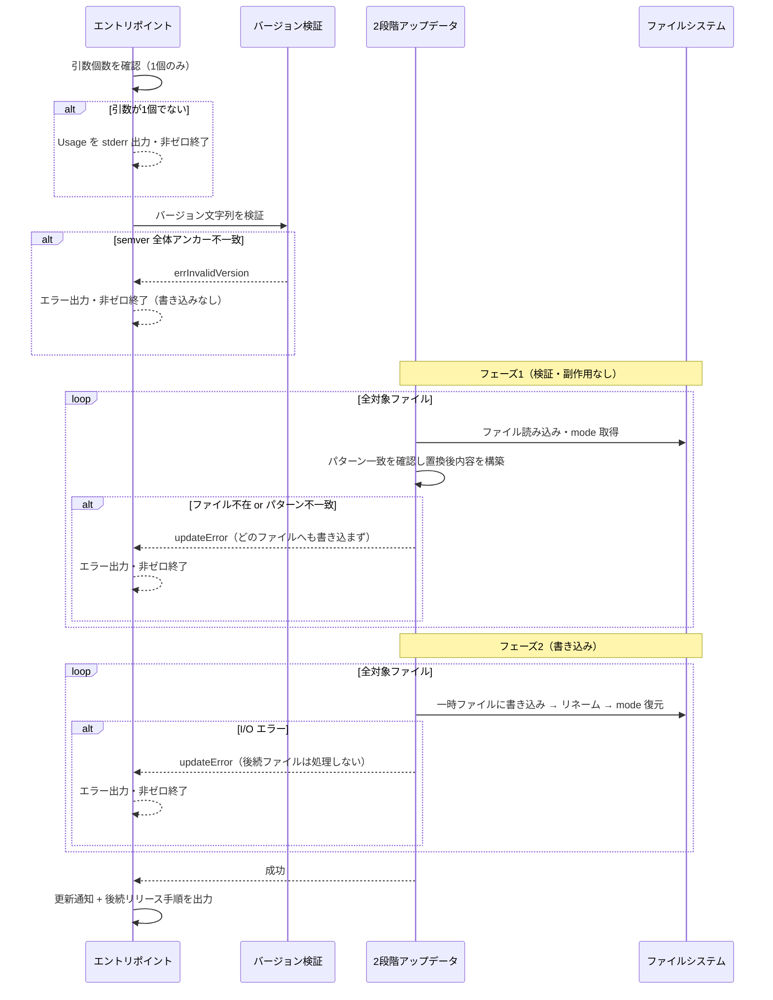
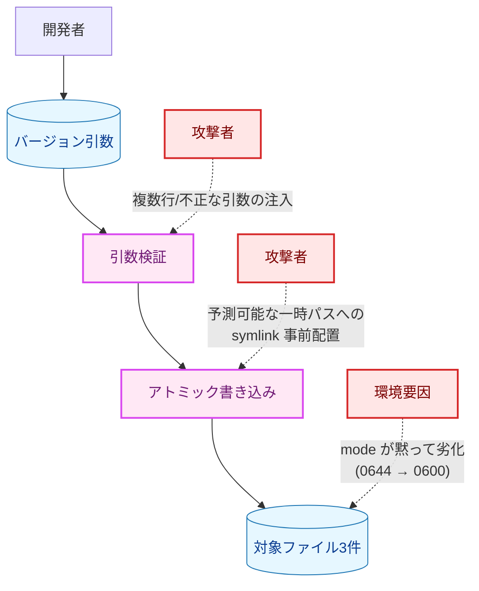

# bump-release-version.sh の Go 移行 — アーキテクチャ設計書

## Document Status

| Item | Value |
|---|---|
| Status | `draft` |
| Created | 2026-07-13 |
| Review date | - |
| Reviewer | - |
| Comments | - |

関連ドキュメント: [要件定義書](01_requirements.md)、[Docker 配布の詳細設計](../../design/docker_deployment.md)

## 1. 設計の全体像

### 1.1 設計原則

- **既存 CLI 契約の踏襲**: 現行 Bash 実装（`scripts/bump-release-version.sh`）が保証する CLI 契約
  （引数形式・エラー時の終了コード・出力メッセージの趣旨）と安全特性（引数検証・symlink 安全性・
  パーミッション保持・フェイルクローズ）を過不足なく引き継ぐ。挙動を「改善」するのではなく、
  言語だけを Go に移し替えることを基本とする（例外は後述の検証先行化 = AC-08）。
- **fail-closed / 部分更新の防止**: 全対象ファイルの検証（存在確認・パターン一致確認）を、
  いずれのファイルへの書き込みよりも先行して一括で実施する。1つでも検証に失敗した場合、
  どのファイルにも書き込まずに非ゼロ終了する（AC-07・AC-08）。
- **標準ライブラリによる OS 差異の吸収**: パーミッションの退避・復元を `os.Stat`/`os.Chmod` に
  一元化し、現行 Bash 実装が抱えていた BSD/GNU `stat` のフラグ名衝突（要件定義書 1.1 の4件目）の
  ような OS ごとのコマンド分岐そのものを排除する（NF-003）。
- **外部依存の最小化（YAGNI/DRY）**: バージョン検証・置換・アトミック書き込み・mode 復元は、いずれも
  標準ライブラリ（`regexp`/`os`）で実現できる。新規の外部依存パッケージは追加しない（NF-004）。
- **書き換え範囲の最小性**: 一致確認と置換に用いるパターンを同一とし、確認した範囲より広い範囲を
  置換しない（AC-02）。置換は一致行内のバージョン文字列のみを対象とし、行頭接頭辞と行末残余
  （末尾コメント等）は原文のまま保持する（AC-02a）。

#### 既存の Bash 実装を維持しない理由（YAGNI 上の判断）

本設計は「既存のより単純な手段（Bash スクリプトの維持）を新しい手段（Go 実装）で置き換える」ものである。
既存手段では満たせない要件は **NF-003（macOS・Linux での同一挙動）** である。現行 Bash 実装は
この同一挙動を BSD/GNU `stat` の `||` フォールバックという移植性コードで実現しようとし、
そのフラグ名衝突により Linux CI でのみ `chmod: invalid mode` エラーを生む不具合を実際に発生させた
（要件定義書 1.1 の4件目）。この種の「片方の実装が同名フラグを異なる意味で受理するため
フォールバックが黙って不発になる」バグは、Go の `os.Stat`/`os.Chmod` という単一の標準ライブラリ API に
置き換えることで、クラスごと構造的に排除される。加えて、Bash 実装には `sed` の置換式に
バージョン文字列を埋め込む際、メタ文字が混入し得る余地（要件定義書 1.1 の1件目、引数インジェクション）
がある。一方 Go 実装は外部プロセスを起動せず `regexp` によるインメモリ置換を行うため、この攻撃面
そのものが存在しない。
以上は要件（NF-003・AC-01）が Go 移行を要求している具体的根拠であり、単なる技術的優劣の問題ではない。

### 1.2 概念モデル



矢印 A → B は「A の出力・成立が B の入力・実行契機になる」ことを表す。青色は入力データ・書き換え対象
ファイル、紫色は本タスクで新規実装するコンポーネントである。フェーズ1（検証）は副作用を持たず、
フェーズ2（書き込み）で初めて外部への書き込みが発生する（副作用境界。5.1 節参照）。

**凡例**:

| クラス | 意味 |
|---|---|
| `data`（青） | コマンドライン引数・書き換え対象ファイルなどの入力データ |
| `newpkg`（紫） | 本タスクで新規実装するコンポーネント |

### 1.3 要件との対応

| 要件 | 対応する設計要素 |
|---|---|
| F-001 | 全体（Bash 実装と同等機能の Go 再実装） |
| AC-01（semver 全体アンカー検証） | 引数検証（3.2.1） |
| AC-02（一致確認と置換の同一パターン・過剰置換の禁止） | 対象ファイル記述子 `target` と検証/置換ロジック（3.1, 3.2.2） |
| AC-02a（接頭辞・行末残余の保持） | キャプチャグループによる部分置換（3.2.2） |
| AC-02b（コメントアウト digest 行の非対象化） | 行頭アンカーによるパターン設計（3.2.2, 5.3） |
| AC-03（アトミック書き込み・symlink 安全性） | 一時ファイル作成 + リネーム（3.2.3） |
| AC-04（mode 保持） | `os.Stat`/`os.Chmod` による退避・復元（3.2.3） |
| AC-05（引数は1つのみ） | 引数個数チェック（3.2.1） |
| AC-06（副作用は3ファイル書き換えのみ） | 副作用契約（5.1） |
| AC-07（フェイルクローズ） | 2段階処理と早期停止（3.2.4, 4章） |
| AC-08（検証の全書き込み先行） | フェーズ1/フェーズ2分離（3.2.4） |
| AC-09（正常終了時の案内出力） | 案内出力（3.2.5） |
| NF-001 | `make fmt`/`make test`/`make lint` で検証（7章） |
| NF-002 | Go 1.26.2 以上でビルド（`go.mod` に整合） |
| NF-003 | `os.Stat`/`os.Chmod` による OS 差異吸収（1.1, 3.2.3） |
| NF-004 | 標準ライブラリのみ利用（1.1, 3.1） |

## 2. システム構成

### 2.1 コンポーネント配置

> **配置先: `scripts/` 配下**（本タスクで確定）。要件定義書 2章では配置先の決定を Out of Scope と
> していたが、既存の Bash 実装と既存テスト（`scripts/bump_release_version_test.go`）がいずれも
> `scripts/` に置かれていることから、同ディレクトリに `package main` の Go ファイルとして実装し、
> `go run ./scripts vX.Y.Z`（またはローカルビルドしたバイナリ）で実行する。あわせて
> [Package Reference](../../dev/developer_guide/package_reference.md) の更新も本タスクの範囲に含める。
> 下図は論理的なコンポーネント分割を示す。



矢印 A → B は「A が B を呼び出す／A が B に書き込む」ことを表す。点線矢印 A -.-> B は
「A が B を機能的に置き換える」ドキュメント上の関係を表す（呼び出し・依存ではない）。

**凡例**:

| クラス | 意味 |
|---|---|
| `newpkg`（紫） | 本タスクで新規実装するコンポーネント |
| `data`（青） | 書き換え対象ファイル |
| `process`（橙） | 本設計では変更しない既存コンポーネント（移行元の Bash 実装。削除は移行完了後の後始末として §3.3・§8 で扱う） |

### 2.2 データフロー

正常系および検証失敗時のシーケンスを示す。フェーズ1で全ファイルを読み込んで検証・置換後の内容を
インメモリに構築し、フェーズ2で書き込む。これにより「検証は通ったが書き込み段階でパターンが消えていた」
という TOCTOU 窓を最小化する（5.3 節参照）。



## 3. コンポーネント設計

### 3.1 データ構造・インターフェース

型定義とエラー型のみを高レベルに示す（実装コードは記述しない）。

```go
// target は、埋め込みバージョン文字列を書き換える対象ファイル1件を表す。
// Pattern は一致確認と置換の双方に用いる同一の正規表現であり（AC-02）、
// 行頭アンカーと複数行モードで、置換対象のバージョン部分のみをキャプチャする。
type target struct {
    Path    string         // 書き換え対象ファイルの絶対パス
    Pattern *regexp.Regexp // 一致確認・置換に共用する、行アンカー付きの正規表現
}

// errInvalidVersion は、引数が semver 形式 vX.Y.Z に（文字列全体で）一致しないことを表す。
var errInvalidVersion = errors.New("version does not match semver format vX.Y.Z")

// errorKind は対象ファイル処理の失敗種別を表す。
type errorKind int // FileNotFound / PatternNotFound / IO

// updateError は、どの対象ファイルがどの理由で失敗したかを表す。
// 呼び出し側はメッセージ文字列ではなく、errors.AsType[*updateError] で型を取り出した上で
// Kind フィールドを比較して判定する（errors.Is はセンチネルエラー errInvalidVersion 用）。
type updateError struct {
    Path string
    Kind errorKind
    Err  error // ラップした下位エラー（存在すれば）
}
```

バージョン検証・置換・書き込みの制御フローは高レベル関数として分割する（シグネチャのみ示す）:

```go
// run はエントリポイントのテスト可能な中核。argv（プログラム名を除く）と出力先を受け取り、
// 終了コードを返す。main は os.Exit(run(os.Args[1:], os.Stdout, os.Stderr)) の薄いラッパとする。
// この分離により、引数個数チェック（AC-05）・Usage 出力・案内出力（AC-09）・終了コードを、
// os.Exit を介さずインプロセスで検証できる（7章）。
func run(args []string, stdout, stderr io.Writer) int

// validateVersion は引数が semver 形式 vX.Y.Z に文字列全体で一致するか検証する（AC-01）。
func validateVersion(arg string) error

// update は全対象ファイルを2段階（検証 → 書き込み）で更新する。
// git 等の他の副作用は一切行わない（AC-06）。
func update(version string, targets []target) error
```

> 配置先を `scripts/` 配下の単一 `package main` に確定した（2.1 節）ため、上記の識別子はすべて
> 非公開（小文字始まり）とし、テストも同一パッケージ内に置いて直接呼び出す。パッケージ境界をまたいだ
> 再利用は想定しないため、入力型 `target` を公開する必要はない。

### 3.2 各コンポーネントの設計

#### 3.2.1 引数検証（AC-01, AC-05）

- **引数個数（AC-05）**: 引数はちょうど1個のみを受け付ける。0個または2個以上の場合は Usage を
  標準エラー出力し、非ゼロ終了する（現行 Bash 実装と同趣旨）。
- **semver 全体アンカー検証（AC-01）**: バージョン文字列を semver 形式（`vX.Y.Z`）に**文字列全体で
  アンカーして**一致させ、部分一致や複数行を含む入力は拒否して非ゼロ終了する。これにより、`v1.2.3` に
  続けて改行以降へ別の内容を与える入力が「先頭行だけ妥当」として通ることを防ぐ。

#### 3.2.2 対象ファイルと一致・置換パターン（AC-02, AC-02a, AC-02b）

各対象ファイルの記述子 `target` に、一致確認と置換で共用する単一の正規表現を持たせる。パターンは
行頭アンカー・複数行モードで、行の接頭辞（`VERSION=` や `image: ghcr.io/...:`）と置換対象のバージョン
文字列を切り分ける。置換ではこの接頭辞（および行末残余）を保ったまま、バージョン部分のみを差し替える。
各ファイルの一致対象は次のとおり。

| 対象ファイル | 一致対象の行 | 置換で保持する範囲 |
|---|---|---|
| `docker-compose.yml` | 行頭（インデント可）が `image: ghcr.io/isseis/bsky-cleaner:vX.Y.Z` の行。バージョン直後を行末にアンカーし、現行 Bash 実装（`scripts/bump-release-version.sh`）と完全に同一の一致範囲とする | 接頭辞（インデント + `image: ghcr.io/...:`） |
| `README.md` / `README.ja.md` | 行頭が `VERSION=vX.Y.Z` の行 | 接頭辞（`VERSION=`）。バージョン直後の末尾コメント（`# ...`）は**一致範囲外**のため原文のまま残る |

各 AC の充足理由は以下のとおり。

- **同一パターンの共用と過剰置換の禁止（AC-02）**: 一致確認と置換に同一パターンを用いる。行頭アンカーに
  より、`docker-compose.yml` 内の無関係なコメント行に同じ `image: ghcr.io/...:vX.Y.Z` という部分文字列が
  現れても、その行は行頭が `#`（インデント後）で `image:` で始まらないため一致せず、書き換えられない。
- **接頭辞・行末残余の保持（AC-02a）**: 置換は一致した範囲のみを対象とし、一致範囲外の行内容はそのまま
  残る。README のパターンはバージョン直後までしか一致範囲に含めないため、末尾コメント
  （`# replace with...` / `# 使いたい...`）は原文のまま保持される（現行 Bash 実装の `sed` と同じ仕組み）。
- **コメントアウト digest 行の非対象化（AC-02b）**: `docker-compose.yml` に併存するコメントアウト行
  `# image: ghcr.io/isseis/bsky-cleaner@sha256:<digest>` は、行頭が `#` で `image:` で始まらず、かつ
  `:vX.Y.Z` ではなく `@sha256:` を含むため、一致対象にならず原文のまま保持される。

> **実装上の注意**: バージョン文字列は一致パターンのキャプチャグループ（接頭辞・行末残余）を保ったまま
> 差し替えるが、Go の置換テンプレートではグループ参照とバージョン先頭文字の境界の扱いに落とし穴があり、
> 素朴に連結すると置換が黙って壊れる。実装ではグループ参照を明示的に区切る必要がある（Bash 版の `sed`
> には無い、移行で新たに生じうる注意点。具体的な回避方法は実装計画書で扱う）。

#### 3.2.3 アトミック書き込みと mode 保持（AC-03, AC-04）

書き込みは、対象ファイルと**同一ディレクトリ**に作成したランダム名の一時ファイルへ置換後の内容を
書き出し、アトミックにリネームして置き換える方式で行う。一時ファイルが同一ファイルシステム上にある
ためリネームがアトミックになり、名前がランダムかつ新規作成であるため、事前に配置された symlink を
追跡して書き込むことはない（AC-03、現行 Bash 実装の `mktemp` と同じ狙い）。

一時ファイルの既定パーミッションはリネーム後もそのまま持ち越されるため、書き込み前に退避しておいた
元ファイルの mode を書き換え後に復元し、追跡対象ファイルが 0644 から 0600 へ黙って劣化することを防ぐ
（AC-04）。この mode の退避・復元は Go 標準ライブラリ（`os.Stat`/`os.Chmod`）だけで完結し、OS ごとに
異なる `stat` コマンドへ分岐する必要がない。これにより、現行 Bash 実装の BSD/GNU `stat` フラグ衝突
不具合のクラスを構造的に排除する（NF-003）。

#### 3.2.4 2段階処理（フェイルクローズと検証先行化, AC-07, AC-08）

現行 Bash 実装は compose → README.md → README.ja.md を**逐次**処理し、途中失敗時に先行ファイルの
書き込みを残す（原子性はファイル単位に閉じる）。Go 版では処理を明確に2フェーズに分ける:

- **フェーズ1（検証・副作用なし）**: 全対象ファイルについて、存在確認とパターン一致確認（AC-02）を
  一括で実施し、あわせて読み込んだ内容から置換後の内容と退避 mode をインメモリに構築する。
  1つでも失敗した場合、**どのファイルへも書き込まずに** 非ゼロ終了する（AC-08）。
  これにより、最頻の失敗ケース（パターン不一致・ファイル不在）での部分更新を構造的に排除する。
  フェーズ1は副作用を持たず全ファイルを走査できるため、最初の失敗で打ち切らず、複数ファイルの検証
  失敗を `errors.Join` でまとめて報告してもよい（診断性の向上。いずれの場合も書き込みは行わない）。
- **フェーズ2（書き込み）**: フェーズ1を全件通過した場合のみ、各ファイルへ 3.2.3 の方式で書き込む。
  書き込み段階で I/O エラーが発生した場合は後続ファイルの処理を行わずに停止する（AC-07, フェイルクローズ）。

全ファイルの検証通過後、実書き込み段階で複数ファイルにまたがる I/O エラーが起きた場合の
ロールバック（既に書き込んだファイルの復元）までは要求されない（要件定義書 AC-08 補足、
そこまでの原子性はスコープ外）。この限界は 5.3 節に明記する。

#### 3.2.5 正常終了時の案内出力（AC-06, AC-09）

全ファイルの更新に成功した場合、更新した各ファイルの通知（`Updated <path>`）と、後続のリリース手順
（`git add`/`commit`/`push`/PR 作成/タグ付けの手引き）を、現行スクリプトと同趣旨で標準出力へ出力する。
この出力は**あくまで人間向けの案内**であり、コマンド自体はこれらの git 操作を一切実行しない（AC-06）。

### 3.3 コンポーネントの責務（新規・変更ファイル一覧）

> 実装は `scripts/` 配下の単一 `package main`（2.1 節で確定）に配置する。各論理コンポーネントは同一
> パッケージ内の関数・型として実装するため、下段のパスは同一ファイル群を指す（1ファイルにまとめても、
> 責務ごとに `.go` を分割してもよい）。

| 論理コンポーネント | 変更種別 | 責務 | 配置（`scripts/` 配下・`package main`） |
|---|---|---|---|
| エントリポイント（`run` seam + `main`） | 新規 | 引数個数チェック（AC-05）、`validateVersion`/`update` の呼び出し、案内出力（AC-09）、終了コード制御 | 例: `scripts/bump_release_version.go` |
| バージョン検証 | 新規 | semver 全体アンカー検証（AC-01） | 同上（同一パッケージ） |
| 2段階アップデータ | 新規 | フェーズ1（全件検証・置換内容構築）とフェーズ2（書き込み）の制御（AC-02, AC-07, AC-08） | 同上（同一パッケージ） |
| アトミック書き込み | 新規 | 一時ファイル作成・リネーム・mode 復元（AC-03, AC-04） | 同上（同一パッケージ） |
| `scripts/bump-release-version.sh` | 削除 | Go 実装への移行に伴い削除する | `scripts/bump-release-version.sh` |
| `scripts/bump_release_version_test.go` | 変更 | 現在は `exec.Command("bash", ...)` で Bash スクリプトを起動して検証している。同一 `package main` 内で Go 実装をインプロセスに直接検証するテストへ書き換える（7.2 節） | `scripts/bump_release_version_test.go` |
| `docs/design/docker_deployment.md` / `docker_deployment.ja.md` | 変更 | Bash スクリプトへの参照を Go 実装の実行方法（`go run ./scripts vX.Y.Z` 等）へ更新する | 同左 |
| `docs/dev/developer_guide/package_reference.md` | 変更 | `scripts/` 配下の新規コンポーネントの配置・責務を追記する（本タスク範囲） | 同左 |

## 4. エラーハンドリング設計

- **エラー型**: 3.1 節の `errInvalidVersion`（センチネル）と `updateError`（`Path`/`Kind`/`Err` を保持）を
  用いる。呼び出し側・テストはメッセージ文字列一致ではなく `errors.Is`（センチネル）/
  `errors.AsType[*updateError]`（型付き抽出）で判定する（CLAUDE.md のテスト方針に整合）。
- **エラーメッセージ**: 現行 Bash 実装と同趣旨の内容を標準エラー出力へ出す。
  - 引数不正: `Usage: <cmd> vX.Y.Z`
  - semver 不一致: `ERROR: version '<arg>' does not match semver format vX.Y.Z`
  - ファイル不在: `ERROR: file not found: <path>`
  - パターン不一致: `ERROR: expected pattern '<pattern>' not found in <path>`（現行 Bash 実装同様、
    ファイル形状のドリフトを診断できるよう、実際のパターンをメッセージに含める）
- **終了コード**: いずれのエラーも非ゼロ終了とする。エントリポイント（`run`）は `update`/`validateVersion`
  が返すエラーを受け取り、標準エラー出力へメッセージを出して非ゼロ終了する（AC-01, AC-05, AC-07, AC-08）。
- 秘密情報（トークン等）を扱わないコンポーネントのため、エラーオブジェクト経由の秘匿情報漏洩は
  本タスクの対象外である（対象ファイルパス・パターン名のみをメッセージに含める）。

## 5. セキュリティ考慮事項

本コマンドはリリース前に開発者本人が手動で1回実行するのみで、CI 非経由・攻撃対象として限定的である
（要件定義書 1.1）。プロジェクト共通のリスク分類は [セキュリティ設計](../../design/security.md) を参照。
本タスクは AT Protocol API クライアント・レート制御・セッション/認証・不可逆な破壊的操作
（[_context.md](../../../.claude/commands/_context.md) の Conditional-guide trigger）のいずれにも該当しない
ため、専用の設計ノートは追加しない。

### 5.1 副作用契約

本コマンドには `--dry-run`/`--apply` のような挙動を切り替えるフラグは存在せず、単一の動作モードのみを持つ。

- **フェーズ1（検証）**: 外部への書き込みを一切行わない（ファイルの読み込みと mode 取得のみ）。
- **フェーズ2（書き込み）**: 検証を全件通過した場合のみ、`docker-compose.yml`・`README.md`・
  `README.ja.md` の3ファイルへの書き込み（一時ファイル作成 + リネーム + `chmod`）を行う。
- 上記3ファイルの書き換え以外の外部副作用（`git commit`/`branch`/`tag`/`push`、他ファイルへの書き込み、
  ネットワーク送信）は**一切行わない**（AC-06）。正常終了時の後続リリース手順の出力は標準出力への
  テキスト表示であり、git 操作の実行ではない（AC-09）。

### 5.2 脅威モデル

現行 Bash 実装が対処済みの脅威（要件定義書 1.1）が、Go 実装でどのように扱われるかを示す。



矢印 A → B はデータ・制御の流れを表す。点線矢印 A -.-> B は脅威（攻撃経路・劣化要因）を表す。

**凡例**:

| クラス | 意味 |
|---|---|
| `newpkg`（紫） | 本タスクで新規実装するコンポーネント |
| `data`（青） | 入力データ・対象ファイル |
| `problem`（赤） | 脅威（攻撃者・攻撃経路・劣化要因） |

**脅威と対策**:

| 脅威 | 対策 | 対応 AC |
|---|---|---|
| 複数行入力を含む引数の注入（Bash では `sed` プログラムへのペイロード混入につながった） | `regexp` による semver 全体アンカー検証で複数行・部分一致を拒否。Go は外部プロセス（`sed`）を起動せず、検証済みバージョンを `regexp` の置換テンプレートへ埋め込むため、そもそも攻撃面が存在しない | AC-01 |
| 予測可能な一時パスへの symlink 事前配置による、リポジトリ外の任意ファイル上書き | 対象と同一ディレクトリにランダム名の一時ファイルを新規作成し、アトミックにリネームして置換（予測可能な一時パスも symlink 追跡も生じない） | AC-03 |
| 一時ファイルの既定 mode（0600）持ち越しによる、追跡対象ファイルのパーミッション劣化 | `os.Stat` で退避した元 mode を `os.Chmod` で復元。OS 差異（BSD/GNU `stat`）に依存しない | AC-04, NF-003 |

### 5.3 検出限界（意図的に対応しない範囲）

- **フェーズ間 / 書き込み時の TOCTOU**: フェーズ1でファイルを読み込み・検証してからフェーズ2で
  書き込むまでの間に、第三者が対象ファイルを差し替える可能性は理論上ある。ただし本コマンドは
  開発者本人が自リポジトリ上で数百ミリ秒単位で実行するローカルツールであり、実行中の並行改変は
  脅威モデルの対象外とする（現行 Bash 実装と同じ前提）。フェーズ1で置換後内容をインメモリに構築し
  フェーズ2でそれを書き込むことで、少なくとも「検証時の内容」と「書き込む内容」の乖離窓は最小化する。
  symlink 差し替えについては、ランダム名の一時ファイルの新規作成とアトミックなリネームにより
  書き込み時点でも防御される（5.2）。
  なお mode 復元はリネーム後にパス指定で行うため、その一瞬に対象パスが symlink へ差し替えられれば
  復元先がリンク先へ向く窓は理論上残るが、これも上記と同じ「ローカル単独実行ツール」の前提により
  脅威モデルの対象外とする。
- **フェーズ2 の複数ファイル間ロールバック非対応**: 全ファイルがフェーズ1を通過した後、フェーズ2の
  書き込み途中で I/O エラーが起きた場合、既に書き込み済みのファイルはロールバックしない
  （要件定義書 AC-08 補足によりスコープ外）。この状況は稀（検証通過後のディスクフル等）であり、
  発生時は開発者が `git` の作業ツリー差分で検知・復旧できる。

## 6. 処理フロー詳細

全体シーケンスは 2.2 節を参照。フェーズ1（検証）とフェーズ2（書き込み）の境界、および各フェーズでの
早期停止（フェイルクローズ）が本コマンドの中心的な制御フローである。個々のファイル書き込みの詳細
（一時ファイル → リネーム → mode 復元）は 3.2.3 を参照。

## 7. テスト戦略

### 7.1 単体テスト

各 AC を独立に検証する。テストは Go 実装をインプロセスで直接呼び出し、`t.TempDir` に実リポジトリと
同じ構造（`docker-compose.yml`・`README.md`・`README.ja.md`）をシードして実施する。引数個数・Usage 出力・
終了コード・案内出力（AC-05・AC-06・AC-09）は、`run(args, &stdout, &stderr)`（3.1 節のテスト可能な
エントリ seam）を呼び出し、返り値の終了コードとバッファへの出力を検証する（サブプロセス起動は不要）。
ファイル内容・mode・部分更新防止は `t.TempDir` 上のシードファイルを走査後に検証する。

| 検証内容 | 対応 AC |
|---|---|
| 3ファイルすべてが新バージョンに更新されること | F-001 |
| semver 全体アンカー検証: 部分一致・複数行入力（`v9.9.9\n<payload>`）を拒否し、全ファイルを原文のまま残すこと | AC-01 |
| パターン不一致・ファイル不在時に当該ファイルを検出してエラー終了すること | AC-02 |
| 末尾コメント付き `VERSION=vX.Y.Z  # ...` 行でコメントが保持されること | AC-02a |
| `docker-compose.yml` の無関係なコメント行（旧バージョンへの言及・コメントアウト digest 行）が保持されること | AC-02, AC-02b |
| 書き込み後、対象ファイルの元 mode（0644）が保持されること | AC-04 |
| 引数が0個・2個以上のとき Usage を出力し非ゼロ終了すること | AC-05 |
| いずれか1ファイルの検証失敗時に、どのファイルへも書き込まれないこと（部分更新の防止） | AC-07, AC-08 |
| 正常終了時に更新通知と後続リリース手順が出力されること（git 操作は実行されないこと） | AC-06, AC-09 |

### 7.2 既存テストへの影響

- `scripts/bump_release_version_test.go`（**変更必須**）: 現在は `runBumpScript` が
  `exec.Command("bash", ...)` で Bash スクリプトを起動し、`CombinedOutput` の終了コードと
  ファイル内容を検証している。Go 移行後は Bash スクリプトを削除するため、これらのテスト
  （`TestBumpReleaseVersion_UpdatesAllFiles` / `_RejectsInvalidSemver` /
  `_RejectsNewlineInjectedVersion` / `_RequiresExactlyOneArgument` /
  `_DoesNotTouchUnrelatedOccurrencesOfTheOldVersion` / `_FailsIfPatternMissing`）は
  Go 実装をインプロセスで直接呼び出す形へ書き換える。各テストが検証している**挙動そのもの**
  （全ファイル更新・不正 semver 拒否・複数行拒否・引数個数・無関係箇所の非改変・パターン不一致時の
  部分更新防止）は Go 実装でも同一に保つべき契約であり、7.1 節の AC 検証としてそのまま引き継ぐ。
  なお `_RejectsNewlineInjectedVersion` の「`sed` ペイロードが実行されない」という前提は、Go 実装では
  `sed` を起動しないため自明に成立するが、「複数行入力を拒否し全ファイルを原文のまま残す」という
  観測可能な挙動（AC-01）は引き続き検証する。
- 上記以外の既存 Go テスト（`internal/`・`cmd/` 配下）は本タスクの対象ファイルに依存しないため非影響。

### 7.3 セキュリティ・回帰テスト

- **symlink 安全性（AC-03）**: 予測可能な `<file>.tmp` に事前 symlink を配置しても、リポジトリ外の
  リンク先が書き換えられないことを確認する（一時ファイル名のランダム化により、そもそも攻撃者が
  一時パスを予測できないことの回帰）。
- **mode 保持（AC-04）**: macOS・Linux の双方で、書き換え後に元 mode が保持されることを確認する
  （現行 Bash 実装で Linux CI のみ発生した mode/`chmod` 系不具合の再発防止・NF-003）。

## 8. 実装優先順位

### フェーズ 1: コアロジック
1. `validateVersion`（semver 全体アンカー検証, AC-01）
2. `target` 記述子と一致・置換パターン（AC-02, AC-02a, AC-02b）
3. アトミック書き込み + mode 復元（AC-03, AC-04）

### フェーズ 2: 2段階制御とエントリポイント
4. 2段階アップデータ `update`（フェーズ1検証 → フェーズ2書き込み, AC-07, AC-08）
5. エントリポイント（引数個数チェック・案内出力・終了コード, AC-05, AC-06, AC-09）

### フェーズ 3: 移行と後始末
6. `scripts/bump_release_version_test.go` を Go 実装のインプロセステストへ書き換え（7.2）
7. `scripts/bump-release-version.sh` の削除と、`docs/design/docker_deployment.md`（+ `.ja.md`）の
   参照更新、[Package Reference](../../dev/developer_guide/package_reference.md) の更新

## 9. 将来拡張性

- **`cmd/` 配下への再配置**: 本タスクでは配置先を `scripts/` 配下に確定した（2.1 節）。将来リリース手順を
  自動化・CI 組み込みする際に、他の CLI サブコマンドと統合しやすい `cmd/` 配下への移設を再検討できる。
  実装が単一 `package main` に閉じているため、移設のコストは小さい。
- **対象ファイル・パターンの拡張**: 対象ファイルは `target` のスライスとして表現するため、将来
  バージョン埋め込み箇所が増えた場合も、記述子を追加するだけで2段階検証・書き込みの仕組みに乗る。
- **リリース手順自動化との接続**: `git commit`/`tag`/`push`/PR 作成の自動化は要件定義書のスコープ外
  （人間のレビューを挟む安全策として意図的に非対応）。将来自動化する場合も、本コマンドは
  「ファイル書き換え」という単一責務に閉じたまま、上位のオーケストレーションから呼び出す形にできる。

## 付録 A: 決定履歴

> 本タスクは現行 Bash 実装（`scripts/bump-release-version.sh`）の CLI 契約・安全特性を、言語だけ Go に
> 移し替えるものである。以下は本設計で新たに行った決定である。
>
> - **検証を全書き込みに先行させる2段階化（AC-08）**: 現行 Bash はファイルを逐次処理し途中失敗時に
>   先行ファイルの書き込みを残すが、Go 版では全ファイルの検証（存在・パターン一致）を書き込みより
>   先行させ、最頻の失敗ケースでの部分更新を構造的に排除する。これは Bash 実装からの意図的な挙動改善で
>   あり、要件（AC-08）が明示的に要求している（3.2.4）。ただし書き込み段階での複数ファイル間
>   ロールバックまでは要求されない（5.3）。
> - **配置先を `scripts/` に確定**: 要件定義書では配置先の決定を Out of Scope としていたが、レビューを
>   経て `scripts/` 配下の単一 `package main` に確定した（既存の Bash 実装・既存テストと同ディレクトリ）。
>   あわせて Package Reference の更新も本タスクの範囲に含めることとした（2.1, 3.3）。
> - **エラー型を最小限の型付きエラーで表現**: 現行 Bash は終了コードとメッセージのみだが、Go 版は
>   テストがメッセージ文字列一致に依存しないよう、センチネル `errInvalidVersion` と型付き
>   `updateError`（`Kind` で判定）を導入する（CLAUDE.md のテスト方針）。過剰なエラー階層は設けない
>   （YAGNI, 4章）。
